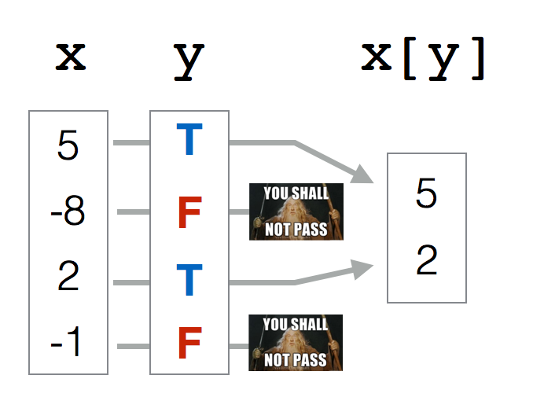
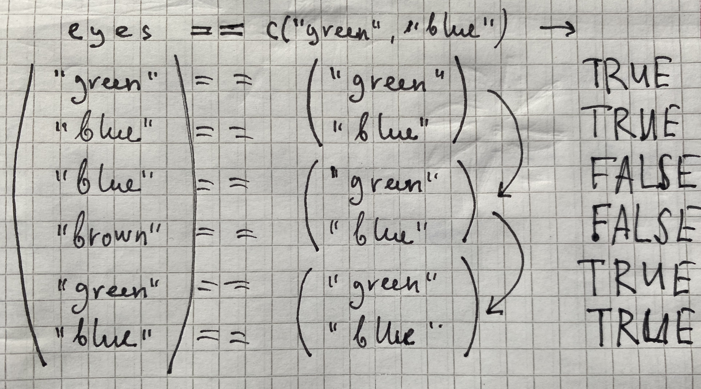

# Введение в R {#intro}

## Установка R и Rstudio {#install}

Для работы с R необходимо его сначала скачать и установить.

* R
    + [на Windows](https://cran.r-project.org/bin/windows/base/), найдите большую кнопку **Download R (номер версии) for Windows.**
    + [на Mac](https://cran.r-project.org/bin/macosx/), если маку меньше, чем 5 лет, то смело ставьте *.pkg файл с последней версией. Если старше, то поищите на той же странице версию для вашей системы.
    + [на Linux](https://cran.rstudio.com/bin/linux/), также можно добавить зеркало и установить из командной строки:
    
```
sudo apt-get install r-cran-base
```

В данной книге используется следующая версия R:

```{r}
sessionInfo()$R.version$version.string
```

После установки R необходимо скачать и установить RStudio:  

* [RStudio](https://www.rstudio.com/products/rstudio/download/)

Если вдруг что-то установить не получается (или же вы просто не хотите устанавливать на компьютер лишние программы), то можно работать в облаке, делая все то же самое в веб-браузере:

* [RStudio cloud](https://rstudio.cloud/)

Первый и вполне закономерный вопрос: зачем мы ставили R и отдельно еще какой-то RStudio?
Если опустить незначительные детали, то R --- это сам язык программирования, а RStudio --- это среда (IDE), которая позволяет в этом языке очень удобно работать. 

> RStudio --- это не единственная среда для R, но, определенно, самая удобная на сегодняшний день. Почти все пользуются именно ею и не стоит тратить время на поиск чего-то более удобного и лучшего. Если же вы привыкли работать с Jupyter Notebook, то в R обычно вместо него используется великолепный RMarkdown --- с помощью которого и написан этот онлайн-учебник, кстати говоря. И с RMarkdown мы тоже будем разбираться!

## Знакомство с RStudio {#rstudio}

Так, давайте взглянем на то, что нам тут открылось:  

  

В первую очередь нас интересуют два окна: **1 - Code Editor** (окно для написания скриптов) [^open_editor] и **2 - R Console** (консоль). Здесь можно писать команды и запускать их. При этом работа в консоли и работа со скриптом немного различается. 

В **2 - R Console** вы пишите команду и запускаете ее нажиманием `Enter`. Иногда после запуска команды появляется какой-то результат. Если нажимать стрелку вверх на клавиатуре, то можно выводить в консоль предыдущие команды. Это очень удобно для запуска предыдущих команд с небольшими изменениями. 

В **1 - Code Editor** для запуска команды вы должны выделить ее и нажать `Ctrl` + `Enter` (`Cmd` + `Enter` на macOS). Если не нажать эту комбинацию клавиш, то команда не запустится. Можно выделить и запустить сразу несколько команд или даже все команды скрипта. Все команды скрипта можно выделить с помощью сочетания клавиш `Ctrl` + `A` на Windows и Linux, `Cmd` + `A` на macOS [^hot_keys]. Как только вы запустите команду (или несколько команд), соответствующие строчки кода появятся в **2 - R Console**, как будто бы вы запускали их прямо там.

Обычно в консоли удобно что-то писать, чтобы быстро что-то посчитать. Скрипты удобнее при работе с длинными командами и как способ сохранения написанного кода для дальнейшей работы. Для сохранения скрипта нажмите `File - Save As...`. R скрипты сохраняются с разрешением *.R*, но по своей сути это просто текстовые файлы, которые можно открыть и модифицировать в любом текстовом редакторе а-ля "Блокнот".  

[^open_editor]: При первом запуске RStudio вы не увидите это окно. Для того, чтобы оно появилось, нужно нажать `File - New File - R Script`.

[^hot_keys]: В RStudio есть много удобных сочетаний горячих клавиш. Чтобы посмотреть их все, нажмите `Help - Keyboard Shortcuts Help`. 

**3 - Workspace and History** --- здесь можно увидеть переменные. Это поле будет автоматически обновляться по мере того, как Вы будете запускать строчки кода и создавать новые переменные. Еще там есть вкладка с историей всех команд, которые были запущены.

**4 - Plots and files**. Здесь есть очень много всего. Во-первых, небольшой файловый менеджер, во-вторых, там будут появляться графики, когда вы будете их рисовать. Там же есть вкладка с вашими пакетами (`Packages`) и `Help` по функциям. Но об этом потом.  

## R как калькулятор  {#calc}

R --- полноценный язык программирования, который позволяет решать широкий спектр задач. Но в первую очередь R используется для анализа данных и статистических вычислений. Тем не менее, многими R до сих пор воспринимается как просто продвинутый калькулятор. Ну что ж, калькулятор, так калькулятор.

Давайте начнем с самого простого и попробуем использовать R как калькулятор с помощью арифметических операторов `+`, `-`, `*`, `/`, `^` (степень), `()` и т.д.

Просто запускайте в консоли пока не надоест:  

```{r}
40+2
3-2
5*6
99/9 #деление
2^3 #степень
13 %/% 3 #целочисленное деление
13 %% 3 #остаток от деления
```

Попробуйте самостоятельно посчитать что-нибудь с разными числами.

{width=400px}

Ничего сложного, верно? Вводим выражение и получаем результат.

Вы могли заметить, что некоторые команды у меня заканчиваются знаком решетки (`#`). Все, что написано в строчке после `#` игнорируется R при выполнении команды. Написанные команды в скрипте рекомендуется сопровождать комментариями, которые будут объяснять вам же в будущем (или кому-то еще), что конкретно происходит в соответствующем куске кода [^comment]. Кроме того, комментарии можно использовать в тех случаях, когда вы хотите написать кусок кода по-другому, не стирая полностью предыдущий код: достаточно "закомментить" нужные строчки - поставить `#` в начало каждой строки, которую вы хотите переписать. Для этого есть специальное сочетание горячих клавиш: `Ctrl` + `Shift` + `C` (`Cmd` + `Shift` + `C` на macOS) --- во всех выделенных строчках будет написан `#` в начале.

[^comment]: Во время написания кода вам может казаться понятным то, что вы написали, но при возвращении к коду через некоторое время вы уже не будете этого помнить. Старайтесь писать комментарии как можно чаще!

Согласно данным навязчивых рекламных баннеров в интернете, только 14% россиян могут справиться с этим примером:

```{r}
2 + 2 * 2
```

На самом деле, разные языки программирования ведут себя [по-разному](https://www.quora.com/Do-all-computer-languages-with-operator-precedence-use-the-same-operator-precedence) в таких ситуациях, поэтому ответ 6 (сначала умножаем, потом складываем) не так очевиден.

Порядок выполнения арифметических операций (т.е. приоритет операторов, *operator precedence*) в R как в математике, так что не забывайте про скобочки. 

```{r}
(2+2)*2
```

Если Вы не уверены в том, какие операторы имеют приоритет, то используйте скобочки, чтобы точно обозначить, в каком порядке нужно производить операции. Или же смотрите на таблицу приоритета операторов с помощью команды `?Syntax`.

## Функции{#func}

Давайте теперь извлечем корень из какого-нибудь числа. В принципе, тем, кто помнит школьный курс математики, возведения в степень вполне достаточно:

```{r}
16^0.5
```

Ну а если нет, то можете воспользоваться специальной **функцией**: это обычно какие-то буквенные символы с круглыми скобками сразу после названия функции. Мы подаем на вход (внутрь скобочек) какие-то данные, внутри этих функций происходят какие-то вычисления, которые выдает в ответ какие-то другие данные (или же функция записывает файл, рисует график и т.д.).

Вот, например, функция для корня:

```{r}
sqrt(16)
```

> R --- case-sensitive язык, т.е. регистр важен. SQRT(16) не будет работать.

А вот так выглядит функция логарифма:  

```{r}
log(8)
```

Так, вроде бы все нормально, но... Если Вы еще что-то помните из школьной математики, то должны понимать, что что-то здесь не так.  

Здесь не хватает основания логарифма!   

> Логарифм --- показатель степени, в которую надо возвести число, называемое основанием, чтобы получить данное число.  

То есть у логарифма 8 по основанию 2 будет значение 3:

$\log_2 8 = 3$

То есть если возвести 2 в степень 3 у нас будет 8:

$2^3 = 8$

Только наша функция считает все как-то не так.  

Чтобы понять, что происходит, нам нужно залезть в хэлп этой функции:  

```{r, eval = F}
?log
```

Справа внизу в RStudio появится вот такое окно:

{width=400px}


Действительно, у этой функции есть еще аргумент *`base =`*. По умолчанию он равен числу Эйлера (`r exp(1)`...), т.е. функция считает натуральный логарифм. 
В большинстве функций R есть какой-то основной инпут --- данные в том или ином формате, а есть и дополнительные параметры, которые можно прописывать вручную, если параметры по умолчанию вас не устраивают.

```{r}
log(x = 8, base = 2)
```

...или просто (если Вы уверены в порядке переменных):

```{r}
log(8,2)
```

Более того, Вы можете использовать результат выполнения одних функций в качестве аргумента для других:  

```{r}
log(8, sqrt(4))
```

Если эксплицитно писать имена аргументов, то их порядок в функции не важен:

```{r}
log(base = 2, x = 8)
```

А еще можно недописывать имена аргументов, если они не совпадают с другими:

```{r}
log(b = 2, x = 8)
```

Мы еще много раз будем возвращаться к функциям. Вообще, функции --- это одна из важнейших штук в R (примерно так же как и в Python). Мы будем создавать свои функции, использовать функции как инпут для функций и многое-многое другое. В R очень крутые возможности работы с функциями. Поэтому подружитесь с функциями, они клевые.  

> Арифметические знаки, которые мы использовали: +,-,/,^ и т.д. называются **операторами** и на самом деле тоже являются функциями:

```{r}
'+'(3,4)
```

## Переменные {#variables}

Важная штука в программировании на практически любом языке --- возможность сохранять значения в **переменных**. В R это обычно делается с помощью вот этих символов: `<-` (но можно использовать и обычное `=`, хотя это не очень принято). Для этого есть удобное сочетание клавиш: нажмите одновременно `Alt` +  `-` (или `option` + `-` на macOS).

> Заметьте, при присвоении результат вычисления не выводится в консоль! Если опустить детали, то обычно результат выполнения комманды либо выводится в консоль, либо записывается в переменную. 

```{r}
a <- 2
a
```

Справа от `<-` находится значение, которое вы хотите сохранить, или же какое-то выражение, результат которого вы хотите сохранить в эту переменную[^rev_assign]:

[^rev_assign]: Есть еще оператор `->`, который позволяет присваивать значения слева направо, но так делать не рекомендуется, хотя это бывает довольно удобным.

Слева от `<-` находится название будущей переменной. Название переменных может быть самым разным. Есть несколько ограничений для синтаксически валидных имен переменных: они должны включать в себя буквы, цифры, `.` или `_`, начинаться на букву (или точку, за которой не будет следовать цифра), не должны совпадать с [коротким списком зарезервированных слов](https://stat.ethz.ch/R-manual/R-devel/library/base/html/Reserved.html). Короче говоря, название не должно включать в себя пробелы и большинство других знаков.

Нельзя: 
 - `new variable`
 - `_new_variable`
 - `.1var`
 - `v-r`
 
Можно:
 - `new_variable`
 - `.new.variable`
 - `var_2`

Обязательно делайте названия переменных осмысленными! Старайтесь делать при этом их понятными и короткими, это сохранит вам очень много времени, когда вы (или кто-то еще) будете пытаться разобраться в написанном ранее коде. Если название все-таки получается длинным и состоящим из нескольких слов, то лучше всего использовать нижнее подчеркивание в качестве разделителя: `some_variable`[^delim_vars].

[^delim_vars]: Еще иногда используются большие буквы `SomeVariable`, но это плохо читается, а иногда --- точка, но это тоже не рекомендуется.

После присвоения переменная появляется во вкладке **Environment** в RStudio:

{width=400px}

Можно использовать переменные в функциях и просто вычислениях:

```{r}
b <- a ^ a + a * a
b
log(b, a)
```

## Логические операторы {#logic}

Вы можете сравнивать разные переменные:

```{r}
a == b
```

Заметьте, что сравнивая две переменные мы используем два знака равно `==`, а не один `=`. Иначе это будет означать присвоение.

```{r}
a = b
a
```

Теперь Вы сможете понять комикс про восстание роботов на следующей странице (пусть он и совсем про другой язык программирования)  

{width=400px}

Этот комикс объясняет, как важно не путать присваивание и сравнение *(хотя я иногда путаю до сих пор =( )*.

Иногда нам нужно проверить на *не*равенство:
```{r}
a <- 2
b <- 3

a == b
a != b
```

Восклицательный язык в программировании вообще и в R в частности стандартно означает отрицание.

Еще мы можем сравнивать на больше/меньше:

```{r}
a > b
a < b
a >= b
a <= b
```

Этим мы будем пользоваться в дальнейшем регулярно! Именно на таких простых логических операциях построено большинство операций с данными.

##Типы данных  {#data_types}

До этого момента мы работали только с числами (numeric):

```{r}
class(a)
```

На самом деле, в R три типа numeric: integer (целые), double (дробные), complex (комплексные числа)[^complex_numbers]. R сам будет конвертировать числа в нужный тип numeric при необходимости, поэтому этим можно не заморачиваться.

[^complex_numbers]: Комплексные числа в R пишутся так: `complexnumber <- 2+2i`. `i` здесь - это та самая мнимая единица, которая является квадратным корнем из -1.

Если же все-таки нужно задать конкретный тип числа эксплицитно, то можно воспользоваться функциями `as.integer()`, `as.double()` и `as.complex()`. Кроме того, при создании числа можно поставить в конце `L`, чтобы обозначить число как integer:

```{r}
is.integer(5)
is.integer(5L)
```

Про double есть еще один маленький секрет. Дело в том, что дробные числа хранятся в R как [числа с плавающей запятой двойной точности](https://ru.wikipedia.org/wiki/Число_двойной_точности). Дробные числа в компьютере могут быть записаны только с определенной степенью точности, поэтому иногда встречаются вот такие вот ситуации:

```{r}
sqrt(2)^2 == 2
```

Это довольно стандартная ситуация, характерная не только для R. Чтобы ее избежать, можно воспользоваться функцией `all.equal()`:

```{r}
all.equal(sqrt(2)^2, 2)
```

Теперь нам нужно ознакомиться с двумя другими важными типами данных в R:

1. **Строковые** данные (**character**): набор букв, цифр и символов, которые должны выделяться кавычками.

```{r}
s <- "Всем привет!"
s
class(s)
```

Можно использовать как `"`, так и `'` (что удобно, когда строчка внутри уже содержит какие-то кавычки).

```{r}
"Ph'nglui mglw'nafh Cthulhu R'lyeh wgah'nagl fhtagn"
```

2. **logical**: просто `TRUE` или `FALSE`. 

```{r}
t1 <- TRUE
f1 <- FALSE

t1
f1
```

Вообще, можно еще писать `T` и `F` (но не `True` и `False`!)

```{r}
t2 <- T
f2 <- F
```

Это дурная практика, так как R защищает от перезаписи переменные `TRUE` и `FALSE`, но не защищает от этого `T` и `F`.

```{r error=TRUE}
TRUE <- FALSE
TRUE
T <- FALSE
T
```

Функция `rm()` позволяет удалить ненужную переменную:

```{r, echo = FALSE}
rm(T)
```

Мы уже встречались с логическими значениями при сравнении двух числовых переменных. Теперь вы можете догадаться, что результаты сравнения, например, числовых или строковых переменных, можно тоже сохранять в переменные!

```{r}
comparison <- a == b
comparison
```

Это нам очень понадобится, когда мы будем работать с реальными данными: нам нужно будет постоянно вытаскивать какие-то данные из датасета, что как раз и построено на игре со сравнением переменных.  
Чтобы этим хорошо уметь пользоваться, нам нужно еще освоить как работать с логическими операторами. Про один мы немного уже говорили --- это логическое НЕ (`!`). `!` превращает `TRUE` в `FALSE`, а `FALSE` в `TRUE`:

```{r}
t1
!t1
!!t1 #Двойное отрицание!
```

Еще есть логическое И (выдаст `TRUE` только в том случае если обе переменные `TRUE`):

```{r}
t1 & t2
t1 & f1
```

А еще логическое ИЛИ (выдаст `TRUE` в случае если хотя бы одна из переменных `TRUE`):

```{r}
t1 | f1
f1 | f2
```

Если кому-то вдруг понадобится другое ИЛИ (строгое ЛИБО) --- есть функция `xor()`, принимающая два аргумента и возвращая `TRUE` только в том случае, если ровно один из двух аргументов равен `TRUE`.

Итак, мы только что разобрались с самой занудной (хотя и важной) частью -  с основными типа данных в R и как с ними работать[^raw]. Пора переходить к чему-то более интересному и специфическому для R. Вперед к ВЕКТОРАМ!

[^raw]: Кроме описанных пяти типов данных (integer, double, complex, character и logical) есть еще и шестой --- это raw, сырая последовательность байтов, но нам она не понадобится.

# Вектор {#vector}
## Понятие atomic вектора в R {#atomic}

Если у вас не было линейной алгебры (или у вас с ней было все плохо), то просто запомните, что **вектор** (**atomic vector** или просто **atomic**) --- это набор (столбик) чисел в определенном порядке.  

Если вы привыкли из школьного курса физики считать вектора стрелочками, то не спешите возмущаться и паниковать. Представьте стрелочки как точки из нуля координат {0,0} до какой-то точки на координатной плоскости, например, {2,3}:

{width=400px}

Вот последние два числа и будем считать вектором. Попытайтесь теперь мысленно стереть координатную плоскость и выбросить стрелочки из головы, оставив только последовательность чисел {2,3}:

{width=400px}

На самом деле, мы уже работали с векторами в R, но, возможно, вы об этом даже не догадывались. Дело в том, что в R нет как таковых скалярных (т.е. одиночных) значений, **есть вектора длиной 1**. Такие дела!

Чтобы создать вектор из нескольких значений, нужно воспользоваться функцией *`c()`*:

```{r}
c(4, 8, 15, 16, 23, 42)
c("Хэй", "Хэй", "Ха")
c(TRUE, FALSE)
```

>Одна из самых мерзких и раздражающих причин ошибок в коде --- это использование `с` из кириллицы вместо `c` из латиницы. Видите разницу? И я не вижу. А R видит. И об этом сообщает:

```{r error=TRUE}
с(3, 4, 5)
```

Для создания числовых векторов есть удобный **оператор** `:`

```{r}
1:10
5:-3
```

Этот оператор создает вектор от первого числа до второго с шагом 1. Вы не представляете, как часто эта штука нам пригодится... Если же нужно сделать вектор с другим шагом, то есть функция `seq()`:

```{r}
seq(10,100, by = 10)
```

Кроме того, можно задавать не шаг, а длину вектора. Тогда функция `seq()` сама посчитает шаг:

```{r}
seq(1,13, length.out = 4)
```

Другая функция --- `rep()` --- позволяет создавать вектора с повторяющимися значениями. Первый аргумент --- значение, которое нужно повторять, а второй аргумент --- сколько раз повторять.

```{r}
rep(1, 5)
```

И первый, и второй аргумент могут быть векторами!

```{r}
rep(1:3, 3)
rep(1:3, 1:3)
```

Еще можно объединять вектора (что мы, по сути, и делали, просто с векторами длиной 1):
```{r}
v1 <- c("Hey", "Ho")
v2 <- c("Let's", "Go!")
c(v1, v2)
```

Очень многие функции в R работают именно с векторами. Например, функции `sum()` (считает сумму значений вектора) и `mean()` (считает среднее арифметическое всех значений в векторе):

```{r}
sum(1:10)
mean(1:10)
```

## Приведение типов {#coercion}

Что будет, если вы объедините два вектора с значениями разных типов? Ошибка? 

Мы уже обсуждали, что в обычных векторах (*atomic* векторах) может быть только один тип данных. В некоторых языках программирования при операции с данными разных типов мы бы получили ошибку. А вот в R при несовпадении типов произойдет попытка привести типы к "общему знаменателю", то есть конвертировать данные в более "широкий" тип (а иногда --- более "узкий" тип, если того требует функция).

Например:  

```{r}
c(FALSE, 2)
```

`FALSE` превратился в `0` (а `TRUE` превратился бы в `1`), чтобы оба значения можно было объединить в вектор. То же самое произошло бы в случае операций с векторами:

```{r}
2 + TRUE
```

Это называется **неявным приведением типов (implicit coercion)**.

Вот более сложный пример:

```{r}
c(TRUE, 3, "Привет")
```

Здесь все значения были приведены сразу к строковому типу данных.

У R есть иерархия приведения типов: 

`NULL < raw < logical < integer < double < complex < character < list < expression`. 

Мы из этого списка еще многого не знаем, сейчас важно запомнить, что логические данные --- `TRUE` и `FALSE` --- превращаются в `0` и `1` соответственно, а `0` и `1` в строчки `"0"` и `"1"`. 

Если Вы боитесь полагаться на приведение типов, то можете воспользоваться функциями `as.нужныйтипданных` для явного приведения типов (**explicit coercion**):

```{r}
as.numeric(c(TRUE, FALSE, FALSE))
as.character(as.numeric(c(TRUE, FALSE, FALSE)))
```

Можно превращать и обратно, например, строковые значения в числовые. Если среди числа встретится буква или другой неподходящий знак, то мы получим предупреждение `NA` --- пропущенное значение (мы очень скоро научимся с ними работать).

```{r}
as.numeric(c("1", "2", "три"))
```

> Один из распространенных примеров использования неявного приведения типов --- использования функций `sum()` и `mean()` для подсчета в логическом векторе количества и доли `TRUE` соответсвенно. Мы будем много раз пользоваться этим приемом в дальнейшем!

## Векторизация {#vector_op}

Все те арифметические операторы, что мы использовали ранее, можно использовать с векторами одинаковой длины:

```{r}
n <- 1:4
m <- 4:1
n + m
n - m
n * m
n / m
n ^ m + m * (n - m)
```

Если применить операторы на двух векторах одинаковой длины, то мы получим результат поэлементного применения оператора к двум векторам. Это называется **векторизацией** (**vectorization**).

> Если после какого-нибудь MATLAB Вы привыкли, что по умолчанию операторы работают по правилам линейной алгебры и `m * n` будет давать скалярное произведение (*dot product*), то снова нет. Для скалярного произведения нужно использовать операторы с `%` по краям:  

```{r}
n %*% m
```

> Абсолютно так же и с операциями с матрицами в R, хотя про матрицы будет немного позже.  

В принципе, большинство функций в R, которые работают с отдельными значениями, так же хорошо работают и с целыми векторами. Скажем, если вы хотите извлечь корень из нескольких чисел, то для этого не нужны никакие циклы (как это обычно делается во многих других языках программирования). Можно просто "скормить" вектор функции и получить результат применения функции к каждому элементу вектора:

```{r}
sqrt(1:10)
```

Таких векторизованных функций в R очень много. Многие из них написаны на более низкоуровневых языках программирования (C, C++, FORTRAN), за счет чего использование таких функций приводит не только к более элегантному, лаконичному, но и к более быстрому коду.

> Векторизация в R --- это очень важная фишка, которая отличает этот язык программирования от многих других. Если вы уже имеете опыт программирования на другом языке, то вам во многих задачах захочется использовать циклы типа `for` и `while` \@ref(for). Не спешите этого делать! В очень многих случаях циклы можно заменить векторизацией. Тем не менее, векторизация --- это не единственный способ избавить от циклов типа `for` и `while` \@ref(apply).

### Ресайклинг {#recycling}

Допустим мы хотим совершить какую-нибудь операцию с двумя векторами. Как мы убедились, с этим обычно нет никаких проблем, если они совпадают по длине. А что если вектора не совпадают по длине? 
Ничего страшного! Здесь будет работать правило **ресайклинга** (*правило переписывания, recycling rule*). Это означает, что если мы делаем операцию на двух векторах разной длины, то если короткий вектор кратен по длине длинному, короткий вектор будет повторяться необходимое количество раз:

```{r}
n <- 1:4
m <- 1:2
n * m
```

А что будет, если совершать операции с вектором и отдельным значением? Можно считать это частным случаем ресайклинга: короткий вектор длиной 1 будет повторятся столько раз, сколько нужно, чтобы он совпадал по длине с длинным:

```{r}
n * 2
```

Если же меньший вектор не кратен большему (например, один из них длиной 3, а другой длиной 4), то R посчитает результат, но выдаст предупреждение. 

```{r}
n + c(3,4,5)
```

Проблема в том, что эти предупреждения могут в неожиданный момент стать причиной ошибок. Поэтому [не стоит полагаться](https://stackoverflow.com/questions/6555651/under-what-circumstances-does-r-recycle) на ресайклинг некратных по длине векторов. А вот ресайклинг кратных по длине векторов --- это очень удобная штука, которая используется очень часто. 

###Индексирование векторов {#index_atomic}  

Итак, мы подошли к одному из самых сложных моментов. И одному из основных. От того, как хорошо вы научись с этим работать, зависит весь ваш дальнейший успех на R-поприще!

Речь пойдет об **индексировании** векторов. Задача, которую Вам придется решать каждые пять минут работы в R --- как выбрать из вектора (или же списка, матрицы и датафрейма) какую-то его часть. Для этого используются квадратные скобочки `[]` (не круглые --- они для функций!).  

Самое простое --- индексировать по номеру индекса, т.е. порядку значения в векторе. 

```{r}
n <- c(0, 1, 1, 2, 3, 5, 8, 13, 21, 34)
n[1]
n[10]
```

> Если вы знакомы с другими языками программирования (не MATLAB, там все так же) и уже научились думать, что индексация с 0 --- это очень удобно и очень правильно (ну или просто свыклись с этим), то в R вам придется переучиться обратно. Здесь первый индекс --- это 1, а последний равен длине вектора --- ее можно узнать с помощью функции `length()`. С обоих сторон индексы берутся включительно.   

С помощью индексирования можно не только вытаскивать имеющиеся значения в векторе, но и присваивать им новые:

```{r}
n[3] <- 20
n
```

Конечно, можно использовать целые векторы для индексирования:

```{r}
n[4:7]
n[10:1]
n[4:6] <- 0
n
```

Индексирование с минусом выдаст вам все значения вектора кроме выбранных:

```{r}
n[-1]
n[c(-4, -5)]
```

Минус здесь "выключает" выбранные значения из вектора, а не означает отсчет с конца как в Python.

Более того, можно использовать логический вектор для индексирования. В этом случае нужен логический вектор такой же длины:

```{r}
n[c(TRUE, FALSE, TRUE, FALSE, TRUE, FALSE, TRUE, FALSE, TRUE, FALSE)]
```

Логический вектор работает здесь как фильтр: пропускает только те значения, где на соответствующей позиции в логическом векторе для индексирования содержится `TRUE`, и не пропускает те значения, где на соответствующей позиции в логическом векторе для индексирования содержится `FALSE`.

{width=400px}

Ну а если эти два вектора (исходный вектор и логический вектор индексов) не равны по длине, то тут будет снова работать правило ресайклинга! 

```{r}
n[c(TRUE, FALSE)] #то же самое - recycling rule!
```

Есть еще один способ индексирования векторов, но он несколько более редкий: индексирование по имени. Дело в том, что для значений векторов можно (но не обязательно) присваивать имена:

```{r}
my_named_vector <- c(first = 1,
                     second = 2,
                     third = 3)
my_named_vector['first']
```

А еще можно "вытаскивать" имена из вектора с помощью функции `names()` и присваивать таким образом новые имена.

```{r}
d <- 1:4
names(d) <- letters[1:4]
names(d)
d["a"]
```

> `letters` --- это "зашитая" в R константа --- вектор букв от a до z. Иногда это очень удобно! Кроме того, есть константа `LETTERS` --- то же самое, но заглавными буквами. А еще в R есть названия месяцев на английском и числовая константа `pi`.  

Вернемся к нашему вектору `n` и посчитаем его среднее с помощью функции `mean()`:

```{r}
mean(n)
```

А как вытащить все значения, которые больше среднего?  

Сначала получим логический вектор --- какие значения больше среднего:  

```{r}
larger <- n>mean(n)
larger
```

А теперь используем его для индексирования вектора `n`:  

```{r}
n[larger]
```

Можно все это сделать в одну строчку:  

```{r}
n[n>mean(n)]
```

Предыдущая строчка отражает то, что мы будем постоянно делать в R: вычленять (subset) из данных отдельные куски на основании разных условий.   

## Работа с логическими векторами {#logic_vectors}

На работе с логическими векторами построено очень много удобных фишек, связанных со сравнением условий. 

```{r}
eyes <- c("green", "blue", "blue", "brown", "green", "blue")
```

### `mean()` и `sum()` для подсчета пропорций и количества TRUE {#logic_mean_sum}

Уже знакомая нам функция `sum()` позволяет посчитать количество `TRUE` в логическом векторе. Например, можно удобно посчитать сколько раз значение `"blue"` встречается в векторе `eyes`:

```{r}
eyes == "blue"
sum(eyes == "blue")
```

Функцию `mean()` можно использовать  для подсчета пропорций `TRUE` в логическом векторе.

```{r}
eyes == "blue"
mean(eyes == "blue")
```

Умножив на 100, мы получим долю выраженную в процентах:

```{r}
mean(eyes == "blue") * 100
```

### `all()` и `any()` {#all_any}

Функция `all()` выдает `TRUE` только когда все значения логического вектора на входе равны `TRUE`:

```{r}
all(eyes == "blue")
```

Функция `any()` выдает `TRUE` когда есть хотя бы одно значение `TRUE`:

```{r}
any(eyes == "blue")
```

Вместе с оператором `!` можно получить много дополнительных вариантов. Например, есть ли хотя бы один `FALSE` в векторе?

```{r}
any(!eyes == "blue")
!all(eyes == "blue")
```

Все ли значения в векторе равны `FALSE`?

```{r}
all(!eyes == "blue")
!any(eyes == "blue")
```


### Превращение логических значений в индексы: `which()` {#which}

Как вы уже знаете, и логические векторы, и числовые вектора с индексами могут использоваться для индексирования векторов. Иногда может понадобиться превратить логический вектор в вектор индексов. Для этого есть функция `which()`

```{r}
which(eyes == "blue")
```


### оператор %in% и match() {#in}

Часто возникает такая задача: нужно проверить вектор на равенство с хотя бы одним значением из другого вектора. Например, мы хотим вычленить всех зеленоглазых и голубоглазых. Может возникнуть идея сделать так:

```{r}
eyes[eyes == c("green", "blue")]
```

Перед нами самый страшный случай: результат *похож* на правильный, но не правильный! Попытайтесь самостоятельно понять почему этот ответ неверный и что произошло на самом деле.

А на самом деле мы просто сравнили два вектора, один из которых короче другого, следовательно, у нас сработало правило ресайклинга. 



Как мы видим, это совсем не то, что нам нужно! В данной ситуации нам подойдет сравнение с двумя значениями вместе с логическим ИЛИ.

```{r}
eyes[eyes == "green" | eyes == "blue"]
```

Однако это не очень удобно, особенно если значений больше 2. Тогда на помощь приходит оператор `%in%`, который выполняет именно то, что нам изначально нужно: выдает для каждого значения в векторе слева, есть ли это значение среди значений вектора справа.

```{r}
eyes[eyes %in% c("green", "blue")]
```

Основное преимущество оператора `%in%` в его простоте и понятности. У оператора `%in%` есть старший брат, более сложный и более мощный. Функция `match()` работает похожим образом на `%in%`, но при совпадении значения в левом векторе с одним из значений в правом выдает индекс соответствующего значения вместо `TRUE`. Если же совпадений нет, то вместо `FALSE` функция `match()` выдает `NA` (что можно поменять параметром `nomatch =`). 

```{r}
match(eyes, c("green", "blue"))
```

Зачем это может понадобиться? Во-первых, это способ соединить два набора данных (хотя для этого есть и более подходящие инструменты), во-вторых, можно так можно заменить все значения кроме выбранных заменить на `NA`.

```{r}
c("green", "blue")[match(eyes, c("green", "blue"))]
```


## NA - пропущенные значения  {#na} 

В реальных данных у нас часто чего-то не хватает. Например, из-за технической ошибки или невнимательности не получилось записать какое-то измерение. Для обозначения пропущенных значений в R есть специальное значение `NA` (расшифровывается как *Not Available* - недоступное значение). `NA` --- это не строка `"NA"`, не `0`, не пустая строка `""` и не `FALSE`. `NA` --- это `NA`.
Большинство операций с векторами, содержащими `NA` будут выдавать `NA`:

```{r}
missed <- NA
missed == "NA"
missed == ""
missed == NA
```

Заметьте, даже сравнение `NA` c `NA` выдает `NA`. Это может прозвучать абсурдно: ну как же так, и то `NA`, и другое `NA` --- это же одно и то же, они должны быть равны! Не совсем: `NA` --- это отсутствие информации об объекте, неопределенность, неизвестная нам величина. Если мы не знаем двух значений (т.е. имеем два `NA`), то это еще не значит, что они равны.

Иногда наличие `NA` в данных очень бесит:

```{r}
n[5] <- NA
n
mean(n)
```

Получается, что наличие `NA` "заражает" неопределенностью все последующие действия. Что же делать?  
Наверное, надо сравнить вектор с `NA` и исключить этих пакостников. Давайте попробуем:

```{r}
n == NA
```

Ах да, мы ведь только что узнали, что даже сравнение `NA` c `NA` приводит к `NA`!

Чтобы выбраться из этой непростой ситуации, используйте функцию `is.na()`:

```{r}
is.na(n)
```

Результат выполнения `is.na(n)` выдает `FALSE` в тех местах, где у нас числа и `TRUE` там, где у нас `NA`. Чтобы вычленить из вектора `n` все значения кроме `NA` нам нужно, чтобы было наоборот: `TRUE`, если это не `NA`, `FALSE`, если это `NA`. Здесь нам понадобится логический оператор НЕ `!` (мы его уже встречали), который инвертирует логические значения:

```{r}
n[!is.na(n)]
```

Ура, мы можем считать среднее!

```{r}
mean(n[!is.na(n)])
```

Теперь Вы понимаете, зачем нужно отрицание (`!`)
 
Вообще, есть еще один из способов посчитать среднее, если есть `NA`. Для этого надо залезть в хэлп по функции *mean()*:

```{r, eval = F}
?mean()
```

В хэлпе мы найдем параметр `na.rm =`, который по умолчанию `FALSE`. Вы знаете, что нужно делать!

```{r}
mean(n, na.rm = T)
```

> `NA` может появляться в векторах других типов тоже. На самом деле, `NA` - это специальное значение в логических векторах, тогда как в векторах других типов `NA` появляется как `NA_integer_`, `NA_real_`, `NA_complex_` или `NA_character_`, но R обычно сам все переводит в нужный формат и показывает как просто `NA`.  

> Кроме `NA` есть еще `NaN` --- это разные вещи. `NaN` расшифровывается как *Not a Number* и получается в результате таких операций как `0 / 0`. Тем не менее, функция `is.na()` выдает `TRUE` на `NaN`, а вот функция `is.nan()` выдает `TRUE` на `NaN` и `FALSE` на `NA`:

```{r}
is.na(NA)
is.na(NaN)
is.nan(NA)
is.nan(NaN)
```


###В любой непонятной ситуации --- гуглите  {#google}

Если вдруг вы не знаете, что искать в хэлпе, или хэлпа попросту недостаточно, то... гуглите!

{width=400px}

Нет ничего постыдного в том, чтобы гуглить решения проблем. Это абсолютно нормально. Используйте силу интернета во благо и да помогут вам *Stackoverflow*[^stack] и бесчисленные R-туториалы!

[^stack]: Stackoverflow --- это сайт с вопросами и ответами. Эдакий аналог *Quora*, *The Question*, ну или *Ответы Mail.ru* в мире программирования.

<blockquote class="twitter-tweet" data-lang="en"><p lang="en" dir="ltr">Computer Programming To Be Officially Renamed “Googling Stack Overflow”<br><br>Source: <a href="http://t.co/xu7acfXvFF">http://t.co/xu7acfXvFF</a> <a href="http://t.co/iJ9k7aAVhd">pic.twitter.com/iJ9k7aAVhd</a></p>&mdash; Stack Exchange (@StackExchange) <a href="https://twitter.com/StackExchange/status/623139544276299776?ref_src=twsrc%5Etfw">July 20, 2015</a></blockquote> <script async src="https://platform.twitter.com/widgets.js" charset="utf-8"></script> 

{width=400px}

Главное, помните: загуглить работающий ответ всегда недостаточно. Надо понять, как и почему решение работает. Иначе что-то обязательно пойдет не так. 

Кроме того, правильно загуглить проблему --- не так уж и просто.

<blockquote class="twitter-tweet" data-lang="en"><p lang="en" dir="ltr">Does anyone ever get good at R or do they just get good at googling how to do things in R</p>&mdash; 🔬🖤Lauren M. Seyler, Ph.D.❤️⚒ (@mousquemere) <a href="https://twitter.com/mousquemere/status/1125522375141883907?ref_src=twsrc%5Etfw">May 6, 2019</a></blockquote> <script async src="https://platform.twitter.com/widgets.js" charset="utf-8"></script> 

Короче говоря: гуглить --- хорошо, бездумно копировать чужие решения --- плохо.

## Заключение {#vector_end}

Итак, с векторами мы более-менее разобрались. Помните, что вектора --- это один из краеугольных камней вашей работы в R. Если вы хорошо с ними разобрались, то дальше все будет довольно несложно. Тем не менее, вектора --- это не все. Есть еще два важных типа данных: списки (**list**) и матрицы (**matrix**). Их можно рассматривать как своеобразное "расширение" векторов, каждый в свою сторону. Ну а списки и матрицы нужны чтобы понять основной тип данных в R --- **data.frame**.  

{width=400px}

# Сложные структуры данных в R {#complex_structures}

## Матрицы {#matrix}

Если вдруг вас пугает это слово, то совершенно зря. Матрица --- это всего лишь "двумерный" вектор: вектор, у которого есть не только длина, но и ширина. Создать матрицу можно с помощью функции `matrix()` из вектора, указав при этом количество строк и столбцов.

```{r}
A <- matrix(1:20, nrow=5,ncol=4)
A
```

> Заметьте, значения вектора заполняются следующим образом: сначала заполняется первый столбик сверху вниз, потом второй сверху вниз и так до конца, т.е. заполнение значений матрицы идет в первую очередь по вертикали. Это довольно стандартный способ создания матриц, характерный не только для R.

Если мы знаем сколько значений в матрице и сколько мы хотим строк, то количество столбцов указывать необязательно:

```{r}
A <- matrix(1:20, nrow=5)
A
```

Все остальное так же как и с векторами: внутри находится данные только одного типа. Поскольку матрица --- это уже двумерный массив, то у него имеется два индекса. Эти два индекса разделяются запятыми.

```{r}
A[2,3]
A[2:4, 1:3]
```

Первый индекс --- выбор строк, второй индекс --- выбор колонок. Если же мы оставляем пустое поле вместо числа, то мы выбираем все строки/колонки в зависимости от того, оставили мы поле пустым до или после запятой:  

```{r}
A[, 1:3]
A[2:4, ]
A[, ]
```

Так же как и в случае с обычными векторами, часть матрицы можно переписать:

```{r}
A[2:4, 2:4] <- 100
A
```

В принципе, это все, что нам нужно знать о матрицах. Матрицы используются в R довольно редко, особенно по сравнению, например, с MATLAB. Но вот индексировать матрицы хорошо бы уметь: это понадобится в работе с датафреймами.

> То, что матрица --- это просто двумерный вектор, не является метафорой: в R матрица --- это по сути своей вектор с дополнительными *атрибутами* `dim` и (опционально) `dimnames`. Атрибуты --- это свойства объектов, своего рода "метаданные". Для всех объектов есть обязательные атрибуты типа и длины и могут быть любые необязательные атрибуты. Можно задавать свои атрибуты или удалять уже присвоенные: удаление атрибута `dim` у матрицы превратит ее в обычный вектор. Про атрибуты подробнее можно почитать [здесь](https://perso.esiee.fr/~courivad/R/06-objects.html) или на стр. 99-101 книги "R in a Nutshell" [@adler2010r].

## Массивы {#arrays}

Два измерения --- это не предел! Структура с одним типом данных внутри, но с тремя измерениями или больше, называется **массивом (array)**. Создание массива очень похоже на создание матрицы: задаем вектор, из которого будет собран массив, и размерность массива.

```{r}
array_3d <- array(1:12, c(3, 2, 2))
array_3d
```


##Списки (list){#list}

Теперь представим себе вектор без ограничения на одинаковые данные внутри. И получим список!

```{r}
simple_list <- list(42, "Пам пам", TRUE)
simple_list
```

А это значит, что там могут содержаться самые разные данные, в том числе и другие списки и векторы!  

```{r}
complex_list <- list(c("Wow", "this", "list", "is", "so", "big"), "16", simple_list)
complex_list
```

Если у нас сложный список, то есть очень классная функция, чтобы посмотреть, как он устроен, под названием `str()`:  

```{r}
str(complex_list)
```

> Представьте, что список - это такое дерево с ветвистой структурой. А на конце этих ветвей - листья-векторы.

Как и в случае с векторами мы можем давать имена элементам списка:  

```{r}
named_list <- list(age = 24, PhDstudent = T, language = "Russian")
named_list
```

К списку можно обращаться как с помощью индексов, так и по именам. Начнем с последнего:  

```{r}
named_list$age
```

А вот с индексами сложнее, и в этом очень легко запутаться. Давайте попробуем сделать так, как мы делали это раньше:  
```{r}
named_list[1]
```

Мы, по сути, получили элемент списка --- просто как часть списка, т.е. как список длиной один:  

```{r}
class(named_list)
class(named_list[1])
```

А вот чтобы добраться до самого элемента списка (и сделать с ним что-то хорошее), нам нужна не одна, а две квадратных скобочки:  

```{r}
named_list[[1]]
class(named_list[[1]])
```

<blockquote class="twitter-tweet" data-lang="en"><p lang="en" dir="ltr">Indexing lists in <a href="https://twitter.com/hashtag/rstats?src=hash&amp;ref_src=twsrc%5Etfw">#rstats</a>. Inspired by the Residence Inn <a href="http://t.co/YQ6axb2w7t">pic.twitter.com/YQ6axb2w7t</a></p>&mdash; Hadley Wickham (@hadleywickham) <a href="https://twitter.com/hadleywickham/status/643381054758363136?ref_src=twsrc%5Etfw">September 14, 2015</a></blockquote> <script async src="https://platform.twitter.com/widgets.js" charset="utf-8"></script> 


Как и в случае с вектором, к элементу списка можно обращаться по имени.

```{r list}
named_list[['age']]
```

Хотя последнее --- практически то же самое, что и использование знака $.

> Списки довольно часто используются в R, но реже, чем в Python. Со многими объектами в R, такими как результаты статистических тестов, удобно работать именно как со списками --- к ним все вышеописанное применимо. Кроме того, некоторые данные мы изначально получаем в виде древообразной структуры --- хочешь не хочешь, а придется работать с этим как со списком. Но обычно после этого стоит как можно скорее превратить список в датафрейм.

## Датафрейм {#df}

Итак, мы перешли к самому главному. Самому-самому. Датафреймы (**data.frames**). Более того, сейчас станет понятно, зачем нам нужно было разбираться со всеми предыдущими темами.

Без векторов мы не смогли бы разобраться с матрицами и списками. А без последних мы не сможем понять, что такое датафрейм.  

```{r}
name <- c("Ivan", "Eugeny", "Lena", "Misha", "Sasha") 
age <- c(26, 34, 23, 27, 26) 
student <- c(F, F, T, T, T) 
df <- data.frame(name, age, student)  
df
str(df)
```

Вообще, очень похоже на список, не правда ли? Так и есть, датафрейм --- это что-то вроде проименованного списка, каждый элемент которого является *atomic* вектором фиксированной длины. Скорее всего, список Вы представляли "горизонтально". Если это так, то теперь "переверните" его у себя в голове на 90 градусов. Так, чтоб названия векторов оказались сверху, а колонки стали столбцами. Поскольку длина всех этих векторов равна (обязательное условие!), то данные представляют собой табличку, похожую на матрицу. Но в отличие от матрицы, разные столбцы могут имет разные типы данных. В нашем случае первая колонка --- `character`, вторая колонка --- `numeric`, третья колонка --- `logical`. Тем не менее, обращаться с датафреймом можно и как с проименованным списком, и как с матрицей:  

```{r}
df$age[2:3]
```

Здесь мы сначала вытащили колонку `age` с помощью оператора `$`. Результатом этой операции является числовой вектор, из которого мы вытащили кусок, выбрав индексы `2` и `3`.

Используя оператор `$` и присваивание можно создавать новые колонки датафрейма:  

```{r}
df$lovesR <- T #правило recycling - узнали? 
df
```

Ну а можно просто обращаться с помощью двух индексов через запятую, как мы это делали с матрицей:

```{r}
df[3:5, 2:3]
```

Как и с матрицами, первый индекс означает строчки, а второй --- столбцы.

А еще можно использовать названия колонок внутри квадратных скобок:

```{r}
df[1:2,"age"]
```

И здесь перед нами открываются невообразимые возможности! Узнаем, любят ли R те, кто моложе среднего возраста в группе:

```{r}
df[df$age < mean(df$age), 4]
```

Эту же задачу можно выполнить другими способами:

```{r dataframe}
df$lovesR[df$age < mean(df$age)]
df[df$age < mean(df$age), 'lovesR']
```

В большинстве случаев подходят сразу несколько способов --- тем не менее, стоит овладеть ими всеми.

Датафреймы удобно просматривать в RStudio. Для это нужно написать команду `View(df)` или же просто нажать на названии нужной переменной из списка вверху справа (там где Environment). Тогда увидите табличку, очень похожую на Excel и тому подобные программы для работы с таблицами. Там же есть и всякие возможности для фильтрации, сортировки и поиска...[^modify]

{width=200}

Но, конечно, интереснее все эти вещи делать руками, т.е. с помощью написания кода.

[^modify]: Все, что вы нажмете в этом окошке, никак не повлияет на исходную переменную. Так что можете смело использовать эти функции для исследования содержимого датафрейма.
