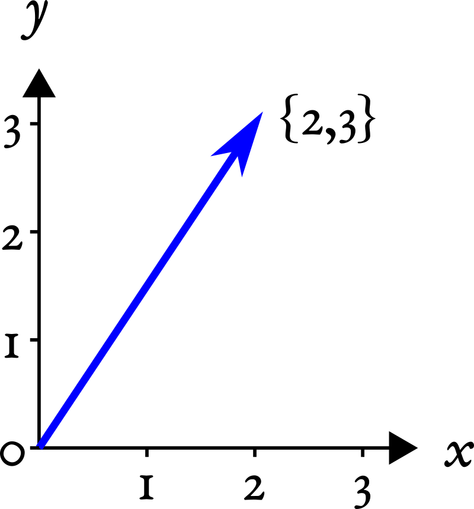
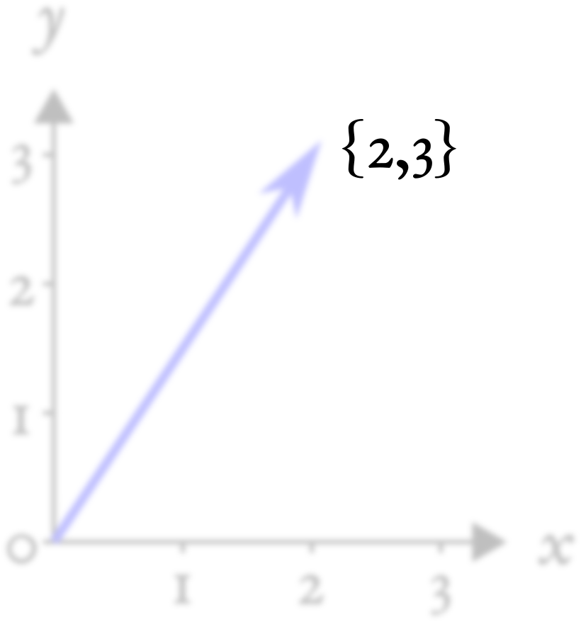
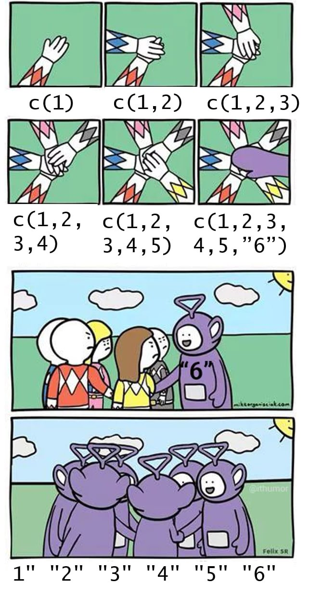
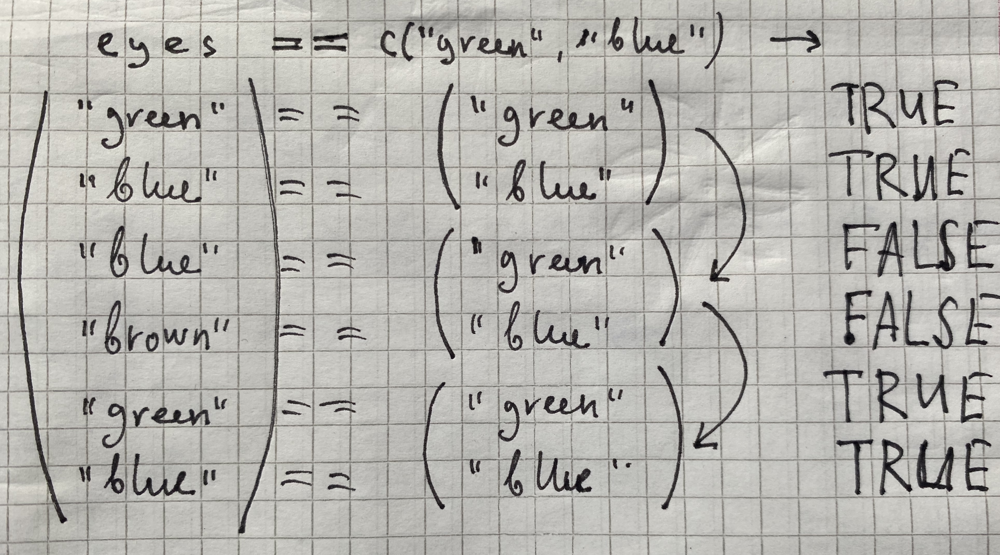
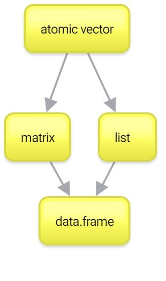

# Вектор {#sec-vector}

## Понятие atomic вектора в R {#sec-atomic}

Если у вас не было линейной алгебры (или у вас с ней было все плохо), то просто запомните, что **вектор** (*atomic vector* или просто *atomic*) --- это набор (столбик) чисел в определенном порядке.

Если вы привыкли из школьного курса физики считать вектора стрелочками, то не спешите возмущаться и паниковать. Представьте стрелочки как точки из нуля координат $(0, 0)$ до какой-то точки на координатной плоскости, например, $(2, 3)$:

{fig-alt="Вектор {2, 3} на координатной плоскости: синяя стрелка из начала координат в точку (2, 3)"}

Вот последние два числа и будем считать вектором. Попытайтесь теперь мысленно стереть координатную плоскость и выбросить стрелочки из головы, оставив только последовательность чисел {2,3}:

{fig-alt="Тот же вектор {2, 3}, но координатная плоскость и стрелка изображены блекло --- остается только последовательность чисел {2, 3}"}

На самом деле, мы уже работали с векторами в R, но, возможно, вы об этом даже не догадывались. Дело в том, что в R нет как таковых скалярных (т.е. одиночных) значений, **есть вектора длиной 1**. Такие дела!

Чтобы создать вектор из нескольких значений, нужно воспользоваться функцией `c()`:

```{r}
c(4, 8, 15, 16, 23, 42)
c("Hey", "Hey", "Ho")
c(TRUE, FALSE)
```

::: callout-important
## *Осторожно:* ошибка с кириллической "с"

Одна из самых мерзких и раздражающих причин ошибок в коде --- это использование `с` из кириллицы вместо `c` из латиницы. Видите разницу? И я не вижу. А R видит. И об этом сообщает:

```{r}
#| error: true
с(3, 4, 5)
```
:::

У любого вектора есть длина --- количество элементов в нем. Ее возвращает функция `length()`:

```{r}
length(c(4, 8, 15, 16, 23, 42))
```

Для создания числовых векторов есть удобный оператор `:`.

```{r}
1:10
5:-3
```

Этот оператор создает вектор от первого числа до второго с шагом 1. Вы не представляете, как часто эта штука нам пригодится... Если же нужно сделать вектор с другим шагом, то есть функция `seq()`:

```{r}
seq(10, 100, by = 10)
```

Кроме того, можно задавать не шаг, а длину вектора. Тогда функция `seq()` сама посчитает шаг:

```{r}
seq(1, 13, length.out = 4)
```

У функции `seq()` есть два полезных родственника --- `seq_len()` и `seq_along()`. `seq_len(n)` создает последовательность натуральных чисел от 1 до `n`:

```{r}
seq_len(5)
```

А `seq_along(x)` создает последовательность натуральных чисел такой же длины, что и `x`, начиная с 1:

```{r}
seq_along(c("Раз", "два", "три", "четыре", "пять", "много", "функций", "будем", "знать!"))
```

::: callout-warning
## *Для продвинутых:* чем `seq_len()` лучше `1:n`

Кажется, будто `seq_len(n)` --- это просто другая запись для `1:n`, а `seq_along(x)` --- для `1:length(x)`. Почти, но есть разница на краю. Вектор бывает и пустым --- длины 0. И если `n` равно 0 (или `x` --- вектор длины 0), то `1:n` даст не пустую последовательность, а `c(1, 0)`: оператор `:` начнет отсчитывать от 1 *в обратную сторону*, до 0. А `seq_len(0)` честно вернет пустую последовательность:

```{r}
1:0
seq_len(0)
```

Особенно пригодятся `seq_len()` и `seq_along()` позже, когда мы будем перебирать элементы вектора по их номерам --- индексам (см. @sec-for): на пустом векторе они уберегут от подобных ошибок.
:::

Другая функция --- `rep()` --- позволяет создавать вектора с повторяющимися значениями. Первый аргумент --- значение, которое нужно повторять, а второй аргумент --- сколько раз повторять.

```{r}
rep(1, 5)
```

И первый, и второй аргумент могут быть векторами! Если второй аргумент --- вектор такой же длины, то каждое значение первого вектора будет повторено соответствующее количество раз из второго вектора.

```{r}
rep(1:3, 3)
rep(1:3, c(10, 2, 30))
```

Если нужно повторить каждое значение в векторе одно и то же количество раз, то можно воспользоваться дополнительным параметром `each =`:

```{r}
rep(1:3, each = 5)
```

Еще можно объединять вектора (что мы, по сути, и делали, просто с векторами длиной 1):

```{r}
v1 <- c("Hey", "Ho")
v2 <- c("Let's", "Go!")
c(v1, v2)
```

Очень многие функции в R работают именно с векторами. Например, функции `sum()` (считает сумму значений вектора) и `mean()` (считает среднее арифметическое всех значений в векторе):

```{r}
sum(1:10)
mean(1:10)
```

## Приведение типов {#sec-coercion}

Что будет, если вы объедините два вектора с значениями разных типов? Ошибка?

Мы уже обсуждали, что в обычных векторах (*atomic* векторах) может быть только один тип данных. В некоторых языках программирования при операции с данными разных типов мы бы получили ошибку. А вот в R при несовпадении типов произойдет попытка привести типы к "общему знаменателю", то есть конвертировать данные в более "широкий" тип (а иногда --- более "узкий" тип, если того требует функция).

Например:

```{r}
c(FALSE, 2)
```

`FALSE` превратился в `0` (а `TRUE` превратился бы в `1`), чтобы оба значения можно было объединить в вектор. То же самое произошло бы в случае операций с векторами:

```{r}
2 + TRUE
```

Это называется **неявным приведением типов (implicit coercion)**.

Вот более сложный пример:

```{r}
c(TRUE, 3, "hi")
```

Здесь все значения были приведены сразу к строковому типу данных.

::: callout-caution
## Время мемов

{fig-alt='Мем: руки складываются в общий кулак (`c(1)`, `c(1,2)`, … `c(1,2,3,4,5,"6")`), но из-за одной строки `"6"` все элементы превращаются в строки `"1"`, `"2"`, …, `"6"` --- иллюстрация приведения типов' fig-align="center" width="56%"}
:::

У R есть иерархия приведения типов:

`NULL < raw < logical < integer < double < complex < character < list < expression`.

Мы из этого списка еще многого не знаем, сейчас важно запомнить, что логические данные --- `FALSE` и `TRUE` --- превращаются в `0` и `1` соответственно, а `0` и `1` в строчки `"0"` и `"1"`.

Если вы боитесь полагаться на приведение типов, то можете воспользоваться функциями `as.нужныйтипданных()` для явного приведения типов (**explicit coercion**):

```{r}
as.numeric(c(TRUE, FALSE, FALSE))
as.character(as.numeric(c(TRUE, FALSE, FALSE)))
```

Можно превращать и обратно, например, строковые значения в числовые. Если среди числа встретится буква или другой неподходящий знак, то мы получим предупреждение `NA` --- пропущенное значение (мы очень скоро научимся с ними работать, см. @sec-about).

```{r}
as.numeric(c("1", "2", "три"))
```

::: callout-tip
## *Полезное:* подсчет количества и доли

Один из распространенных примеров использования неявного приведения типов --- использования функций `sum()` и `mean()` для подсчета в логическом векторе количества и доли `TRUE` соответственно. Мы будем много раз пользоваться этим приемом в дальнейшем!
:::

## Векторизация {#sec-vector_op}

Все те арифметические операторы, что мы использовали ранее, можно использовать с векторами одинаковой длины:

```{r}
n <- 1:4
m <- c(10, 100, 1000, 10000)
m + n
m - n
m * n
m / n
```

Если применить операторы на двух векторах одинаковой длины, то мы получим результат поэлементного применения оператора к двум векторам. Это называется **векторизацией** (**vectorization**).

::: callout-warning
## *Для продвинутых:* скалярное произведение

Если после какого-нибудь MATLAB вы привыкли, что по умолчанию операторы работают по правилам линейной алгебры и `m * n` будет давать скалярное произведение (*dot product*), то снова нет. Для скалярного произведения нужно использовать операторы с `%` по краям:

```{r}
n %*% m
```

Абсолютно так же и с операциями с матрицами в R, хотя про матрицы будет немного позже.
:::

В принципе, большинство функций в R, которые работают с отдельными значениями, так же хорошо работают и с целыми векторами. Скажем, если вы хотите извлечь корень из нескольких чисел, то для этого не нужны никакие циклы (как это обычно делается во многих других языках программирования). Можно просто "скормить" вектор функции и получить результат применения функции к каждому элементу вектора:

```{r}
sqrt(1:10)
```

Таких векторизованных функций в R очень много. Многие из них написаны на более низкоуровневых языках программирования (C, C++, FORTRAN), за счет чего использование таких функций приводит не только к более элегантному, лаконичному, но и к более быстрому коду.

::: callout-warning
## *Для продвинутых:* векторизация вместо циклов

Если вы уже имеете опыт программирования на другом языке, то вам во многих задачах захочется использовать циклы типа `for` и `while` (см. @sec-for). Не спешите этого делать! В очень многих случаях циклы можно заменить векторизацией. Тем не менее, векторизация --- это не единственный способ избавиться от циклов, есть еще функции семейства `apply()` (см. @sec-apply).
:::

## Ресайклинг {#sec-recycling}

Допустим, мы хотим совершить какую-нибудь операцию с двумя векторами. Как мы убедились, с этим обычно нет никаких проблем, если они совпадают по длине. А что если вектора не совпадают по длине? Ничего страшного! Здесь будет работать правило **ресайклинга** *(recycling rule)*. Это означает, что если мы делаем операцию на двух векторах разной длины, то если короткий вектор кратен по длине длинному, короткий вектор будет повторяться необходимое количество раз:

```{r}
n <- 1:4
m <- 1:2
n * m
```

А что будет, если совершать операции с вектором и отдельным значением? Можно считать это частным случаем ресайклинга: короткий вектор длиной 1 будет повторятся столько раз, сколько нужно, чтобы он совпадал по длине с длинным:

```{r}
n * 2
```

Если же меньший вектор не кратен большему (например, один из них длиной 3, а другой длиной 4), то R посчитает результат, но выдаст предупреждение.

```{r}
n + c(3,4,5)
```

Проблема в том, что эти предупреждения могут в неожиданный момент стать причиной ошибок. Поэтому [не стоит полагаться](https://stackoverflow.com/questions/6555651/under-what-circumstances-does-r-recycle) на ресайклинг некратных по длине векторов. А вот ресайклинг кратных по длине векторов --- это очень удобная штука, которая используется очень часто.

## Индексирование векторов {#sec-index_atomic}

Итак, мы подошли к одному из самых сложных моментов. И одному из основных. От того, как хорошо вы научитесь с этим работать, зависит весь ваш дальнейший успех на R-поприще!

Речь пойдет об **индексировании** векторов. Задача, которую вам придется решать каждые пять минут работы в R --- как выбрать из вектора (или же списка, матрицы и датафрейма) какую-то его часть. Для этого используются квадратные скобочки `[]` (не круглые --- они для функций!).

Самое простое --- индексировать по номеру индекса, т.е. порядку значения в векторе.

```{r}
n <- c(0, 1, 1, 2, 3, 5, 8, 13, 21, 34)
n[1]
n[10]
```

::: callout-important
## *Осторожно:* индексация с 1

Если вы знакомы с другими языками программирования (не MATLAB, там всё так же) и уже научились думать, что индексация с 0 --- это очень удобно и очень правильно (ну или просто свыклись с этим), то в R вам придётся переучиться обратно. Здесь первый индекс --- это 1, а последний равен длине вектора --- ее, как мы помним, возвращает `length()`. С обеих сторон индексы берутся включительно.
:::

С помощью индексирования можно не только вытаскивать имеющиеся значения в векторе, но и присваивать им новые:

```{r}
n[3] <- 20
n
```

Конечно, можно использовать целые векторы для индексирования:

```{r}
n[4:7]
n[10:1]
n[4:6] <- 0
n
```

Индексирование с минусом выдаст вам все значения вектора кроме выбранных:

```{r}
n[-1]
n[c(-4, -5)]
```

Минус здесь "выключает" выбранные значения из вектора, а не означает отсчет с конца как в Python.

Более того, можно использовать логический вектор для индексирования. В этом случае нужен логический вектор такой же длины:

```{r}
n[c(TRUE, FALSE, TRUE, FALSE, TRUE, FALSE, TRUE, FALSE, TRUE, FALSE)]
```

Логический вектор работает здесь как фильтр: пропускает только те значения, где на соответствующей позиции в логическом векторе для индексирования содержится `TRUE`, и не пропускает те значения, где на соответствующей позиции в логическом векторе для индексирования содержится `FALSE`.

![Схема логического индексирования: вектор x = (5, −8, 2, −1), логический вектор y = (T, F, T, F); значения с `FALSE` «не проходят» (мем Гэндальфа «YOU SHALL NOT PASS»), поэтому x[y] = (5, 2)](images/013-vector_index_gandolf.png)

Ну а если эти два вектора (исходный вектор и логический вектор индексов) не равны по длине, то тут будет снова работать правило ресайклинга!

```{r}
n[c(TRUE, FALSE)] #то же самое - recycling rule!
```

Есть еще один способ индексирования векторов, но он несколько более редкий: индексирование по имени. Дело в том, что для значений векторов можно (но не обязательно) присваивать имена --- такой вектор называют **именованным** *(named vector)*:

```{r}
my_named_vector <- c(first = 1,
                     second = 2,
                     third = 3)
my_named_vector["first"]
```

А еще можно "вытаскивать" имена из вектора с помощью функции `names()` и присваивать таким образом новые имена.

```{r}
d <- 1:4
names(d) <- letters[1:4]
names(d)
d["a"]
```

::: callout-tip
## *Полезное:* встроенные константы

`letters` --- это "зашитая" в R константа --- вектор букв от a до z. Иногда это очень удобно! Кроме того, есть константа `LETTERS` --- то же самое, но заглавными буквами. А еще в R есть `month.name` --- полные названия месяцев на английском, `month.abb` --- трёхбуквенные аббревиатуры месяцев и числовая константа `pi`.
:::

Вернемся к нашему вектору `n` и посчитаем его среднее с помощью функции `mean()`:

```{r}
mean(n)
```

А как вытащить все значения, которые больше среднего?

Сначала получим логический вектор --- какие значения больше среднего:

```{r}
larger <- n > mean(n)
larger
```

А теперь используем его для индексирования вектора `n`:

```{r}
n[larger]
```

Можно все это сделать в одну строчку:

```{r}
n[n > mean(n)]
```

Предыдущая строчка отражает то, что мы будем постоянно делать в R: вычленять (subset) из данных отдельные куски на основании разных условий.

## Сортировка и ранжирование {#sec-sorting}

Чтобы упорядочить значения в векторе, есть три родственные функции: `sort()`, `order()` и `rank()`. Они хоть и связаны, но возвращают разное.

### `sort()`: сортируем значения {#sec-sort}

Функция `sort()` возвращает вектор с теми же значениями, но в возрастающем порядке:

```{r}
nums <- c(40, 10, 30)
nums
sort(nums)
```

Если параметру `decreasing =` передать значение `TRUE`, то порядок будет обратным:

```{r}
sort(nums, decreasing = TRUE)
```

Обратите внимание на поведение `sort()` со значениями `NA`: по умолчанию они удаляются, но параметром `na.last =` можно настроить, чтобы все `NA` оказались в конце (`TRUE`) или в начале (`FALSE`):

```{r}
nums_na <- c(40, 10, NA, 30)
sort(nums_na)
sort(nums_na, na.last = TRUE)
sort(nums_na, na.last = FALSE)
```

Сортировать можно не только числовые векторы: для логических векторов сначала будут идти все `FALSE`, потом все `TRUE`, а строковые сортируются в алфавитном порядке.

::: callout-important
## *Осторожно:* порядок сортировки строк зависит от локали

А как насчет того, что алфавитный порядок в разных языках разный? Документация R (`?Comparison`) прямо предупреждает: не стоит делать никаких допущений о порядке сортировки строк. Например, в эстонском «z» идет между «s» и «t», а в датском «aa» считается отдельной буквой и идет после «z». Бывает и сложнее: в чешском «ch» --- отдельная буква, которая идет после «h». По правилам какого языка пойдет сортировка, определяется **локалью** *(locale)* --- набором региональных настроек, в которых работает программа: это язык, правила сравнения строк, формат дат и чисел. Существует и особая «нейтральная» локаль `C`: в ней строки сравниваются не по алфавиту какого-либо языка, а просто по числовым кодам символов. Такой порядок не самый естественный для человека (например, все заглавные буквы в нем идут раньше всех строчных), зато он одинаковый на любом компьютере. Отсортировать в этом порядке можно, не меняя никаких настроек: `sort(x, method = "radix")`.
:::

### `order()`: получаем индексы для сортировки {#sec-order}

Функция `order()` возвращает не сами значения, а их **индексы**: в каком порядке нужно брать элементы исходного вектора, чтобы получить отсортированный вектор. Рассмотрим на примере вектора `nums`:

```{r}
nums
```

Сначала нам надо взять второй элемент (`10`), потом третий (`30`), а в конце первый (`40`). Это и выдаст функция `order()`:

```{r}
order(nums)
```

Если проиндексировать исходный вектор этими индексами, то получится то же, что выдает функция `sort()`:

```{r}
nums[order(nums)]
sort(nums)
```

Польза `order()` в том, что полученными индексами можно упорядочить и другой вектор тоже:

```{r}
name <- c("Veronika", "Eugeny", "Lena", "Misha", "Sasha")
age <- c(26, 34, 23, 27, 26)
name[order(age)]
```

### `rank()`: ранжируем значения {#sec-rank}

Функция `rank()` возвращает **ранг** каждого элемента, то есть его место по величине. Ранги стоят на тех же позициях, что и исходные значения: для вектора `nums` это `3 1 2` --- у `40` ранг 3, у `10` --- ранг 1, у `30` --- ранг 2:

```{r}
rank(nums)
```

::: callout-important
## *Осторожно:* ранг 1 получает наименьшее значение

Мы привыкли, что «первое место» достается тому, у кого наибольшее значение, --- как в спорте. У `rank()` наоборот: ранг 1 получает наименьшее значение, а ранги растут в том же направлении, что и сами значения. Поэтому взаимный порядок элементов сохраняется: `order()` от исходного вектора и от вектора рангов выдаст одно и то же. Если же нужны «спортивные» ранги --- 1 у наибольшего, --- можно ранжировать вектор с минусом: `rank(-nums)`.
:::

Если несколько значений в векторе совпадают, возникает **ничья** *(tie)*: на одни и те же ранги претендуют сразу несколько элементов. По умолчанию `rank()` усредняет спорные ранги. Например, в векторе `c(40, 10, 30, 10)` две десятки претендуют на ранги 1 и 2 --- и каждая получает $(1 + 2) / 2 = 1.5$:

```{r}
rank(c(40, 10, 30, 10))
```

Параметр `ties.method =` позволяет выбрать и другие способы. Например, `"min"` присваивает всем совпадающим значениям наименьший из спорных рангов, а `"first"` раздает спорные ранги по порядку появления в векторе:

```{r}
rank(c(40, 10, 30, 10), ties.method = "min")
rank(c(40, 10, 30, 10), ties.method = "first")
```

Сведем все три функции в таблицу:

| Функция | Что возвращает | Для `c(40, 10, 30)` |
|---------|----------------|---------------------|
| `sort()` | значения по порядку | `10 30 40` |
| `order()` | индексы для сортировки | `2 3 1` |
| `rank()` | ранг каждого элемента | `3 1 2` |

## Работа с логическими векторами {#sec-logic_vectors}

На работе с логическими векторами построено очень много удобных фишек, связанных со сравнением условий.

```{r}
eyes <- c("green", "blue", "blue", "brown", "green", "blue")
```

### `mean()` и `sum()` для подсчета пропорций и количества TRUE {#sec-logic_mean_sum}

Уже знакомая нам функция `sum()` позволяет посчитать количество `TRUE` в логическом векторе. Например, можно удобно посчитать сколько раз значение `"blue"` встречается в векторе `eyes`:

```{r}
eyes == "blue"
sum(eyes == "blue")
```

Функцию `mean()` можно использовать для подсчета пропорций `TRUE` в логическом векторе.

```{r}
eyes == "blue"
mean(eyes == "blue")
```

Умножив на 100, мы получим долю, выраженную в процентах:

```{r}
mean(eyes == "blue") * 100
```

### `all()` и `any()` {#sec-all_any}

Функция `all()` выдает `TRUE` только когда все значения логического вектора на входе равны `TRUE`:

```{r}
all(eyes == "blue")
```

Функция `any()` выдает `TRUE` когда есть хотя бы одно значение `TRUE`:

```{r}
any(eyes == "blue")
```

Вместе с оператором `!` можно получить много дополнительных вариантов. Например, есть ли хотя бы один `FALSE` в векторе?

```{r}
any(!eyes == "blue")
!all(eyes == "blue")
```

Все ли значения в векторе равны `FALSE`?

```{r}
all(!eyes == "blue")
!any(eyes == "blue")
```

### Превращение логических значений в индексы: `which()` {#sec-which}

Как вы уже знаете, и логические векторы, и числовые вектора с индексами могут использоваться для индексирования векторов. Иногда может понадобиться превратить логический вектор в вектор индексов. Для этого есть функция `which()`

```{r}
which(eyes == "blue")
```

### Оператор `%in%` и `match()` {#sec-in}

Часто возникает такая задача: нужно проверить вектор на равенство с хотя бы одним значением из другого вектора. Например, мы хотим вычленить всех зеленоглазых и голубоглазых. Может возникнуть идея сделать так:

```{r}
eyes[eyes == c("green", "blue")]
```

Перед нами самый страшный случай: результат *похож* на правильный, но не правильный! Попытайтесь самостоятельно понять почему этот ответ неверный и что произошло на самом деле.

А на самом деле мы просто сравнили два вектора, один из которых короче другого, следовательно, у нас сработало правило ресайклинга.

{fig-alt='Рукописная схема: сравнение eyes == c("green", "blue") с ресайклингом короткого вектора по длинному из шести значений, результат --- TRUE, TRUE, FALSE, FALSE, TRUE, TRUE'}

Как мы видим, это совсем не то, что нам нужно! В данной ситуации нам подойдет сравнение с двумя значениями вместе с логическим ИЛИ.

```{r}
eyes[eyes == "green" | eyes == "blue"]
```

Однако это не очень удобно, особенно если значений больше 2. Тогда на помощь приходит оператор `%in%`, который выполняет именно то, что нам изначально нужно: выдает для каждого значения в векторе слева, есть ли это значение среди значений вектора справа.

```{r}
eyes[eyes %in% c("green", "blue")]
```

::: callout-warning
## *Для продвинутых:* `match()`

Основное преимущество оператора `%in%` в его простоте и понятности. У оператора `%in%` есть старший брат, более сложный и более мощный.

Функция `match()` работает похожим образом на `%in%`, но при совпадении значения в левом векторе с одним из значений в правом выдает индекс соответствующего значения вместо `TRUE`. Если же совпадений нет, то вместо `FALSE` функция `match()` выдает `NA` (что можно поменять параметром `nomatch =`).

```{r}
match(eyes, c("green", "blue"))
```

Зачем это может понадобиться? Во-первых, это способ соединить два набора данных (хотя для этого есть и более подходящие инструменты), во-вторых, так можно все значения, кроме выбранных, заменить на `NA` (для чего тоже есть альтернативы).

```{r}
c("green", "blue")[match(eyes, c("green", "blue"))]
```
:::

## NA - пропущенные значения {#sec-na}

В реальных данных у нас часто чего-то не хватает. Например, из-за технической ошибки или невнимательности не получилось записать какое-то измерение. Для обозначения пропущенных значений в R есть специальное значение `NA` (расшифровывается как *Not Available* - недоступное значение). `NA` --- это не строка `"NA"`, не `0`, не пустая строка `""` и не `FALSE`. `NA` --- это `NA`. Большинство операций с векторами, содержащими `NA` будут выдавать `NA`:

```{r}
missed <- NA
missed == "NA"
missed == ""
missed == NA
```

Заметьте, даже сравнение `NA` c `NA` выдает `NA`. Это может прозвучать абсурдно: ну как же так, и то `NA`, и другое `NA` --- это же одно и то же, они должны быть равны! Не совсем: `NA` --- это отсутствие информации об объекте, неопределенность, неизвестная нам величина. Если мы не знаем двух значений (т.е. имеем два `NA`), то это еще не значит, что они равны.

Иногда наличие `NA` в данных очень бесит:

```{r}
n[5] <- NA
n
mean(n)
```

Получается, что наличие `NA` "заражает" неопределенностью все последующие действия. Что же делать?

Наверное, надо сравнить вектор с `NA` и исключить этих пакостников. Давайте попробуем:

```{r}
n == NA
```

Ах да, мы ведь только что узнали, что даже сравнение `NA` c `NA` приводит к `NA`! Сначала это может показаться нелогичным: ведь с обоих сторон `NA`, почему же тогда результат их сравнения --- это тоже `NA`, а не `TRUE`?

Дело в том, что сравнивая две неопределенности, вы не можете установить между ними знак равенства. Представим себе двух супергероев: Бэтмена и Спайдермена. Допустим, мы не знаем их рост:

```{r}
Batman <- NA
Spiderman <- NA
```

Одинаковый ли у них рост?

```{r}
Batman == Spiderman
```

Мы не знаем! Возможно, да, возможно, и нет. Поэтому у нас здесь остается неопределенность.

Так как же избавиться от `NA` в данных? Самый простой способ --- это функция `is.na()`:

```{r}
is.na(n)
```

Результат выполнения `is.na(n)` выдает `FALSE` на тех позициях, где у нас числа (или другие значения), и `TRUE` там, где у нас `NA`. Чтобы вычленить из вектора `n` все значения кроме `NA` нам нужно, чтобы было наоборот: `TRUE`, если это не `NA`, `FALSE`, если это `NA`. Здесь нам понадобится логический оператор НЕ `!` (мы его уже встречали --- см. @sec-type_logical), который инвертирует логические значения:

```{r}
n[!is.na(n)]
```

Ура, мы можем считать среднее без `NA`!

```{r}
mean(n[!is.na(n)])
```

Теперь вы понимаете, зачем нужно отрицание (`!`)

::: callout-tip
## *Полезное:* `na.rm = TRUE`

Вообще, есть еще один способ посчитать среднее, если есть NA. Для этого надо залезть в хэлп по функции `mean()`:

```{r}
#| eval: false
?mean()
```

В хэлпе мы найдем параметр `na.rm =`, который по умолчанию `FALSE`. Вы знаете, что нужно делать!

```{r}
mean(n, na.rm = TRUE)
```
:::

`NA` может появляться в векторах разных типов. На самом деле, `NA` - это специальное значение в логических векторах, тогда как в векторах других типов `NA` появляется как `NA_integer_`, `NA_real_`, `NA_complex_` или `NA_character_`, но R обычно сам все переводит в нужный формат и показывает как просто `NA`. Таким образом, `NA` в векторах разных типов --- это разные `NA`, хотя на практике эта деталь обычно несущественна.

::: callout-warning
## *Для продвинутых:* `NA` против `NaN`

Кроме `NA` есть еще `NaN` --- это разные вещи. `NaN` расшифровывается как *Not a Number* и получается в результате таких операций как `0 / 0`. Тем не менее, функция `is.na()` выдает `TRUE` на `NaN`, а вот функция `is.nan()` выдает `TRUE` на `NaN` и `FALSE` на `NA`:

```{r}
is.na(NA)
is.na(NaN)
is.nan(NA)
is.nan(NaN)
```
:::

Еще один объект, похожий на `NA` и `NaN`, — это `NULL`. Его можно воспринимать как объект нулевой длины без типа:

```{r}
length(NULL)
is.null(NULL)
```

`NULL` часто используется как значение по умолчанию в аргументах функций (что-то вроде "ничего не задано"), а также для удаления элементов из списков. В отличие от `NA`, `NULL` не является "пропущенным значением" — это скорее "ничто" или "пустой объект".

## Заключение {#sec-vector_end}

Итак, с векторами мы более-менее разобрались. Помните, что вектора --- это один из краеугольных камней вашей работы в R. Если вы хорошо с ними разобрались, то дальше все будет довольно несложно. Тем не менее, вектора --- это не все. Есть еще два важных типа данных: **списки** *(list)* и **матрицы** *(matrix)*. Их можно рассматривать как своеобразное "расширение" векторов, каждый в свою сторону. Ну а списки и матрицы нужны чтобы понять основной тип данных в R --- **датафрейм** *(dataframe)*.

{fig-alt="Схема связей структур данных: от atomic vector стрелки ведут к matrix и list, а от них обоих --- к data.frame" width="400"}
