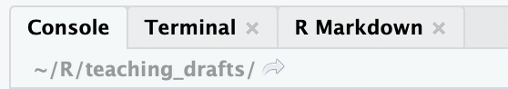

# Импорт данных {#real_data}  

Итак, пришло время перейти к реальным данным. Мы начнем с использования датасета (так мы будем называть любой набор данных) по супергероям. Этот датасет представляет собой табличку, каждая строка которой - отдельный супергерой, а столбик --- какая-либо информация о нем. Например, цвет глаз, цвет волос, вселенная супергероя[^hero_uni], рост, вес, пол и так далее. Несложно заметить, что этот датасет идеально подходит под структуру датафрейма: прямоугольная табличка, внутри которой есть разные колонки, каждая из которой имеет свой тип (числовой или строковый).

[^hero_uni]: супергерои в комиксах, фильмах и телесериалах часто взаимодействуют друг с другом, однако обычно это взаимодействие происходит между супергероями одного издателя. Два крупнейших издателя комиксов --- DC и Marvel, поэтому принято говорить о вселенной DC и Marvel.

## Рабочая папка и проекты RStudio {#wd}

Для начала скачайте файл по [ссылке](https://raw.githubusercontent.com/agricolamz/2020-2021-ds4dh/master/data/heroes_information.csv)

Он, скорее всего, появился у Вас в папке "Загрузки". Если мы будем просто пытаться прочитать этот файл (например, с помощью `read.csv()`  --- мы к этой функцией очень скоро перейдем), указав его имя и разрешение, то наткнемся на такую ошибку:

```{r, error=TRUE}
read.csv("heroes_information.csv")
```

Это означает, что R не может найти нужный файл. Вообще-то мы даже не сказали, где искать. Нам нужно как-то совместить место, где R ищет загружаемые файлы и сами файлы. Для этого есть несколько способов.

- Магомет идет к горе: перемещение файлов в рабочую папку.

Для этого нужно узнать, какая папка является рабочей с помощью функции `getwd()` (без аргументов), найти эту папку в проводнике и переместить туда файл. После этого можно использовать просто название файла с разрешением:

```{r, eval = FALSE}
heroes <- read.csv("heroes_information.csv")
```

Кроме того, путь к рабочей папке можно увидеть в RStudio во вкладке с консолью, в самой верхней части (прямо под надписью "Console"):

{width=400px}

- Гора идет к Магомету: изменение рабочей папки.

Можно просто сменить рабочую папку с помощью `setwd()` на ту, где сейчас лежит файл, прописав путь до этой папки. Теперь файл находится в рабочей папке:

```{r, eval = FALSE}
heroes <- read.csv("heroes_information.csv")
```

Этот вариант использовать не рекомендуется! Как минимум, это сразу делает невозможным запустить скрипт на другом компьютере.

- Гора находит Магомета по месту прописки: указание полного пути файла.

```{r, eval = FALSE}
heroes <- read.csv("/Users/Username/Some_Folder/heroes_information.csv")
```

Этот вариант страдает теми же проблемами, что и предыдущий, поэтому тоже не рекомендуется! 

> Для пользователей Windows есть дополнительная сложность: знак `/` является особым знаком для R, поэтому вместо него нужно использовать двойной `//`.

- Магомет использует кнопочный интерфейс: Import Dataset.

Во вкладке Environment справа в окне RStudio есть кнопка "Import Dataset". Возможно, у Вас возникло непреодолимое желание отдохнуть от написания кода и понажимать кнопочки --- сопротивляйтесь этому всеми силами, но не вините себя, если не сдержитесь.  

- Гора находит Магомета в интернете. 

Многие функции в R, предназначенные для чтения файлов, могут прочитать файл не только на Вашем компьютере, но и сразу из интернета. Для этого просто используйте ссылку вместо пути:

```{r}
heroes <- read.csv("https://raw.githubusercontent.com/agricolamz/2020-2021-ds4dh/master/data/heroes_information.csv")
```

- Каждый Магомет получает по своей горе: использование проектов в RStudio.

На первый взгляд это кажется чем-то очень сложным, но это не так. Это очень просто и ОЧЕНЬ удобно. При создании проекта создается отдельная папочка, где у Вас лежат данные, хранятся скрипты, вспомогательные файлы и отчеты. Если нужно вернуться к другому проекту --- просто открываете другой проект, с другими файлами и скриптами. Это еще помогает не пересекаться переменным из разных проектов --- а то, знаете, использование двух переменных `data` в разных скриптах чревато ошибками. Поэтому очень удобным решением будет выделение отдельного проекта под этот курс.

> При закрытии проекта все переменные по умолчанию тоже будут сохраняться, а при открытии --- восстанавливаться. Это очень удобно, хотя некоторые [рекомендуют от этого отказаться](https://r4ds.had.co.nz/workflow-projects.html). Это можно сделать во вкладке `Tool - Global Options...`

### Табличные данные: текстовые и бинарные данные {#text_binary}

Как Вы уже поняли, импортирование данных - одна из самых муторных и неприятных вещей в R. Если у Вас получится с этим справится, то все остальное - ерунда. Мы уже разобрались с первой частью этого процесса - нахождением файла с данными, осталось научиться их читать.  

Здесь стоит сделать небольшую ремарку. Довольно часто данные представляют собой табличку. Или же их можно свести к табличке. Такая табличка, как мы уже выяснили, удобно репрезентируется в виде датафрейма. Но как эти данные хранятся на компьютере? Есть два варианта: в *бинарном* и в *текстовом* файле.

Текстовый файл означает, что такой файл можно открыть в программе "Блокнот" или аналоге (например, TextEdit на macOS) и увидеть напечатанный текст: скрипт, роман или упорядоченный набор цифр и букв. Нас сейчас интересует именно последний случай. Таблица может быть представлена как текст: отдельные строчки в файле будут разделять разные строчки таблицы, а какой-нибудь знак-разделитель отделять колонки друг от друга.

Для чтения данных из текстового файла есть довольно удобная функция `read.table()`. Почитайте хэлп по ней и ужаснитесь: столько разных параметров на входе! Но там же вы увидете функции `read.csv()`, `read.csv2()` и некоторые другие --- по сути, это тот же `read.table()`, но с другими параметрами по умолчанию, соответствующие формату файла, который мы загружаем. В данном случае используется формат .csv, что означает "Comma Separated Values" (Значения, Разделенные Запятыми). Формат .csv --- это самый известный способ хранения табличных данных в файде на сегодняшний день. Файлы с расширением .csv можно легко открыть в любой программе, работающей с таблицами, в том числе Microsoft Excel и его аналогах.

Файл с расширением .csv --- это просто текстовый файл, в котором "закодирована" таблица: разные строчки разделяют разные строчки таблицы, а столбцы отделяются запятыми (отсюда и название). Вы можете вручную создать такие файлы в Блокноте и сохранять их с форматом .csv - и такая табличка будет нормально открываться в Microsoft Excel и других программах для работы с таблицами. Можете попробовать это сделать самостоятельно!

Как говорилось ранее, в качестве разделителя ячеек по горизонтали --- то есть разделителя между столбцами --- используется запятая. С этим связана одна проблема: в некоторых странах (в т.ч. и России) принято использовать запятую для разделения дробной части числа, а не точку, как это делается в большинстве стран мира. Поэтому есть альтернативный вариант формата .csv, где значения разделены точкой с запятой (`;`), а дробные значения - запятой (`,`). В этом и различие функций `read.csv()` и `read.csv2()` --- первая функция предназначена для "международного" формата, вторая - для (условно) "Российского". Оба варианта формата имеют расширение .csv, поэтому заранее понять какой именно будет вариант довольно сложно, приходится либо пробовать оба, либо заранее открывать файл в текстовом редакторе.

В первой строчке обычно содержатся названия столбцов - и это чертовски удобно, функции `read.csv()` и `read.csv2()` по умолчанию считают первую строчку именно как название для колонок.

Кроме .csv формата есть и другие варианты хранения таблиц в виде текста. Например, .tsv
 --- тоже самое, что и .csv,  но разделитель - знак табуляции. Для чтения таких файлов есть функция  `read.delim()`  и `read.delim2()`. Впрочем, даже если бы ее и не было, можно было бы просто подобрать нужные параметры для функции `read.table()`. Есть даже функции, которые пытаются сами "угадать" нужные параметры для чтения --- часто они справляются с этим довольно удачно. Но не всегда. Поэтому стоит научиться справляться с любого рода данными на входе.

Итак, прочитаем наш файл. Для этого используем только параметр `file =`, который идет первым, и для параметра `stringsAsFactors =` поставим значение `FALSE`:  

```{r}
heroes <- read.csv("data/heroes_information.csv", stringsAsFactors = FALSE)
```

> Параметр `stringsAsFactors =` задает то, как будут прочитаны строковые значения - как уже знакомые нам строки или как факторы. По сути, факторы - это примерно то же самое, что и character, но закодированные числами. Когда-то это было придумано для экономии используемых времени и памяти, сейчас же обычно становится просто лишней морокой. Но некоторые функции требуют именно character, некоторые factor, в большинстве случаев это без разницы. Но иногда непонимание может привести к дурацким ошибкам. В данном случае мы просто пока обойдемся без факторов. Если у вас версия R выше 4.0, то `stringsAsFactors =` будет `FALSE` по умолчанию.

Можете проверить с помощью `View(heroes)`: все работает! Если же вылезает какая-то странная ерунда или же просто ошибка - попробуйте другие функции (`read.table()`, `read.delim()`) и покопаться с параметрами. Для этого читайте `Help`. 

## Проверка импортированных данных

При импорте данных обратите внимания на предупреждения (если таковые появляются), в большинстве случаев они указывают на то, что данные импортированы некорректно.

Проверим, что все прочиталось нормально с помощью уже известной нам функции `str()`: 

```{r}
str(heroes)
```

> Всегда проверяйте данные на входе и никогда не верьте на слово, если вам говорят, что данные вычищенные и не содержат никаких ошибок. 

На что нужно обращать внимание?

1. Прочитаны ли пропущенные значения как `NA`. По умолчанию пропущенные значения обозначаются пропущенной строчкой или "NA", но встречаются самые разнообразные варианты. Возможные варианты кодирования пропущенных значений можно задать в параметре `na.strings =` функции `read.table()` и ее вариантов. В нашем датасете как раз такая ситуация, где нужно самостоятельно задавать, какие значения будут прочитаны как `NA`. Попытайтесь самостоятельно догадаться, как именно.  

2. Прочитаны ли те столбики, которые должны быть числовыми, как `int` или `num`. Если в колонке содержатся числа, а написано `chr` (= `"character"`) или `Factor` (в случае если `stringsAsFactors = TRUE`), то, скорее всего, одна из строчек содержит в себе нечисловые знаки, которые не были прочитаны как `NA`.

3. Странные названия колонок. Это может случиться по самым разным причинам, но в таких случаях стоит открывать файл в другой программе и смотреть первые строчки. Например, может оказаться, что первые несколько строчек --- пустые или что первая строчка не содержит название столбцов (тогда для параметра `header =`  нужно поставить `FALSE`)

4. Вместо строковых данных у вас кракозябры. Это означает проблемы с кодировкой. В первую очередь попробуйте выставить значение `"UTF-8"` для параметра `encoding =` в функции для чтения файла:

```{r}
heroes <- read.csv("data/heroes_information.csv", 
                   stringsAsFactors = FALSE,
                   encoding = "UTF-8")
```

В случае если это не помогает, попробуйте [разобрать](https://www.artlebedev.ru/decoder/), что это за кодировка.

5. Все прочиталось как одна колонка. В этом случае, скорее всего, неправильно подобран разделить колонок --- параметр `sep =`. Откройте файл в текстовом редакторе, чтобы понять какой нужно использовать.

6. В отдельных строчках все прочиталось как одна колонка, а в остальных нормально. Скорее всего, в файле есть значения типа `\` или `"`, которые в функциях `read.csv()`, `read.delim()`, `read.csv2()`, `read.delim2()` читаются как символы для закавычивания значений. Это может понадобиться, если у вас в таблице есть строковые значения со знаками `,` или `;`, которые могут восприниматься как разделитель столбцов.

7. Появились какие-то новые числовые колонки. Возможно неправильно поставлен разделитель дробной части. Обычно это либо `.` (`read.table()`, `read.csv()`, `read.delim()`), либо `,` (`read.csv2()`, `read.delim2()`).

Конкретно в нашем случае все прочиталось хорошо с помощью функции `read.csv()`, но в строковых переменных есть много прочерков, которые обозначают отсутствие информации по данному параметру супергероя, т.е. пропущенное значение. А вот с числовыми значениями все не так просто: для всех супергероев прописано какое-то число, но во многих случаях это -99. Очевидно, отрицательного роста и массы не бывает, это просто обозначение пропущенных значений (такое часто используется). Таким образом, чтобы адекватно прочитать файл, нам нужно поменять параметр `na.strings =` функции `read.csv()`:

```{r}
heroes <- read.csv("data/heroes_information.csv", 
                   stringsAsFactors = FALSE,
                   na.strings = c("-", "-99"))
```

## Экспорт данных {#export_data}

Представим, что вы хотите сохранить табличку с данными про супергероев из вселенной DC в виде отдельного файла .csv.

```{r}
dc <- heroes[heroes$Publisher == "DC Comics",]
```

Функция `write.csv()` позволит записать датафрейм в файл формата .csv:

```{r}
write.csv(dc, "data/dc_heroes_information.csv")
```

Обычно названия строк не используются, и их лучше не записывать, поставив для `row.names =` значение `FALSE`:

```{r}
write.csv(dc, "data/dc_heroes_information.csv", row.names = FALSE)
```

По аналогии с `read.csv2()`, `write.csv2()` позволит записать файлы формата .csv с разделителем `;`.

```{r}
write.csv2(dc, "data/dc_heroes_information.csv", row.names = FALSE)
```

## Импорт таблиц в бинарном формате: таблицы Excel, SPSS {#binary}
 
Тем не менее, далеко не всегда таблицы представлены в виде текстового файла. Самый распространенный пример таблицы в бинарном виде --- родные форматы Microsoft Excel. Если Вы попробуете открыть .xlsx  файл в Блокноте, то увидите кракозябры. Это делает работу с этим файлами гораздо менее удобной, поэтому стоит избегать экселевских форматов и стараться все сохранять в .csv.

Такие файлы не получится прочитать при помощи базового инструментария R. Тем не менее, для чтения таких файлов есть много дополнительных пакетов:

- файлы Microsoft Excel: лучше всего справляется пакет `readxl` (является частью расширенного tidyverse), у него есть много альтернатив (`xlsx`, `openxlsx`).  

- файлы SPSS, SAS, Stata: существуют два основных пакета --- `haven` (часть расширенного tidyverse) и `foreign`.

Что такое пакеты и как их устанавливать мы изучим очень скоро.

## Быстрый импорт данных {#fastread}

Чтение табличных данных обычно происходит очень быстро. По крайней мере, до тех пор пока ваши данные не содержат очень много значений. Если вы попробуете прочитать с помощью `read.csv()` таблицу с миллионами строчками, то заметите, что это происходит довольно медленно. Впрочем, эта проблема эффективно решается дополнительными пакетами.

- Пакет `readr` (часть базового tidyverse) предлагает функции, очень похожие на стандартные `read.csv()`, `read.csv2()` и тому подобные, только в названиях используется нижнее подчеркивание: `read_csv()` и `read_csv2()`. Они быстрее и немного удобнее, особенно если вы работаете в tidyverse.

```{r}
readr::read_csv("data/heroes_information.csv",
         na = c("-", "-99"))
```

- Пакет `vroom` - это часть расширенного tidyverse. Это такая альтернатива `readr` из того же tidyverse, но еще быстрее (отсюда и название).

```{r}
vroom::vroom("data/heroes_information.csv")
```

- Пакет `data.table` - это не просто пакет, а целый фреймворк для работы с R, основной конкурент tidyverse. Одна из основных фишек `data.table` - быстрота работы. Это касается не только процессинга данных, но и их загрузки и записи. Поэтому некоторые используют функции `data.table` для чтения и записи данных в отдельности от всего остального пакета - они даже и называются соответствующе: `fread()` и `fwrite()`, где **f** означет **f**ast[^fread_friendly].

[^fread_friendly]: А еще **f**riendly: `fread()` обычно самостоятельно хорошо угадывает формат таблицы на входе. `vroom` тоже так умеет.

```{r}
data.table::fread("data/heroes_information.csv")
```

Чем же пользоваться среди всего этого многообразия? [Бенчмарки](https://www.danielecook.com/speeding-up-reading-and-writing-in-r/)[^bench] показывают, что быстрее всех `vroom` и `data.table`. Если же у вас нет задачи ускорить работу кода на несколько миллисекунд или прочитать датасет на много миллионов строк, то стандартного `read.csv()` (если вы работаете в базовом R) и `readr::read_csv()` (если вы работаете в tidyverse) должно быть достаточно.

[^bench]: бенчмаркинг --- это тест производительности, в данном случае --- сравнение скорости работы конкурирующих пакетов.

Все перечисленные пакеты повзоляют не только быстро импортировать данные, но и быстро (и удобно!) экспортировать их:

```{r}
readr::write_csv(dc, "data/dc_heroes_information.csv")
readr::write_excel_csv(dc, "data/dc_heroes_information.csv") #Если в Excel возникают проблемы с кодировками при открытии созданного .csv файла, то эта функция решает эти проблемы
vroom::vroom_write(dc, "data/dc_heroes_information.csv", delim = ",")
data.table::fwrite(dc, "data/dc_heroes_information.csv")
```

В плане скорости записи файлов соотношение сил примерно такое же, как и для чтения: `vroom` и `data.table` обгоняют всех, затем идет `readr`, и только после него - базовые функции R.