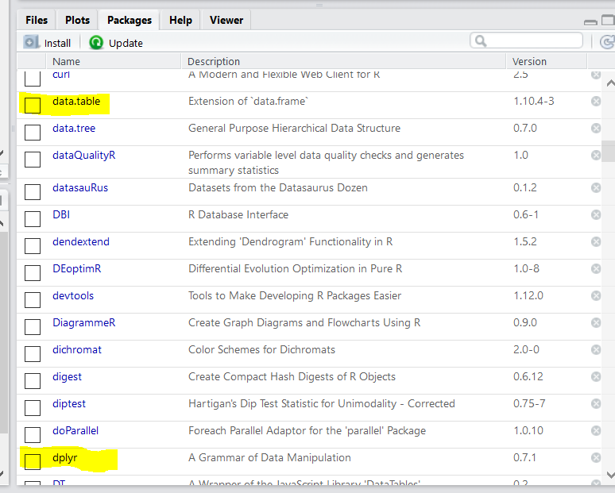

# День 2. Работа с реальными данными в R {#real}

##Препроцессинг данных в R {#prep}

Вчера мы узнали про основы языка R, про то, как работать с векторами, списками, матрицами и, наконец, датафреймами. Мы закончили день на загрузке данных, с чего мы и начнем сегодня:

```{r day2}
got <- read.csv("data/character-deaths.csv", stringsAsFactors = FALSE)
```

После загрузки данных стоит немного "осмотреть" получившийся датафрейм `got`.

###Исследование данных  {#explore}

Ок, давайте немного поизучаем датасет. Обычно мы привыкли глазами пробегать по данным, листая строки и столбцы - и это вполне правильно и логично, от этого не нужно отучаться. Но мы можем дополнить наш базовый зрительнопоисковой инструментарий несколькими полезными командами.  

Во-первых, вспомним другую полезную функцию `str()`:
```{r}
str(got)
```

Давайте разберемся с переменными в датафрейме:

Колонка `Name` - здесь все понятно. Важно, что эти имена записаны абсолютно по-разному: где-то с фамилией, где-то без, где-то в скобочках есть пояснения. Колонка `Allegiances` - к какому дому принадлежит персонаж. С этим сложно, иногда они меняют дома, здесь путаются сами семьи и персонажи, лояльные им. Особой разницы между `Stark` и `House Stark` нет.  Следующие колонки - `Death Year`, `Book.of.Death`, `Death.Chapter`, `Book.Intro.Chapter` - означают номер главы, в которой персонаж впервые появляется, а так же номер книги, глава и год (от завоевания Вестероса Эйгоном Таргариеном), в которой персонаж умирает. `Gender` - `1` для мужчин, `0` для женщин. `Nobility` - дворянское происхождение персонажа. Последние 5 столбцов содержат информацию, появлялся ли персонаж в книге (всего книг пока что 5).   

Другая полезная функция для больших таблиц - функция `head()`: она выведет первые несколько (по дефолту 6) строчек датафрейма.

```{r}
head(got)
```

Есть еще функция `tail()`. Догадайтесь сами, что она делает.

Для некоторых переменных полезно посмотреть таблицы частотности с помощью функции `table()`:

```{r}
table(got$Allegiances)
```

Уау! Очень просто и удобно, не так ли? Функция `table()` может принимать сразу несколько столбцов. Это удобно для получения *таблиц сопряженности*:

```{r}
table(got$Allegiances, got$Gender)
```

###Subsetting  {#subset}
 
Как мы обсуждали на прошлом занятии, мы можем сабсеттить (т.е. выделять часть датафрейма) датафрейм, обращаясь к нему и как к матрице: *датафрейм[вектор_с_номерами_строк, вектор_с_номерами_колонок]*

```{r}
got[100:115, 1:2]
```

и используя имена колонок:

```{r}
got[508:515, "Name"]
```

и даже используя вектора названий колонок!

```{r}
got[508:515, c("Name", "Allegiances", "Gender")]
```

Мы можем вытаскивать отдельные колонки как векторы:  

```{r}
houses <- got$Allegiances
unique(houses) #посмотреть все уникальные значения - почти как с помощью table()
```

Итак, давайте решим нашу первую задачу - вытащим в отдельный датасет всех представителей Ночного Дозора.
Для этого нам нужно создать вектор логических значений - результат сравнений колонки `Allegiances` со значением `"Night's Watch"` и использовать его как вектор индексов для датафрейма.

```{r}
vectornight <- got$Allegiances == "Night's Watch"
head(vectornight)
```

Теперь этот вектор с `TRUE` и `FALSE` нам надо использовать для индексирования строк. Но что со столбцами? Если мы хотем сохранить все столбцы, то после запятой внутри квадратных скобок нам не нужно ничего указывать:  

```{r}
nightswatch <- got[vectornight, ]
head(nightswatch)
```

Вуаля!
Все это можно сделать проще и в одну строку:

```{r}
nightswatch <- got[got$Allegiances == "Night's Watch", ]
```

И не забывайте про запятую!

Теперь попробуем вытащить одновременно всех Одичалых (`Wildling`) и всех представителей Ночного Дозора. Это можно сделать, используя оператор `|` (ИЛИ) при выборе колонок:

```{r}
nightwatch_wildling <-
  got[got$Allegiances == "Night's Watch" | got$Allegiances == "Wildling", ]

head(nightwatch_wildling)
```

> Кажется очевидным следующий вариант: `got[got$Allegiances == c("Night's Watch", "Wildling"),]`. Однако это выдаст не совсем то, что нужно, хотя результат может показаться верным на первый взгляд. Попробуйте самостоятельно ответить на вопрос, что происходит в данном случае и чем результат отличается от предполагаемого. Подсказка: вспомните правило recycling.

Для таких случаев есть удобный оператор `%in%`, который позволяет сравнить каждое значение вектора с целым набором значений. Если значение вектора хотя бы один раз встречается в векторе справа от `%in%`, то результат - `TRUE`:

```{r}
1:6 %in% c(1, 4, 5)

nightwatch_wildling <- got[got$Allegiances %in% c("Night's Watch", "Wildling"), ]
head(nightwatch_wildling)
```

###Создание новых колонок {#newcol}

Давайте создадим новую колонку, которая будет означать, жив ли еще персонаж (по книгам). 
Заметьте, что в этом датасете, хоть он и посвящен смертям персонажей, нет нужной колонки. Мы можем попытаться "вытащить" эту информацию.  В колонках `Death.Year`, `Death.Chapter` и `Book.of.Death` стоит `NA` у многих персонажей. Например, у `"Arya Stark"`, которая и по книгам, и по сериалу живее всех живых и мертвых:

```{r}
got[got$Name == "Arya Stark", ]
```

Следовательно, если в `Book.of.Death` стоит `NA`, мы можем предположить, что Джордж Мартин еще не занес своей карающей руки над этим героем.

Мы можем создать новую колонку `Is.Alive`:

```{r}
got$Is.Alive <- is.na(got$Book.of.Death)
```

Готово! Как легко, просто и элегантно, не так ли? Но в жизни часто бывает все сложнее, поэтому давайте научимся еще некоторым важным инструментам.

##Циклы, условия, создание функций {#loopsetc}
###If, else, else if {#ifelse}

Как и во всех "нормальных" языках программирования, в R есть if-else statements.

Например:

```{r}
na_slovah <- "Лев Толстой"
if (na_slovah == "Лев Толстой"){
  na_dele = "Парень простой"
} else {na_dele = na_slovah} 

na_dele
```

В круглых скобках после `if` - условие. Если оно `TRUE`, то выполняется то, что внутри последующих фигурных. Если не выполняется, то выполняется то, что в фигурных скобках после `else` (если `else` вообще присутствует).  

Можно использовать несколько условий:

```{r}
na_slovah <- "Алексей Толстой"
if (na_slovah == "Лев Толстой"){
  na_dele = "Парень простой"
} else if (na_slovah == "Алексей Толстой") {
  na_dele = "Лев Толстой"
} else {na_dele = na_slovah}

na_dele
```


Тем не менее, с `if`, `else`, `else if` есть одна серьезная проблема - на входе нельзя дать вектор, можно только единственное значение. Какая боль! Для решения этой проблемы можно воспользоваться функцией `ifelse()` или циклами.

###Функция ifelse() {#ifelse}

Функция `ifelse()` принимает три аргумента - 1) условие (т.е., по сути, логический вектор, состоящий из `TRUE` и `FALSE`), 2) что выдавать в случае `TRUE`, 3) что выдавать в случае `FALSE`. Вот это как раз мы можем применить уже к нашим данным.

Давайте сначала сотрем созданную колонку `Is.Alive`. Для этого присвоим ей значение `NULL`:

```{r}
got$Is.Alive <- NULL
```

Затем создадим ее заново, но уже как текстовую с помощью ifelse():

```{r}
got$Is.Alive <- ifelse(is.na(got$Book.of.Death), "Alive", "Dead")
```

> К сожалению, аналога `else if` в этой функции нет. Но если у вас больше, чем два варианта, то никто не мешает использовать `ifelse()` внутри `ifelse()`

###For loops {#for}

Во многих других языках программирования циклы (типа `for` и `while`) - это основа основ. Но не в R. В R они, конечно, есть, но использовать их не рекомендуется.
Векторизированные операции в R экономнее - как в плане более короткого и читаемого кода, так и в плане скорости. 

> Векторизованные функции часто написаны на более низкоуровневом языке (например, С), которые быстрее R.

Поэтому дважды подумайте, прежде чем делать то, что я сейчас покажу! Почти всегда в R можно обойтись без циклов.  

```{r}
got$Is.Alive <- NULL
got$Is.Alive <- character(nrow(got)) #сделаем вектор, заполненный пустыми строками

for (i in 1:nrow(got)) {
  if (is.na(got$Book.of.Death[i])) {
  got$Is.Alive[i] <- "Alive"
  } else {
  got$Is.Alive[i] <- "Dead"
  }
}
```

Ужас какой! Да еще и легко ошибиться. К тому, чтобы НЕ использовать циклы обычно получается приучиться не сразу у тех, кто пришел из других языков программирования. Часто кажется, что именно в данном случае без циклов не обойтись, но в подавляющем числе случаев это не так. Дело в том, что обычно мы работаем в R с датафреймами, которые представляют собой множество относительно независимых наблюдений. Если мы хотим провести какие-нибудь операции с этими наблюдениями, то они обычно могут быть выполнены параллельно. Скажем, вы хотите для каждого испытуемого пересчитать его массу из фунтов в килограммы. Этот пересчет осуществляется по одинаковой формуле для каждого испытуемого. Эта формула не изменится из-за того, что какой-то испытуемый слишком большой или слишком маленький - для следующего испытуемого формула будет прежняя. Если Вы встречаете подобную задачу (где функцию можно применить независимо для всех значений), то без цикла `for` вполне можно обойтись. 

> После этих объяснений кому-то может показаться странным, что я вообще упоминаю про эти циклы. Но для кого-то циклы `for` настолько привычны, что их полное отсутствие в курсе может показаться еще более странным. Поэтому лучше от меня, чем на улице.

Бывают случаи, в которых расчет значения в строчке все-таки зависит от предыдущих, но и тогда можно обойтись без циклов! Например, для подсчета кумулятивной суммы можно использовать функцию `cumsum()`:

```{r}
cumsum(1:10)
```

Существуют и исключения - некоторые функции не векторизованы. Но и тогда можно обойтись без `for`. В R есть "скрытые" циклы - семейство функций `apply()`. Но сначала нам нужно научиться создавать собственные функции.

> Вообще, если писать циклы `for` корректно, то они не такие уж и медленные. Главное --- заранее создавать переменную нужного размера  и не изменять размер объекта при каждой итерации цикла. Это основная причина "тормознутости" циклов в R. Тем не менее, циклов следует избегать по той причине, что они со скрипом вписываются в логику функционального программирования в R, поэтому решения без циклов `for` обычно оказываются проще и элегантнее.

###Создание функций {#newfun}

Поздравляю, сейчас мы выйдем на качественно новый уровень владения R. Вместо того, чтобы пользоваться теми функциями, которые уже написали за нас, мы можем сами создавать свои функции! В этом нет ничего сложного. Функция - это такой же объект в R, как и остальные. Давайте разберем на примере создания функции `sumofsquares()`, которая будет считать сумму квадратичных отклонений от среднего:  $Sum of squares = \sum_{i=1}^{n}(x_i - \bar{x})^2$

Эта формула будет нам часто встречаться, когда мы перейдем к статистике!

```{r}
sumofsquares <- function(x) {
  centralized_x <- x - mean(x)
  squares <- centralized_x ^ 2
  sum_of_squares <- sum(squares)
  return(sum_of_squares)
}
sumofsquares(1:10)
```

Синтаксис создания функции внешне похож на создание циклов. Мы пишем ключевое слово `function`, в круглых скобках обозначаем переменные, с которыми собираемся что-то делать. Внутри фигурных скобок пишем выражения, которые будут выполняться при запуске функции. У функции есть свое собственное окружение --- место, где хранятся переменные. Вот именно те объекты, которые мы передаем в скобочках, и будут в окружении, так же как и "обычные" переменные для нас в глобальном окружении. Это означает, что функция будет искать переменные в первую очередь среди объектов, которые переданы в круглых скобочках. С ними функция и будет работать. На выходе функция выдаст то, что будет закинуто в `return()`. Однако функция `return()` часто опускается: если ее нет, то функция будет выводить результат последнего выражения [^return]. Таким образом, нашу функцию можно написать короче:

[^return]: Если в последней строчке будет присвоение, то функция ничего не вернет обратно. Это очень распространенная ошибка: функция вроде бы работает правильно, но ничего не возвращает. Нужно писать так, как будто бы в последней строчке результат выполнения выводится в консоль.

```{r}
sumofsquares <- function(x) {
  centralized_x <- x - mean(x)
  squares <- centralized_x ^ 2
  sum(squares)
}
sumofsquares(1:10)
```

Можно еще сократить функцию:

```{r}
sumofsquares <- function(x) {
  sum((x - mean(x)) ^ 2)
}
sumofsquares(1:10)
```

На самом деле, если функция занимает всего одну строчку, то фигурные скобки и не нужны. 

```{r}
sumofsquares <- function(x) sum((x - mean(x)) ^ 2)

sumofsquares(1:10)
```

Вообще, фигурные скобки используются для того, чтобы выполнить серию выражений, но вернуть только результат выполнения последнего выражения. Это можно использовать, чтобы не создавать лишних временных переменных в глобальном окружении.

Когда стоит создавать функции? Существует ["правило трех"](https://en.wikipedia.org/wiki/Rule_of_three_(computer_programming)) - если у вас есть три куска очень похожего кода, то самое время превратить код в функцию. Это очень условное правило, но, действительно, стоит избегать копипастинга в коде. В этом случае очень легко ошибиться, код становится нечитаемым. 

Но есть и другой подход к созданию функций. Их стоит создавать не столько для того, чтобы использовать тот же код снова, сколько для абстрагирования от того, что происходит в отдельных строчках кода. Если несколько строчек кода были написаны для того, чтобы решить одну задачу, которой можно дать понятное название (например, подсчет какой-то особенной метрики, для которой нет готовой функции в R), то этот код стоит обернуть в функцию. Если функция работает корректно, то теперь не нужно думать над тем, что происходит внутри нее. Вы ее можете мысленно представить как операцию, которая имеет определенный вход и выход --- как и встроенные функции в R.

<blockquote class="twitter-tweet" data-lang="en"><p lang="en" dir="ltr">The reason for writing a function is not to reuse its code, but to name the operation it performs.</p>&mdash; Tim &quot;Agile Otter&quot; Ottinger (@tottinge) <a href="https://twitter.com/tottinge/status/293776089099153408?ref_src=twsrc%5Etfw">January 22, 2013</a></blockquote> <script async src="https://platform.twitter.com/widgets.js" charset="utf-8"></script> 


###Cемейство функций apply()  {#apply}

Семейство? Да, их целое множество: `apply()`, `lapply()`,`sapply()`, `vapply()`,`tapply()`,`mapply()`, `rapply()`... Ладно, не пугайтесь, всех их знать не придется. Обычно достаточно первых двух-трех. Проще всего пояснить как они работают на простой матрице с числами:

```{r}
A <- matrix(1:12, 3, 4)
A 
```

Теперь представим, что нам нужно посчитать что-нибудь (например, сумму) по каждой из строк. С помощью функции `apply()` вы можете в буквальном смысле "применить" какую либо функцию к матрице или датафрейму. Правда, эта функция будет пытаться превратить датафрейм в матрицу, так что будьте осторожны. Синтаксис такой: `apply(X, MARGIN, FUN, ...)`, где  `X` --- Ваши данные, `MARGIN` это `1` (для строк), `2` (для колонок), `c(1,2)` для строк и колонок (т.е. для каждого элемента по отдельности), а `FUN` --- это функция, которую вы хотите применить, но без скобок `()`! `apply()` будет брать строки/колонки из `X` в качестве первого аргумента для функции. 

{width=400}

Давайте разберем на примере:

```{r}
apply(A, 1, sum) #сумма по каждой строчке
apply(A, 2, sum) #сумма по каждой колонке
apply(A, c(1,2), sum) #кхм... сумма каждого элемента
```

Заметьте, мы вставляем функцию (а не ее аутпут!) как инпут в функцию.  

{width=400}

###Анонимные функции  {#anon}

Если вдумаетесь, то тут возникает определенная сложность: функция `apply()` будет работать только в том случае, если функция принимает первым аргументом именно то, что мы ей даем... А если это не так? Тогда мы можем создать *анонимные функции*! 

>Еще можно написать нужные аргументы через запятую после аргумента FUN:  

```{r}
apply(A, 1, weighted.mean, w = c(0.2, 0.4, 0.3, 0.1)) 
```

Анонимные функции - это функциии, которые будут использоваться один раз и без названия.

> Питонистам знакомо понятие *лямбда-функций*. Да, это то же самое

Например, мы можем посчитать сумму квадратичных отклонений от среднего без называния этой функции:
```{r}
apply(A, 1, function(x) sum((x-mean(x))^2))
apply(A, 2, function(x) sum((x-mean(x))^2))
apply(A, c(1,2), function(x) sum((x-mean(x))^2))
```

Как и в случае с обычной функцией, в качестве `x` выступает объект, с которым мы хотим что-то сделать, а дальше следует функция, которую мы собираемся применить к `х`. Можно использовать не `х`, а что угодно, как и в обычных функциях:

```{r}
apply(A, 1, function(whatevername) sum((whatevername-mean(whatevername))^2))
```

Ок, с `apply()` разобрались. А что с остальными? Некоторые из них еще проще и не требуют индексов, например, `lapply` (для применения к каждому элементу списка) и `sapply()` - упрощенная версия `lapply()`, которая пытается по возможности "упростить" результат до вектора или матрицы. Давайте теперь сделаем то же самое, что мы и делали (создание колонки `got$Is.Alive`), но с помощью `sapply()`:  

```{r}
got$Is.Alive <- NA
got$Is.Alive <- sapply(got$Book.of.Death, function (x) ifelse(is.na(x), "Alive", "Dead"))
```

Можно применять функции `lapply()` и `sapply()` на датафреймах. Поскольку фактически датафрейм - это список из векторов одинаковой длины (см. \@ref(df)), то итерироваться эти функции будут по колонкам:

```{r}
lapply(got, class)
```

Еще одна функция из семейства `apply()` - функция `replicate()` - самый простой способ повторить одну и ту же операцию много раз. Обычно это используется при симуляции данных и моделировании. Например, давайте сделаем выборку из логнормального распределения:

```{r}
set.seed(1) #Это сделает выбор случайных чисел воспроизводимым
samp <- rlnorm(30)
hist(samp)
```

А теперь давайте сделаем 1000 таких выборок и из каждой возьмем среднее:

```{r}
sampdist <- replicate(1000, mean(rlnorm(30)))
hist(sampdist)
```

> Про функции для генерации случайных чисел и про визуализацию мы поговорим в следующие дни.

Если хотите познакомиться с семейством `apply()` чуточку ближе, то рекомендую [вот этот туториал](https://www.datacamp.com/community/tutorials/r-tutorial-apply-family).

##Работа с текстом {#text}

Работа с текстом - это отдельная и сложная задача. И у R есть мощные инструменты для этого!. Для более-менее продвинутой работы с текстом придется выучить специальный язык - "регулярные выражения" (*regular expressions, regex, regexp*). Регулярные выражения реализованы на многих языках, в том числе в R. Но мы пока обойдемся наиболее простыми функциями, которые покроют большую часть того, что нам нужно уметь делать при работе с текстом. 

У нас есть две текстовые переменные - `Name` (имя персонажа) и `Allegiances` (дом, которому персонаж принадлежит/лоялен). Давайте попробуем вытащить всех персонажей, лояльных Старкам - как тех, у которых в `Allegiances` стоит `"House Stark"`, так и тех, у кого стоит `"Stark"`. В этом нам поможет функция `grep()`. Заметьте, что в этой функции необычного - первым ее аргументом является паттерн, который мы ищем, а не данные (как обычно). 

> Я рекомендую пока что ставить параметр `fixed = TRUE`. Иначе он будет искать по правилам регулярных выражений (да, R по умолчанию работает именно с регулярными выражениями). Сейчас это не создаст нам проблем, а вот если будете искать что-то с математическими или другими знаками - проблемы будут возникать. Регулярные выражения  - это специальный язык поиска сложных паттернов в тексте. Типа "Хочу все первые три знака после второго дефиса". Он выглядит страшным и совершенно не читаемым, но в нем нет ничего сложного. Если Вам нужно много работать с текстом, то уделите один день освоению "регулярок"! По умолчанию с помощью функции grep() идет поиск именно по регулярным выражениям. Чтобы это отключить, мы и используем параметр fixed = TRUE.  

```{r}
grep("Stark", got$Allegiances, fixed = TRUE) 
```

Результат --- индексы, которые мы можем использовать, чтобы вытащить всех Старков:  

```{r}
starks <- got[grep("Stark", got$Allegiances, fixed = TRUE), ]
table(starks$Allegiances)
```

Остались только Старки! 

> Если вы вдруг при чтении файла не поставили `stringsAsFactors = FALSE`, то в полученной таблице останутся другие дома, пусть и с нулевыми значениями. Так работают факторы в R. Чтобы избавиться от "пустых" уровней факторов (иногда это нужно), можно воспользоваться простой функцией `droplevels()`. С character колонками такой магии не нужно.

Хорошо, как находить что-то в текстовых переменных --- разобрались. А как заменять? У нас здесь есть очевидная задача: cовместить все `"House Stark"` и просто `"Stark"`, но для всех домов в оригинальном датасете. Для этого можно поменять все `"House "` на пустую строку `""` с помощью функции `gsub()`. Она работает примерно так же как и `grep()`, но сначала ищет искомый паттерн (`"House "`), затем то, на что мы его меняем (`""`), потом наш вектор. На выходе мы получим новый вектор, который можно подставить взамен старой колонки `got$Allegiances` (или создать новую колонку `got$Houses`):

```{r}
got$Houses <- gsub("House ", "", got$Allegiances, fixed = TRUE)
table(got$Allegiances)
```

Другая важная функция для работы с текстом: `nchar()` - количество знаков. Давайте найдем самое длинное имя в книгах Джорджа Мартина про лед, пламя, насилие и инцест:

```{r}
max(nchar(got$Name))
```

`r max(nchar(got$Name))` символа! Интересно, у кого же это?

```{r}
longest <- which.max(nchar(got$Name)) #index of the longest name
got[longest, 1:2]
```

А, ну, конечно, вот это вот пояснение в скобочках все испортило. Давайте его уберем.

Для этого нам понадобится функция `substr()`. Она работает как "ножницы": Сначала берем вектор значений, а потом два числа: откуда и покуда будем вырезать нужный кусок:

```{r}
aemon <- substr(got$Name[longest], 1, 15)
aemon
got$Name[longest] <- aemon 
```

Ну и, конечно, нам нужно знать как объединять строки. Не в вектор, а в одно значение. Для этого есть простые функции `paste()` и `paste0()`. Для `paste()` можно выбрать разделить `sep =`, который по умолчанию является пробелом, а `paste0()` - это функция `paste()` с пустым разделителем по умолчанию:

```{r}
paste("R", "is", "love")
paste0("R", "is", "love")
```

Обратите внимание: функция `paste()` принимает в качестве аргуметов векторы, чтобы соединить их в один вектор. Если нужно превратить один строковый вектор в одно значение, то можно поставить какое-нибудь значение параметра `collapse =` (по дефолту это `NULL`):  

```{r}
phrase <- paste(c("All", "you", "need", "is", "love"), collapse = " <3 ")
phrase
```

Функция `strsplit()` делает наоборот - она разбирает значение на вектор с выбранным разделителем:

```{r}
strsplit(phrase, split = " <3 ")
```

> Для тех, кто привык к C format (printf-style formatting), в R это можно сделать с помощью функции `sprintf()`:

```{r}
sprintf("%i на кроссовки; Трачу деньги на %s и трачу их без остановки", 20000, "ерунду")
```


Пока что этого будет нам достаточно для работы с текстом. В принципе, этих функций достаточно в большинстве случаев. Если же вдруг нужно копнуть глубже - придется освоить язык регулярных выражений. Он кажется страшным, но это займет у Вас всего пару часов с вот этим [удобным онлайн туториалом](https://regexone.com/) и [этим онлайн инструментом](https://regex101.com/). 
Для базовой работы с текстом в R есть вот [эта немного занудная, но короткая книжка](http://gastonsanchez.com/Handling_and_Processing_Strings_in_R.pdf). В ней примерно все то же самое, что мы сегодня разобрали, но на более глубоком уровне.

##Работа с дополнительными пакетами {#new_pack}

Пакеты в R - это обычно набор функций (иногда датасетов и т.п.) с документацией по ним. Они нужны для того, чтобы выйти за рамки функциональности базового R или же просто для того, чтобы сделать работу в R еще удобнее. Для R есть более 15000 пакетов (по данным на февраль 2020 года), которые вы можете скачать с зеркал Comprehensive R Archive Network (CRAN) с помощью простой функции `install.packages()`, где в качестве основного аргумента используется вектор имен скачиваемых пакетов.  

```{r, eval = FALSE}
install.packages(c("data.table", "dplyr"))
```

Для установки пакетов нужен интернет!  

Эти 15000+ пакетов содержат в себе уйму всякого. Некоторые представляют собой буквально одну удобную функцию, некоторые посвящены какой-то узкоспециализированной теме (например, работе с текстом), есть даже просто наборы всякой всячины от того или иного разработчика (например, пакет `Hmisc`). Кроме того, можно устанавливать пакеты из других источников и делать собственные.  
После установки пакета Вы увидете его во вкладке Packages справа внизу

{width=400}

Затем нужно "присоединить" этот пакет. Запомните: устанавливаете пакет всего один раз, а присоединяете его в каждой новой сессии.  

```{r}
library("dplyr")
```

{width=400}

##Решейпинг данных {#reshape}

Теперь мы возьмем данные по битвам из книг про Игру Престолов. Каждая строчка означает какую-то битву, описанную в книгах нашего любомого пухляша-бородача. Подробную информацию про набор данных можно найти [здесь](https://www.kaggle.com/mylesoneill/game-of-thrones). Скачать данные можно [здесь](https://raw.githubusercontent.com/Pozdniakov/stats/master/data/character-deaths.csv)

```{r}
bat <- read.csv("data/battles.csv")
```

После освоения базовых возможностей датафрейма, становится понятно, что чего-то не хватает. Допустим, мы хотим узнать, в каких годах были наиболее эпичные битвы. Нам нужно посчитать среднее количество бойцов атакующей армии по годам. Зная все года битв, можно сделать так:

```{r}
mean(bat[bat$year == 298, "attacker_size"], na.rm = T)
mean(bat[bat$year == 299, "attacker_size"], na.rm = T)
mean(bat[bat$year == 300, "attacker_size"], na.rm = T)
```

Всякий раз, когда у Вас возникает желание сделать что-нибудь с помощью священного копипаста - задумайтесь: разве ради этого Вы пришли на курс? Конечно, нет! Как говорилось ранее, если появляется желание копипастить одни и те же строчки, это означает, что, скорее всего, это можно сделать быстрее, проще и лучше.

Конечно, стандартными возможностями R, которые мы уже освоили, нашу задачу можно выполнить, но довольно неудобно:  

```{r}
sapply(unique(bat$year), function(x) mean(bat$attacker_size[bat$year == x], na.rm = T))
```

> В принципе, есть много других способов сделать то же самое - функция `aggregate()`, `split()`, но мы на них останавливаться не будем.

Тем не менее, задача аггрегации данных - это то, что необходимо постоянно. Усреднить значения по каждому испытуемому, получить средние значения по каждому из уровней всех переменных... А если нужно не усреднять, а делать что-то более сложное? Очевидно, что тут нам нужны какие-то новые инструменты, которых мы еще не знаем. И здесь у нас появляется важная развилка - есть два разных пакета, которые позволяют удобно делать агрегацию и другие операции, о которых мы говорили раньше (например, сабсеттинг) и о которых мы еще поговорим позднее.  


###data.table vs. dplyr {#holywar}


Начнем с пакета **`dplyr`** от создателя `ggplot2` (а еще `tidyr`, `stringr`, `lubridate`, `devtools`, `httr`, `readr` и много других популярных пакетов для R) Хэдли Уиэкхэма.  

> Сейчас этот парень работает в RStudio, следы чего вы можете обнаружить. Например, откройте Help - Cheatsheets: Вы обнаружите читшиты для dplyr. Но не для data.table =)  

Этот подход сильно перерабатывает синтаксис R, отличается понятностью и читаемостью. Более того, он очень популярен, многие пакеты предполагают, что Вы именно с ним работаете и хорошо им владеете. 

``` {r}
library("dplyr")
bat %>% group_by(year) %>% summarise(mean(attacker_size, na.rm = T))
```

Просто попытайтесь догадаться, что значат эти строчки: берем датафрейм, группируем по году, выводим какую-то суммирующию информацию по каждой группе. 

> Оператор %>% называется "пайпом" (pipe), т.е. "трубой". Он означает, что следующая функция принимает на вход в качестве первого аргумента аутпут предыдущей. Фактически, это примерно то же самое, что и вставлять аутпут функции как первый инпут в другую функцию. Просто выглядит это красивее и читабельнее. Как будто данные пропускаются через трубы функций или конвеерную ленту на заводе, если хотите. А то, что первый параметр функции - это почти всегда данные, работает нам на руку. Этот оператор взят из пакета magrittr. Возможно, даже если вы не захотите пользоваться dplyr, использование пайпов Вам понравится. Ну а если нет, то тогда вперед к data.table!  

Множество пакетов, опирающихся и дополняющих `dplyr` (`magrittr`, `purrr`, `stringr`, `readr`, `tidyr`, `tibble` и т.д.), называют "tidyverse". Эти пакеты предлагают альтернативные варианты для многих операций в R. Например, `stringr` дает удобные функции для работы со строковыми данными (фактически заменяя стандартные), пакет `readr` заменяет стандартный импорт данных, а `purrr` - функции типа `apply()`. Выходит, что это уже практически новый язык!

Другой подход - пакет **`data.table`**. Он не так сильно перерабатывает стиль работы в R, но изменяет датафреймы, "совершенствуя" их. Этот пакет сильно повышает скорость обработки данных, поскольку написан с использованием более совершенных алгоритмов. `data.table` обладает более "суровым" и лаконичным синтаксисом:  

```{r}
library("data.table")
batdt <- as.data.table(bat)
batdt[,mean(attacker_size, na.rm = T), by = year]
```

Внешне все очень похоже на работу с обычным data.frame, но если приглядитесь, то увидите, что появился непонятный *by =* - это как раз-таки группировка. Более того, мы делаем анализ прямо в том месте, где раньше просто выбирали столбцы. Да и столбцы эти (как и строчки) мы выбираем без кавычек.  

### Так что же выбрать?  {#what}

Мы остановимся на data.table. В принципе, если Вы освоили один пакет, то альтернативный пакет уже не нужен - про это можете почитать замечательную дискуссию от создателей пакетов. Основной вывод - оба пакета позволяют делать нужные нам вещи, но [разными способами](https://stackoverflow.com/questions/21435339/data-table-vs-dplyr-can-one-do-something-well-the-other-cant-or-does-poorly). 

###data.table  {#dt}

Мы начнем с очень милой функции под названием `fread()`. Эта функция похожа на функцию `read.table()`, но быстрее (воистину!) и автоматически подбирает параметры чтения файлов (обычно правильно). В большинстве случаев Вы можете просто использовать эту функцию без задания каких-либо параметров для чтения таблицы - и готово!

```{r}
batdt <- fread("data/battles.csv")
```

> Ну, на этом датасете Вы едва ли заметите разницу в скорости, а вот если у вас датасет побольше, скажем, на несколько десятков мегабайт, то разница будет заметна.

Заметьте, теперь это уже не совсем датафрейм:

```{r}
class(batdt)
```

Одновременно датафрейм и дататейбл! Это означает, что почти все, что мы умеем делать с датафреймом, мы можем делать так же и с дататейблом, но теперь нам открываются новые возможности (и новый синтаксис).

> Некоторые используют пакет data.table только для того, чтобы быстрее загружать данные. Если Вы захотите пойти этим путем, то нужно поставить параметр `data.table = FALSE` - тогда данные загрузятся как "чистый" датафрейм. Кроме того, в R можно использовать функцию, не подключая весь пакет с помощью оператора `::`. То есть вот так: 

```{r}
batdataframe <- data.table::fread("data/battles.csv", data.table = FALSE)
```

> Этот оператор `::` еще рекомендуется использовать, если у Вас есть есть несколько одноименных функций для одного и того же из разных пакетов, и есть риск запутаться в том, какой именно пакет вы используете. 

####Основы data.table  {#base_dt}

data.table обладает своим синтаксисом, напоминающим SQL (если Вы не знаете, что это, то Вы счастливый человек; ну а если знаете, то быстрее освоитесь). Главная формула звучит так:

`DT[i, j, by]`

Здесь `i` - это то, какие Вы выбираете строки. Очень похоже на обычный data.frame, не так ли?
`j` - это то, что Вы считаете. Это тоже похоже на датафрейм - Вы выбираете колонки. Но тут есть важное различие - можно что-то считать прямо внутри `j`, т.е. внутри квадратных скобочек!
`by` - это аггрегация по подгруппам.

> "General form: DT[i, j, by] “Take DT, subset rows using `i`, then calculate `j` grouped by `by` " (из читшита по data.table). Если проводить аналогии с SQL, то i = WHERE, j = SELECT | UPDATE, by = GROUP BY.

Естественно, далеко не всегда используются сразу все три `i`, `j` и `by`. Но это дает прекрасные возможности делать сложные операции с данными в одну строчку. Как и в датафрейме, если Вы хотите выбрать все строчки, просто оставляете поле перед первой запятой пустым. Если не хотите делать группировку, то можете просто не писать вторую запятую. Если же не писать вообще запятых внутри квадратных скобок, то все внутри будет считаться как `i`, т.е. Вы будете выбирать только строки. Но я советую все-таки ставить одну запятую, чтобы не запутаться с тем, где выбираются строки (`i`), а где производятся манипуляции с колонками (`j`).


Скажем, мы хотим посчитать средний размер защищающихся армий только для битв, где победили атакующие, группируя по регионам:

```{r}
batdt[attacker_outcome == "win", mean(attacker_size, na.rm = TRUE), by = region]
```

Готово!

Давайте разберем этот пример подробнее:

- `i`: выбираем только те строки, где `attacker_outcome` равен `"win"`. Заметьте, мы тут используем не вектор (как если бы это была переменная), а название колонки и без кавычек!
- `j`: прямо в `j` считаем средний размер атакующей армии. Опять же - без кавычек используем название столбца.
- `by`: группируем по региону. То есть как бы делим дататейбл на пять дататейблов и применяем функцию среднего для каждого.

В итоге мы получили новый дататейбл!

По умолчанию новому столбцу будет присваиваться название `V1` (а если такая колонка есть, то `V2` и т.д.), но можно присвоить и свое название колонки. Для этого используйте круглые скобки и точку перед ними:


```{r}
batdt[attacker_outcome == "win", 
      .(mean_attack = mean(attacker_size, na.rm = TRUE)), 
      by = region]
```

> .() - это то же самое, что и list(). То есть мы создаем список, а это значит, что мы можем сделать сразу несколько операций:

```{r}
batdt[attacker_outcome == "win", 
      .(mean_attack = mean(attacker_size, na.rm = TRUE), 
        max_attacker = max(attacker_size, na.rm = TRUE)), 
      by = region]
```

Чтобы аггрегировать по двум условиям, нужно использовать конструкцию с `.()` в `by`:

```{r}
batdt[,.(mean_attack = mean(attacker_size, na.rm = TRUE)), by = .(region, attacker_outcome)]
```

####Создание новых колонок  {#new_col_dt}

В data.table есть специальный оператор `:=` для создания новых колонок.

Давайте создадим новую колонку, по которой будет проще понять, кто победил в битве:  

```{r}
batdt[,outcome:=ifelse(attacker_outcome == "win", 
                       "Победа атакующих", 
                       ifelse(attacker_outcome == "loss", 
                              "Победа защищающихся", 
                              "Исход неизвестен"))]
```

> Оператор `:=` создает поверхностную копию, т.е. не копирует физически данные.

Заметьте, мы даже не присваиваем результат выполнения этой операции новой переменной: просто в нашем batdt появилась новая колонка.

> Если мы хотим создать сразу несколько столбцов за раз, то можно использовать оператор `:=` как функцию:

```{r}
batdt[, ':='(all_army = attacker_size + defender_size, 
             ratio_army = attacker_size / defender_size)]
```


####Chaining  {#chaining}

*Chaining* (формирование цепочки) - это что-то вроде альтернативы пайпам. В принципе, это можно делать и с обычным датафреймом или матрицей, но именно с data.table это становится удобным и клевым инструментом. А также способом "сделать весь анализ в одну очень длинную строчку". Все просто - результатом вычислений в data.table обычно является новый data.table. И ничто не мешает нам делать несколько квадратных скобочек, превращая код в паравозик со множеством вагонов. Это позволяет избежать промежуточных присвоений переменных, как и в случае с пайпами.   

Давайте шаг за шагом создадим такой паровозик для того, чтобы сделать таблицу частот битв по регионам.

Для начала нам нужно посчитать длину столбцов. Для этого в data.table есть `.N`, и это гораздо удобнее, чем считать `length()` какого-нибудь столбца:  

```{r}
batdt[.N,]
```

> Заметьте, мы используем `.N` в j (т.е. после первой запятой). Если мы используем `.N` в `i`, то получим просто последнюю строчку дататейбла.  

Если же мы аггрегируем по регионам, то получим таблицу частот регионов - что нам и нужно:  

```{r}
batdt[,.N, by = region]
```

Отличная альтернатива функции `table()`!  

Можно было сохранить результат в новой переменной, а можно просто продолжить работать с получившимся дататейблом, "дописывая" его.  

```{r}
batdt[,.N, by = region][order(-N),]
```

Теперь мы отсортировали регионы по количеству битв. Мы используем функцию `order()`, чтобы посчитать ранг каждого значения нового столбца `N`, а потом использовать значения этого столбца для выбора строк в нужном порядке. Добавление минуса позволяет "инвертировать" этот порядок, чтобы получилось от большего к меньшему.  

```{r}
batdt[,.N, by = region][order(-N),][N>2,]
```

Продолжая наш паровозик, мы "отрезали" от получившегося дататейбла только те регионы, где `N` больше двух. 

Для лучшей читаемости можно организовать цепочку таким образом:

```{r}
batdt[,.N, by = region
      ][order(-N),
        ][N>2,]
```


###Широкий и длинный форматы данных {#long_wide}

Что если есть несколько измерений по одному испытуемому? Например, вес до и после прохождения курса. Как это лучше записать - как два числовых столбца (один испытуемый - одна строка) или же создать отдельную "группирующую" колонку, в которой будет написано время измерения, а в другой - измеренные значения (одно измерение - одна строка)? На самом деле, оба варианта приемлимы, оба варианта возможны в реальных данных, а разные функции и статистические пакеты могут требовать от вас как "длинный", так и "широкий" форматы.

####"Широкий" формат  {#wide_f}

Студент |До курса по R     | После курса по R
--------|----------------  | ----------------
Маша    |70                | 63
Рома    |80                | 74
Антонина|86                | 71

####"Длинный" формат {#long_f}

Студент |Время измерения   | Вес (кг)
--------|----------------  | ----------------
Маша    |До курса по R     | 70
Рома    |До курса по R     | 80
Антонина|До курса по R     | 86
Маша    |После курса по R  | 63
Рома    |После курса по R  | 74
Антонина|После курса по R  | 71

###Решейпинг в data.table: melt() и dcast()  {#melt_dcast}

Таким образом, нам нужно научиться переводить из широкого формата в длинный и наоборот. Это может показаться довольно сложной задачей, но для это в data.table есть специальные функции:

+ `melt()` (= "плавление"): из *широкого* в *длинный* формат  

+ `dcast()`(= "литье"): из *длинного* в *широкий* формат  

#### Пример 1: melt() для размера армий {#melt}

В нашем дататейбле `batdt` у нас есть две колонки, которые содержат информацию про размер армий:
`attacker_size` и `defender_size`.

```{r}
head(batdt[, .(name, year, attacker_size, defender_size)])
```

Это пример широкого формата: у нас два измерения на каждую битву. Допустим, мы хотим сделать длинный формат. В новом дататейбле будет "группирующая" колонка `battle_role`, а все размеры армий будут в новой колонке `army_size`:

```{r}
batlong <- melt(batdt, 
                measure.vars = c("attacker_size", "defender_size"),
                variable.name = "battle_role", 
                value.name = "army_size")
```

Теперь новый дататейбл batlong в два раза длиннее оригинального, а названия колонок `attacker_size` и `defender_size` превратились в значения колонки `battle_role`.  

Важные параметры функции `melt()`:  

+ `data` - Ваш data.table
+ `id.vars` - вектор имен id. Можно не ставить, если у нас "чистый" длинный формат. 
+ `measure.vars` - вектор названий колонок (т.е. в кавычках!), которые содержат измерения
*Note:* `melt()` удалит в новом дататейбле все колонки, которые вы написали в `id.vars` и `measure.vars`.  

+ `variable.name` - название новой "группирующей" колонки
+ `value.name` - название новой колонки с измерениями

#### Пример 2: dcast() для размера армий  {#dcast}

А теперь обратно к широкому формату!  

Функция `dcast()` использует формулы. Это новый для нас тип данных, но мы с ним еще столкнемся, когда перейдем к статистическим тестам и моделям, поэтому давайте немного ознакомимся с ними. Собственно, для задания статистических моделей формулы в R и существуют, но иногда они используются и в других случаях.  

```{r}
class(y ~ x1 + x2 * x3)
```

В формуле обязательно присутствует тильда (`~` - в клавиатуре на кнопке "ё"), которая разделяет левую и правую часть. 

Давайте вернемся к `dcast()`
```{r, echo = T, message=F, warning=F}
batwide <- dcast(batlong,  
                 ... ~ battle_role, 
                 value.var = "army_size")
```

Мы практически вернулись к исходному `batdt`, разве что колонки в другой последовательности.  

### Объединение с помощью rbind(), cbind() и merge() {#join_merge}

Допустим, у нас есть два дататейбла. Мы создадим немного искусственную ситуацию, разделив длинный дататейбл на два:  

```{r}
bat_at <- batlong[battle_role == "attacker_size",]
bat_def <- batlong[battle_role == "defender_size",]
```

Ну а теперь попробуем склеить их обратно!  

Для этого есть три замечательные функции: `rbind()`, `cbind()` и `merge()`.  


С первымии двумя все просто. `rbind()` соединяет вертикально, а `cbind()` - горизонтально.  

```{r}
verylong_bat <-cbind(bat_at, bat_def) #c stands for columns
```

`h_bat` это результат вертикального соединения. По сути, мы почти вернулись к `batlong`

```{r}
verywide_bat <- rbind(bat_at, bat_def) #r stands for rows
```

А теперь мы сделали горизонтальное соединение, получив ооочень широкий дататейбл с повторяющимися колонками.  

Самое сложное (и самое интересное!) - это `merge()`.  

На практике часто случается, что нужно объединить два датасета. Например, поведенческие данные с какими-нибудь метриками ЭЭГ. Скажем, время реакции на задачу и мощность альфа-ритма. Или, например, мы хотим добавить в набор данных информацию о поле и возрасте, которая у нас хранится в отдельной табличке. Все, что объединяет два датасета - это *id* испытуемых, по которым нужно составить новую табличку.  

Другая проблема может возникнуть, когда мы сделали какой-то анализ с данными, что-то аггрегировали, посчитали, а теперь это нужно вставить в оригинальный датасет. Давайте решим такую задачу: создадим сабсет из нашего `batdt`, в котором будут только битвы, которые проходили в регионах, где было больше двух битв.  

Первую часть этой задачи мы уже делали сегодня: считали частоты по регионам, а потом оставляли только регионы с больше чем двумя битвами:  

```{r}
batdt[,.N, by = region][order(-N),][N>2,]
```

Сохраним этот результат в переменную `hot_regions`. 

```{r}
hot_regions <- batdt[,.N, by = region][order(-N),][N>2,]
```

Теперь воспользуемся `merge()`:

```{r}
subset_batdt <- merge(hot_regions, batdt, 
      by = "region", 
      all.x = TRUE, all.y = FALSE)
```

Получилось! А теперь чуть подробнее, о том, что мы сделали.

Первые два аргумента в `merge()` - это дататейблы. `by =` это тот самый айди, который должен совпадать у обоих дататейблов. Это может быть не одна, а сразу несколько колонок. В качестве значения по умолчанию используются все общие колонки двух дататейблов. Если названия не совпадают, то их можно прописать в `by.x =` и `by.y =` отдельно.  

Следующие важные варианты - это `all.x =` и `all.y =`. С помощью этих параметров мы прописываем, что нужно сделать, если список айдишников (в нашем случае - регионов) не совпадает. Они могут принимать значения `TRUE` и `FALSE`, в зависимости от этого есть 4 варианта:  

+ `all = T`: добавит новые строки, если в каком-то из дататейблов каких-то значений нет. Что-то вроде логического "ИЛИ" для выбора строк: если хотя бы в одном дататейбле есть строки с каким-то айди, то они добавятся в получившийся дататейбл.  
+ `all.x = T, all.y = F`: возьмет все строки из первого дататейбла, но проигнорирует все строки с айдишниками, которых нет во втором дататейбле.  
+ `all.x = F, all.y = T`: возьмет все строки из второго дататейбла, но проигнорирует лишние строки из первого.  
+ `all.x = F, all.y = F`: возьмет только строчки, айдишники которых пересекаются в обоих дататейблах.  

Мы взяли именно второй вариант. Взяли все регионы из `hot_regions` и проигнорировали те регионы, что встречаются только в `batdt`.  

##Заключение {#day2_con}

Итак, мы научились делать самые сложные штуки в R (из тех, которые жизненно необходимы вне зависимости от данных). Сабсетить данные, агрегировать, вертеть их, соединять... На самом деле, подобные вещи отнимают большую часть времени, и они не раз нам понадобятся в будущем. С другой стороны, какие-то сложные вещи, например, `melt()`, `dcast()` и `merge()` сложно запомнить сразу. И это нормально, главное - понимать, в какую сторону гуглить и какие заметки смотреть в случае необходимости.

> Кстати говоря, для более глубокого погружения в data.table есть замечательный [туториал, переведенный на русский язык](https://bookdown.org/statist_/DataTableManual/01_data.table_intro.html).

