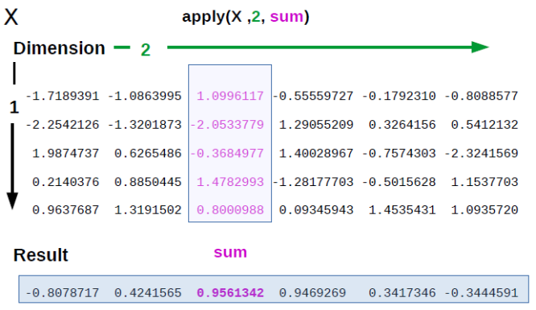

# Условные конструкции и циклы {#loops_conditions}

## Выражения `if`, `else`, `else if` {#if}

Стандратная часть практически любого языка программирования --- условные конструкции. R не исключение. Однако и здесь есть свои особенности. Начнем с самого простого варианта с одним условием. Выглядеть условная конcтрукция будет вот так:

```
if (условие) выражение
```

Вот так это будет работать на практике:

```{r}
number <- 1
if (number > 0) "Положительное число"
```

Если выражение (expression) содержит больше одной строчки, то они объединяются фигурными скобками. Впрочем, использовать их можно, даже если строчка всего в выражении всего одна. 

```{r}
number <- 1
if (number > 0) {
  "Положительное число"
}
```

В рассмотренной нами конструкции происходит проверка на условие. Если условие верно[^condition_true], то происходит то, что записано в последующем выражении. Если же условие неверно[^condition_false], то ничего не происходит. 

[^condition_true]: В принципе, необязательно внутри должна быть проверка условий, достаточно просто значения `TRUE`.

[^condition_false]: Аналогично, достаточно просто значения `FALSE`.

Оператор `else` позволяет задавать действие на все остальные случаи:

```
if (условие) выражение else выражение
```

Работает это так:

```{r}
number <- -3
if (number > 0) {
  "Положительное число"
} else {
  "Отрицательное число или ноль"
}
```

Иногда нам нужна последовательная проверка на несколько условий. Для этого есть оператор `else if`. Вот как выглядит ее применение:

```{r}
number <- 0
if (number > 0) {
  "Положительное число"
} else if (number < 0){
  "Отрицательное число"
} else {
  "Ноль"
}
```

Как мы помним, R --- язык, в котором векторизация играет большое значение. Но вот незадача --- условные конструкции не векторизованы в R! Давайте попробуем применить эти конструкции для вектора значений и посмотрим, что получится.

```{r}
number <- -2:2
if (number > 0) {
  "Положительное число"
} else if (number < 0){
  "Отрицательное число"
} else {
  "Ноль"
}
```

R выдает сообщение, что используется только первое значение логического вектора внутри условия. Остальные просто игнорируются. Как же посчитать для всего вектора сразу? 

## Циклы `for` {#for}

Во-первых, можно использовать `for`. Синтаксис у `for` похож на синтаксис условных конструкций.

```
for(переменная in последовательность) выражение
```

Теперь мы можем объединить условные конструкции и `for`. Немножко монструозно, но это работает: 

```{r}
for (i in number) {
  if (i > 0) {
    print("Положительное число")
  } else if (i < 0) {
    print("Отрицательное число")
  } else {
    print("Ноль")
  }
}
```

> Чтобы выводить в консоль результат вычислений внутри `for`, нужно использовать `print()`.

Здесь стоит отметить, что `for` используется в R относительно редко. В подавляющем числе ситуаций использование `for` можно избежать. Обычно мы работаем в R с векторами или датафреймами, которые представляют собой множество относительно независимых наблюдений. Если мы хотим провести какие-нибудь операции с этими наблюдениями, то они обычно могут быть выполнены параллельно. Скажем, вы хотите для каждого испытуемого пересчитать его массу из фунтов в килограммы. Этот пересчет осуществляется по одинаковой формуле для каждого испытуемого. Эта формула не изменится из-за того, что какой-то испытуемый слишком большой или слишком маленький - для следующего испытуемого формула будет прежняя. Если Вы встречаете подобную задачу (где функцию можно применить независимо для всех значений), то без цикла `for` вполне можно обойтись. 

Даже во многих случаях, где расчеты для одной строчки зависят от расчетов предыдущих строчек, можно обойтись без `for` векторизованными функциями, например, `cumsum()` для подсчета кумулятивной суммы.

```{r}
cumsum(1:10)
```

Если же нет подходящей векторизованной функции, то можно воспользоваться семейством функций `apply()` (см. \@ref(apply_f) ).

> После этих объяснений кому-то может показаться странным, что я вообще упоминаю про эти циклы. Но для кого-то циклы `for` настолько привычны, что их полное отсутствие в курсе может показаться еще более странным. Поэтому лучше от меня, чем на улице.

Зачем вообще избегать конструкций `for`? Некоторые говорят, что они слишком медленные, и частично это верно, если мы сравниваем с векторизованными функциями, которые написаны на более низкоуровневых языках. Но в большинстве случаев низкая скорость `for` связана с неправильным использованием этой конструкции. Например, стоит избегать ситуации, когда на каждой итерации `for` какой-то объект (вектор, список, что угодно) изменяется в размере. Лучше будет создать заранее объект нужного размера, который затем будет наполняться значениями:

```{r}
number_descriptions <- character(length(number)) #создаем строковый вектор с такой же длиной, как и исходный вектор
for (i in 1:length(number)) {
  if (number[i] > 0) {
    number_descriptions[i] <- "Положительное число"
  } else if (number[i] < 0) {
    number_descriptions[i] <- "Отрицательное число"
  } else {
    number_descriptions[i] <- "Ноль"
  }
}
number_descriptions
```

В общем, при правильном обращении с `for` особых проблем со скоростью не будет. Но все равно это будет громоздкая конструкция, в которой легко ошибиться, и которую, скорее всего, можно заменить одной короткой строчкой. Кроме того, без конструкции `for` код обычно легко превратить в набор функций, последовательно применяющихся к данным, что мы будем по максимуму использовать, работая в tidyverse и применяя пайпы (см. [pipe]).

## Векторизованные условные конструкции: функции `ifelse()` и `dplyr::case_when()` {#ifelse}

Альтернатива сочетанию условных конструкций и циклов `for` является использование встроенной функции `ifelse()`. Функция `ifelse()` принимает три аргумента - 1) условие (т.е. просто логический вектор, состоящий из `TRUE` и `FALSE`), 2) что выдавать в случае `TRUE`, 3) что выдавать в случае `FALSE`. На выходе получается вектор такой же длины, как и изначальный логический вектор (условие).

```{r}
ifelse(number > 0, "Положительное число", "Отрицательное число или ноль")
```

> Периодически я встречаю у студентов строчку вроде такой: `ifelse(условие, TRUE, FALSE)`. Эта конструкция избыточна, т.к. получается, что логический вектор из `TRUE` и `FALSE` превращается в абсолютно такой же вектор из `TRUE` и `FALSE` на тех же самых местах. Выходит, что ничего не меняется! 

У `ifelse()` тоже есть недостаток: он не может включать в себя дополнительных условий по типу `else if`. В простых ситуациях можно вставлять `ifelse()` внутри `ifelse()`:

```{r}
ifelse(number > 0,
       "Положительное число",
       ifelse(number < 0, "Отрицательное число", "Ноль"))
```

Достаточно симпатичное решение предлогает пакет `dplyr` (основа tidyverse) --- функция `case_when()`, которая работает с использованием формулы:

```{r}
dplyr::case_when(
  number > 0 ~ "Положительное число",
  number < 0 ~ "Отрицательное число",
  number == 0 ~ "Ноль")
```


# Функциональное программирование в R {#functional}
## Создание функций {#create_fun}

Поздравляю, сейчас мы выйдем на качественно новый уровень владения R. Вместо того, чтобы пользоваться теми функциями, которые уже написали за нас, мы можем сами создавать свои функции! В этом нет ничего сложного.

Синтаксис создания функции внешне похож на создание циклов или условных конструкций. Мы пишем ключевое слово `function`, в круглых скобках обозначаем переменные, с которыми собираемся что-то делать. Внутри фигурных скобок пишем выражения, которые будут выполняться при запуске функции. У функции есть свое собственное окружение — место, где хранятся переменные. Именно те объекты, которые мы передаем в скобочках, и будут в окружении, так же как и “обычные” переменные для нас в глобальном окружении. Это означает, что функция будет искать переменные в первую очередь среди объектов, которые переданы в круглых скобочках. С ними функция и будет работать. На выходе функция выдаст то, что вычисляется внутри функции `return()`. Если `return()` появляется в теле функции несколько раз, то до результат будет возвращаться из той функции `return()`, до которой выполнение дошло первым.

```{r}
pow <- function(x, p) {
  power <- x ^ p
  return(power)
}
pow(3, 2)
```

Если функция проработала до конца, а функция `return()` так и не встретилась, то возвращается последнее посчитанное значение.

```{r}
pow <- function(x, p) {
  x ^ p
}
pow(3, 2)
```

Если в последней строчке будет присвоение, то функция ничего не вернет обратно. Это очень распространенная ошибка: функция вроде бы работает правильно, но ничего не возвращает. Нужно писать так, как будто бы в последней строчке результат выполнения выводится в консоль.

```{r}
pow <- function(x, p) {
  power <- x ^ p #Функция ничего не вернет, потому что в последней строчке присвоение!
}
pow(3, 2) #ничего не возвращается из функции
```

Если функция небольшая, то ее можно записать в одну строчку без фигурных скобок.

```{r}
pow <- function(x, p) x ^ p
pow(3, 2) 
```

Вообще, фигурные скобки используются для того, чтобы выполнить серию выражений, но вернуть только результат выполнения последнего выражения. Это можно использовать, чтобы не создавать лишних временных переменных в глобальном окружении.

Мы можем оставить в функции параметры по умолчанию.

```{r}
pow <- function(x, p = 2) x ^ p
pow(3) 
pow(3, 3) 
```

В R работают **ленивые вычисления (lazy evaluations)**. Это означает, что параметры функций будут только когда они понадобятся, а не заранее. Например, эта функция не будет выдавать ошибку, если мы не зададим параметр `we_will_not_use_this_parameter =`, потому что он нигде не используется в расчетах.

```{r}
pow <- function(x, p = 2, we_will_not_use_this_parameter) x ^ p
pow(x = 3)
```

## Проверка на адекватность {#sanity_check}

Лучший способ не бояться ошибок и предупреждений --- научиться прописывать их самостоятельно в собственных функциях. Это позволит понять, что за текстом предупреждений и ошибок, которые у вас возникают, стоит забота разработчиков о пользователях, которые хотят максимально обезопасить нас от наших непродуманных действий.

Хорошо написанные функции не только выдают правильный результат на все возможные адекватные данные на входе, но и не дают получить правдоподобные результаты при неадекватных входных данных. Как вы уже знаете, если на входе у вас имеются пропущенные значения, то многие функции будут в ответ тоже выдавать пропущенные значения. И это вполне осознанное решение, которое позволяет избегать ситуаций вроде той, когда [около одной пятой научных статей по генетике содержало ошибки в приложенных данных](https://genomebiology.biomedcentral.com/articles/10.1186/s13059-016-1044-7) и замечать пропущенные значения на ранней стадии. Кроме того, можно проводить проверки на адекватность входящих данных (sanity check). 

Разберем это на примере самодельной функции `imt()`, которая выдает индекс массы тела, если на входе задать вес (аргумент `weight =`) в килограммах и рост (аргумент `height =`) в метрах. 

```{r}
imt <- function(weight, height) weight / height ^ 2
```

Проверим, что функция работает верно:

```{r}
w <- c(60, 80, 120)
h <- c(1.6, 1.7, 1.8)
imt(weight = w, height = h)
```

Очень легко перепутать и написать рост в сантиметрах. Было бы здорово предупредить об этом пользователя, показав ему предупреждающее сообщение, если рост больше, чем, например, 3. Это можно сделать с помощью функции `warning()`

```{r}
imt <- function(weight, height) {
  if (height > 3) warning("Рост в аргументе height больше 3: возможно, указан рост в сантиметрах, а не в метрах\n")
  weight / height ^ 2
}
imt(78, 167)
```

В некоторых случаях ответ будет совершенно точно некорректным, хотя функция все посчитает и выдаст ответ, как будто так и надо. Например, если какой-то из аргументов функции `imt()` будет меньше или равен 0. В этом случае нужно прописать проверку на это условие, и если это действительно так, то выдать пользователю ошибку.

```{r, error=TRUE}
imt <- function(weight, height) {
  if (any(weight <= 0 | height <= 0)) stop("Индекс массы тела не может быть посчитан для отрицательных значений")
  if (height > 3) warning("Рост в аргументе height больше 3: возможно, указан рост в сантиметрах, а не в метрах\n")
  weight / height ^ 2
}
imt(-78, 167)
```

Когда вы попробуете самостоятельно прописывать предупреждения и ошибки в функциях, то быстро поймете, что ошибки - это вовсе не обязательно результат того, что где-то что-то сломалось и нужно паниковать. Совсем даже наоборот, прописанная ошибка - чья-то забота о пользователях, которых пытаются максимально проинформировать о том, что и почему пошло не так.

Это естественно в начале работы с R (и вообще с программированием) избегать ошибок, конечно, в самом начале обучения большая часть из них остается непонятной. Но постарайтесь понять текст ошибки, вспомнить в каких случаях у вас возникала похожая ошибка. Очень часто этого оказывается достаточно чтобы понять причину ошибки даже если вы только-только начали изучать R.

Ну а в дальнейшем я советую ознакомиться со [средствами отладки кода в R](https://adv-r.hadley.nz/debugging.html) для того, чтобы научиться справляться с ошибками в своем коде на более продвинутом уровне.

## Когда и зачем создавать функции? {#why_functions}

Когда стоит создавать функции? Существует ["правило трех"](https://en.wikipedia.org/wiki/Rule_of_three_(computer_programming)) --- если у вас есть три куска очень похожего кода, то самое время превратить код в функцию. Это очень условное правило, но, действительно, стоит избегать копипастинга в коде. В этом случае очень легко ошибиться, а сам код становится нечитаемым.

Есть и другой подход к созданию функций: их стоит создавать не столько для того, чтобы использовать тот же код снова, сколько для абстрагирования от того, что происходит в отдельных строчках кода. Если несколько строчек кода были написаны для того, чтобы решить одну задачу, которой можно дать понятное название (например, подсчет какой-то особенной метрики, для которой нет готовой функции в R), то этот код стоит обернуть в функцию. Если функция работает корректно, то теперь не нужно думать над тем, что происходит внутри нее. Вы ее можете мысленно представить как операцию, которая имеет определенный вход и выход --- как и встроенные функции в R.

Отсюда следует важный вывод, что хорошее название для функции --- это очень важно. Очень, очень, очень важно.

## Функции как объекты первого порядка {#functions_objects}

Ранее мы убедились, что арифметические операторы --- это тоже функции. На самом деле, практически все в R --- это функции. Даже `function` --- это функция `function()`. Даже скобочки `(`, `{` --- это функции!

А сами функции --- это объекты первого порядка в R. Это означает, что с функциями вы можете делать практически все то же самое, что и с другими объектами в R (векторами, датафреймами и т.д.). Небольшой пример, который может взорвать ваш мозг:

```{r}
list(mean, min, `{`)
```

Мы можем создать список из функций! Зачем --- это другой вопрос, но ведь можем же!

Еще можно создавать функции внутри функций [^factory], использовать функции в качестве аргументов функций, сохранять функции как переменные. Пожалуй, самое важное из этого всего - это то, что функция может быть аргументом в функции. Не просто название функции как строковая переменная, не результат выполнения функции, а именно сама функция. Это лежит в основе использования семейства функций `apply()` (\@ref(apply_f) и многих фишек tidyverse.

[^factory]: Функция, которая создает другие функции, называется **фабрикой функций**.

> В Python дело обстоит похожим образом: функции там тоже являются объектами первого порядка, поэтому все эти фишки функционального программирования (с поправкой на синтаксис, конечно) будут работать и там.

## Семейство функций apply() {#apply_f}
### Применение `apply()` для матриц {#apply}

Семейство? Да, их целое множество: `apply()`, `lapply()`,`sapply()`, `vapply()`,`tapply()`,`mapply()`, `rapply()`... Ладно, не пугайтесь, всех их знать не придется. Обычно достаточно первых двух-трех. Проще всего пояснить как они работают на простой матрице с числами:

```{r}
A <- matrix(1:12, 3, 4)
A 
```

> Функция `apply()` предназначена для работы с матрицами (или многомерными массивами). Если вы скормите функции `apply()` датафрейм, то этот датафрейм будет сначала превращен в матрицу. Главное отличие матрицы от датафрейма в том, что в матрице все значения одного типа, поэтому будьте готовы, что сработает имплицитное приведение к общему типу данных. Например, если среди колонок датафрейма есть хотя бы одна строковая колонка, то все колонки станут строковыми.

Теперь представим, что нам нужно посчитать что-нибудь (например, сумму) по каждой из строк. С помощью функции `apply()` вы можете в буквальном смысле "применить" функцию к матрице или датафрейму. Синтаксис такой: `apply(X, MARGIN, FUN, ...)`, где  `X` --- данные, `MARGIN` это `1` (для строк), `2` (для колонок), `c(1,2)` для строк и колонок (т.е. для каждого элемента по отдельности), а `FUN` --- это функция, которую вы хотите применить! `apply()` будет брать строки/колонки из `X` в качестве первого аргумента для функции. 

{width=400}

> Заметьте, мы вставляем функцию без скобок и кавычек как аргумент в функцию. Это как раз тот случай, когда аргументом в функции выступает сама функция, а не ее название или результат ее выполнения.

Давайте разберем на примере:

```{r}
apply(A, 1, sum) #сумма по каждой строчке
apply(A, 2, sum) #сумма по каждой колонке
apply(A, c(1,2), sum) #кхм... сумма каждого элемента
```

> Конкретно для подсчета сумм и средних по столбцам и строкам в R есть функции `colSums()`, `rowSums()`, `colMeans()` и `rowMeans()`, которые можно использовать как альтернативы `apply()` в данном случае. 

Если же мы хотим прописать дополнительные аргументы для функции, то их можно перечислить через запятую после функции:

```{r}
apply(A, 1, sum, na.rm = TRUE)
```

```{r}
apply(A, 1, weighted.mean, w = c(0.2, 0.4, 0.3, 0.1)) 
```

### Анонимные функции {#anon_f}

Что делать, если мы хотим сделать что-то более сложное, чем просто применить одну функцию? А если функция принимает не первым, а вторым аргументом данные из матрицы? В этом случае нам помогут **анонимные функции**.

Анонимные функции - это функции, которые будут использоваться один раз и без названия.

> Питонистам знакомо понятие **лямбда-функций**. Да, это то же самое.

Например, мы можем посчитать отклонения от среднего без называния этой функции:

```{r}
apply(A, 1, function(x) x - mean(x)) #отклонения от среднего по строчке
apply(A, 2, function(x) x - mean(x)) #отклонения от среднего по столбцу
apply(A, c(1,2), function(x) x - mean(x)) #отклонения от одного значения, т.е. ноль
```

Как и в случае с обычной функцией, в качестве `x` выступает объект, с которым мы хотим что-то сделать, а дальше следует функция, которую мы собираемся применить к `х`. Можно использовать не `х`, а что угодно, как и в обычных функциях:

```{r}
apply(A, 1, function(whatevername) whatevername - mean(whatevername))
```

### Другие функции семейства `apply()` {#apply_other}

Ок, с `apply()` разобрались. А что с остальными? Некоторые из них еще проще и не требуют индексов, например, `lapply` (для применения к каждому элементу списка) и `sapply()` - упрощенная версия `lapply()`, которая пытается по возможности "упростить" результат до вектора или матрицы. 

```{r}
some_list <- list(some = 1:10, list = letters)
lapply(some_list, length)
sapply(some_list, length)
```

Использование `sapply()` на векторе приводит к тем же результатам, что и просто применить векторизованную функцию обычным способом.

```{r}
sapply(1:10, sqrt)
sqrt(1:10)
```

Зачем вообще тогда нужен `sapply()`, если мы можем просто применить векторизованную функцию? Ключевое слово здесь *векторизованная* функция. Если функция не векторизована, то `sapply()` становится удобным вариантом для того, чтобы избежать итерирования с помощью циклов `for`.

> Еще одна альтернатива - это векторизация невекторизованной функции с помощью `Vectorize()`. Эта функция просто оборачивает функцию одним из вариантов `apply()`.

Можно применять функции `lapply()` и `sapply()` на датафреймах. Поскольку фактически датафрейм - это список из векторов одинаковой длины (см. \@ref(df)), то итерироваться эти функции будут по колонкам:

```{r}
heroes <- read.csv("data/heroes_information.csv", 
                   na.strings = c("-", "-99"))
sapply(heroes, class)
```

Еще одна функция из семейства `apply()` - функция `replicate()` - самый простой способ повторить одну и ту же операцию много раз. Обычно эта функция используется при симуляции данных и моделировании. Например, давайте сделаем выборку из логнормального распределения:

```{r}
samp <- rlnorm(30)
hist(samp)
```

А теперь давайте сделаем 1000 таких выборок и из каждой возьмем среднее:

```{r}
sampdist <- replicate(1000, mean(rlnorm(30)))
hist(sampdist)
```

> Про функции для генерации случайных чисел и про визуализацию мы поговорим в следующие дни.

Если хотите познакомиться с семейством `apply()` чуточку ближе, то рекомендую [вот этот туториал](https://www.datacamp.com/community/tutorials/r-tutorial-apply-family).

В заключение стоит сказать, что семейство функций `apply()` --- это очень сильное колдунство, но в tidyverse оно практически полностью перекрывается функциями из пакета `purrr`. Впрочем, если вы поняли логику `apply()`, то при желании вы легко сможете переключиться на альтернативы из пакета `purrr`.