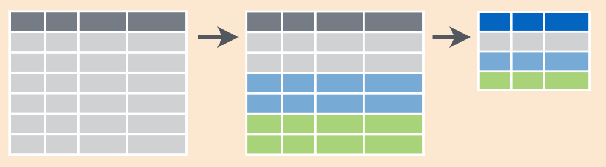

#Введение в tidyverse {#tidy_intro}

## Вселенная tidyverse {#tidy_verse}

tidyverse - это не один, а целое множество пакетов. Есть ключевые пакеты (ядро тайдиверса), а есть побочные - в основном для работы со специфическими видами данных.

[_tidyverse_](https://www.tidyverse.org) --- это набор пакетов:

* _ggplot2_, для визуализации
* _tibble_, для работы с тибблами, продвинутый вариант датафрейма
* _tidyr_, для формата tidy data
* _readr_, для чтения файлов в R
* _purrr_, для функционального программирования (замена семейства функций *apply())
* _dplyr_, для преобразованиия данных
* _stringr_, для работы со строковыми переменными
* _forcats_, для работы с переменными-факторами

Полезно также знать о следующих пакетах, не включенных в ядро, но также считающихся частью тайдиверса:

* _vroom_, для быстрой загрузки табоичных данных
* _readxl_, для чтения .xls и .xlsx
* _jsonlite_, для работы с JSON
* _xml_, для работы с XML
* _DBI_, для работы с базами данных
* _rvest_, для веб-скреппинга
* _lubridate_, для работы с временем
* _tidytext_, для работы с текстами и корпусами
* _glue_, для продвинутого объединения строк
* _magrtittr_, с несколькими вариантами pipe оператора
* _tidymodels_, для моделирования и машинного обучения[^tidymodels]
* _dtplyr_, для ускорения `dplyr` за счет перевод синтаксиса на `data.table`

[^tidymodels]: Как и пакет `tidyverse`, `tidymodels` --- это пакет с несколькими пакетами.

И это еще не все пакеты tidyverse! Есть еще много других небольших пакетов, которые тоже считаются частью tidyverse. Кроме официальных пакетов tidyverse есть множество пакетов, которые пытаются соответствовать принципам tidyverse и дополняют его.

Все пакеты tidyverse объединены tidy философией и взаимосовместимым синтаксисом. Это означает, что, во многих случаях даже не нужно думать о том, из какого именно пакета тайдиверса пришла функция. Можно просто установить и загрузить пакет `tidyverse`.

```{r, eval = FALSE}
install.packages("tidyverse")
```

Пакет `tidyverse` --- это такой [пакет с пакетами](https://cs11.pikabu.ru/post_img/big/2019/03/12/11/1552415351186680692.jpg).

```{r, message = TRUE}
library("tidyverse")
```

Подключение пакета `tidyverse` автоматически приводит к подключению ядра tidyverse, остальные же пакеты нужно подключать дополнительно при необходимости.

## Загрузка данных с помощью `readr`

Стандартной функцией для чтения `.csv` файлов в R является функция `read.csv()`, но мы будем использовать функцию `read_csv()` из пакета `readr`. Синтаксис функции `read_csv()` очень похож на `read.csv()`: первым аргументом является путь к файлу (в том числе можно использовать URL), некоторые остальные параметры тоже совпадают.

```{r, message = TRUE}
heroes <- read_csv("data/heroes_information.csv",
                   na = c("-", "-99"))
```

Подробнее про импорт данных, в том числе в tidyverse, смотри в \@ref(real_data).  

##tibble

Когда мы загрузили данные с помощью `read_csv()`, то мы получили `tibble`, а не `data.frame`:

```{r}
class(heroes)
```

Тиббл (`tibble`) - это такой "усовершенствованный" `data.frame`. [Почти](https://www.jumpingrivers.com/blog/the-trouble-with-tibbles/) все, что работает с `data.frame`, работает и с тибблами. Однако у тибблов есть свои дополнительные фишки. Самая очевидная из них - более аккуратный вывод в консоль:

```{r}
heroes
```

Выводятся только первые 10 строк, если какие-то колонки не влезают на экран, то они просто перечислены внизу. Ну а тип данных написан прямо под названием колонки.

Функции различных пакетов tidyverse сами конвертируют в тиббл при необходимости. Если же нужно это сделать самостоятельно, то можно это сделать так:

```{r}
heroes_df <- as.data.frame(heroes) #создаем простой датафрейм
class(heroes_df)
as_tibble(heroes_df) #превращаем обратно в тиббл
```

> В дальнейшем мы будем работать только с tidyverse, а это значит, что только с тибблами, а не обычными датафреймами. Тем не менее, тибблы и датафреймы будут в дальнейшем использоваться как синонимы.

Можно создавать тибблы вручную с помощью функции `tibble()`, которая работает аналогично функции `data.frame()`:

```{r}
tibble(
  a = 1:3,
  b = letters[1:3]
)
```

## magrittr::`%>%` {#pipe}

Оператор `%>%` называется “пайпом” (pipe), т.е. “трубой”. Он означает, что следующая функция (справа от пайпа) принимает на вход в качестве первого аргумента результат выполнения предыдущей функции (той, что слева). Фактически, это примерно то же самое, что и вставлять результат выполнения функции в качестве первого аргумента в другую функцию. Просто выглядит это красивее и читабельнее. Как будто данные пропускаются через трубы функций или конвеерную ленту на заводе, если хотите. А то, что первый параметр функции - это почти всегда данные, работает нам здесь на руку. Этот оператор взят из пакета `magrittr`[^pipes_everywhere]. Возможно, даже если вы не захотите пользоваться tidyverse, использование пайпов Вам понравится.

[^pipes_everywhere]: Если быть точным, то оператор `%>%` был импортирован во все основные пакеты tidyverse, а сам пакет `magrittr` не входит в базовый набор tidyverse. Тем не менее, в самом `magrittr` есть еще несколько интересных операторов.

Важно понимать, что пайп не дает какой-то дополнительной функциональности или дополнительной скорости работы[^pipe_speed]. Он создан исключительно для читабельности и комфорта.

[^pipe_speed]: Даже наоборот, использование пайпов незначительно снижает скорость выполнения команды.

С помощью пайпов вот эту команду...

```{r}
sum(sqrt(abs(sin(1:22))))
```

...можно переписать вот так:

```{r}
1:22 %>% 
  sin() %>% 
  abs() %>% 
  sqrt() %>% 
  sum()
```

В очень редких случаях результат выполнения функции нужно вставить не на первую позицию (или же мы хотим использовать его несколько раз). В этих случаях можно использовать `.`, чтобы обозначить, куда мы хотим вставить результат выполнения выражения слева от `%>%`.

```{r}
"Всем привет!" %>%
  c("--", ., "--")
```

## Главные пакеты tidyverse: `dplyr` и `tidyr`

`dplyr`[^2] --- это самая основа всего `tidyverse`. Этот пакет предоставляет основные функции для манипуляции с тибблами. Пакет `dplyr` является наследником и более усовершенствованной версией `plyr`, так что если увидите использование пакета `plyr`, то, скорее всего, скрипт был написан очень давно.

[^2]: [Есть споры о том, как это правильно читать](https://community.rstudio.com/t/pronunciations-of-common-r-terms/1810). Используемые варианты: *диплаер*, *диплюр*, *диплир*.

Пакет `tidyr` дополняет `dplyr`, предоставляя полезные функции для тайдификации тибблов.
Тайдификация ("аккуратизация") данных означает приведение табличных данных к такому формату, в котором:

- Каждая переменная имеет собственный столбец
- Каждый наблюдение имеет собственную строку
- Каждое значение имеет свою собственную ячейку

Впрочем, многие функции `dplyr` часто используются при тайдификации, так же как и многие функции `tidyr` имеет применение вне тайдификации. В общем, функционал этих двух пакетов несколько смешался, поэтому мы будем рассматривать их вместе. А чтобы представлять, какая функция относится к какому пакету (хотя запоминать это необязательно), я буду использовать запись с двумя двоеточиями `::`, которая обычно используется для использования функции без подгрузки всего пакета, при первом упоминании функции.

Пакет `tidyr` --- это более усовершенствованная версия пакета `reshape2`, который в свою очередь является усовершенствованной версией `reshape`. По аналогии с `plyr`, если вы видите использование этих пакетов, то это указывает на то, что перед вами морально устаревший код.

Код с использованием `dplyr` и `tidyr`сильно непохож на то, что мы видели раньше. Большинство функций `dplyr` и `tidyr` работают с целым тибблом сразу, принимая его в качестве первого аргумента и возвращая измененный тиббл. Это позволяет превратить весь код в последовательный набор применяемых функций, соединенный пайпами. На практике это выглядит очень элегантно, и вы в этом скоро убедитесь.

## Работа с колонками тиббла {#tidy_select_cols}
### Выбор колонок: `dplyr::select()`

Функция `dplyr::select()` позволяет выбирать колонки по номеру или имени (кавычки не нужны).

```{r}
heroes %>%
  select(1,5)
```

```{r}
heroes %>%
  select(name, Race, Publisher, `Hair color`)
```

Обратите внимание, если в названии колонки присутствует пробел или, например, колонка начинается с цифры или точки и цифры, то это синтаксически невалидное имя (\@ref(variables)). Это не значит, что такие названия колонок недопустимы. Но такие названия колонок нужно обособлять \` грависом (правый штрих, на клавиатуре находится там же где и буква ё и ~).

Еще обратите внимание на то, что функции tidyverse не изменяют сами изначальные тибблы/датафреймы. Это означает, что если вы хотите полученный результат сохранить, то нужно добавить присвоение:

```{r}
heroes_some_cols <- heroes %>%
  select(name, Race, Publisher, `Hair color`)
heroes_some_cols
```

### Мини-язык tidyselect для выбора колонок {#tidyselect}

Для выбора столбцов (не только в `select()`, но и для других функций tidyverse) используется специальный мини-язык tidyselect из одноименного пакета[^tidyselect_package]. tidyselect дает очень широкие возможности для выбора колонок.

[^tidyselect_package]: Как и в случае с `magrittr`, пакет `tidyselect` не содержатся в базовом tidyverse, но функции импортируются основыми пакетами tidyverse.

Можно использовать оператор `:` для выбора нескольких соседних колонок (по аналогии с созданием числового вектора с шагом 1).

```{r}
heroes %>%
  select(name:Publisher)
```

```{r}
heroes %>%
  select(name:`Eye color`, Publisher:Weight)
```

Используя `!` можно вырезать ненужные колонки.

```{r}
heroes %>%
  select(!X1)
heroes %>%
  select(!(Gender:Height))
```

Другие известные нам логические операторы (`&` и `|`) тоже работают в tidyselect.

В дополнение к логическим операторам и `:`, в tidyselect есть набор вспомогательных функций, работающих исключительно в контексте выбора колонок с помощью tidyselect.

Вспомогательная функция `last_col()` позволит обратиться к последней колонке тиббла:

```{r}
heroes %>%
  select(name:last_col())
```

А функция `everything()` позволяет выбрать все колонки.

```{r}
heroes %>%
  select(everything())
```

При этом `everything()` не будет дублировать выбранные колонки, поэтому можно использовать `everything()` для перестановки колонок в тиббле:

```{r}
heroes %>%
  select(name, Publisher, everything())
```

Впрочем, для перестановки колонок удобнее использовать специальную функцию `relocate()` (\@ref(tidy_relocate)) 
Можно даже выбирать колонки по паттернам в названиях. Например, с помощью `ends_with()` можно выбрать все колонки, заканчивающиеся одинаковым суффиксом:

```{r}
heroes %>%
  select(ends_with("color"))
```

Аналогично, с помощью функции `starts_with()` можно найти колонки с одинаковым префиксом, с помощью `contains()` --- все колонки с выбранным паттерном в любой части названия колонки[^tidyselect_regex]. 

[^tidyselect_regex]: Выбранный паттерн будет найден посимвольно, если же вы хотите искать по регулярным выражениям, то вместо `contains()` нужно использовать `matches()`.

```{r}
heroes %>%
  select(starts_with("Eye") & ends_with("color"))
heroes %>%
  select(contains("eight"))
```

Ну и наконец, можно выбирать по содержимому колонок с помощью `where()`. Это напоминает применение `sapply()`(\@ref(apply_other)) на датафрейме для индексирования колонок: в качестве аргумента для `where` принимается функция, которая применяется для каждой из колонок, после чего выбираются только те колонки, для которых было получено `TRUE`.

```{r}
heroes %>%
  select(where(is.numeric))
```

Функция `where()` дает невиданную мощь. Например, можно выбрать все колонки без `NA`:

```{r}
heroes %>%
  select(where(function(x) !any(is.na(x))))
```

###Переименование колонок: `dplyr::rename()`

Внутри `select()` можно не только выбирать колонки, но и переименовывать их:

```{r}
heroes %>%
  select(id = X1)
```

Однако удобнее для этого использовать специальную функцию `dplyr::rename()`. Синтаксис у нее такой же, как и у `select()`, но `rename()` не выбрасывает колонки, которые не были упомянуты.

```{r}
heroes %>%
  rename(id = X1)
```

Для массового переименования колонок можно использовать функцию `rename_with()`. Эта функция так же использует tidyselect синтаксис для выбора колонок (по умолчанию выбираются все колонки) и применяет функцию в качестве аргумента, которая изменяет 

```{r}
heroes %>%
  rename_with(make.names)
```

###Перестановка колонок: `dplyr::relocate()` {#tidy_relocate}

Для изменения порядка колонок можно использовать функцию `relocate()`. Она тоже работает похожим образом на `select()` и `rename()`[^relocate_rename]. Как и `rename()`, функция `relocate()` не выкидывает неиспользованные колонки:

[^relocate_rename]: `relocate()` не позволяет переименовывать колонки в отличие от `select()` и `rename()`

```{r}
heroes %>%
  relocate(Publisher)
```

При этом `relocate()` имеет дополнительные параметры `.after =` и `.before =`, которые позволяют выбирать, куда поместить выбранные колонки.

```{r}
heroes %>%
  relocate(Publisher, .after = name)
```

`relocate()` очень хорошо работает в сочетании с выбором колонок с помощью tidyselect. Например, можно передвинуть в одно место все колонки с одним типом данных:

```{r}
heroes %>%
  relocate(Publisher, where(is.numeric), .after = name)
```

Последняя важная функция для выбора колонок --- `pull()`. Эта функция делает то же самое, что и индексирование с помощью `$`, т.е. вытаскивает из тиббла вектор с выбранным названием. Это лучше вписывается в логику tidyverse, поскольку позволяет извлечь колонку из тиббла с использованием пайпа:

```{r}
heroes %>%
  select(Height) %>%
  pull() %>%
  head()

heroes %>%
  pull(Height) %>%
  head()
```

У функции `pull()` есть аргумент `name =`, который позволяет создать проименованный вектор:

```{r}
heroes %>%
  pull(Height, name) %>%
  head()
```

В отличие от базового R, tidyverse нигде не сокращает имплицитно результат вычислений до вектора, поэтому функция `pull()` - это основной способ извлечения колонки из тиббла как вектора.

## Работа со строками тиббла {#tidy_select_rows}

### Выбор строк по номеру: `dplyr::slice()` {#tidy_slice}

Начнем с выбора строк. Функция `dplyr::slice()` выбирает строчки по их числовому индексу.

```{r}
heroes %>%
  slice(1:3)
```


### Выбор строк по условию: `dplyr::filter()` {#tidy_filter}

Функция `dplyr::filter()` делает то же самое, что и `slice()`, но уже по условию. Причем для условий нужно использовать не векторы из тиббла, а название колонок (без кавычек) как будто бы они были переменными в окружении.

```{r}
heroes %>% 
  filter(Publisher == "DC Comics")
```

### Семейство функций `slice()` {#slice_family}

У функции `slice()` есть множество родственников, которые объединяют функционал обычного `slice()` и `filter()`. Например, с помощью функций `dplyr::slice_max()` и `dplyr::slice_min()` можно выбрать заданное количество строк, содержащих наибольшие или наименьшие значения по колонке соответственно:

```{r}
heroes %>%
  slice_max(Weight, n = 3)
heroes %>%
  slice_min(Weight, n = 3)
```

Функция `slice_sample()` позволяет выбирать заданное количество случайных строчек:

```{r}
heroes %>%
  slice_sample(n = 3)
```

Или же долю строчек:

```{r}
heroes %>%
  slice_sample(prop = .01)
```

Если поставить значение параметра `prop =` равным `1`, то таким образом можно перемешать порядок строчек в тиббле:

```{r}
heroes %>%
  slice_sample(prop = 1)
```


### Удаление строчек с NA: `tidyr::drop_na()` {#tidy_drop_na}

Если нужно выбрать только строчки без пропущенных значений, то можно воспользоваться удобной функцией `tidyr::drop_na()`.

```{r}
heroes %>%
  drop_na()
```

Можно выбрать колонки, наличие `NA` в которых будет приводить к удалению соответствующих строчек (не затрагивая другие строчки, в которых есть `NA` в остальных столбцах).

```{r}
heroes %>%
  drop_na(Weight)
```

Для выбора колонок в `drop_na()` используется tidyselect, с которым мы недавно познакомились (\@ref(tidyselect)).

### Сортировка строк: `dplyr::arrange()` {#tidy_arrange}

Функция `dplyr::arrange()` сортирует строчки от меньшего к большему (или по алфавиту - для текстовых значений) по выбранной колонке. 

```{r}
heroes %>%
  arrange(Weight)
```

Чтобы отсортировать в обратном порядке, воспользуйтесь функцией `desc()`.

```{r}
heroes %>%
  arrange(desc(Weight))
```

Можно сортировать по нескольким колонкам сразу. В таких случаях удобно в качестве первой переменной выбирать переменную, обозначающую принадлежность к группе, а в качестве второй --- континуальную числовую переменную:

```{r}
heroes %>%
  arrange(Gender, desc(Weight))
```


## Создание колонок: `dplyr::mutate()` и `dplyr::transmute()` {#tidy_mutate}

Функция `dplyr::mutate()` позволяет создавать новые колонки в тиббле.

```{r}
heroes %>%
  mutate(imt = Weight/(Height/100)^2) %>%
  select(name, imt) %>%
  arrange(desc(imt))
```

`dplyr::transmute()` - это аналог `mutate()`, который не только создает новые колонки, но и сразу же выкидывает все старые:

```{r}
heroes %>%
  transmute(imt = Weight/(Height/100)^2)
```

Внутри `mutate()` и `transmute()` мы можем использовать либо векторизованные операции (длина новой колонки должна равняться длине датафрейма), либо операции, которые возвращают одно значение. В последнем случае значение будет одинаковым на всю колонку, т.е. будет работать правило ресайклинга (\@ref(recycling)):

```{r}
heroes %>%
  transmute(name, weight_mean = mean(Weight, na.rm = TRUE))
```

Однако в функциях `mutate()` и `transmute()` правило ресайклинга не будет работать в остальных случаях: если полученный вектор будет не равен 1 или длине датафрейма, то мы получим ошибку.

```{r, error = TRUE}
heroes %>%
  mutate(one_and_two = 1:2)
```

Это не баг, а фича: авторы пакета `dplyr` считают, что ресайклинг кратных друг другу векторов --- это слишком удобное место для выстрелов себе в ногу. Поэтому в таких случаях разработчики `dplyr` рекомендуют использовать функцию `rep()`, знакомую нам уже очень давно (\@ref(atomic)).

```{r}
heroes %>%
  mutate(one_and_two = rep(1:2, length.out = nrow(.)))
```


## Агрегация данных в тиббле {#tidy_aggregate}
### Подытоживание: `summarise()` {#summarise}

Аггрегация по группам - это очень часто возникающая задача, например, это может использоваться для усреднения данных по испытуемым или условиям. Сделать аггрегацию в датафрейме удобной Хэдли Уикхэм пытался еще в предшественнике `dplyr`, пакете `plyr`. `dplyr` позволяет делать аггрегацию очень симпатичным и понятным способым. Аггрегация в `dplyr` состоит из двух этапов: группировки (`group_by()`) и подытоживания (`summarise()`). Начнем с последнего.

Функция `dplyr::summarise()`[^summarize] позволяет аггрегировать данные в тиббле. Работает она очень похоже на `mutate()`, но если внутри `mutate()` используются векторизованные функции, возвращающие вектор такой же длины, что и колонки, использовавшиеся для расчетов, то в `summarise()` используются функции, которые возвращают вектор длиной 1. Например, `min()`, `mean()`, `max()` и т.д. Можно создавать несколько колонок через запятую (это работает и для `mutate()`).

[^summarize]: У функции `dplyr::summarise()` есть синоним `dplyr::summarize()`, которая делает абсолбтно то же самое. Просто потому что в американском английском и британском английском это слово пишется по-разному.

```{r}
heroes %>%
  mutate(imt = Weight/(Height/100)^2) %>%
  summarise(min(imt, na.rm = TRUE),
            max(imt, na.rm = TRUE))
```

В `dplyr` есть дополнительные суммирующие функции для более удобного индексирования в стиле tidyverse. Например, функции `dplyr::nth()`, `dplyr::first()` и `dplyr::last()`, которые позволяют вытаскивать значения из вектора по индексу (что-то вроде `slice()`, но для векторов)

```{r}
heroes %>%
  mutate(imt = Weight/(Height/100)^2) %>%
  arrange(imt) %>%
  summarise(first = first(imt),
            tenth = nth(imt, 10),
            last = last(imt))
```

В отличие от `mutate()`, функции внутри `summarise()` вполне позволяют функциям внутри возвращать вектор из нескольких значений, создавая тиббл такой же длины, как и получившийся вектор.

```{r}
heroes %>%
  mutate(imt = Weight/(Height/100)^2) %>%
  summarise(imt_range = range(imt, na.rm = TRUE)) #функция range() возвращает вектор из двух значений: минимальное и максимальное
```

### Группировка: `group_by()` {#tidy_group}

`dplyr::group_by()` - это функция для группировки данных в тиббле по дискретной переменной для дальнейшей аггрегации с помощью `summarise()`. После применения `group_by()` тиббл будет выглядеть так же, но у него появятся атрибут `groups`[^ungroup]: 

```{r}
heroes %>%
  group_by(Gender)
```

[^ungroup]: Снять группировку можно с помощью функции `ungroup()`.

Если после этого применить на тиббле функцию `summarise()`, то мы получим не тиббл длиной один, а тиббл со значением для каждой из групп.

```{r}
heroes %>%
  mutate(imt = Weight/(Height/100)^2) %>%
  group_by(Gender) %>%
  summarise(min(imt, na.rm = TRUE),
            max(imt, na.rm = TRUE))
```

Схематически это выглядит вот так:

{width=400}

### Подсчет строк: `dplyr::n()`, `dplyr::count()` {#tidy_count}

Для подсчет количества значений можно воспользоваться функцией `n()`.

```{r}
heroes %>%
  group_by(Gender) %>%
  summarise(n = n())
```

Функция `n()` вместе с `group_by()` внутри `filter()` позволяет удобным образом "отрезать" от тиббла редкие группы...

```{r}
heroes %>%
  group_by(Race) %>%
  filter(n() > 10) %>%
  select(name, Race)
```

или же наоборот, выделить только маленькие группы: 

```{r}
heroes %>%
  group_by(Race) %>%
  filter(n() == 1) %>%
  select(name, Race)
```

Таблицу частот можно создать без `group_by()` и `summarise(n = n())`. Функция `count()` заменяет эту конструкцию: 

```{r}
heroes %>%
  count(Gender)
```

Эту таблицу частот удобно сразу проранжировать, указав в параметре `sort =` значение `TRUE`.

```{r}
heroes %>%
  count(Gender, sort = TRUE)
```

> Функция `count()`, несмотря на свою простоту, является одной из наиболее используемых в tidyverse.

### Уникальные значения: `dplyr::distinct()` {#tidy_distinct}

`dplyr::distinct()` - это более быстрый аналог `unique()`, позволяет извлекать уникальные значения для одной или нескольких колонок.

```{r}
heroes %>%
  distinct(Gender)
```

```{r}
heroes %>%
  distinct(Gender, Race)
```

Иногда нужно аггрегировать данные, но при этом сохранить исходную структуру тиббла.  Например, нужно посчитать размер групп или посчитать средние значения по группе для последующего сравнения с индивидуальными значениями.

### Создание колонок с группировкой {#tidy_group_mutate}

В tidyverse это можно сделать с помощью сочетания `group_by()` и `mutate()` (вместо `summarise()`):

```{r}
heroes %>%
  group_by(Race) %>%
  mutate(Race_n = n()) %>%
  select(Race, name, Gender, Race_n)
```

Результаты аггрегации были записаны в отдельную колонку, при этом значения этой колонки внутри одной группы повторяются:

{width=400}

## Трансформация нескольких колонок: `dplyr::across()`

Допустим, вы хотите посчитать среднюю массу и рост, группируя по полу супергероев. Можно посчитать это внутри одного `summarise()`, использую запятую:

```{r}
heroes %>%
  group_by(Gender) %>%
  summarise(height = mean(Height, na.rm = TRUE),
            weight = mean(Weight, na.rm = TRUE))
```

Если таких колонок будет много, то это уже станет сильно неудобным, нам придется много копировать код, а это чревато ошибками и очень скучно.

Поэтому в `dplyr` есть функция для операций над несколькими колонками сразу: `dplyr::across()`[^at_if_all]. Эта функция работает похожим образом на функции семейства `apply()` и использует tidyselect для выбора колонок.

Таким образом, конструкции с функцией `across()` можно разбить на три части:

1. Выбор колонок с помощью tidyselect. Здесь работают все те приемы, которые мы изучили при выборе колонок (\@ref(tidyselect)). 
2. Собственно применение функции `across()`. Первый аргумент `.col` --- колонки, выбранные на первом этапе с помощью tidyselect, по умолчанию это `everything()`, т.е. все колонки. Второй аргумент `.fns` --- это функция или целый список из функций, которые будут применены к выбранным колонкам. Если функции требуют дополнительных аргументов, то они могут быть перечислены внутри `across()`.
3. Использование `summarise()` или другой функции `dplyr`. В этом случае в качестве аргумента для функции используется результат работы функции `across()`.

Вот такой вот бутерброд выходит. Давайте посмотрим, как это работает на практике и посчитаем среднее значение по колонкам `Height` и `Weight`.

[^at_if_all]: Функция `across()` появилась в пакете `dplyr` относительно недавно, до этого для работы с множественными колонками в tidyverse использовались многочисленные функции `*_at()`, `*_if()`, `*_all()`, например, `summarise_at()`, `summarise_if()`, `summarize_all()`. Эти функции до сих пор присутствуют в `dplyr`, но считаются устаревшими. Другая альтернатива - использование пакета `purrr` (\@ref(purrr)) или семейства функций `apply()` (\@ref(apply_f)).  

```{r}
heroes %>%
  group_by(Gender) %>%
  summarise(across(c(Height,Weight), mean))
```

Здесь мы столкнулись с уже известной нам проблемой: функция `mean()` при столкновении хотя бы с одним `NA` будет возвращать `NA`, если мы не изменим параметр `na.rm =`. Как и в случае с функциями семейства `apply()` (\@ref(apply_f)), дополнительные параметры для функции можно перечислить через запятую после самой функции:

```{r}
heroes %>%
  group_by(Gender) %>%
  summarise(across(c(Height, Weight), mean, na.rm = TRUE))
```

До этого мы просто использовали выбор колонок по их названию. Но именно внутри `across()` использование tidyselect раскрывается как удивительно элегантный и мощный инструмент. Например, можно посчитать среднее для всех numeric колонок:

```{r}
heroes %>%
  drop_na(Height, Weight) %>%
  group_by(Gender) %>%
  summarise(across(where(is.numeric), mean, na.rm = TRUE))
```

Или длину строк для строковых колонок. Для этого нам понадобится вспомнить, как создавать анонимные функции (\@ref(anon_f)).

```{r}
heroes %>%
  group_by(Gender) %>%
  summarise(across(where(is.character), 
                   function(x) mean(nchar(x), na.rm = TRUE)))
```

Или же даже посчитать и то, и другое внутри одного `summarise()`!

```{r}
heroes %>%
  group_by(Gender) %>%
  summarise(across(where(is.numeric), mean, na.rm = TRUE),
            across(where(is.character), 
                   function(x) mean(nchar(x), na.rm = TRUE)))
```

Внутри одного `across()` можно применить не одну функцию к каждой из выбранных колонок, а сразу несколько функций для каждой из колонок. Для этого нам нужно использовать список функций (желательно - проименованный).

```{r}
heroes %>%
  group_by(Gender) %>%
  summarise(across(c(Height, Weight), 
                   list(minimum = min,
                        average = mean,
                        maximum = max), 
                   na.rm = TRUE))
```

> Вот нам и понадобился список функций (\@ref(functions_objects))!

```{r}
heroes %>%
  group_by(Gender) %>%
  summarise(across(c(Height, Weight),
                   list(min = function(x) min(x, na.rm = TRUE),
                        mean = function(x) mean(x, na.rm = TRUE),
                        max = function(x) max(x, na.rm = TRUE),
                        na_n = function(x, ...) sum(is.na(x)))
                   )
            )
```

Хотя основное применение функции `across()` --- это массовое подытоживание с помощью `summarise()`, `across()` можно использовать и с другими функциями `dplyr`. Например, можно делать массовые операции с колонками с помощью `mutate()`:

```{r}
heroes %>%
  mutate(across(where(is.character), as.factor))
```

Менее очевидный способ применения `across()` - использование `across()` внутри `count()` вместе с функцией `n_distinct()`, которая считает количество уникальных значений в векторе. Это позволяет посмотреть таблицу частот для группирующих переменных:

```{r}
heroes %>%
  select(where(function(x) n_distinct(x) <= 6))
```


```{r}
heroes %>%
  count(across(where(function(x) n_distinct(x) <= 6)))
```

## Объединение нескольких датафреймов {#tidy_several}
### Соединение структурно схожих датафреймов: bind_rows(), bind_cols() {#tidy_bind}

Для начала создадим следующие тибблы и сохраним их как `dc`, `marvel` и `other_publishers`:

```{r}
dc <- heroes %>%
  filter(Publisher == "DC Comics") %>%
  group_by(Gender) %>%
  summarise(weight_mean = mean(Weight, na.rm = TRUE))
dc

marvel <- heroes %>%
  filter(Publisher == "Marvel Comics") %>%
  group_by(Gender) %>%
  summarise(weight_mean = mean(Weight, na.rm = TRUE))
marvel

other_publishers <- heroes %>%
  filter(!(Publisher %in% c("DC Comics","Marvel Comics"))) %>%
  group_by(Gender) %>%
  summarise(weight_mean = mean(Weight, na.rm = TRUE))
other_publishers
```

Несколько тибблов можно объединить вертикально с помощью функции `bind_rows()`. Для корректного объединения тибблы должны иметь одинаковые названия колонок.

```{r}
bind_rows(dc, marvel)
```

Чтобы соединить тибблы горизонтально, воспользуйтесь функцией `bind_cols()`.

```{r}
bind_cols(dc, marvel)
```

Функции `bind_rows()` и `bind_cols()` могут работать не только с двумя, но сразу с несколькими датафреймами. 

```{r}
bind_rows(dc, marvel, other_publishers)
```

На входе в функции `bind_rows()` и `bind_cold()` можно подавать как сами датафреймы или тибблы через запятую, так и список из датафреймов/тибблов.

```{r}
heroes_list_of_df <- list(DC = dc, 
                          Marvel = marvel, 
                          Other = other_publishers)
bind_rows(heroes_list_of_df)
```

Чтобы не потерять, из какого датафрейма какие данные, можно указать любое строковое значение (название будущей колонки) для необязательного аргумента `.id =`.

```{r}
bind_rows(heroes_list_of_df, .id = "Publisher")
```

`bind_rows()` обычно используется, когда ваши данные находятся в разных файлах с одинаковой структурой. Тогда вы можете прочитать все таблицы в папке, сохранить их в качестве списка из датафреймов и объединить в один датафрейм с помощью `bind_rows()`.

### Реляционные данные: `*_join()` {#tidy_join}

В реальности иногда возникает ситуация, когда нужно соединить две таблички, у которых есть общий столбец (или несколько столбцов), но все остальные столбцы различаются. Табличек может быть и больше, это может быть целая сеть таблиц, некоторые из которых содержат основные данные, а некоторые - дополнительные, которые необходимо на определенном этапе "включить" в анализ. Например, таблица с расшифровкой аббревиатур или сокращений вроде коротких названий стран или таблица телефонных кодов разных стран. Совокупность нескольких связанных друг с другом таблиц называют реляционными данными.

В случае с реляционными данными простых `bind_rows()` и `bind_cols()` становится недостаточно.

Эти две таблички нужно объединить (*join*). Эта задача обычно возникает не очень часто, обычно это происходит один-два раза в одном проекте, когда нужно дополнить имеющиеся данные дополнительной информацией извне или объединить два набора данных, обрабатывавшихся в разных программах. Всякий раз, когда такая задача возникает, это доставляет много боли. `dplyr` предлагает интуитивно понятный инструмент для объединения реляционных данных - семейство функций `*_join()`.

Возьмем для примера два тиббла `band_members` и `band_instruments`, встроенных в `dplyr` специально для демонстрации работы функций `*_join()`.

```{r}
band_members
band_instruments
```

У этих двух тибблов есть колонка с одинаковым названием, которая по своему смыслу соединяет данные обоих тибблов. Такая колонка называется **ключом**. Ключ должен однозначно идентифицировать наблюдения[^unique_key].

[^unique_key]: Если ключи будут неуникальными, то функции `*_join()` не будут выдавать ошибку. Вместо этого они добавят в итоговую таблицу все возможные пересечения повторяющихся ключей. С этим нужно быть очень осторожным, поэтому рекомендуется, во-первых, проверять уникальность ключей на входе и, во-вторых, проверять тиббл на выходе. Ну или использовать эту особенность работы функции `*_join()` себе во благо.

Давайте попробуем посоединять `band_members` и `band_instruments` разными вариантами `*_join()` и посмотрим, что у нас получится. Все эти функции имеют на входе два обязательных аргумента (`x =` и `y =`) в которые мы должны подставить два датафрейма/тиббла которые мы хотим объединить. Главное различие между этими функциями заключается в том, что они будут делать, если уникальные значения в ключах `x` и `y` не соответствуют друг другу.

{width=400}

- `left_join()`: 

```{r}
band_members %>%
  left_join(band_instruments)
```

`left_join()` - это самая простая для понимания и самая используемая функция из семейства `*_join()`. Она как бы "дополняет" информацию из первого тиббла вторым тибблом. В этом случае сохраняются все уникальные наблюдения в `x`, но отбрасываются лишние наблюдения в тиббле `y`. Тем значениям, которым не нашлось соотвествия в `y`, в колонках, взятых их `y`, ставятся значения `NA`. 

Вы можете сами задать колонки-ключи параметром `by =`, по умолчанию это все колонки с одинаковыми названиями в двух тибблах.

```{r}
band_members %>%
  left_join(band_instruments, by = "name")
```

Часто случается, что колонки-ключи называются по-разному в двух тибблах. Их необязательно переименовывать, можно поставить соответстие вручную используя проименованный вектор: 

```{r}
band_members %>%
  left_join(band_instruments2, by = c("name" = "artist"))
```

- `right_join()`:

```{r}
band_members %>%
  right_join(band_instruments)
```

`right_join()` отбрасывает строчки в `x`, которых не было в `y`, но сохраняет соответствующие строчки `y` - `left_join()` наоборот.

- `full_join()`:

```{r}
band_members %>%
  full_join(band_instruments)
```

Функция `full_join()` сохраняет все строчки и из `x` и `y`. Пожалуй, наиболее используемая функция после `left_join()` --- благодаря `full_join()` вы точно ничего не потеряете при объединении.

- `inner_join()`:

```{r}
band_members %>%
  inner_join(band_instruments)
```

Функция `full_join()` сохраняет только строчки, которые присутствуют и в `x`, и в `y`.

- `semi_join()`:

```{r}
band_members %>%
  semi_join(band_instruments)
```

- `anti_join()`:

```{r}
band_members %>%
  anti_join(band_instruments)
```

Функции `semi_join()` и `anti_join()` не присоединяют второй датафрейм/тиббл (`y`) к первому. Вместо этого они используются как некоторый словарь-фильтр для отделения только тех значений в `x`, которые есть в `y` (`semi_join()`) или, наоборот, которых нет в `y` (`anti_join()`).

## Tidy data: `tidyr::pivot_longer()`, `tidyr::pivot_wider()` {#tidy_data}

Принцип tidy data предполагает, что каждая строчка содержит в себе одно измерение, а каждая колонка - одну характеристику. Тем не менее, это не говорит однозначно о том, как именно хранить повторные измерения. Их можно хранить как одну колонку для каждого измерения (широкий формат) и как две колонки: одна колонка - для идентификатора измерения, другая колонка - для записи самого измерения.

Это лучше понять на примере. Например, вес до и после прохождения курса. Как это лучше записать - как два числовых столбца (один испытуемый - одна строка) или же создать отдельную "группирующую" колонку, в которой будет написано время измерения, а в другой - измеренные значения (одно измерение - одна строка)? 

- **Широкий формат:**

Студент |До курса по R     | После курса по R
--------|----------------  | ----------------
Маша    |70                | 63
Рома    |80                | 74
Антонина|86                | 71

- **Длинный" формат:**

Студент |Время измерения   | Масса (кг)
--------|----------------  | ----------------
Маша    |До курса по R     | 70
Рома    |До курса по R     | 80
Антонина|До курса по R     | 86
Маша    |После курса по R  | 63
Рома    |После курса по R  | 74
Антонина|После курса по R  | 71


На самом деле, оба варианта приемлимы, оба варианта возможны в реальных данных, а разные функции и статистические пакеты могут требовать от вас как длинный, так и широкий форматы.

Таким образом, нам нужно научиться переводить из широкого формата в длинный и наоборот.

+ `tidyr::pivot_longer()`: из *широкого* в *длинный* формат  

+ `tidyr::pivot_wider()`: из *длинного* в *широкий* формат  

```{r}
new_diet <- tibble(
  student = c("Маша", "Рома", "Антонина"),
  before_r_course = c(70, 80, 86),
  after_r_course = c(63, 74, 71)
)
new_diet
```

Тиббл `new_diet` - это пример широкого формата данных.

Превратим тиббл `new_diet` длинный:

```{r}
new_diet %>%
  pivot_longer(cols = before_r_course:after_r_course,
               names_to = "measurement_time", 
               values_to = "weight_kg")
```

А теперь обратно в короткий:

```{r}
new_diet %>%
  pivot_longer(cols = before_r_course:after_r_course,
               names_to = "measurement_time", 
               values_to = "weight_kg") %>%
  pivot_wider(names_from = "measurement_time",
              values_from = "weight_kg")
```


