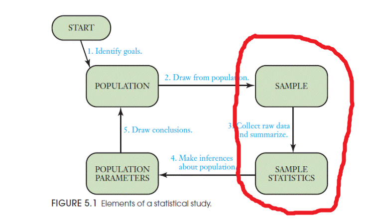
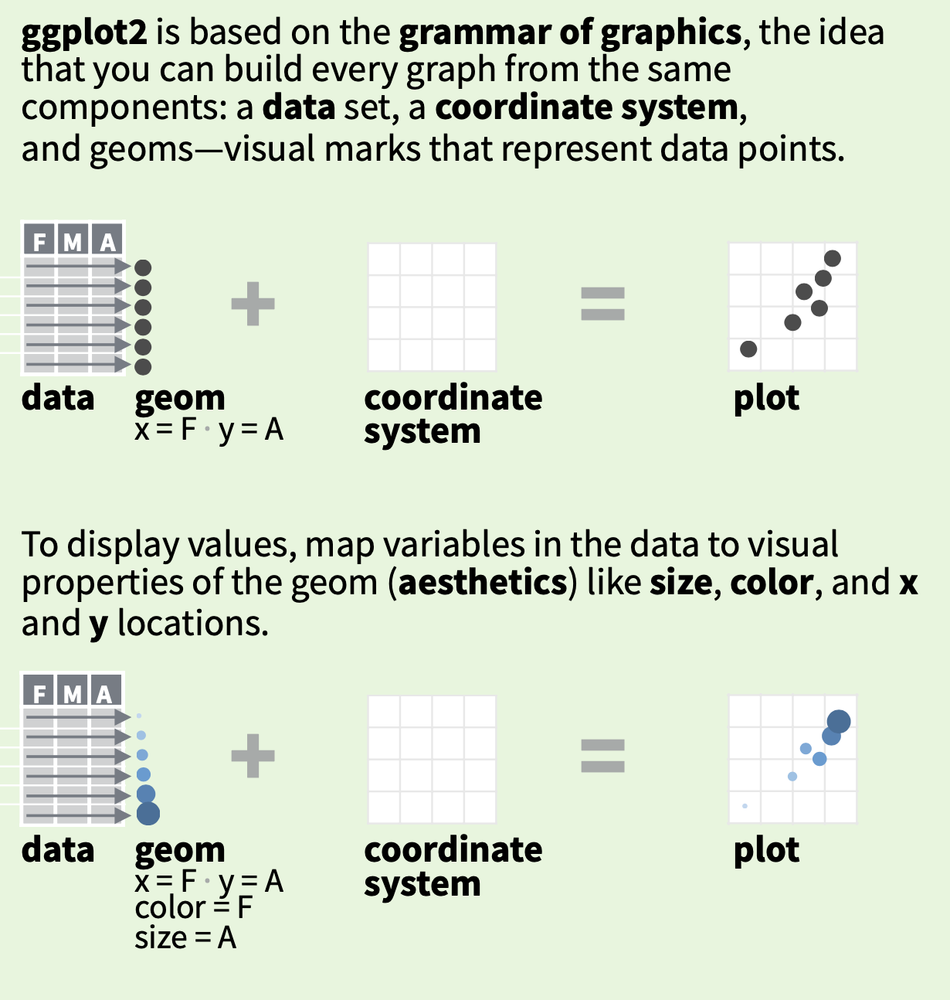
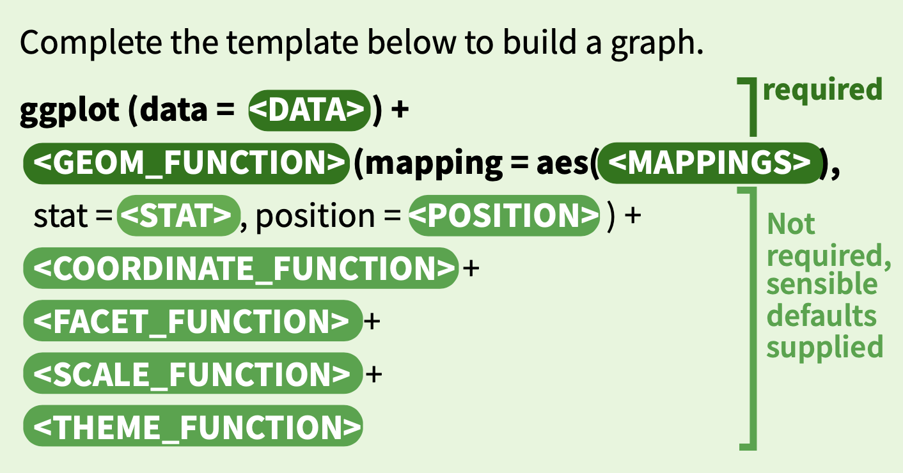
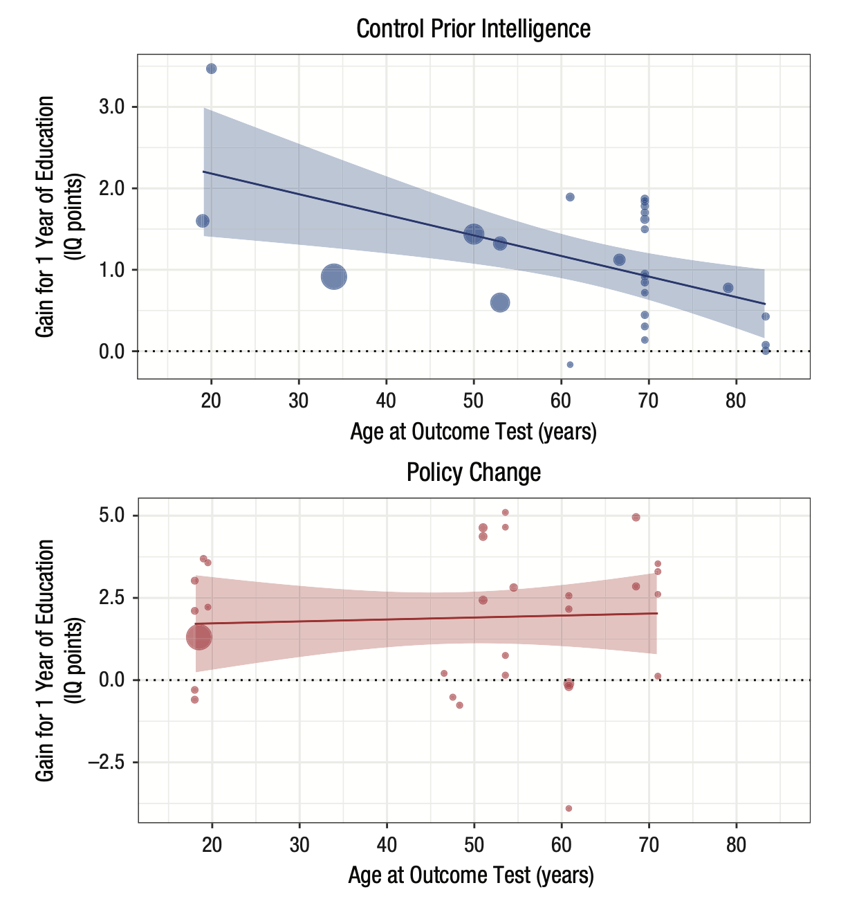

# Описательная статистика {#vdesc}
## Описательная статистика и статистика вывода {#desc_infer}

Статистика делится на **описательную статистику** (*descriptive statistics*) и **статистику вывода** (*inferential statistics*). Описательная статистика пытается описать нашу **выборку** (*sample*, т.е. те данные, что у нас на руках) различными способами. Проблема в том, что описательная статистика может описать только то, что у нас есть, но не позволяет сделать выводы о **генеральной совокупности** (*population*) - это уже цель статистики вывода. Цель описательной статистики - "ужать" данные для их обобщенного понимания с помощью *статистик*. 

> Заметьте, у выборки (**s**ample) мы считаем статистики (**s**tatistics), а у генеральной совокупности (**P**opulation) есть параметры (**P**arameters). Вот такая вот мнемотехника. 

Статистики часто выступают в роли *точечной оценки* (point estimators) параметров, так что в этом легко запутаться. Например, среднее (в выборке) - это оценка среднего (в генеральной совокупности). Да, можно свихнуться. Мы это будем разбирать подробнее в следующие занятия (это действительно важно, поверьте), пока что остановимся только на описании выборки.

{width=400}

## Типы шкал

Перед тем, как начать речь об описательных статистиках, нужно разобраться с существующими типами шкал. Типы шкал классифицируются на основании типа измеряемых данных, которые задают допустимые для данной шкалы отношения.

**- Шкала наименований (номинальная шкала)** --- самая простая шкала, где единственное отношение между элементами --- это отношения равенства и неравенства. Это любая качественная шкала, между элементами которой не могут быть установлены отношения "больше --- меньше". Это большинство группирующих переменных (экспериментальная группа, пол, политическая партия, страна), переменные с id. Еще один пример - номера на майках у футболистов.

**- Шкала порядка (ранговая шкала)** --- шкала следующего уровня, для которой можно установить отношения "больше --- меньше", причем если *B* больше *A*, а *C* больше *B*, то и *C* должно быть больше *A*. Если это верно, то мы можем выстроить последовательность значений. Однако мы еще не можем говорить о разнице между значениями. Ответы на вопросы "Как часто вы курите?" по шкале "Никогда", "Редко" и "Часто" являются примером ранговой шкалы. "Часто" --- это чаще, чем "Редко", "Редко" --- это чаще чем "Никогда", и, соотвественно, "Часто" --- это чаще, чем "Никогда". Но мы не можем сказать, что разница между "Часто" и "Редко" такая же, как и между "Редко" и "Никогда". Соответственно, даже если мы обозначим "Часто", "Редко" и "Никогда" как 3, 2 и 1 соответственно, то многого не можем сделать с этой шкалой, Например, мы не можем посчитать арифметическое среднее для такой шкалы.

**- Шкала разностей (интервальная шкала)** --- шкала, для которой мы уже можем говорить про разницы между интервалами. Например, разница между 10 Cº и 20 Cº такая же как и между 80 Cº и 90 Cº. Для шкалы разностей уже можно сравнивать средние, но операции умножения и деления не имеют смысл, потому что ноль в шкале разностей относительный. Например, мы не можем сказать, что 20 Cº --- это в два раза теплее, чем 10 Cº, потому что 0 Cº --- это просто условно взятая точка --- температура плавления льда.

**- Шкала отношений (абсолютная шкала)** --- самая "полноценная" шкала, которая отличается от интервальной наличием естественного и однозначного начала координат. Например, масса в килограммах или та же температура, но в градусах Кельвина, а не Цельсия.

## Меры центральной тенденции {#cent_tend}

Для примера мы возьмем массу супергероев, предварительно удалив из нее все `NA` для удобства. 

```{r}
weight <- heroes %>%
  drop_na(Weight) %>%
  pull(Weight)
```


Мера центральной тенденции - это число для описания *центра* распределения. 

### Арифметическое среднее {#mean}
Самая распространенная мера центральных тенденций - **арифметическое среднее**, то самое, которые мы считаем с помощью функции `mean()`.

$$\overline{x}= \frac{\sum\limits_{i=1}^{n} x_{i}} {n}$$

Не пугайтесь значка $$\sum\limits_{i=1}^{n}$$ - это означает сумму от i = 1 до n. Что-то вроде цикла `for`!  

В качестве упражнения попробуйте самостоятельно превратить эту формулу в функцию `mymean()` c помощью `sum()` и `length()`. Можете убирать `NA` по дефолту! Сравните с результатом функции `mean()`.  

```{r}
mean(weight)
```


### Медиана {#median}

**Медиана** - это *середина* распределения. Представим, что мы расставили значения по порядку (от меньшего к большему) и взяли значение по середине. Если у нас четное количество значений, то берется среднее значение между теми двумя, что по середине. Для расчета медианы есть функция `median()`:  

```{r}
median(weight)
```

Разница медианы со средним не очень существенная. Это значит, что распределение довольно "симметричное". Но бывает и по-другому.

Представьте себе, что кто-то говорит про среднюю зарплату в Москве. Но ведь эта средняя зарплата становится гораздо больше, если учитывать относительно небольшое количество мультимиллионеров и миллиардеров! А вот медианная зарплата будет гораздо меньше.  

Представьте себе, что в среде супергероев поялвяется кто-то, кто весит 9000 килограммов! Тогда среднее сильно изменится:

```{r}
mean(c(weight, 9000))
```

А вот медиана останется той же.

```{r}
median(c(weight, 9000))
```

Таким образом, экстремально большие или маленькие значения оказывают сильное влияние на арифметическое среднее, но не на медиану. Поэтому медиана считается более "робастной" оценкой, т.е. более устойчивой к выбросам и крайним значениям.  

### Усеченное среднее (trimmed mean) {#trim}

Если про среднее и медиану слышали все, то про усеченное (тримленное) среднее известно гораздо меньше. Тем не менее, на практике это довольно удобная штука, потому что представляет собой некий компромисс между арифметическим средним и медианой.  

В усеченном среднем значения ранжируются так же, как и для медианы, но отбрасывается только какой-то процент крайних значений. Усеченное среднее можно посчитать с помощью обычной функции `mean()`, поставив нужное значение параметра `trim =`:  

```{r}
mean(weight, trim = 0.1)
```

`trim = 0.1` означает, что мы отбросили 10% слева и 10% справа. `trim` может принимать значения от 0 до 0.5. Что будет, если `trim = 0`?  

```{r}
mean(weight, trim = 0)
```

Обычное арифметическое среднее! А если `trim = 0.5`?  

```{r}
mean(weight, trim = 0.5)
```

Медиана!

### Мода {#mode}

**Мода** *(mode)* - это самое *частое* значение. Обычно используется для номинальных переменных, для континуальных данных мода неприменима. Что интересно, в R нет встроенной функции для подсчета моды. Обычно она и не нужна: мы можем посчитать таблицу частот и даже проранжировать ее (и мы уже умеем это делать разными способами).

```{r}
heroes %>%
  count(Gender, sort = TRUE)
```

> Можете попробовать написать свою функцию для моды!


## Меры рассеяния {#vary}

> Начинающий статистик пытался перейти в брод реку, средняя глубина которой 1 метр. И утонул.  
> В чем была его ошибка? Он не учитывал разброс значений глубины!  

Мер центральной тенденции недостаточно, чтобы описать выборку. Необходимо знать ее вариабельность.  
### Размах {range}

Самое очевидное - посчитать **размах** *(range)*, то есть разницу между минимальным и максимальным значением. В R есть функция для вывода максимального и минимального значений:  

```{r}
range(weight)
```

Осталось посчитать разницу между ними:  

```{r}
diff(range(weight))
```

Естественно, крайние значения очень сильно влияют на этот размах, поэтому на практике он не очень-то используется.  

### Дисперсия {#var}

**Дисперсия** *(variance)* вычисляется по следующей формуле:  


$$s^2= \frac{\sum\limits_{i=1}^{n} (x_{i} - \overline{x})^2} {n}$$


Попробуйте превратить это в функцию `myvar()`!

```{r}
myvar <- function(x) mean((x - mean(x))^2)
```

Естественно, в R уже есть готовая функция `var()`. Но, заметьте, ее результат немного отличается от нашего:  

```{r}
myvar(weight)
var(weight)
```

Дело в том, что встроенная функция `var()` делит не на $n$, а на $n-1$. Это связано с тем, что эта функция пытается оценить дисперсию в генеральной совокупности, т.е. относится уже к статистике вывода. Про это мы будем говорить в дальнейших занятиях, сейчас нам нужно только отметить то, что здесь есть небольшое различие.  

### Стандартное отклонение {#sd}

Если вы заметили, значение дисперсии очень большое. Чтобы вернуться к единицам измерения, соответствующих нашим данным используется корень из дисперсии, то есть **стандартное отклонение** *(standard deviation)*:  


$$s= \sqrt\frac{\sum\limits_{i=1}^{n} (x_{i} - \overline{x})^2} {n}$$


Для этого есть функция `sd()`:

```{r}
sd(weight)
```

Что то же самое, что и:  

```{r}
sqrt(var(weight))
```

### Медианное абсолютное отклонение {#mad}

Поскольку стандартное отклонение не устойчиво к выбросам, то иногда используют его альтернативу, которая устойчива к выбросам (особенно если эти выбросы нам как раз и нужно удалить) - медианное абсолютное отклонение (median absolute deviation):


$$mad= median(|x_{i} - median(x)|)$$


Для этого есть функция `mad()`:

```{r}
mad(weight)
```

### Межквартильный размах {#iqr}

Другой вариант рабостной оценки вариабельности данных является **межквартильный размах** *(interquartile range, IQR)*. Это разница между третьим и первым **квартилем** [^quantile] - значением, которое больше 75% значений в выборке, и значением, которое больше 25% значений в выборке. 

[^quantile]: Квартиль --- это частный пример квантиля. Другой известный квантиль --- процентиль. Процентили часто используют для сравнения значения с другими значениями. Например, 63ий процентиль означает, что данное значение больше 63% значений в выборке.

```{r}
IQR(weight)
```

> Ну а второй квартиль - это медиана!  

## Ассиметрия и эксцесс {#skku}
### Ассиметрия {#skew}

**Ассиметрия (skewness)** измеряет симметричность распределения. Положительный показатель ассиметрии ("Right-skewed" или positive skewness) означает, что хвосты с правой части распределения длиннее. Негативный показатель ассиметрии ("Left-skewed" или negative skewness) означает, что левый хвост длиннее.  

{width=400}

> Например, в психологии положительная ассиметрия встречается очень часто. Например, время реакции: оно ограничено снизу 0 мс (а по факту не меньше 100 мс - быстрее сигнал не успеет по нервной системе пройти до пальцев), а вот с другой стороны оно никак не ограничено. Испытуемый может на полчаса перед монитором затупить, ага.  

### Эксцесс {#kurtosis}

**Эксцесс (kurtosis)** - это мера "вытянутости" распределения:


Положительные показатели эксцесса означают "вытянутое" распределение, а отрицательные - "плоское".

### Ассиметрия и эксцесс в R  {#skewR}

К сожалению, в базовом R нет функций для ассиметрии и эксцесса. Зато есть замечательный пакет `psych` (да-да, специально для психологов).  

```{r, eval = FALSE}
install.packages("psych")
```

```{r}
library("psych")
```

В нем есть функции `skew()` и `kurtosi()`:

```{r}
skew(weight)
kurtosi(weight)
```

Ассиметрия положительная, это значит что распределение выборки асимметричное, хвосты с правой части длиннее. Эксцесс значительно выше нуля - значит распределение довольно "вытянутое".

## Квантили {#quantiles}

В жизни мы постоянно проходим какие-нибудь тесты, получаем баллы и рано или поздно встает вопрос: ну а как оно у других? Как бы нас ни учили книжки по саморазвитию, что не стоит сравнивать себя с другими, от этого вопроса очень сложно избавиться. А иногда и вовсе не нужно. 

Допустим, вы проходите профессиональный тест с задачами одинаковой сложности. Как понять, если вы решили 10 из 20 задач (допустим, что задачи одинаковой сложности), то это много или мало? Мы договорились, что задачи одинаковой сложности, но не сказали какой. Если все 20 задач очень легкие, то 10 - это мало, а если сложные - то много. В этой ситуации может быть важен относительный успех: сколько людей справились с тестом хуже вас, а сколько - лучше вас. Вот это и позволяют посчитать **процентили** --- ОПРЕДЕЛЕНИЕ ДЛЯ ПРОЦЕНТИЛЕЙ

То есть 90ый процентиль означает, что вы справились лучше, чем 90% людей, который прошли тот же тест. То есть вы находитесь в 10% самых-самых! Поэтому настоящие понторезы должны меряться не абсолютными значениями, а процентилями.  ПОГОВОРКА ПРО СОСЕДЕЙ

Можно делить значения не на 100 интервалов, а на меньшее количество. Например, на 4. Для этого нам нужно три точки: одна отделяет 25% наименьших значений, 


Важно понимать, что иногда квантилями называются сами разделительные точки, а иногда - разделительные интервалы между этими точками. то есть первым квартилем, т.е. Q1 называют и границу, отделяющие наименьшие 25% значений от наибольших 75% значений, так и сами наименьшие 25% значений.


## А теперь все вместе!  {#summary}

В базовом R есть функция `summary()`, которая позволяет получить сразу неплохой набор описательных статистик.

```{r}
summary(weight)
```

> Функция `summary()` - это универсальная (generic) функция. Это означает, что Вы можете ее применять для разных объектов и получать разные результаты. Попробуйте применить ее к векторам с разными типами данных и даже к дата.фреймам и дата.тейблам. Посмотрите, что получится.   

В пакете `psych` есть еще и замечательная функция `describe()`, которая даст Вам еще больше статистик, включая ассиметрию и куртозис:  

```{r}
psych::describe(weight)
```

Даже усеченное (trimmed) среднее есть (с `trim = 0.1`)! Все кроме `se` мы уже знаем. А про этот `se` узнаем немного позже.  

Эта функция хорошо работает в сочетании с `group_by()`:  

```{r}
heroes %>%
  group_by(Gender) %>%
  summarise(describe(Weight))
```

Другой интересный пакет для получения описательных статистик для всего датафрейма --- `skimr`.

```{r, eval = FALSE}
install.packages("skimr")
```

Его основная функция --- `skim()`, выводит симпатичную сводную таблицу для датафрейма.

```{r}
skimr::skim(heroes)
```

Здесь количество и доля пропущенных значений, среднее, стандартное отклонение, минимальное и максимальное значение (*p0* и *p100* соответственно), квартили. Ну и вишенкой на торте выступает маленькая гистограмма для каждой колонки!

Кроме того, `skimr` адаптирован под tidyverse. В нем можно выбирать колонки с помощью tidyselect (\@ref(tidyselect)) прямо внутри функции `skim()`.

```{r}
heroes %>%
  skimr::skim(ends_with("color"))
```

А еще можно сочетать с группировкой с помощью `group_by()`.

```{r}
heroes %>%
  group_by(Gender) %>%
  skimr::skim(ends_with("color"))
```

###Описательных статистик недостаточно {#datasaurus} 

```{r, echo = FALSE, message = FALSE}
xxx <- read_csv("data/d.csv")
```

Я в тайне от Вас загрузил данные в переменную `xxx` (можете найти этот набор данных [здесь](https://raw.githubusercontent.com/Pozdniakov/stats/master/data/d.csv), если интересно). Выглядят они примерно так:

```{r}
head(xxx)
str(xxx)
```

Надеюсь, Вы уже понимаете, как это интерпретировать - два столбца с 142 числами каждый. Представьте себе, как выглядят эти точки на плоскости, если каждая строчка означают координаты одной точки по осям *x* и *y* (это называется диаграмма рассеяния, точечная диаграмма или scatterplot).  

```{r echo = FALSE}
library(ggplot2)

ggplot(xxx, aes(x = x, y = y))+
  coord_fixed()+
  xlim(0, 100)+
  ylim(0, 100)+
  labs(title = "Представьте точки здесь:")+
  theme_linedraw()
```

Применим разные функции, которые мы выучили:  

```{r}
mean(xxx$x)
mean(xxx$y)
median(xxx$x)
median(xxx$y)
```

Средние и медианы примерно одинаковые, при этом по *х* они около 53-54, а по *у* - примерно 46-47. Попытайтесь представить это. Идем дальше: 

```{r}
sd(xxx$x)
sd(xxx$y)
```

Похоже, разброс по *у* несколько больше, верно?  
```{r}
skew(xxx$x)
skew(xxx$y)
kurtosi(xxx$x)
kurtosi(xxx$y)
```

Похоже, оба распределения немного право-ассиметричны и довольно "плоские".  

Давайте еще посчитаем **коэффициент корреляции (correlation coefficient)**. Мы про него будем говорить позже гораздо подробнее. Пока что нам нужно знать, что она говорит о линейной связи двух переменных. Если коэффициент корреляции *положительный* (максимум равен `1`), то чем *больше* х, тем *больше* у. Если *отрицательный* (минимум равен `-1`), то чем *больше* х, тем *меньше* у. Если же коэффициент корреляции равна нулю, то такая линейная зависимость отсутствует.  

```{r}
cor(xxx$x, xxx$y)
```

Коэффициент корреляции очень близка к нулю (делайте выводы и представляйте).

Давайте напоследок воспользуемся функцией `describe()` из `psych`:  

```{r}
psych::describe(xxx)
```

```{r}
skimr::skim(xxx)
```


Готовы узнать, как выглядят эти данные на самом деле?!  

<details>
  <summary>Жмите сюда если готовы!</summary>


```{r, echo = FALSE}
ggplot(xxx, aes(x = x, y = y))+
  geom_point()+
  coord_fixed()+
  xlim(0, 100)+
  ylim(0, 100)+
  labs(title = "Это Датазавр!")+
  theme_linedraw()
```

</details>


Из этого можно сделать важный вывод: не стоит слепо доверять описательным статистикам. Нужно визуализировать данные, иначе можно попасть в такую ситуацию в реальности. По словам знаменитого статитстика Джона Тьюки, величайшая ценность картинки в том, что она заставляет нас заметить то, что мы не ожидали заметить. Поэтому графики --- это не просто метод коммуникации --- представления ваших результатов сообществу в понятном виде (хотя и это, конечно, тоже), но и сам по себе очень важный метод анализа данных.


#Визуализация в R {#r_vis}
## Базовые функции для графики {#base_vis}

В R есть достаточно мощный встроенный инструмент для визуализации. Я приведу три простых примера. Во-первых, это та самая диаграмма рассеяния. Здесь все просто: функция `plot()`, вектора `x` и `у`, дополнительные параметры для цвета, размера, формы точек.

Для примера возьмем датасет `heroes` с `Height` по оси *x* и `Weight` по оси *y*. 

```{r}
plot(heroes$Height, heroes$Weight)
```

> Между прочим, функция `plot()` - это тоже универсальная (generic) функция, как и `summary()`. В качестве аргумента можете ей скормить просто один вектор, матрицу, датафрейм. Более того, многие пакеты добавляют новые методы plot() для новых объектов из этих пакетов.

Другая распространенная функция --- `hist()` --- **гистограмма (histogram)**:

```{r}
hist(weight)
```

Ну и закончим на суперзвезде прошлого века под названием **ящик с усами (boxplot with whiskers)**:

```{r}
boxplot(Weight ~ Gender, heroes)
```

Здесь мы использовали уже знакомый нам класс формул. Они еще будут нам встречаться дальше, обычно они используются следующим образом: слева от `~` находится зависимая переменная, а справа - "предикторы". Эта интуиция работает и здесь: мы хотим посмотреть, как различается вес в зависимости от пола.

## История грамматики графики {#grammar_of_graphics}

Встроенные возможности для визуализации в R довольно обширны, но дополнительные пакеты значительно ее расширяют. Среди этих пакетов, есть один, который занимает совершенно особенное место -- `ggplot2`.

`ggplot2` --- это не просто пакет, который рисует красивые графики. Красивые графики можно рисовать и в базовом R. Чтобы понять, почему пакет `ggplot2` занимает особенное место среди пакетов для визуализации (и не только среди пакетов для R, а вообще!), нужно расшифровать `gg` в его названии. `gg` означает грамматику графики (Grammar of Graphics), язык для описания графиков, изложенный в одноименной книге Леланда Уилкинсона [@gg]. 

Грамматика графики позволяет описывать графики не в терминах типологии (вот есть пайчарт, есть барплот, есть гистограмма, а есть ящик с усами), а с помощью специального разработанного языка. Этот язык позволяет с помощью грамматики и небольшого количества "слов" языка описывать и создавать практически любые графики и даже придумывать новые! Это дает огромную свободу в создании именно той визуализации, что необходима для текущей задачи.

Хэдли Уикхэм (да, снова он) немного дополнил идею грамматики графики в статье "A Layered grammar of graphics" [@layered-grammar], которую сопроводил пакетом `ggplot2` с реализацией идей Уилкинсона и своих.

## Основы грамматики графики {#gg_base}

Каждый график состоит из одного или нескольких **слоев (layers)**. Если слоев несколько, то они располагаются один над другим, при этом верхние слои "перекрывают" нижние, примерно как это происходит в программах вроде Adobe Photoshop. У каждого слоя есть три обязательных элемента: **данные (data)**, **геом (geom)**, **эстетики (aestetics)**; и два вспомогательных: **статистические трансформации (stat).** и **регулировка положения (position adjustment).**

{width=400}

- **Данные (data).** Собственно, сами данные в виде датафрейма, используемые в данном слое.

- **Геом (geom).** Геом --- это сокращение от "геометрический объект". Собственно, в какой геометрический объект мы собираемся превращать данные. Например, в точки, прямоугольники или линии.

- **Отображение (mapping).** Эстетические отображения или просто **эстетики (aestetics)** --- это набор правил, как различные переменные превращаются в визуальные особенности геометрии. Без эстетик остается непонятно, какие именно колонки в используемом датафрейме превращаются в различные особенности геомов: позицию, размер, цвет и т.д. У каждой геометрии свой набор  эстетик, но многие из них совпадают у разных геомов, например, *x*, *y*, *colour*, *fill*, *size*. Без некоторых эстетик геом не будет работать. Например, геометрия в виде точек не будет работать без двух координат этих точек (*x* и *y*). Другие эстетики необязательны и имеют значения по умолчанию. Например, по умолчанию точки будут черными, но можно сделать их цвет зависимым от выбранной колонки в датафрейме с помощью эстетики *colour*.

- **Статистические трансформации (stat).** Название используемой статистической трансформации (или просто --- статистики). Да, статистические трансформации можно делать прямо внутри `ggplot2`! Это дает дополнительную свободу в выборе инструментов, потому что обычно те же статистические трансформации можно сделать вне `ggplot2` в процессе препроцессинга. Формально, статистические трансформации --- это обязательный элемент геома, но если вы не хотите преобразовывать данные, то можете выбрать "identity" преобразование, которое оставляет все как есть. В `ggplot2` у каждого геома есть статистика по умолчанию, а у каждой статистики - свой геом по умолчанию. И не всегда статистика по умолчанию --- это "identity" статистика. Например, для барплота (`geom_barplot()`) используется статистика "count" [^stat_count], которая считает частоты, ведь именно частоты затем трансформируются в высоту барплотов.

[^stat_count]: идентична по своему смыслу функции `dplyr::count`, которая считает частоты по выбранной колонке тиббла \@ref(tidy_count)

- **Регулировка положения (position adjustment).** Регуляровка положения --- это небольшое улучшение позиции геометрий для части элементов. Например, можно добавить немного случайного шума ("jitter") в позицию точек, чтобы они не перекрывали друг друга. Или "раздвинуть" ("dodge") два барплота, чтобы один не загораживал другой. Как и в случае со статистическими трансформациями, в большинстве случаев значение по умолчанию --- "identity". 

Кроме слоев, у графика есть: 

- **Координатная система (coord).** Если мы задали координаты, то нам нужно задать и координатную плоскость, верно? Конечно, в большинстве случаев используется *декартова система координат (Cartesian coordinate system)* [^cartesius], т.е. стандартная прямоугольная система координат, но можно использовать и другие, например, полярную систему координат или картографическую проекцию. 

[^cartesius]: Декартова система координат названа в честь великого математика и философа Рене Декарта, на латинском --- *Renatus Cartesius*, отсюда и название *cartesian coordinate system*.

- **Шкалы (scales).** Шкалы задают то, *как именно* значения превращаются в эстетики. Например, если мы задали, что разные значения в колонке будут влиять на цвет точки, то какая именно палитра будет использоваться? В какие конкретно цвета будут превращаться числовые, логические или строковые значения в колонке? В `ggplot2` есть правила по умолчанию для всех эстестик, и они отличные, но самостоятельная настройка шкал может значительно улучшить график.

- **Фасетки (facets).** Фасетки --- это одно из нововведений Уикхэма в грамматику графики. Фасетки повзоляют разбить график на множество похожих, задав переменную, по которой график будет разделен. Это очень напоминает использование группировки с помощью `group_by()`.

- **Тема (theme).** Тема --- это зрительное оформление "подложки" графика, не относящийся к содержанию графика: размер шрифта, цвет фона, размер и цвет линий на фоне и т.д. и т.п. В `ggplot2` есть несколько встроенных тем, а также есть множество пакетов, которые добавляют дополнительные темы. Кроме того, их можно настраивать самостоятельно! 

- **Значения по умолчанию (defaults).** Если в графике используется несколько слоев, то часто все они используют одни и те же данные и эстетики. Можно задать данные и эстетики по умолчанию для всего графика, чтобы не повторять код.
    
## Пример №0: пайчарт с распределение по полу {#gg_0}

Сейчас мы попробуем сделать простой пример в `ggplot2`, похожий на пример, который использует в своей книге Леланд Уилкинсон, чтобы показать мощь грамматики графики [@gg]. Приготовьтесь, этот пример перевернет ваши представления о графиках!

Но сначала взглянем на структуру кода в `ggplot()`.

{width=400}

Как видно, код чем-то напоминает стандартный код tidyverse, но с `+` вместо пайпов. Когда был написан `ggplot2`, Хэдли Уикхэм еще не знал про `%>%` из `magrittr`, хотя по смыслу `+` означает примерно то же самое.


```{r}
library(tidyverse)
heroes <- read_csv("data/heroes_information.csv",
                   na = c("-", "-99"))
```

Итак, запустим функцию `ggplot()`, задав наш тиббл `heroes` в качестве данных. 

```{r}
ggplot(data = heroes)
```

Мы ничего не получили! Это естественно, ведь мы задали только данные по умолчанию, но не задали геометрию и эстетики. 

Функция `ggplot()` не просто отрисовывает график, эта функция создает объект класса `ggplot`, который можно сохранить и модифицировать в дальнейшем:

```{r}
almost_empty_ggplot <- ggplot(data = heroes)
almost_empty_ggplot
```

Возьмем `geom_bar()` для отрисовки барплота. В качестве эстетик поставим `x = Gender` и `fill = Gender`. Поскольку это эстетики, они обозначаются внутри функции параметра `mapping = aes()` или просто внутри функции `aes()`. По умолчанию, `geom_bar()` имеет статистику "count", что нас полностью устраивает: `geom_bar()` сам посчитает табличу частот и использует значения `Gender` для обозначения позиций и заливки, а посчитанные частоты будет использовать для задания высоты столбцов.

```{r}
ggplot(data = heroes) +
  geom_bar(aes(x = Gender, fill = Gender))
```

Сейчас мы сделаем один хитрый трюк: поставим значение эстетики `x = ""`, чтобы собрать все столбики в один.

```{r}
ggplot(data = heroes) +
  geom_bar(aes(x = "", fill = Gender))
```

Получилось что-то не очень симпатичное, но вполне осмысленное: доли столбца обозначают относительную частоту.

Можно настроить общие параметры геома, не зависящие от данных. Это нужно делать *вне* функции `aes()`, но внутри функции для геома.

```{r}
ggplot(data = heroes) +
  geom_bar(aes(x = "", fill = Gender), width = .2)
```

> Казалось бы, причем здесь Minecraft?

А теперь внимание! Подумайте, какого действия нам не хватает, чтобы из имеющегося графика получить пайчарт?

```{r}
ggplot(data = heroes) +
  geom_bar(aes(x = "", fill = Gender)) +
  coord_polar(theta = "y")
```

Нам нужно было всего-лишь поменять систему координат с декартовой на полярную (круговую)! Иначе говоря, пайчарт - это барплот в полярной системе координат.

Именно в этом основная сила грамматики графики и ее реализации в `ggplot2` --- вместо того, чтобы описывать и рисовать огромное количество типов графиков, можно описать практически любой график через небольшой количество элементарных элементов и правила их соединения.

Получившийся пайчарт осталось подретушировать, убрав все лишние элементы подложки с помощью самой минималистичной темы `theme_void()` и добавив название графика:

```{r}
ggplot(data = heroes) +
  geom_bar(aes(x = "", fill = Gender)) +
  coord_polar(theta = "y") +
  theme_void() +
  labs(title = "Gender distributions for superheroes")
```

Это был интересный, но немного шуточный пример. Все-таки пайчарт --- это довольно спорный способ визуализировать данные, вызывающий много вполне справедливой критики. Поэтому сейчас мы перейдем к гораздо более реалистичному примеру.

## Пример №1: Education and IQ meta-analysis {#gg_1}

Для этого примера мы возьмем мета-анализ связи количества лет обучения и интеллекта: *"How Much Does Education Improve Intelligence? A Meta-Analysis"* [@eduiq]. Мета-анализ --- это группа статистических методов, которые позволяют объединить результаты нескольких исследований с похожим планом исследованием и тематикой, чтобы посчитать средний эффект между несколькими статьями сразу.

Данные и скрипт для анализа данных в этой статье находятся в открытом доступе: https://osf.io/r8a24/

Полный текст статьи доступен по [ссылке](https://www.ncbi.nlm.nih.gov/pmc/articles/PMC6088505/).

Существует положительная корреляция между количеством лет, который человек потратил на обучение, и интеллектом. Это может объясняться по-разному: как то, что обучение повышает интеллект, и как то, что люди с высоким интеллекте стремятся получать больше образования. Напрямую в эксперименте это проверить нельзя, поэтому есть несколько квази-экспериментальных планов, которые косвенно указывают на верность той или иной гипотезу. Например, если в стране изменилось количество лет обязательного школьного образования, то повлияло ли это на интеллект целого поколения? ~~Или все-таки дело в Моргенштерне~~ 



Данная картинка показывает, насколько размер эффекта (выраженный в баллах IQ) зависит от того, какой средний возраст участвоваших в исследовании испытуемых.

Каждая точка на этом графике --- это отдельное исследование, положение по оси *x* --- средний возраст респондентов, а положение по оси *y* - средний прирост интеллекта согласно исследованию. Размер точки отражает "точность" исследования (грубо говоря, чем больше выборка, тем больше точка). Два графика обозначают два квазиэкспериментальных плана.

Мы сфокусируемся на нижней картинке с "Policy change" --- это как раз исследования, в которых изучается изменения интеллекта в возрастных группах после изменения количества лет обучения в школе.


Мы полностью воспроизведем код 
```{r}
library(tidyverse)
```

Заметьте, данный датасет использует немного непривычный для нас формат хранения данных. Попытайтесь самостоятельно прочитать его.

```{r}
df <- read_tsv("https://raw.githubusercontent.com/Pozdniakov/tidy_stats/master/data/meta_dataset.txt")
```

Давайте посмотрим, как устроен датафрейм `df`:

```{r}
df
```

Каждая строчка --- это результат отдельного исследования, при этом одна статья может включать несколько исследований,

В дальнейшем мы будем использовать код авторов статьи и смотреть, строчка за строчкой, как он будет работать.

```{r}
cpiq <- subset(df, subset=(Design=="Control Prior IQ"))
poli <- subset(df, subset=(Design=="Policy Change"))
```

Авторы исследования используют `subset()`, это функция базового R, принцип которой очень похож на `filter()` [^subset_inspires].

[^subset_inspires]: Кстати, именно функция `subset()` вдохновила Уикхема на создание `filter()`. 

Итак, начнем рисовать сам график. Сначала иницируем объект `ggplot` с данными `poli` по умолчанию.

```{r}
ggplot(data=poli) 
```

Теперь добавим в качестве эстетик по умолчанию координаты: `aes(x=Outcome_age, y=Effect_size)`.

```{r}
ggplot(aes(x=Outcome_age, y=Effect_size), data=poli) 
```

Что изменилось? Появилась координатная ось и шкалы. Заметьте, масштаб неслучаен: он строится на основе разброса значений в выбранных колонках. Однако этого недостаточно для отрисовки графика, нехватает геометрии: нужно задать, в какую географическую сущность отобразятся данные.

```{r}
ggplot(aes(x=Outcome_age, y=Effect_size), data=poli) +
		geom_point() 
```

Готово! Это и есть основа картинки. Добавляем размер:

```{r}
ggplot(aes(x=Outcome_age, y=Effect_size, size=1/(SE^2)), data=poli) +
		geom_point() 
```

Перед нами возникла проблема оверплоттинга: некоторые точки перекрывают друг друга, поскольку имеют очень близкие координат. Авторы графика решают эту проблему очевидным способом: добавляют прозрачности точкам. Заметьте, прозрачность задается для всех точек одним значением, поэтому параметр `alpha` задается вне функции `aes()`.

```{r}
ggplot(aes(x=Outcome_age, y=Effect_size, size=1/(SE^2)), data=poli) +
		geom_point(alpha=.55) 
```

Совершенно так же задается и цвет. Он задается одинаковым для всех точек с помощью [HEX-кода](https://ru.wikipedia.org/wiki/Цвета_HTML).

```{r}
ggplot(aes(x=Outcome_age, y=Effect_size, size=1/(SE^2)), data=poli) +
		geom_point(alpha=.55, colour="#BA1825")
```

Теперь добавим регрессионную прямую с доверительными интервалами на график. Это специальный геом `geom_smooth()` со специальной статистикой, который займет второй слой данного графика.

```{r}
ggplot(aes(x=Outcome_age, y=Effect_size, size=1/(SE^2)), data=poli) +
		geom_point(alpha=.55, colour="#BA1825") +
		geom_smooth()
```

По умолчанию `geom_smooth()` строит кривую линию. Поставим `method = "lm"` для прямой.

```{r}
ggplot(aes(x=Outcome_age, y=Effect_size, size=1/(SE^2)), data=poli) +
		geom_point(alpha=.55, colour="#BA1825") +
		geom_smooth(method="lm")
```

Теперь нужно поменять цвет: ярко синий цвет, используемый по умолчанию здесь попросту мешает восприятию графика.

```{r}
ggplot(aes(x=Outcome_age, y=Effect_size, size=1/(SE^2)), data=poli) +
		geom_point(alpha=.55, colour="#BA1825") +
		geom_smooth(method="lm", colour="#BA1825")
```

Авторы графика перекрашивают серую полупрозначную область тоже. В этом случае используется параметр `fill =`, а не `colour =`, но цвет используется тот же.

```{r}
ggplot(aes(x=Outcome_age, y=Effect_size, size=1/(SE^2)), data=poli) +
		geom_point(alpha=.55, colour="#BA1825") +
		geom_smooth(method="lm", colour="#BA1825",fill="#BA1825")
```

Регрессионную линию авторы немного утоньшают с помощью параметра `size =`.

```{r}
ggplot(aes(x=Outcome_age, y=Effect_size, size=1/(SE^2)), data=poli) +
		geom_point(alpha=.55, colour="#BA1825") +
		geom_smooth(method="lm", colour="#BA1825",fill="#BA1825",size=.5)
```

Чтобы сместить фокус в сторону точек, авторы добавляют прозрачности для всего `geom_smooth()`.

```{r}
ggplot(aes(x=Outcome_age, y=Effect_size, size=1/(SE^2)), data=poli) +
		geom_point(alpha=.55, colour="#BA1825") +
		geom_smooth(method="lm", colour="#BA1825",fill="#BA1825",size=.5, alpha=.25)
```

На шкале присутствует 0, и по умолчанию он никак не обозначен. Это легко исправить с помощью вспомогательного геома `geom_hline()`.

```{r}
ggplot(aes(x=Outcome_age, y=Effect_size, size=1/(SE^2)), data=poli) +
		geom_point(alpha=.55, colour="#BA1825") +
		geom_hline(yintercept=0) + 
		geom_smooth(method="lm", colour="#BA1825",fill="#BA1825",size=.5, alpha=.25)
```

Оттенить эту линию можно, сделав ее пунктирной.

```{r}
ggplot(aes(x=Outcome_age, y=Effect_size, size=1/(SE^2)), data=poli) +
		geom_point(alpha=.55, colour="#BA1825") +
		geom_hline(yintercept=0, linetype="dotted") + 
		geom_smooth(method="lm", colour="#BA1825",fill="#BA1825",size=.5, alpha=.25)
```

Авторы графика вручную задают деления шкалы по оси *x*.

```{r}
ggplot(aes(x=Outcome_age, y=Effect_size, size=1/(SE^2)), data=poli) +
		geom_point(alpha=.55, colour="#BA1825") +
		geom_hline(yintercept=0, linetype="dotted") + 
		scale_x_continuous(breaks=c(20,30,40,50,60,70,80)) +
		geom_smooth(method="lm", colour="#BA1825",fill="#BA1825",size=.5, alpha=.25)
```

С помощью функции `guides()` убирают легенду с картинки.

```{r}
ggplot(aes(x=Outcome_age, y=Effect_size, size=1/(SE^2)), data=poli) +
		geom_point(alpha=.55, colour="#BA1825") +
		geom_hline(yintercept=0, linetype="dotted") + 
		scale_x_continuous(breaks=c(20,30,40,50,60,70,80)) +
		guides(size=F) +
		geom_smooth(method="lm", colour="#BA1825",fill="#BA1825",size=.5, alpha=.25)
```

Следующим этапом авторы добавляют подписи шкал и название картинки. Обратите внимание на `\n` внутри подписи к оси *y*, которая задает перенос на следующую строку. 

```{r}
ggplot(aes(x=Outcome_age, y=Effect_size, size=1/(SE^2)), data=poli) +
		geom_point(alpha=.55, colour="#BA1825") +
		geom_hline(yintercept=0, linetype="dotted") + 
		scale_x_continuous(breaks=c(20,30,40,50,60,70,80)) +
		xlab("Age at outcome test (years)") +
		ylab("Gain for 1 year of education\n(IQ points)") +
		guides(size=F) +
		geom_smooth(method="lm", colour="#BA1825",fill="#BA1825",size=.5, alpha=.25) + ggtitle("Policy Change")
```

Теперь пришло время сделать график более красивым и понятным с помощью изменения подложки, т.е. работы с темой графика. Здесь тема задается сначала как `theme_bw()` --- встроенная в `ggplot2` минималистичная тема, а потом через функцию `theme()`, через которую можно управлять конкретными элементами темы. Здесь это сделано, чтобы передвинуть название графика к центру.

```{r}
ggplot(aes(x=Outcome_age, y=Effect_size, size=1/(SE^2)), data=poli) +
		geom_point(alpha=.55, colour="#BA1825") +
		geom_hline(yintercept=0, linetype="dotted") + 
		theme_bw() + 
		scale_x_continuous(breaks=c(20,30,40,50,60,70,80)) +
		xlab("Age at outcome test (years)") +
		ylab("Gain for 1 year of education\n(IQ points)") +
		guides(size=F) +
		geom_smooth(method="lm", colour="#BA1825",fill="#BA1825",size=.5, alpha=.25) + ggtitle("Policy Change")+ 
		theme(plot.title = element_text(hjust=0.5))
```

Готово! Мы полностью воспроизвели график авторов статьи с помощью их открытого кода.

Если вы помните, то в изначальном графике было две картинки. Авторы делают их отдельно, с помощью почти идентичного кода. Нечто похожее можно сделать по-другому, применяя фасетки.

Для этого мы возьмем неотфильтрованный датасет `df`, а с помощью колонки `Design`, на основании которой разделялся датасет для графиков, произведем разделение графиков внутри самого `ggplot` объекта. Для этого нам понадобится функция `facet_wrap()`, в которой с помощью формулы можно задать колонки, по которым будут разделены картинки по вертикали (слева от ~) и горизонтально (справа от ~). Пробуем разделить графики горизонтально:

```{r}
ggplot(aes(x=Outcome_age, y=Effect_size, size=1/(SE^2)), data=df) +
		geom_point(alpha=.55, colour="#BA1825") +
		geom_hline(yintercept=0, linetype="dotted") + 
		theme_bw() + 
		scale_x_continuous(breaks=c(20,30,40,50,60,70,80)) +
		xlab("Age at outcome test (years)") +
		ylab("Gain for 1 year of education\n(IQ points)") +
		guides(size=F) +
		geom_smooth(method="lm", colour="#BA1825",fill="#BA1825",size=.5, alpha=.25) + ggtitle("Policy Change")+ 
		theme(plot.title = element_text(hjust=0.5)) +
    facet_wrap(~Design)
```

Здесь становится очевидно, почему авторы не включали данные `"School Age Cutoff"` третьим графиком: средний возраст участников этих исследований сильно отличается. 

```{r}
ggplot(aes(x=Outcome_age, y=Effect_size, size=1/(SE^2)), data=df %>% filter(Design != "School Age Cutoff")) +
		geom_point(alpha=.55, colour="#BA1825") +
		geom_hline(yintercept=0, linetype="dotted") + 
		theme_bw() + 
		scale_x_continuous(breaks=c(20,30,40,50,60,70,80)) +
		xlab("Age at outcome test (years)") +
		ylab("Gain for 1 year of education\n(IQ points)") +
		guides(size=F) +
		geom_smooth(method="lm", colour="#BA1825",fill="#BA1825",size=.5, alpha=.25) + ggtitle("Policy Change")+ 
		theme(plot.title = element_text(hjust=0.5)) +
    facet_wrap(~Design)
```

Теперь поставим два графика друг над другом, поместив `Design` слева от `~` внутри `facet_wrap()`. Справа нужно добавить точку.

```{r}
ggplot(aes(x=Outcome_age, y=Effect_size, size=1/(SE^2)), data=df %>% filter(Design != "School Age Cutoff")) +
		geom_point(alpha=.55, colour="#BA1825") +
		geom_hline(yintercept=0, linetype="dotted") + 
		theme_bw() + 
		scale_x_continuous(breaks=c(20,30,40,50,60,70,80)) +
		xlab("Age at outcome test (years)") +
		ylab("Gain for 1 year of education\n(IQ points)") +
		guides(size=F) +
		geom_smooth(method="lm", colour="#BA1825",fill="#BA1825",size=.5, alpha=.25) + ggtitle("Policy Change")+ 
		theme(plot.title = element_text(hjust=0.5)) +
    facet_grid(Design~.)
```

Теперь нужно изменить подписи.

```{r}
ggplot(aes(x=Outcome_age, y=Effect_size, size=1/(SE^2)), data=df %>% filter(Design != "School Age Cutoff")) +
		geom_point(alpha=.55, colour="#BA1825") +
		geom_hline(yintercept=0, linetype="dotted") + 
		theme_bw() + 
		scale_x_continuous(breaks=c(20,30,40,50,60,70,80)) +
		xlab("Age at outcome test (years)") +
		ylab("Gain for 1 year of education\n(IQ points)") +
		guides(size=F) +
		geom_smooth(method="lm", colour="#BA1825",fill="#BA1825",size=.5, alpha=.25) + 
    ggtitle("Effect of education as a function of age at the outcome test")+ 
		theme(plot.title = element_text(hjust=0.5)) +
    facet_grid(Design~.)
```

Чтобы акцентировать графики, можно раскрасить их в разные цвета в дополнение к фасеткам. Для этого мы переносим `colour =` и `fill =` из параметров соответствующих геомов внутрь эстетик и делаем зависимыми от `Design`. Поскольку эти эстетики (точнее, `colour =`) одинаковы заданы для двух геомов (`geom_point()` и `geom_smooth()`), то мы спокойно можем вынести их в эстетики по умолчанию --- в параметры `aes()` внутри `ggplot()`.

При этом сразу выключим легенды для новых эстетик, потому они избыточны.

```{r}
ggplot(aes(x=Outcome_age, y=Effect_size, size=1/(SE^2), colour = Design, fill = Design), data=df %>% filter(Design != "School Age Cutoff")) +
		geom_point(alpha=.55) +
		geom_hline(yintercept=0, linetype="dotted") + 
		theme_bw() + 
		scale_x_continuous(breaks=c(20,30,40,50,60,70,80)) +
		xlab("Age at outcome test (years)") +
		ylab("Gain for 1 year of education\n(IQ points)") +
		guides(size=FALSE, colour = FALSE, fill = FALSE) +
		geom_smooth(method="lm", size=.5, alpha=.25) + 
    ggtitle("Effect of education as a function of age at the outcome test")+ 
		theme(plot.title = element_text(hjust=0.5)) +
    facet_grid(Design~.)
```

Слишком блеклая палитра? Не беда, можно задать палитру вручную! В `ggplot2` встроены легендарные *Brewer's Color Palettes*, которыми мы и воспользуемся.

Функции для шкал устроены интересным образом: они состоят из трех слов, первое из которых `scale_*_*()`, второе --- эстетика, например, `scale_color_*()`, а последнее слово --- тип самой шкалы, в некоторых случаях - специальное название для используемой шкалы, как и в случае с `scale_color_brewer()`.

```{r}
meta_2_gg <- ggplot(aes(x=Outcome_age, y=Effect_size, size=1/(SE^2), colour = Design, fill = Design), data=df %>% filter(Design != "School Age Cutoff")) +
		geom_point(alpha=.55) +
		geom_hline(yintercept=0, linetype="dotted") + 
		theme_bw() + 
		scale_x_continuous(breaks=c(20,30,40,50,60,70,80)) +
		xlab("Age at outcome test (years)") +
		ylab("Gain for 1 year of education\n(IQ points)") +
		guides(size=FALSE, colour = FALSE, fill = FALSE) +
		geom_smooth(method="lm", size=.5, alpha=.25) + 
    ggtitle("Effect of education as a function of age at the outcome test")+ 
		theme(plot.title = element_text(hjust=0.5)) +
    facet_grid(Design~.)+
    scale_colour_brewer(palette = "Set1")+
    scale_fill_brewer(palette = "Set1")
meta_2_gg
```

## Расширения `ggplot2` {#gg_ext}

`ggplot2` стал очень популярным пакетом и быстро обзавелся расширениями - пакетами R, которые являются надстройками над `ggplot2`. Эти расширения бывают самого разного рода, например, добавляющие дополнительные геомы или просто реализующие отдельные типы графиков на языке `ggplot2`. 

Я рекомендую посмотреть самостоятельно галерею расширений `ggplot2`: https://exts.ggplot2.tidyverse.org/gallery/

Для примера мы возьмем пакет `hrbrthemes`, который предоставляет дополнительные темы для `ggplot2`, компоненты тем и шкалы.

```{r, eval = FALSE}
install.packages("hrbrthemes")
```

```{r}
library(hrbrthemes)
meta_2_gg +
  theme_ipsum_tw()
```

## Динамические визуализации в R {#vis_dynamic}
### Интерфейс для JavaScript фреймворков: пакет `htmlwidgets` {#html_w}

До этого мы делали только статические картинки, но в R можно делать динамические визуализации с интерактивными элементами! Делаются такие визуализации на основе JavaScript, в первую очередь, на основе фреймворка D3.js. Существует пакет для R `htmlwidgets`, который предоставляет интерфейс для работы с JavaScript визуализациями из R и вставлять их в RMarkdown HTML-документы и веб-приложения Shiny. `htmlwidgets` --- это пакет, в первую очередь, для разработчиков R пакетов, которые делают на его основе очень простые и удобные в использовании R пакеты для создания динамических визуализаций и прочих динамических элементов.

### Динамические визуализации в `plotly` {#plotly}

Один из самых распространенных средств для динамических визуализаций --- это пакет `plotly`.

```{r, eval = FALSE}
install.packages("plotly")
```

```{r}
library(plotly)
```

Есть два базовых способа использовать `plotly` в R. Первый --- это просто оборачивать готовые графики `ggplot2` с помощью функции `ggplotly()`.

```{r}
ggplotly(meta_2_gg)
```

Не всегда это получается так, как хотелось бы, но простота этого способа подкупляет: теперь наведение на курсора на точки открывает небольшое окошко с дополнительной информацией о точке (конечно, если вы читаете эту книгу в PDF или ePUB, то этого не увидите).

Другой способ создания графиков --- создание вручную с помощью `plot_ly()`. Такой способ частично напоминает `ggplot2` использованием пайпов (обычных `%>%`, а не `+`), задание эстетик здесь происходит с помощью `~`.

```{r}
plot_ly(poli, 
        x = ~Outcome_age, 
        y = ~Effect_size, 
        size = ~1/(SE^2), 
        color = ~Effect_size, 
        sizes = c(40, 400),
        text = ~paste("N: ", n, '<br>Country:', Country)) %>%
  add_markers()
```


### Другие пакеты для динамической визуализации {#html_other}

Кроме `plotly` есть и множество других HTML-виджетов для динамической визуализации. Я рекомендую посмотреть их самостоятельно на 
http://gallery.htmlwidgets.org/ 

Выделю некоторые из них:

* [`echarts4r`](https://echarts4r.john-coene.com/articles/get_started.html) --- один из основных конкурентов для `plotly`. Симпатичный, работает довольно плавно, синтаксис тоже пытается вписаться в логику tidyverse.
* [`leaflet`](https://rstudio.github.io/leaflet/) --- основной (но не единственный!) пакет для работы с картами. Leaflet --- это очень популярная библиотека JavaScript, используемая во многих веб-приложениях, а пакет `leaflet` - это довольно понятный интерфейс к ней с широкими возможностями.
* [`networkD3`](http://christophergandrud.github.io/networkD3/) --- пакет для интерактивной визуализации сетей. Подходит для небольших сетей.

