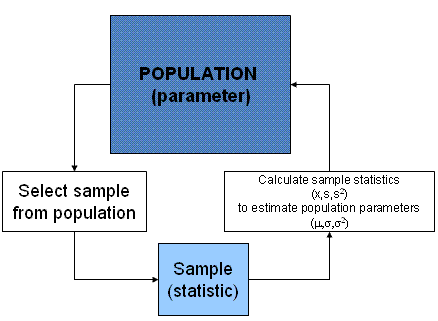
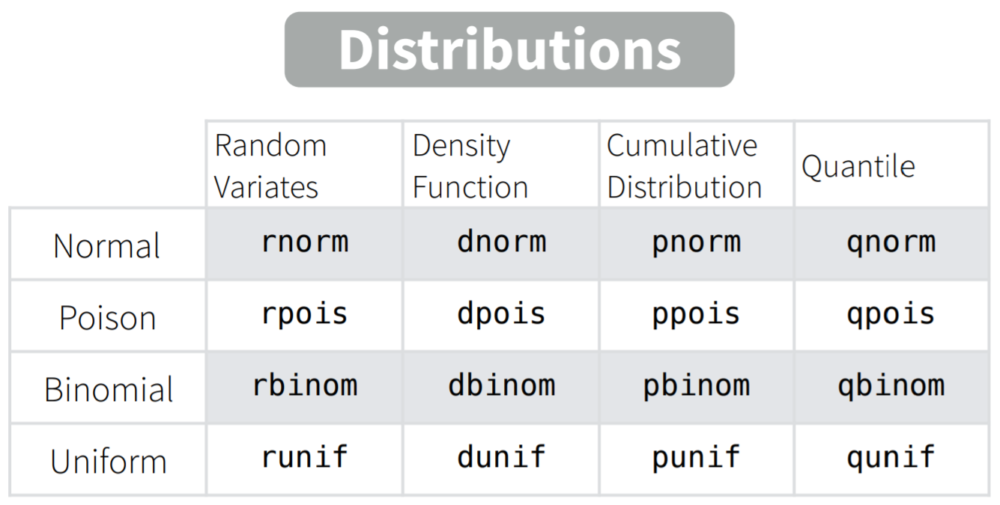
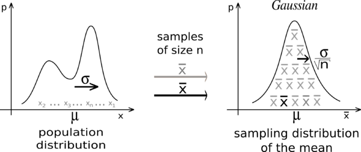

# Статистика вывода {#infer_stats}
## Введение в статистику вывода {#infer_intro}

**Статистика вывода** (inferential statistics) - это основной раздел статистики, связанный уже не с описанием и суммированием имеющихся данных (**описательная статистика**), а с попытками сделать вывод о **генеральной совокупности** (population) на основе имеющихся данных по **выборке**. Короче говоря, статистика вывода - это о том, как выйти за пределы наших данных. Это именно то, зачем мы проводим исследования - мы не можем собрать информацию обо всей генеральной совокупности, но по тому, что имеем (т.е. по нашей выборке), можем попытаться как-то оценить **параметры** генеральной совокупности.

Итак, еще раз: генеральной совокупности - параметры (**P**opulation - **P**arameters), а у выборки - статистики (**S**ample - **S**tatistics). Параметры обычно обозначаются греческими буквами: $\mu$, $\sigma$ (или большими латинскими: $M$, $S$ ), а статистики - соответствующими латинскими: $m$, $s$. 

## Оценки {#estimates}

Самая основа статистики вывода - это **оценки**. Как мы уже знаем, у распределений есть определенные параметры, которые описывают данное распределение.

Возьмем для примера нормальное распределение.

$$P(x) = \frac{e^{-(x - \mu)^{2}/(2\sigma^{2}) }} {\sigma\sqrt{2\pi}}$$

Например, для того, чтобы описать нормальное распределение нам нужно всего два параметра - его среднее $\mu$ и стандартное отклонение $\sigma$. Если же $\mu = 0$, а $\sigma = 1$, то такое нормальное распределение называется стандартным.

{width=400}

Наша цель - как-нибудь оценить эти параметры, потому что обычно мы их не знаем. Какой средний рост в популяции? Какого его стандартное отклонение? Для этого мы используем разного рода оценки: точечные и интервальные. В качестве оценок параметров часто используются статистики по выборке. Вот здесь легко запутаться, поэтому покажу картинку:  

{width=400}

Давайте познакомимся поближе с распределениями.

## Распределения

Распределения разделяются на дискретные и непрерывные. По большей части нас будут интересовать именно непрерывные. Хотя для полного их понимания нужен матан (да, именно тот, который calculus), непрерывные распределения довольно интуитивно понятны. 

Для каждого имеющегося в R распределения есть свой набор из четырех функций.

{width=400}

Скоро мы разберем их все.

Возьмем, например, нормальное распределение, про которое мы уже немного говорили (функции `rnorm()`, `dnorm()`, `pnorm()`, `qnorm()`).

То, что Вы видите на картинке - это так называемая **функция плотности вероятности (probability density function).** Это аналог probability mass function для дискретных величин - распределение вероятности того, что случайная величина имеет данное значение. Довольно очевидно, да? Тогда почему аналогичная штука для непрерывных распределений называется, черт возьми, по-другому? 

Дело в том, что вероятность получения конкретного значения для непрерывных величин равна нулю. Это немного необычный момент, но тем не менее: если распределение непрерывно, то получить точно 0,000000000000 с бесконечным количеством нулей после запятой невозможно, даже если среднее распределения равно нулю. Тем не менее, мы можем посчитать вероятность того, что случайное значение окажется в определенном промежутке. Чтобы посчитать эту вероятность, надо посчитать площадь соответствующего участка. Соответсвенно, площадь под всей функцией плотности вероятности равна 1.

Конечно, функцию плотности можно получить в R - это функции `d*()`, где \\* означает соответствующее распределение. Например, функция `dnorm()`.

Функция `dnorm()` имеет следующие основные параметры: `x =` - вектор принимаемых значений, среднее и стандартное отклонение (`mean =` и `sd = `). В качестве параметров по умолчанию используются 0 для среднего и 1 для стандартного отклонения, то есть стандартное нормальное распределение.

Давайте посмотрим, как работает эта функция, визуализировав результат ее выполнения на вектор от -3 до 3 с небольшим шагом.

```{r}
vec <- seq(-3,3, 0.1)
plot(vec,dnorm(vec))
```

Вот мы и получили то, что называем стандартным нормальным распределением, точнее, функцию плотности веротности стандартного нормального распределения.

Давайте теперь возьмем среднее 100 и стандартное отклонение 15 --- нормы для шкалы IQ:  

```{r}
iq <- seq(50,150, 0.1)
plot(iq, dnorm(iq, mean = 100, sd = 15))
```

> Шкала IQ --- это вообще очень удобная шкала. Поскольку в измерениях интеллекта нет никаких объективных метрик (сантиметров, градусов, килограммов), с которыми его можно было бы сравнить, то единственная возможность дать какую-то оценку величины интеллекта у человека --- сравнить его с интеллектом другого человека, например, по количеству решенных заданий за определенное время. Поэтому шкала IQ так сконструирована, чтобы среднее значение количество решенных заданий обозначалось за 100, а стандартное отклонение за 15. Поэтому по баллу IQ (если используется хороший тест, разумеется) можно понять процент людей, которых респондент опережает по интеллекту, по крайней мере, сравнивая с выборкой, на которой был стандартизирован тест. Примерно так же устроены и другие психологические шкалы. 

Следующая функция это **функция накопленной плотности распределения (cumulative distribution function; cdf)** [^cdf]. Это функция очень важная, потому что именно на ней основано тестирование уровня значимости нулевой гипотезы, которым мы будем заниматься в дальнейшем. Она означает вероятность того, что полученное случайное значение из распределения будет меньше искомого или равно ему. Для этого используется функция `pnorm()`.

[^cdf]: Иногда эта функция называется *интегральной функцией вероятности*, а иногда просто *функцией вероятности.* Последний вариант может запутать, потому что часто под функцией вероятности подразумевают функцию плотности вероятности.

```{r}
plot(iq, pnorm(iq, mean = 100, sd = 15))
```

Какова вероятность того, что полученное случайное значение IQ будет меньше или равно 100?

```{r}
pnorm(100, mean = 100, sd = 15)
```

А 130?

```{r}
pnorm(130, mean = 100, sd = 15)
```

Следующая функция --- это **квантильная функция (quantile function)**, или **обратная функция накопленной плотности распределения (inverse cumulative distribution function)**:  

```{r}
prob <- seq(0,1, 0.01)
plot(prob, qnorm(prob, mean = 100, sd = 15))
```

Обратная функция означает, что если мы применим сначала одну, а потом другую, то (если не берем особо крайних значений) на выходе получим исходные числа [^extreme_quantile].

[^extreme_quantile]: Если мы возьмем достаточно большие значения, то этот трюк не сработает, что свзязано с тем, что числа дробные числа в компьютерах хранятся с некоторой погрешностью.

```{r}
qnorm(pnorm(-4:4))
```

Ну и последняя важная функция - это `rnorm()` - просто генерирует выборку значений из данного распределения заданной длины `n =`:

```{r}
set.seed(42)
samp <- rnorm(100, mean = 100, sd = 15)
samp
```

> `set.seed()` - это функция, которая позволяет получить нам воспроизводимые результаты при использовании генератора случайных чисел. Короче говоря, если все мы поставим `set.seed(42)` [^why42], то одна и та же строчка выдаст нам один и тот же результат на разных компьютерах. Как это вообще возможно, это же случайные числа? Дело в том, что... нет. Они "псевдо-случайные". На самом деле, используются определенные алгоритмы, чтобы генерировать числа, которые выглядят как случайные. Например, можно брать цифры после запятой в числе пи после, например, 42го знака. Реальные алгоритмы создания псевдо-случайных чисел, конечно, гораздо сложнее, но суть примерно такая. Насколько подобные числа действительно получаются случайными - отдельный сложный математический вопрос. Но для нас этого вполне достаточно.

[^why42]: А почему именно 42? Ну, можно брать любое число, которое Вам нравится. А 42 - это [ответ на главный вопрос жизни, вселенной и всего такого](https://ru.wikipedia.org/wiki/%D0%9E%D1%82%D0%B2%D0%B5%D1%82_%D0%BD%D0%B0_%D0%B3%D0%BB%D0%B0%D0%B2%D0%BD%D1%8B%D0%B9_%D0%B2%D0%BE%D0%BF%D1%80%D0%BE%D1%81_%D0%B6%D0%B8%D0%B7%D0%BD%D0%B8,_%D0%B2%D1%81%D0%B5%D0%BB%D0%B5%D0%BD%D0%BD%D0%BE%D0%B9_%D0%B8_%D0%B2%D1%81%D0%B5%D0%B3%D0%BE_%D1%82%D0%B0%D0%BA%D0%BE%D0%B3%D0%BE)

```{r}
hist(samp, breaks = 10)
```

## Точечные оценки {#sample_estimate}

Представим, что только что сгенерированные данные с помощью `rnorm()` - это и есть наша выборка. Перед нами стоит задача оценить IQ популяции по этой выборке. Ну что, давайте попробуем оценить среднее. Здесь все просто и очень очевидно - самой лучшей оценкой среднего в генеральной совокупности будет среднее по выборке.

```{r}
mean(samp)
```

Конечно, не совсем точно, но лучше оценки не придумаешь. Что есть, то есть. Чем больше выборка, тем ближе мы будем к популяционному среднему.

А что с оценкой стандартного отклонения? Давайте воспользуемся нашей предыдущей формулой.

$$s= \sqrt\frac{\sum\limits_{i=1}^{n} (x_{i} - \overline{x})^2} {n}$$

```{r}
sqrt(sum((samp - mean(samp))^2)/length(samp))
```

В данном случае мы несколько промахнулись вверх, но обычно оценка по этой формуле дает небольшое **смещение** *(bias)* в меньшую сторону. Само по себе это кажется странным, и это нормально. Но этому есть всякие серьезные математические доказательства. Кроме того, есть множество всяких демонстраций, например, [от Академии Хана](https://www.khanacademy.org/math/ap-statistics/summarizing-quantitative-data-ap/more-standard-deviation/v/simulation-showing-bias-in-sample-variance). 

> Одно из простых объяснений такое: поскольку мы оцениваем стандартное отклонение на основе оценки среднего, среднеквадратичные расстояния счиаются не от реального среднего в генеральной совокупности, а от среднего по выборке, которое немного смещено в ту или иную сторону. Представьте, что так получилось, что в нашей выборке оно оказалось сильно смещено и выборочное среднее получилось около 90 (такое бывает). Это значит, что получилось много довольно низких значений около этого 90, а высчитываться среднеквадратичные разницы будут не от среднего 100 (которое мы не знаем), а от этого 90. Поэтому стандартное отклонение получится сильно меньше, чем должно было получиться.

Короче говоря, чтобы получить **несмещенную (unbiased) оценку** стандартного отклонения или дисперсии, то нам нужно делить не на $n$, а на $n-1$. 

$$s= \sqrt\frac{\sum\limits_{i=1}^{n} (x_{i} - \overline{x})^2} {n-1}$$

Заметьте, что именно так делает дефолтная функция `sd()`:

```{r}
sqrt(sum((samp - mean(samp))^2)/(length(samp) - 1))
sd(samp)
```

Это называется поправкой Бесселя, и она настолько распространена, что именно скорректированное стандартное отклонение обычно называют стандартным отклонением. Поэтому в дальнейшем будет использоваться именно эта формула или же просто функция `sd()`.  

Таким образом, у оценки есть два критерия качества - ее точность и ее несмещенность.

Тем не менее, точечные оценки - это еще не все. Мы еще хотим оценить, в каком интервале находится тот или иной параметр генеральной совокупности.  

## Интервальные оценки {#interval_estimate}

Самая распространенная интервальная оценка называется **доверительным интервалом (confidence interval)**. Цель доверительного интервала - "покрыть" параметр генеральной совокупности с определенной степенью уверенности.  

Например, 95% доверительный интервал или просто $CI95\%$ означает, что примерно в 95% случаев подсчитанный на выборках интервал будет ловить значение параметра в популяции. Например, построив $CI95\%$ по нашей сгенерированной выборке, мы хотим чтобы примерно в 95% случаев выборок, построенных таким способом, этот интервал ловил истинное среднее (в данном случае --- 100).  

Для того, чтобы научиться строить такие интервалы, нам нужно разобраться с **выборочным распределение (sampling distribution).**

## Выборочное распределение {#sample_dist}

Представьте себе, что мы бы выбрали не одну, а сразу много выборок, а потом у каждой выборки посчитали бы среднее. Мы бы получили новый вектор данных - средние выборок из одного распределения. Давайте это сделаем.  

```{r}
v <- rep(100, 1000)
samplemeans <- sapply(v, function(x) mean(rnorm(x, mean = 100, sd = 15)))
```

Каждая выборка состоит из сотни "испытуемых", всего таких выборок 1000. По каждой мы посчитали среднее. Как распределены эти средние?  

```{r}
hist(samplemeans, breaks = 30)
```

Вот это распределение и есть выборочное распределение средних. Точнее, было бы, если бы мы взяли не 1000 выборок, а бесконечное количество выборок. Так что у нас всего лишь апроксимация. При этом мы могли взять другие статистики, не средние выборок, а, например, медианы или стандартные отклонения выборок. Тогда это были бы выборочные распределения медиан и выборочные распределения стандартных отклонений. Но именно выборочное распределение средних обладает уникальными математическими свойствами, про которые мы скоро узнаем.

Среднее выборочного распределения средних будет близко к популяционному среднему:

```{r}
mean(samplemeans)
```

А вот чему будет равно стандартное отклонение средних?  

```{r}
sd(samplemeans)
```

Очень похоже на стандартное отклонение IQ, но в 10 раз меньше. В действительности, стандартное отклонение выборочного распределения средних равно стандартному отклонению в генеральной совокупности, деленному на корень из размера выборки. 

$$\sigma_{\overline{x}}= \frac{\sigma} {\sqrt{n}}$$
Как раз это мы и получили: размер нашей выборки - 100, а корень из 100 равен 10.  

Стандартное отклонение выборочного распределения средних (ох, йо) называется еще **стандартной ошибкой или standard error of the mean (s.e.m.).** Именно стандартную ошибку обычно используют на графиках в качестве error bars. Теперь вы знаете как ее посчитать!  

```{r}
sem <- 15/sqrt(length(samp))
sem
```

Ну а если мы не знаем стандартного отклонения в генеральной совокупности (что обычно и бывает в жизни), то можем оценить стандартную ошибку среднего с помощью оценки стандартного отклонения, посчитанного на выборке:

$$s_{\overline{x}}= \frac{s} {\sqrt{n}}$$

```{r}
sd(samp)/sqrt(length(samp))
```

Это означает, что стандартная ошибка тем меньше, чем больше выборка. И это довольно логично: чем больше у нас размер выборок, тем меньше будет расброс их средних.  

## Центральная предельная теорема {#clt}

Давайте теперь сделаем много выборок не из нормального, а из логнормального распределения. Что-то похожее представляет собой распределение времени реакции на многие задачи (особенно связанные с выбором и когда нужно подумать перед нажатием кнопки). Одна выборка будет распределена примерно так:  

```{r}
hist(rlnorm(10000), breaks = 100)
```

Распределение сильно ассиметрично, но его форма примерно понятна.

А как будут распределены средние многих выборок, взятых из логнормального распределения? Хочется сказать, что так же, но нет!  

```{r}
hist(sapply(rep(10000,1000),function(x)mean(rlnorm(x))), breaks = 100)
```

Удивительно, но средние по выборкам из логнормального распределения будут выглядеть почти нормально! Более того, для других распределений это тоже будет верно: **согласно центральной предельной теореме _(ЦПТ, central limit theorem)_, какой бы ни была форма распределения в генеральной совокупности, выборочное распределение средних будет стремиться к нормальному. При этом чем больше размер выборки, тем ближе выборочное распределение средних будет к нормальному.**  Это очень важная фишка, на которой основаны многие статистические тесты. 

{width=400}

Не верите? Попробуйте сами! Можете поиграться с разными распределениями с помощью кода (можете посмотреть другие распределения в хэлпе: `help("distributions")` ). 

Можете поиграться с интерактивной [Shiny-демонстрацией магии ЦПТ](https://gallery.shinyapps.io/CLT_mean/). Я очень и очень рекомендую поиграться с ней. Попробуйте разные значения, посмотрите что будет.

Как только наиграетесь, то сразу станет понятно, почему именно нормальное распределение занимает такое важное место в статистике.

> Если выходить за рамки выборочного распределения средних, то центральная предельная теорема говорит нам о том, что сумма слабо зависящих случайных величин, имеющих примерно одинаковое влияние, имеет распределение близкое к нормальному. Например, рост является следствием большого количества генетических и средовых факторов, поэтому он распределен примерно нормально. Однако это нормальное распределение портят такие факторы как пол --- он вносит очень сильный вклад в рост, поэтому распределение становится немного "двугорбым".

## Строим доверительный интервал {#ci_build}

Теперь мы знаем достаточно, чтобы построить доверительный интервал своими руками на основе стандартной ошибки. Мы построим самый стандартный вариант - 95% доверительный интервал. 

Давайте еще раз посмотрим на нормальное распределение.

{width=400}

Мы хотим поймать симметрично 95% от площади под кривой. Для этого нам нужно отбросить по 2.5% с обоих сторон. Эти 2.5% соответствуют примерно двум стандартным отклонениям от среднего. Если быть точнее, то 1.96. Если быть еще точнее:

```{r}
qnorm(0.975)
```

Почему 0.975? Потому что мы смотрим квантильную функцию по верхней границе: отсекаем правые 0.025:

```{r}
qnorm(1 - (1 - 0.95)/2)
```

Давайте сохраним это число. Назовем его `zcr`:  

```{r}
zcr <- qnorm(1 - (1 - 0.95)/2)
```

Это количество стандартных отклонений от среднего в нормальном распределении, которое включает в себя ровно 95% площади нормального распределения. Теперь давайте посчитаем стандартную ошибку. Здесь мы знаем стандартное отклонение в генеральной совокупности (это 15), его поделим на корень из размера выборки:  

```{r}
sem <- 15/sqrt(length(samp))
```

Чтобы посчитать нижнюю и верхнюю границы доверительного интервала, нам нужно вычесть и прибавить соответственно нужное количество стандартных ошибок:  

```{r}
mean(samp) - sem*zcr #нижняя граница
mean(samp) + sem*zcr #верхняя граница
```

Давайте теперь нарисуем сотню доверительных интервалов с помощью `ggplot2`! Цветом обозначим интервалы, которые не поймали истинное значение параметра в центральной совокупности.

```{r}
library("tidyverse")
sample_size <- 100
set.seed(42)
ci_simulations <- tibble(
  m = replicate(sample_size, mean(rnorm(sample_size, mean = 100, sd = 15))),
  se = 15/sqrt(sample_size),
  lower = m - se*zcr,
  higher = m + se*zcr,
  parameter_inside = lower<100 & higher>100
)
```

```{r}
graph <- ggplot(data = ci_simulations, aes(x = 1:sample_size,y = m)) +
  geom_pointrange(aes(ymin = lower,ymax = higher,colour = parameter_inside))+
  geom_hline(yintercept = 100)+
  coord_flip()
graph
```

Примерно 5% не ловят 100 в 95% доверительный интервал!  Примерно это и означает доверительный интервал: где-то в 95% он ловит параметр в генеральной совокупности, а в 5% - нет.

> Понятие доверительного интервала вызывает кучу недопонимания и ошибок. Очень многие его интерпретируют, например, как интервал, включающий в себя 95% значений популяции, но это неправильно.

Еще я советую посмотреть вот эту визуализацию:  

[Доверительные интервалы сыпятся как из мешка](http://rpsychologist.com/d3/CI/)


## Тестирование значимости нулевой гипотезы (#nhst)

**Тестирование значимости нулевой гипотезы (null hypothesis significance testing)** --- это основной подход в статистике вывода. Вы про него точно слышали, потому что де-факто он является стандартом в психологии, биологии, медицине и многих других науках.

Мы сейчас детально его проведем на примере одного из самых простых статистических тестов - z-тестов. Однако та же самая логика стоит и за остальными статистическими тестами.

**1. Формулирование нулевой и альтернативной гипотезы.**

Сначала мы задаем две гипотезы о параметрах распределения. Одна из них называется нулевой: она обычно включает положение о том, что различий или связи нет или что это различие/связь равно определенному числу. Если мы хотим применить тестирование значимости к нашей "выборке", то нулевую гипотезу можно будет сформулировать так: $$H_0: \mu = 100$$. Альтернативная или ненулевая гипотеза либо говорит о том, что среднее в генеральной совокупности на самом деле не равно какому-то конкретному числу (в нашем случае --- 100) или что две выборки взяты из групп с различным средним и т.п. 

$$H_1: \mu \ne 100$$

Тестирование нулевой гипотезы предполагает подсчет какой-то статистики, а потом вычисление того, какова вероятность получить такой или более радикальный результат при условии, что верна нулевая гипотеза.

Заметьте, мы формулируем гипотезу не про *статистики* в выборке, а про *параметры* в генеральной совокупности, поэтому пользуемся греческими (или большими латинскими) буквами.

Вся дальнейшая логика расчетов будет строиться именно на нулевой гипотезе: мы будем пытаться понять, насколько реалистичны наши результаты при верности нулевой гипотезы, которую мы заранее обозначили

**2. Подсчет тестовой статистики по выборке**

Следующий этап тестирования значимости нулевой гипотезы --- подсчет тестовой статистики. Тестовые статистики по своей сути не отличаются от описательных статистик, с которыми мы уже познакомились, но имеют другую функцию. Как и в случае описательных статистик, мы пытаемся выразить информацию о выборке в виде одного числа, но делаем это для того, чтобы сравнить это значение с другими *возможными* значениями, которые мы могли бы получить, если бы наша нулевая гипотеза была верна. 

Если мы знаем стандартное отклонение в генеральной совокупности, то можем посчитать z-статистику по формуле:

$$z = \frac{\overline{x} - \mu} {\sigma / \sqrt{N}} $$

```{r}
m <- mean(samp)
sem <- 15/sqrt(length(samp))
z <- (m - 100)/sem
z
```

z-статистика --- это выборочное среднее, из которого вычтено среднее в генеральной совокупносности согласно нашей гипотезе. Получившуюся разницу мы делим на стандартную ошибку. 

**3. Расчет p-value**

И вот мы подобрались к самому важному этапу --- расчет **p-value**. Очень важно понять, как именно он расчитывается, потому что на этом основывается сама идея тестирования значимости нулевой гипотезы! Для этого нам нужно вернуться к идее выборочного распределения, только теперь уже не среднего, а z-статистики. Впрочем, выглядеть оно будет абсолютно так же - нормально!

Благодаря ЦПТ, если распределение в генеральной совокупности не слишком далеко от нормального, а выборка достаточно большая, то выборочное распределение z-статистик при верности нулевой гипотезы будет (примерно) нормальным со средним 0 и стандартным отклонением 1.

Теперь нам нужно соотнести нашу z-статистику с теоретическим выборочным распределением z-статистик.

Какова вероятность получить z-статистику `r z`? Это вопрос с подвохом: как мы выяснили ранее, для непрерывных распределений вероятность получить отдельное число равна 0. Но мы можем посчитать, какова вероятность получить такую же или большую z-статистику! Эту вероятность можно посчитать с помощью `pnorm()`:

```{r}
pnorm(z)
```

`pnorm()` считает от минус бесконечности до заданного числа, а нам нужно наоборот --- от заданного числа до плюс бесконечности. Этого можно добиться вычетанием из 1 [^tail]:

[^tail]: или же можно поставить параметру `lower.tail = ` функции `pnorm()` значение `FALSE`.

```{r}
1 - pnorm(z)
```

Обычно это число еще и умножают на 2, потому что мы заранее не знаем, в какую сторону будет отклоняться среднее по нашей выборке. Вернемся к шагу 1: мы сформулировали ненулевую гипотезу таким образом, что среднее генеральной совокупности не равно 100:

$$H_1: \mu \ne 100$$

Это означает, что $H_1$ включает в себя как случаи, когда среднее отклоняется в большую сторону, так и случаи когда среднее отклоняется в меньшую сторону.

```{r}
p <- (1 - pnorm(z))*2
p
```

Вот эта число и есть **p-value --- вероятность получения такого же и более экстремального значения тестовой статистики при условии, что нулевая гипотеза верна.**

**4. Принятие решения о гипотезах**

Отлично, мы посчитали *p-value*. В данном конкретном случае он оказался равен `r p`. Это много или мало? Фактически это означает, что если нулевая гипотеза верна, то в большинстве случаев мы будем получать z-статистики больше нашей. Короче говоря, это вполне реалистичный случай, если нулевая гипотеза верна. 

Значит ли это, что нулевая гипотеза верна? Нет, не значит. При тестировании значимости нулевой гипотезы мы в принципе ничего не можем сказать про верность альтернативной гипотезы. Например, возможно, настоящее среднее в генеральной совокупности, из которой мы взяли выборку, очень мало отличается от 100. 

Поэтому если *p-value* достаточно большой, мы не можем сделать выводов про верность нулевой и альтернативной гипотезы. Мы можем лишь сказать, что у нас нет оснований отклонить нулевую гипотезу.

Если же *p-value* очень маленький, то здесь у нас появляется больше однозначности. Например, если *p-value* равен .02, мы можем сказать, что ситуация малореалистичная: такие и более сильные отклонения от среднего мы можем получить только раз в 50 случаев, если $H_0$ верна. Поэтому мы отклоняем $H_0$ и принимаем $H_1$.

Насколько маленьким должен быть *p-value*, чтобы отклонить нулевую гипотезу? __Критическое значение *p-value*, при котором отклоняют нулевую гипотезу, называется уровнем $\alpha$.__ Это максимальный уровень ошибки, который мы допускаем в исследовании.

Так получилось исторически, что стандартный уровень $\alpha$ равен .05. Нужно помнить, что .05 --- это просто общепринятая условность, за этим числом не стоит никакого сакрального знания. Просто так получилось.

Очевидно, что такой статистический подход к принятию решений будет периодически приводить к нас ошибкам. Если $H_0$ на самом деле верна, а мы ее отвергли и приняли $H_1$, то это **ошибка первого рода** (*type I error*). Вероятность этой ошибки и есть наше критическое значение $\alpha$. Однако есть вероятность ошибиться и в другую сторону, т.е. ошибочно не отклонить $H_0$ --- это **ошибка второго рода** (*type II error*), эта вероятность обозначается буквой $\beta$.

| Принятое решение \ Реальность 	| $H_0$ верна                  	| $H_1$ верна                   	|
|-------------------------------	|------------------------------	|-------------------------------	|
| Не отклоняем $H_0$            	| Верный пропуск               	| Ошибка 2 рода (type II error) 	|
| Отклоняем $H_0$               	| Ошибка 1 рода (type I error) 	| Верное попадание              	|

