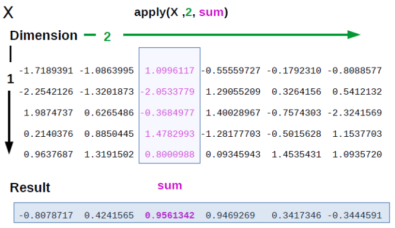

# Функциональное программирование в R {#sec-functional}

## Создание функций {#sec-create_fun}

Поздравляю, сейчас мы выйдем на качественно новый уровень владения R. Вместо того, чтобы пользоваться теми функциями, которые уже написали за нас, мы можем сами создавать свои функции! 

Синтаксис создания функции внешне похож на создание циклов или условных конструкций:

```
function(параметры) { тело функции }
```

Разберем подробнее все три элемента:

1.  ключевое слово `function`;
2.  в круглых скобках --- **параметры**: они превратятся в переменные, с которыми функция будет работать в теле;
3.  в фигурных скобках --- тело функции: выражения, которые выполнятся при вызове функции. Результатом работы функции станет то, что передано внутри тела в `return()`. А если `return()` так и не встретится --- результат последней команды в теле, как если бы мы выполнили ее в консоли.

Созданную функцию нужно присвоить переменной, чтобы потом ее вызывать и использовать.

Сделаем простой пример --- функцию `pow()`, которая возводит число `x` в степень `p`:

```{r}
pow <- function(x, p) {
  power <- x ^ p
  return(power)
}
pow(3, 2)
```

Ту же `pow()` можно записать и без `return()` --- результат вернется и так:

```{r}
pow <- function(x, p) {
  x ^ p
}
pow(3, 2)
```

Именно так и рекомендуется создавать функции, используя `return()` только в том случае, если нужно вернуть значение из функции досрочно, не дожидаясь завершения ее выполнения.

Если в последней строчке будет присвоение, то функция ничего не вернет обратно. Это очень распространенная ошибка: функция вроде бы работает правильно, но ничего не возвращает. Вспомните: функция возвращает то, что вывелось бы в консоли, --- а присваивание в консоли ничего не печатает.

```{r}
pow <- function(x, p) {
  power <- x ^ p # Функция ничего не вернет, потому что в последней строчке присвоение!
}
pow(3, 2) # ничего не возвращается из функции
```

Если функция небольшая, то ее можно записать в одну строчку без фигурных скобок.

```{r}
pow <- function(x, p) x ^ p
pow(3, 2) 
```

::: callout-warning
## *Для продвинутых:* `{}` --- блок инструкций

Вообще, фигурные скобки используются для того, чтобы выполнить серию команд, но вернуть только результат выполнения последней команды. Такой набор команд называется **блоком инструкций** *(statements block)*. Это можно использовать, чтобы не создавать лишних временных переменных в глобальном окружении.
:::

Мы можем оставить в функции параметры по умолчанию.

```{r}
pow <- function(x, p = 2) x ^ p
pow(3) 
pow(3, 3) 
```

::: callout-warning
## *Для продвинутых:* ленивые вычисления

В R работают **ленивые вычисления** *(lazy evaluations)*. Это означает, что аргументы функции вычисляются только тогда, когда понадобятся, а не заранее: R, как самый ленивый прокрастинатор, откладывает вычисление аргумента, пока оно действительно не потребуется. Из-за этого, если для параметра не передан аргумент, выяснится это только в момент, когда он используется. Например, эта функция не выдаст ошибку, даже если мы не передадим аргумент для параметра `we_will_not_use_this_parameter`, потому что он нигде не используется в расчетах.

```{r}
pow <- function(x, p = 2, we_will_not_use_this_parameter) x ^ p
pow(x = 3)
```
:::

## Когда и зачем создавать функции? {#sec-why_functions}

Когда стоит создавать функции? Существует ["правило трех"](https://en.wikipedia.org/wiki/Rule_of_three_(computer_programming)) --- если у вас есть три куска очень похожего кода, то самое время превратить код в функцию. Это очень условное правило, но, действительно, стоит избегать «копипастинга» в коде. В этом случае очень легко ошибиться, а сам код становится нечитаемым.

Есть и другой подход к созданию функций: их стоит создавать не столько для того, чтобы использовать тот же код снова, сколько для абстрагирования от того, что происходит в отдельных строчках кода. Если несколько строчек кода были написаны для того, чтобы решить одну задачу, которой можно дать понятное название (например, подсчет какой-то особенной метрики, для которой нет готовой функции в R), то этот код стоит обернуть в функцию. Если функция работает корректно, то теперь не нужно думать над тем, что происходит внутри нее. Вы можете мысленно представить ее как операцию, которая имеет определенный вход и выход --- как и встроенные функции в R.

Отсюда следует важный вывод, что хорошее название для функции --- это очень важно. Очень, очень, очень важно. Впрочем, это важно для любых переменных.

## Проверка на адекватность {#sec-sanity_check}

Лучший способ не бояться ошибок и предупреждений --- научиться прописывать их самостоятельно в собственных функциях. Это позволит понять, что за текстом предупреждений и ошибок, которые у вас возникают, стоит забота разработчиков о пользователях, которые хотят максимально обезопасить нас от наших непродуманных действий.

Хорошо написанные функции не только выдают правильный результат на все возможные адекватные данные на входе, но и не дают получить правдоподобные результаты при неадекватных входных данных. Как вы уже знаете, если на входе у вас имеются пропущенные значения, то многие функции будут в ответ тоже выдавать пропущенные значения. И это вполне осознанное решение, которое позволяет избегать ситуаций вроде той, когда около одной пятой научных статей по генетике содержало ошибки в приложенных данных [@ziemann16] и замечать пропущенные значения на ранней стадии. Кроме того, можно проводить **проверки на адекватность входящих данных** *(sanity check)*.

Разберем проверку на адекватность входящих данных на примере самодельной функции `imt()`, которая выдает индекс массы тела, если на входе задать массу (параметр `weight =`) в килограммах и рост (параметр `height =`) в метрах.

```{r}
imt <- function(weight, height) weight / height ^ 2
```

Проверим, что функция работает верно:

```{r}
w <- c(60, 80, 120)
h <- c(1.6, 1.7, 1.8)
imt(weight = w, height = h)
```

Очень легко перепутать и написать рост в сантиметрах. Было бы здорово предупредить об этом пользователя, показав ему предупреждающее сообщение, если рост больше, чем, например, 3. Это можно сделать с помощью функции `warning()`.

```{r}
imt <- function(weight, height) {
  if (any(height > 3)) warning("Рост в аргументе height больше 3: возможно, указан рост в сантиметрах, а не в метрах\n")
  weight / height ^ 2
}
imt(78, 167)
```

В некоторых случаях ответ будет совершенно точно некорректным, хотя функция все посчитает и выдаст ответ, как будто так и надо. Например, если какой-то из аргументов функции `imt()` будет меньше или равен 0. В этом случае нужно прописать проверку на это условие. Если это действительно так, то можно поступить еще строже: выдать пользователю ошибку.

```{r}
#| error: true
imt <- function(weight, height) {
  if (any(weight <= 0 | height <= 0)) stop("Индекс массы тела не может быть посчитан для отрицательных значений")
  if (any(height > 3)) warning("Рост в аргументе height больше 3: возможно, указан рост в сантиметрах, а не в метрах\n")
  weight / height ^ 2
}
imt(-78, 167)
```

Когда проверок несколько, их удобно собрать внутри функции `stopifnot()`. Эта функция по очереди проверяет переданные условия и останавливает выполнение функции с ошибкой, когда какое-то из них окажется ложным. Условие можно передать с именем, оно станет текстом ошибки:

```{r}
#| error: true
imt <- function(weight, height) {
  stopifnot("масса должна быть положительной" = all(weight > 0),
            "рост должен быть положительным" = all(height > 0))
  weight / height ^ 2
}
imt(-78, 167)
```

Отдельный случай --- когда аргумент должен принимать одно из нескольких допустимых значений. Здесь помогает `match.arg()`: варианты перечисляют прямо в значении параметра по умолчанию, а внутри функции вызывают `match.arg()`. Он подставит первый вариант по умолчанию и выдаст понятную ошибку, если передать что-то постороннее:

```{r}
#| error: true
greet <- function(lang = c("ru", "en")) {
  lang <- match.arg(lang)
  if (lang == "ru") "Привет" else "Hi"
}
greet()          # по умолчанию берется первый вариант
greet("en")
greet("de")      # недопустимый вариант -- ошибка
```

Такой параметр-выбор вы уже встречали --- `ties.method =` в функции `rank()` (@sec-rank): внутри он устроен именно через `match.arg()`.

Когда вы попробуете самостоятельно прописывать предупреждения и ошибки в функциях, то быстро поймете, что ошибки --- это вовсе не обязательно результат того, что где-то что-то сломалось и нужно паниковать. Совсем даже наоборот, прописанная ошибка --- чья-то забота о пользователях, которых пытаются максимально проинформировать о том, что и почему пошло не так.

Это естественно в начале работы с R (и вообще с программированием) избегать ошибок и пугаться их. Конечно, в самом начале обучения большая часть из них остается непонятной. Но постарайтесь понять текст ошибки, вспомнить, в каких случаях у вас возникала похожая ошибка. Очень часто этого оказывается достаточно, чтобы понять причину ошибки, даже если вы только-только начали изучать R.

Ну а в дальнейшем я советую ознакомиться со [средствами отладки кода в R](https://adv-r.hadley.nz/debugging.html) для того, чтобы научиться справляться с ошибками в своем коде на более продвинутом уровне.

## Функции как объекты первого порядка {#sec-functions_objects}

Ранее мы убедились (@sec-func), что арифметические операторы --- это функции. Да и не только арифметические операторы, но и все остальные операторы типа `>` или `%in%`. И даже, например, скобочки для индексирования `[` --- это тоже функции. Более того, функциями оказываются даже управляющие конструкции: `if`, `for` и подобные --- это зарезервированные (ключевые) слова (см. @sec-loops_conditions), но за каждым из них стоит функция, которую можно вызвать и напрямую:

```{r}
`if`(2 > 1, "да", "нет")
```

Зарезервированное слово --- это просто удобный синтаксис для вызова такой функции. В принципе, всё, что *происходит* в R --- это вызов функции.

> Чтобы понять вычисления в R, полезны два девиза: всё, что существует, --- это объект; всё, что происходит, --- это вызов функции.
>
> --- Джон Чеймберс, один из создателей R [@chambers2008]

А сами функции --- это объекты первого порядка в R. Это означает, что с функциями вы можете делать практически все то же самое, что и с другими объектами в R (векторами, датафреймами и т.д.). Небольшой пример, который может взорвать ваш мозг:

```{r}
list(mean, min, `{`)
```

Мы можем создать список из функций! Зачем --- это другой вопрос, но ведь можем же! Например, создавать списки из функций может быть удобным для продвинутых операций в `across()` в пакете `{dplyr}` (см. @sec-tidy_across).

Еще можно создавать функции внутри функций[^050-functional-1], использовать функции в качестве аргументов функций, сохранять функции как переменные. Пожалуй, самое важное из этого всего --- это то, что функция может быть аргументом в функции. Не просто название функции как строковая переменная, не результат выполнения функции, а именно сама функция как объект! Это лежит в основе использования семейства функций `apply()`, о которых пойдет речь далее, и многих фишек *tidyverse.*

[^050-functional-1]: Функция, которая создает другие функции, называется **фабрикой функций** *(function factory)*.

::: callout-tip
## *Полезное:* а как в Python?

В Python дело обстоит похожим образом: функции там тоже являются объектами первого порядка, поэтому все эти фишки функционального программирования (с поправкой на синтаксис, конечно) будут работать и там.
:::

::: callout-warning
## *Для продвинутых:* окружения и поиск переменных

Каждая переменная, которую мы создаем, хранится в каком-то **окружении** *(environment)*. Окружение --- это набор переменных, собранных вместе: каждому имени в нем соответствует какое-то значение, что делает окружение похожим на именованный список [@wickham19, chap. 7]. Главное окружение, с которым мы работаем, --- **глобальное** *(global environment)*: именно оно показано во вкладке **Environment** в RStudio.

У каждой запущенной функции появляется свое окружение. В нем живут параметры --- имена из круглых скобок, получившие переданные значения (аргументы), --- и переменные, созданные в теле функции (обычно на основе тех же аргументов).

Когда мы запускаем команду `x <- 10` в консоли или в скрипте, мы добавляем в глобальное окружение переменную `x` со значением `10`. Если же `x <- 10` стоит в теле функции, то при ее выполнении переменная `x` создается в окружении функции и попадает в компанию параметров и других переменных, созданных внутри.

Кстати, переменные можно создавать и по-другому --- функцией `assign()`. Вызов `assign("x", 10)` даст тот же результат, что и `x <- 10`. У `assign()` есть параметр `envir =`, которым можно задать, в какое именно окружение поместить переменную. По умолчанию она попадает в то окружение, откуда вызвали сам `assign()`: ровно так же, как при обычном присваивании --- в глобальном окружении переменная добавится к глобальному, а внутри функции --- к окружению функции. А если передать `envir = globalenv()`, присваивание произойдет в глобальном окружении, даже когда мы находимся внутри функции. Правда, в R так делать не принято: это побочный эффект, из-за которого функция перестает быть «чистой» (см. @sec-pure_fun).

Но что, если в теле функции встречается имя, которого в ее собственном окружении нет? Тогда R продолжает поиск снаружи --- и здесь важно, где именно. R ищет переменную с этим именем в том окружении, где функцию **определили** *(enclosing environment)*, а не в том, откуда ее **вызвали**. Если и там имени нет, поиск идет дальше наружу --- и так до глобального окружения. Это правило называется **лексической областью видимости** *(lexical scoping)*.

Поэтому результат не зависит от того, откуда функцию вызвали:

```{r}
x <- 10
f <- function() x        # x внутри f не задан
g <- function() {
  x <- 20                # локальный x внутри g
  f()                    # вызываем f изнутри g
}
g()
```

Функция `f()` не находит `x` у себя и ищет его там, где была определена, --- в глобальном окружении. Там `x` равен `10`, поэтому результат `10`, а не `20` из `g()`, откуда `f()` вызвали.
:::

## Чистые функции и побочные эффекты {#sec-pure_fun}

Один из важных аспектов функциональной парадигмы в программировании --- это использование **чистых функций** *(pure functions)*. У чистых функций две ключевые особенности:

1.  Чистые функции **детерминированы**: их результат зависит только от переданных аргументов.
2.  У чистых функций нет **побочных эффектов** *(side effects)*: они не записывают файлы, не печатают сообщений, не рисуют графиков, не создают глобальных переменных и т.д.

Критерий детерминированности исключает функции для импорта данных (подставив разные файлы с одинаковым названием, мы получим разные результаты) и функции вроде `Sys.time()` для определения текущего времени. Ну а без функций с побочными эффектами... зачем нам вообще тогда что-то делать в R?

Короче говоря, R не является на 100% функциональным языком: не все функции в нем чистые. Тем не менее в R принято придерживаться функционального стиля и стараться создавать чистые функции там, где это не противоречит здравому смыслу. В первую очередь это означает не создавать переменные в глобальном окружении изнутри функций и полагаться только на переменные в окружении самой функции. Ограничение не такое уж большое, зато благодаря ему функции становятся полностью предсказуемыми, а весь анализ данных можно представить как набор функций, примененных к данным. Этим мы будем активно пользоваться с функциями семейства `apply()` (@sec-apply_f), а особенно --- с пайпами и *tidyverse* (@sec-tidy_intro).

## Семейство функций `apply()` {#sec-apply_f}

### Применение `apply()` для матриц {#sec-apply}

Семейство функций `apply()`? Да, их целое множество: `apply()`, `lapply()`, `sapply()`, `vapply()`, `tapply()`, `mapply()`, `rapply()`... Ладно, не пугайтесь, всех их знать не придется. Обычно достаточно первых двух-трех. Проще всего пояснить как они работают на простой матрице с числами:

```{r}
A <- matrix(1:12, 3, 4)
A 
```

Теперь представим, что нам нужно посчитать что-нибудь (например, сумму) по каждой из строк. С помощью функции `apply()` вы можете в буквальном смысле "применить" функцию к матрице или датафрейму. Синтаксис такой: `apply(X, MARGIN, FUN, ...)`, где `X` --- данные, `MARGIN` это `1` (для строк), `2` (для колонок), `c(1,2)` для строк и колонок (т.е. для каждого элемента по отдельности), а `FUN` --- это функция, которую вы хотите применить! `apply()` будет брать строки/колонки из `X` в качестве первого аргумента для функции.

{fig-alt="Схема работы `apply()`: выбираем матрицу, задаем направление обхода (по строкам или по столбцам) и функцию, которая применяется к каждой строке или столбцу"}

::: callout-important
## *Осторожно:* передаём в `FUN =` функцию как объект

Заметьте, мы вставляем функцию без скобок и кавычек как аргумент в функцию. Это как раз тот случай, когда аргументом в функции выступает сама функция, а не её название или результат её выполнения.
:::

Давайте разберем на примере:

```{r}
apply(A, 1, sum) # сумма по каждой строчке
apply(A, 2, sum) # сумма по каждой колонке
apply(A, c(1,2), sum) # кхм... сумма каждого элемента
```

::: callout-tip
## *Полезное:* специальные функции для операций над всеми строками/столбцами

Конкретно для подсчета сумм и средних по столбцам и строкам в R есть функции `colSums()`, `rowSums()`, `colMeans()` и `rowMeans()`, которые можно использовать как альтернативы `apply()` в данном случае.
:::

Если же мы хотим прописать дополнительные аргументы для функции, то их можно перечислить через запятую после функции:

```{r}
A[2, 2] <- NA
A
apply(A, 1, sum)
apply(A, 1, sum, na.rm = TRUE)
```

Что это за многозначительное `...` в параметрах функции `apply(X, MARGIN, FUN, ...)`? Это **многоточие** *(dot-dot-dot)* --- особенный параметр, который принимает сколько угодно аргументов --- как именованных, так и нет. Мы уже знакомы с функциями, у которых есть параметр `...`. Взять, к примеру, функцию `c()`, которая соединяет произвольное количество векторов вместе (@sec-atomic): многоточие как раз и является основным параметром этой функции. Если переданные в `...` аргументы не именованы, то мы получаем обычный atomic вектор, а если именованы --- именованный вектор (@sec-index_atomic). И `c()` --- отнюдь не единственный встречавшийся нам пример: аналогичным образом работают `list()`, `data.frame()`, а еще `paste()`, `sum()` и многие другие.

У `apply()` роль многоточия другая: оно пробрасывает аргументы дальше, в функцию, которую мы передаем в `FUN =`. Именно так `na.rm = TRUE` из примера выше добрался до `sum()`.

Многоточие можно использовать и в собственных функциях. Допустим, мы хотим сделать функцию, которая считает средний индекс массы тела по векторам массы и роста:

```{r}
imt_mean <- function(weight, height) mean(weight / height ^ 2)
imt_mean(c(60, 80, NA), c(1.6, 1.7, 1.8))
```

Что делать с `NA`? Можно прописать у своей функции параметр `na.rm =` и вручную передать его в `mean()`:

```{r}
imt_mean <- function(weight, height, na.rm = FALSE) {
  imt <- weight / height ^ 2
  mean(imt, na.rm = na.rm)
}
imt_mean(c(60, 80, NA), c(1.6, 1.7, 1.8), na.rm = TRUE)
```

И это сработало. Но что, если таких параметров будет много? Тогда нам придется вручную «прокладывать» каждый параметр, который может понадобиться. А можно вместо этого объявить параметр `...` и внутри тела функции передать `...` в функцию `mean()`. Тогда дополнительные аргументы, переданные в нашу функцию, будут проброшены в `mean()`:

```{r}
imt_mean <- function(weight, height, ...) mean(weight / height ^ 2, ...)
imt_mean(c(60, 80, NA), c(1.6, 1.7, 1.8), na.rm = TRUE)
```

Причем работать это будет не только с `na.rm =`, но и с любым другим дополнительным аргументом!

::: callout-important
## *Осторожно:* `apply()` не работает с датафреймами

Функция `apply()` предназначена для работы с матрицами (или многомерными массивами). Если вы скормите функции `apply()` датафрейм, то этот датафрейм будет сначала превращён в матрицу. Главное отличие матрицы от датафрейма в том, что в матрице все значения одного типа, поэтому будьте готовы, что сработает имплицитное приведение к общему типу данных. Например, если среди колонок датафрейма есть хотя бы одна строковая колонка, то все колонки станут строковыми.
:::

### Анонимные функции {#sec-anon_f}

Что делать, если мы хотим сделать что-то более сложное, чем просто применить одну функцию? А если функция принимает не первым, а вторым аргументом данные из матрицы? В этом случае нам помогут **анонимные функции** *(anonymous function)*.

Анонимные функции --- это функции, которые будут использоваться один раз и без названия.

::: callout-tip
## *Полезное:* а как в Python?

Питонистам знакомо понятие **лямбда-функций** *(lambda function)*. Да, это то же самое.
:::

Например, мы можем посчитать общее количество знаков по строкам и столбцам без называния этой функции:

```{r}
B <- matrix(c("Всем", "привет", "Я", "строковая", "матрица", "и", "такое", "тоже", "бывает"), nrow = 3)
apply(B, 1, function(x) sum(nchar(x)))
apply(B, 2, function(x) sum(nchar(x)))
```

Начиная с R 4.1.0 (май 2021) можно использовать сокращенный вариант написания анонимных функций с `\` вместо ключевого слова `function`:

```{r}
apply(B, 1, \(x) sum(nchar(x)))
apply(B, 2, \(x) sum(nchar(x)))
```

::: callout-tip
## *Полезное:* параметр анонимной функции

Как и в обычной функции, `x` здесь --- это **параметр**: имя, под которым в теле доступен переданный объект. Назвать его можно как угодно, не обязательно `x`:

```{r}
apply(B, 1, function(whatevername) sum(nchar(whatevername)))
```
:::

### Другие функции семейства `apply()` {#sec-apply_other}

ОК, с `apply()` разобрались. А что с остальными? Некоторые из функций семейства `*apply()` еще проще и не требуют индексов, например, `lapply()` (для применения к каждому элементу списка) и `sapply()` --- упрощенная версия `lapply()`, которая пытается по возможности "упростить" результат до вектора или матрицы.

```{r}
some_list <- list(some = 1:10, list = letters)
lapply(some_list, length)
sapply(some_list, length)
```

::: callout-important
## *Осторожно:* такой непредсказуемый `sapply()`

Достаточно сложно предсказать, в каких именно случаях будет произведено упрощение, а в каких нет. Поэтому `sapply()` удобен в исследовании данных, но использовать эту функцию в скриптах не очень рекомендуется. Один из вариантов решения этой проблемы --- это функция `vapply()`, которая позволяет управлять результатом `lapply()`, но гораздо более красиво эта проблема решена в пакете `{purrr}` (см. @sec-purrr ).
:::

Применение `sapply()` к вектору приводит к тем же результатам, что и просто применить векторизованную функцию обычным способом.

```{r}
sapply(1:10, sqrt)
sqrt(1:10)
```

Зачем вообще тогда нужен `sapply()`, если мы можем просто применить векторизованную функцию? Ключевое слово здесь *векторизованная* функция. Если функция не векторизована, то `sapply()` становится удобным вариантом для того, чтобы избежать итерирования с помощью циклов `for`. Если же у вас уже есть векторизованная функция, то лучше применять напрямую именно её: такой код будет не только более читаемым, но и в большинстве случаев более быстрым.

::: callout-warning
## *Для продвинутых:* `Vectorize()`

Еще одна альтернатива --- это векторизация невекторизованной функции с помощью `Vectorize()`. Эта функция просто оборачивает функцию одним из вариантов `apply()`. Обратите внимание: функция `Vectorize()` в качестве аргумента принимает функцию и возвращает тоже функцию!
:::

Можно применять функции `lapply()` и `sapply()` на датафреймах. Поскольку фактически датафрейм --- это список из векторов одинаковой длины (см. @sec-df), то итерироваться эти функции будут по колонкам:

```{r}
heroes <- read.csv("https://raw.githubusercontent.com/Pozdniakov/tidy_stats/master/data/heroes_information.csv", 
                   na.strings = c("-", "-99", "NA"))
sapply(heroes, class)
```

Еще одна функция из семейства `apply()` --- функция `replicate()` --- самый простой способ повторить одну и ту же операцию много раз. Обычно эта функция используется при симуляции данных и моделировании. Например, давайте сделаем выборку из логнормального распределения (подробнее про распределения см. в @sec-distributions):

```{r}
samp <- rlnorm(30)
hist(samp)
```

А теперь давайте сделаем 1000 таких выборок и из каждой возьмем среднее:

```{r}
sampdist <- replicate(1000, mean(rlnorm(30)))
hist(sampdist)
```

Про функции для генерации случайных чисел и про визуализацию будет в следующих главах: @sec-distributions и @sec-r_vis соответственно.

В заключение стоит сказать, что семейство функций `apply()` --- это очень сильное колдунство, но в *tidyverse* оно практически полностью перекрывается функциями из пакета `{purrr}`, за исключением самого `apply()` и некоторых других функций, которые работают с матрицами и массивами (*tidyverse* с ними принципиально не дружит). Впрочем, если вы поняли логику `apply()`, то при желании вы легко сможете переключиться на альтернативы из пакета `{purrr}` (см. @sec-purrr).
