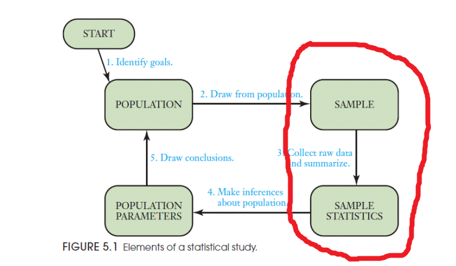
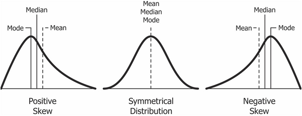
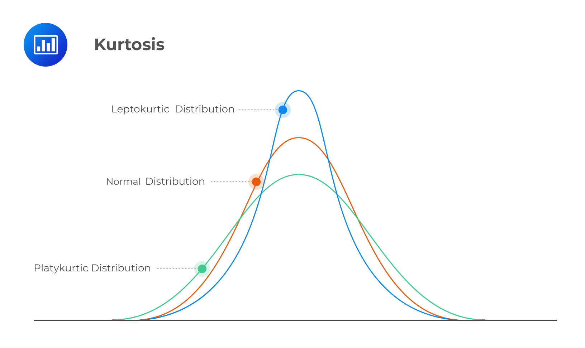

# Описательная статистика {#sec-vdesc}

## Описательная статистика и статистика вывода {#sec-desc_infer}

Статистика делится на **описательную статистику** (*descriptive statistics*) и **статистику вывода** (*inferential statistics*). Описательная статистика пытается описать нашу **выборку** (*sample*, т.е. те данные, что у нас на руках) различными способами. Проблема в том, что описательная статистика может описать только то, что у нас есть, но не позволяет сделать выводы о **генеральной совокупности** (*population*) --- это уже цель статистики вывода. Цель описательной статистики --- "ужать" данные для их обобщенного понимания с помощью *статистик*.

> Заметьте, у выборки (**s**ample) мы считаем статистики (**s**tatistics), а у генеральной совокупности (**P**opulation) есть параметры (**P**arameters). Вот такая вот мнемотехника.

Статистики часто выступают в роли *точечной оценки* (point estimators) параметров, так что в этом легко запутаться. Например, среднее (в выборке) --- это оценка среднего (в генеральной совокупности). Да, можно свихнуться. Мы это будем разбирать подробнее в следующие занятия (это действительно важно, поверьте), пока что остановимся только на описании выборки.

{width="400"}

## Типы шкал

Перед тем, как начать речь об описательных статистиках, нужно разобраться с существующими типами шкал. Типы шкал классифицируются на основании типа измеряемых данных, которые задают допустимые для данной шкалы отношения.

**- Шкала наименований (номинальная шкала)** --- самая простая шкала, где единственное отношение между элементами --- это отношения равенства и неравенства. Это любая качественная шкала, между элементами которой не могут быть установлены отношения "больше --- меньше". Это большинство группирующих переменных (экспериментальная группа, пол, политическая партия, страна), переменные с id. Еще один пример --- номера на майках у футболистов.

**- Шкала порядка (ранговая шкала)** --- шкала следующего уровня, для которой можно установить отношения "больше --- меньше", причем если *B* больше *A*, а *C* больше *B*, то и *C* должно быть больше *A*. Если это верно, то мы можем выстроить последовательность значений. Однако мы еще не можем говорить о разнице между значениями. Ответы на вопросы "Как часто вы курите?" по шкале "Никогда", "Редко" и "Часто" являются примером ранговой шкалы. "Часто" --- это чаще, чем "Редко", "Редко" --- это чаще чем "Никогда", и, соответственно, "Часто" --- это чаще, чем "Никогда". Но мы не можем сказать, что разница между "Часто" и "Редко" такая же, как и между "Редко" и "Никогда". Соответственно, даже если мы обозначим "Часто", "Редко" и "Никогда" как 3, 2 и 1 соответственно, то многого не можем сделать с этой шкалой, Например, мы не можем посчитать арифметическое среднее для такой шкалы.

**- Шкала разностей (интервальная шкала)** --- шкала, для которой мы уже можем говорить про разницы между интервалами. Например, разница между 10 °C и 20 °C такая же, как и между 80 °C и 90 °C. Для шкалы разностей уже можно сравнивать средние, но операции умножения и деления не имеют смысла, потому что ноль в шкале разностей относительный. Например, мы не можем сказать, что 20 °C --- это в два раза теплее, чем 10 °C, потому что 0 °C --- это просто условно взятая точка --- температура плавления льда.

**- Шкала отношений (абсолютная шкала)** --- самая "полноценная" шкала, которая отличается от интервальной наличием естественного и однозначного начала координат. Например, масса в килограммах или та же температура, но в градусах Кельвина, а не Цельсия.

## Квантили {#sec-quantiles}

В жизни мы постоянно проходим какие-нибудь тесты, получаем баллы и рано или поздно встает вопрос: ну а как оно у других? Как бы нас ни учили книжки по саморазвитию, что не стоит сравнивать себя с другими, от этого вопроса очень сложно избавиться. А иногда и вовсе не нужно.

Допустим, вы проходите профессиональный тест с задачами одинаковой сложности. Как понять, если вы решили 10 из 20 задач (допустим, что задачи одинаковой сложности), то это много или мало? Мы договорились, что задачи одинаковой сложности, но не сказали какой. Если все 20 задач очень легкие, то 10 --- это мало, а если сложные --- то много. В этой ситуации может быть важен относительный успех: сколько людей справились с тестом хуже вас, а сколько --- лучше вас. Вот это и позволяют посчитать **процентили** (*percentile rank*) --- процент значений в распределении ниже заданного значения. То есть 90-й процентиль означает, что вы справились лучше, чем 90% людей, которые прошли тот же тест. То есть вы находитесь в 10% самых-самых! Поэтому настоящие понторезы должны меряться не абсолютными значениями, а процентилями.

Здесь сразу нужно оговориться, что понятие процентиля имеет несколько неоднозначностей. В английском принято разделять *percentile* и *percentile rank*. *Percentile rank* --- это процент значений в распределении ниже заданного, то просто *percentile* --- это само значение, ниже которого находится соответствующий процент значений. А иногда и вовсе процентилем называют сам интервал между процентильными границами. Все эти понятия взаимосвязаны, поэтому о том, в каком именно значении используется понятие "процентиль" можно догадаться из контекста. Другая неоднозначность понятия процентиля связана с тем, в какой процентиль относить пограничные значения. Эта проблема породила целых девять различных подходов к расчету процентилей! Однако если шкала континуальная и имеет достаточно много значений, то разницы между этими подходами не будет.

Можно делить значения не на 100 интервалов, а на меньшее количество. Например, на 4. Для этого нам нужно три точки: одна отделяет 25% наименьших значений, вторая отделяет нижнее 50% от верхних 50% (то есть это медиана!), третья --- верхние 25% от нижних 75%. Эти точки и интервалы, разделяемые ими, называются **квартилями**.

<!--# Сюда картинку с квартилями! -->

Кроме процентилей и квартилей есть еще **децили**, **квинтили**, **секстили**, **септили** и что угодно **-тили**, хотя и используются они гораздо реже. Общее название для всех них --- **квантили**.

## Меры центральной тенденции {#sec-cent_tend}

Продолжим работать с данными про супергероев.

```{r}
#| message: false
library("tidyverse")
heroes <- read_csv("https://raw.githubusercontent.com/Pozdniakov/tidy_stats/master/data/heroes_information.csv",
                   na = c("-", "-99", "NA"))
```

Для примера мы возьмем массу супергероев, предварительно удалив из нее все `NA` для удобства.

```{r}
weight <- heroes %>%
  drop_na(Weight) %>%
  pull(Weight)
```

Мера центральной тенденции --- это число для описания *центра* распределения.

### Арифметическое среднее {#sec-mean}

Самая распространенная мера центральной тенденции --- **арифметическое среднее**, то самое, которое мы считаем с помощью функции `mean()`.

$$\overline{x}= \frac{\sum\limits_{i=1}^{n} x_{i}} {n}$$

Не пугайтесь значка $\sum\limits_{i=1}^{n}$ --- он означает сумму от $i = 1$ до $n$. Что-то вроде цикла `for`!

Для расчёта среднего есть функция `mean()`:

```{r}
mean(weight)
```

### Медиана {#sec-median}

Представьте себе, что мы считаем среднюю зарплату сотрудников завода. Большинство рабочих получает 30000-40000 рублей в месяц, а директор завода получает 2 миллиона в месяц. Средняя зарплата на заводе в итоге равна 70000 рублей. Никакого подвоха: мы просто применили арифметическое среднее. Что спросили, то и получили, никаких манипуляций с цифрами! На деле же нас интересует обычно не средняя зарплата, а сколько получает средний сотрудник. Не директор, не главный мастер, но и не новичок и не алкоголик Василий, который постоянно опаздывает и плохо справляется с работой. Простой рабочий Иван, нормальный парень. Сколько зарабатывают такие как он? Для ответа на этот вопрос используют не арифметическое среднее, а **медиану.**

**Медиана** *(median)* --- это *середина* распределения. Представим, что мы расставили значения по порядку (от меньшего к большему) и взяли значение посередине.

<!--# vis here -->

Если у нас четное количество значений, то берется среднее значение между теми двумя, что посередине.

<!--# vis here -->

Для расчета медианы есть функция `median()`:

```{r}
median(weight)
```

Разница медианы со средним существенная. Это значит, что распределение довольно асимметричное.

Представьте себе, что кто-то говорит про среднюю зарплату в Москве. Но ведь эта средняя зарплата становится гораздо больше, если учитывать относительно небольшое количество мультимиллионеров и миллиардеров! А вот медианная зарплата будет гораздо меньше.

Представьте себе, что в среде супергероев появляется кто-то с массой 9000 килограммов! Тогда среднее сильно изменится:

```{r}
mean(c(weight, 9000))
```

А вот медиана останется той же.

```{r}
median(c(weight, 9000))
```

Таким образом, экстремально большие или маленькие значения оказывают сильное влияние на арифметическое среднее, но не на медиану. Поэтому медиана считается более "робастной" оценкой, т.е. более устойчивой к выбросам и крайним значениям.

### Усеченное среднее (trimmed mean) {#sec-trim}

Если про среднее и медиану слышали все, то про усеченное (тримленное) среднее известно гораздо меньше. Тем не менее, на практике это довольно удобная штука, потому что представляет собой некий компромисс между арифметическим средним и медианой.

В усеченном среднем значения ранжируются так же, как и для медианы, но отбрасывается только какой-то процент крайних значений. Усеченное среднее можно посчитать с помощью обычной функции `mean()`, поставив нужное значение аргумента `trim =`:

```{r}
mean(weight, trim = 0.1)
```

`trim = 0.1` означает, что мы отбросили 10% слева и 10% справа. `trim` может принимать значения от 0 до 0.5. Что будет, если `trim = 0`?

```{r}
mean(weight, trim = 0)
```

Обычное арифметическое среднее! А если `trim = 0.5`?

```{r}
mean(weight, trim = 0.5)
```

Медиана!

### Мода {#sec-mode}

**Мода** *(mode)* --- это самое *частое* значение. Обычно используется для номинальных переменных, для континуальных данных мода неприменима. Что интересно, в R нет встроенной функции для подсчета моды. Обычно она и не нужна: мы можем посчитать таблицу частот и даже проранжировать ее (и мы уже умеем это делать разными способами).

```{r}
heroes %>%
  count(Gender, sort = TRUE)
```

> Можете попробовать написать свою функцию для моды!

## Меры рассеяния {#sec-vary}

> Начинающий статистик пытался перейти в брод реку, средняя глубина которой 1 метр. И утонул.\
> В чем была его ошибка? Он не учитывал разброс значений глубины!

Мер центральной тенденции недостаточно, чтобы описать выборку. Необходимо знать ее вариабельность.

### Размах {#sec-range}

Самое очевидное --- посчитать **размах** *(range)*, то есть разницу между минимальным и максимальным значением. В R есть функция для вывода максимального и минимального значений:

```{r}
range(weight)
```

Осталось посчитать разницу между ними:

```{r}
diff(range(weight))
```

Естественно, крайние значения очень сильно влияют на этот размах, поэтому на практике он не очень-то используется.

### Дисперсия {#sec-var}

**Дисперсия** *(variance)* вычисляется по следующей формуле:

$$s^2= \frac{\sum\limits_{i=1}^{n} (x_{i} - \overline{x})^2} {n}$$

Попробуйте превратить это в функцию `myvar()`!

```{r}
myvar <- function(x) mean((x - mean(x))^2)
```

Естественно, в R уже есть готовая функция `var()`. Но, заметьте, ее результат немного отличается от нашего:

```{r}
myvar(weight)
var(weight)
```

Дело в том, что встроенная функция `var()` делит не на $n$, а на $n-1$. Это связано с тем, что эта функция пытается оценить дисперсию в генеральной совокупности, т.е. относится уже к статистике вывода. Про это мы будем говорить в дальнейших занятиях, сейчас нам нужно только отметить то, что здесь есть небольшое различие.

### Стандартное отклонение {#sec-sd}

Если вы заметили, значение дисперсии очень большое. Чтобы вернуться к единицам измерения, соответствующим нашим данным, используется корень из дисперсии, то есть **стандартное отклонение** *(standard deviation)*:

$$s= \sqrt\frac{\sum\limits_{i=1}^{n} (x_{i} - \overline{x})^2} {n}$$

Для этого есть функция `sd()`:

```{r}
sd(weight)
```

Что то же самое, что и:

```{r}
sqrt(var(weight))
```

#### Преобразование в z-оценки {#sec-z_scores}

На основе арифметического среднего и стандартного отклонения вычисляются $z$-оценки ($z$-scores) по простой формуле:

$$z_i = \frac{x_i - \overline{x}}{s}$$

Проще говоря, $z$-оценки --- это центрированные вокруг нуля значения в единицах стандартного отклонения. Это может понадобится в случае необходимости свести разные шкалы как одной размерности (со средним равным нулю и стандартным отклонением равным одному). $z$-преобразование является стандартной процедурой для многих методов, например, для анализа главных компонент (см. @sec-dim_red_pca).

Для проведения $z$-преобразования можно воспользоваться встроенной функцией `scale()`, однако она возвращает $z$-оценки в довольно неочевидном формате: матрицу (см. @sec-matrix) с атрибутами (см. @sec-attr_class) `"scaled:center"` (среднее изначальной шкалы) и `"scaled:scale"` (стандартное отклонение изначальной шкалы). Впрочем, функцию для $z$-преобразования легко написать самостоятельно:

```{r}
head(scale(weight))

z <- function(x) (x - mean(x, na.rm = TRUE))/sd(x, na.rm = TRUE)
head(z(weight))
```

### Медианное абсолютное отклонение {#sec-mad}

Поскольку стандартное отклонение не устойчиво к выбросам, то иногда используют его альтернативу, которая устойчива к выбросам (особенно если эти выбросы нам как раз и нужно удалить) --- **медианное абсолютное отклонение** *(median absolute deviation)*:

$$\mathrm{mad} = \mathrm{median}(|x_{i} - \mathrm{median}(x)|)$$

Для этого есть функция `mad()`:

```{r}
mad(weight)
```

### Межквартильный размах {#sec-iqr}

Другой вариант робастной оценки вариабельности данных является **межквартильный размах** *(interquartile range, IQR)*. Это разница между третьим и первым **квартилем** [^210-desc_stats-1] --- значением, которое больше 75% значений в выборке, и значением, которое больше 25% значений в выборке.

[^210-desc_stats-1]: Квартиль --- это частный пример квантиля. Другой известный квантиль --- процентиль. Процентили часто используют для сравнения значения с другими значениями. Например, 63ий процентиль означает, что данное значение больше 63% значений в выборке.

```{r}
IQR(weight)
```

> Ну а второй квартиль --- это медиана!

## Асимметрия и эксцесс {#sec-skku}

### Асимметрия {#sec-skew}

**Асимметрия *(skewness)*** измеряет симметричность распределения. **Положительный показатель асимметрии** *(Right-skewed, positive skewness)* означает, что хвосты с правой части распределения длиннее. **Отрицательный показатель асимметрии** *(Left-skewed, negative skewness)* означает, что левый хвост длиннее. Нулевой показатель асимметрии означает симметричное распределение.

{width="400"}

В целом, распределения с положительным показателем асимметрии на практике встречаются чаще, чем с отрицательным: очень часто мы сталкиваемся со шкалами, которые ограничены снизу, но не ограничены сверху.

- В когнитивистике положительная асимметрия встречается очень часто. Например, время реакции: оно ограничено снизу 0 мс (а по факту не меньше 100 мс --- быстрее сигнал не успеет по нервной системе пройти до пальцев), а вот с другой стороны оно никак не ограничено. Испытуемый может на полчаса перед монитором затупить, ага.

- Если мы анализируем индивидуальные доходы, то они не могут быть меньше 0, но могут быть невероятно большими для относительно небольшого количества миллионеров и миллиардеров. Доходы остальных людей находятся в относительно небольшом диапазоне (который гораздо ближе к нулю, чем к доходам миллиардеров)

### Эксцесс {#sec-kurtosis}

**Эксцесс** *(kurtosis)* --- это мера "вытянутости" распределения:



Положительные показатели эксцесса означают "вытянутое" распределение, а отрицательные --- "плоское".

### Асимметрия и эксцесс в R {#sec-skewR}

К сожалению, в базовом R нет функций для асимметрии и эксцесса. Зато есть замечательный пакет [`{psych}`](https://personality-project.org/r/psych/) (да-да, специально для психологов).

```{r}
#| eval: false
install.packages("psych")
```

```{r}
#| message: false
library("psych")
```

В нем есть функции `skew()` и `kurtosi()`:

```{r}
skew(weight)
kurtosi(weight)
```

Асимметрия положительная, это значит что распределение выборки асимметричное, хвосты с правой части длиннее. Эксцесс значительно выше нуля --- значит распределение довольно "вытянутое".

## А теперь все вместе! {#sec-summary}

В базовом R есть функция `summary()`, которая позволяет получить сразу неплохой набор описательных статистик.

```{r}
summary(weight)
```

Функция `summary()` --- это **универсальная** *(generic)* функция (см. @sec-attr_class). Это означает, что вы можете ее применять для разных объектов и получать разные результаты. Попробуйте применить ее к векторам с разными типами данных и даже к датафреймам. Посмотрите, что получится.

В пакете `psych` есть еще и замечательная функция `describe()`, которая даст вам еще больше статистик, включая асимметрию и эксцесс:

```{r}
psych::describe(weight)
```

Даже **усеченное *(trimmed)* среднее** есть (с `trim = 0.1`)! Всё кроме `se` мы уже знаем. А про этот `se` узнаем немного позже (см. @sec-sample_dist).

Эта функция хорошо работает в сочетании с `group_by()`:

```{r}
heroes %>%
  group_by(Gender) %>%
  summarise(describe(Weight))
```

Другой интересный пакет для получения описательных статистик для всего датафрейма --- [`{skimr}`](https://docs.ropensci.org/skimr/).

```{r}
#| eval: false
install.packages("skimr")
```

Его основная функция --- `skim()`, выводит в консоли симпатичную сводную таблицу:

```{r}
skimr::skim(heroes)
```

В зависимости от типа данных колонки функция skim() показывает различные статистики. Для числовых колонок мы можем увидеть количество и долю пропущенных значений, среднее и стандартное отклонение. А еще мы видим некие *p0, p25, p50, p75* и *p100.* Это процентили! И совсем не с потолка взятые:

- p0 --- минимальное значение,

- p25 --- первый квартиль (Q1),

- p50 --- второй квартиль (Q2), т.е. медиана,

- p75 --- третий квартиль (Q3),

- p100 --- максимальное значение.

Ну и вишенкой на торте выступает маленькая гистограмма для каждой колонки (подробнее про гистограммы будет позже: см. @sec-base_vis_hist)!

Кроме того, `skimr` адаптирован под tidyverse. В нем можно выбирать колонки с помощью tidyselect (@sec-tidyselect) прямо внутри функции `skim()`.

```{r}
heroes %>%
  skimr::skim(ends_with("color"))
```

А еще можно сочетать с группировкой с помощью `group_by()`.

```{r}
heroes %>%
  group_by(Gender) %>%
  skimr::skim(ends_with("color"))
```

### Описательных статистик недостаточно {#sec-datasaurus}

```{r}
#| echo: false
#| message: false
xxx <- read_csv("data/d.csv")
```

Я в тайне от вас загрузил данные в переменную `xxx` (можете скачать [этот набор данных](https://raw.githubusercontent.com/Pozdniakov/stats/master/data/d.csv), если интересно). Выглядят они примерно так:

```{r}
head(xxx)
str(xxx)
```

Надеюсь, вы уже понимаете, как это интерпретировать --- два столбца с 142 числами каждый. Представьте себе, как выглядят эти точки на плоскости, если каждая строчка означают координаты одной точки по осям *x* и *y* (это называется диаграмма рассеяния, точечная диаграмма или scatterplot).

```{r}
#| echo: false
library(ggplot2)

ggplot(xxx, aes(x = x, y = y))+
  coord_fixed()+
  xlim(0, 100)+
  ylim(0, 100)+
  labs(title = "Представьте точки здесь:")+
  theme_linedraw()
```

Применим разные функции, которые мы выучили:

```{r}
mean(xxx$x)
mean(xxx$y)
median(xxx$x)
median(xxx$y)
```

Средние и медианы примерно одинаковые, при этом по *х* они около 53-54, а по *у* --- примерно 46-47. Попытайтесь представить это. Идем дальше:

```{r}
sd(xxx$x)
sd(xxx$y)
```

Похоже, разброс по *у* несколько больше, верно?

```{r}
skew(xxx$x)
skew(xxx$y)
kurtosi(xxx$x)
kurtosi(xxx$y)
```

Похоже, оба распределения немного право-асимметричны и довольно "плоские".

Давайте еще посчитаем **коэффициент корреляции** *(correlation coefficient)*. Мы про него будем говорить позже гораздо подробнее (@sec-cor). Пока что нам нужно знать, что коэффициент корреляции говорит о линейной связи двух переменных. Если коэффициент корреляции *положительный* (максимум равен `1`), то чем *больше* х, тем *больше* у. Если *отрицательный* (минимум равен `-1`), то чем *больше* х, тем *меньше* у. Если же коэффициент корреляции равен нулю, то такая линейная зависимость отсутствует.

```{r}
cor(xxx$x, xxx$y)
```

Коэффициент корреляции очень близок к нулю (делайте выводы и представляйте).

Давайте напоследок воспользуемся функцией `describe()` из `psych`:

```{r}
psych::describe(xxx)
```

```{r}
skimr::skim(xxx)
```

Готовы узнать, как выглядят эти данные на самом деле?!

<details>

<summary>Жмите сюда если готовы!</summary>

```{r}
#| echo: false
ggplot(xxx, aes(x = x, y = y))+
  geom_point()+
  coord_fixed()+
  xlim(0, 100)+
  ylim(0, 100)+
  labs(title = "Это Датазавр!")+
  theme_linedraw()
```

</details>

Из этого можно сделать важный вывод: не стоит слепо доверять описательным статистикам. Нужно визуализировать данные, иначе можно попасть в такую ситуацию в реальности. По словам знаменитого статистика Джона Тьюки [@tukey77], величайшая ценность картинки в том, что она заставляет нас заметить то, что мы не ожидали заметить. Поэтому графики --- это не просто метод коммуникации --- представления ваших результатов сообществу в понятном виде (хотя и это, конечно, тоже), но и сам по себе очень важный метод анализа данных.
