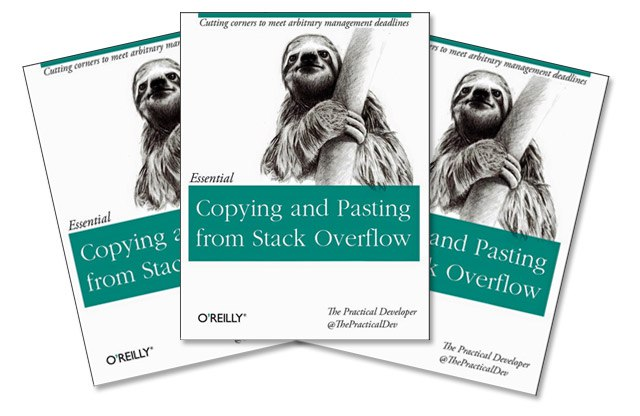
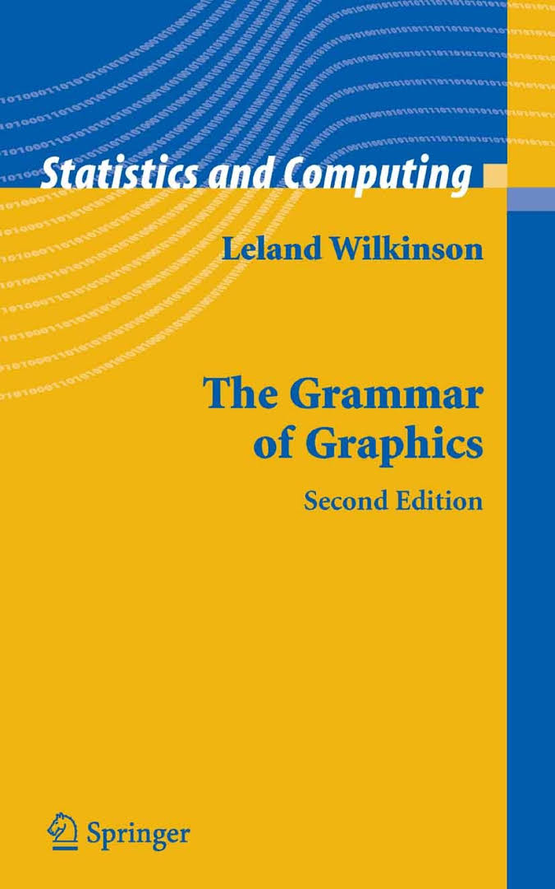

```{r setup, include=FALSE}
knitr::opts_chunk$set(echo = TRUE, warning = FALSE, message = FALSE)
```

# Введение

## Кто

- Поздняков Иван

- Выпускник МГУ (2014) и Вышки (2016)

- Работаю дата-аналитиком

- Cтарший преподаватель Школы Лингвистики НИУ ВШЭ

- Cognitive neuroscience, Digital Literary Studies

## Что

- Для тех, кто без опыта программирования: R с нуля

- Для тех, кто умеет в MATLAB, python: R-way

- Для тех, кто уже знает R: продвинутые фишки R

- И все это в едином потоке безумия

## Как

- Много практики (в т.ч. на данных)

- Задания разного уровня

- Да, будет тяжело

- Зато интересно!

## Linear Warriors, Quadratic Wizards


## Основы R


## Работа с данными в R

{width = 600}  

## Второй день{data-background="images/ramsay.jpg"}

## Третий день  

- Создание функций

- Функции семейства apply()

- Работа с пакетами

- Основы tidyverse

## Третий день: tidyverse


## Четвертый день

- Визуализация данных в ggplot2

## Четвертый день: ggplot2


# День первый

---


---



---


#День второй

## Бинарные vs текстовые файлы данных

Текстовые: 

- .csv = comma separated values

- .tsv = tab separated values

- .txt, .dat и так далее

Бинарные:

-  Excel formats (.xls, .xlsx)

## Бинарные vs текстовые файлы данных


#День третий  

## Функция `apply()`


## data.table vs tidyverse


#День четвертый 

## tidyverse


## dplyr::slice(), dplyr::filter()


## magrittr


## dplyr::select()


## dplyr::group_by(...) %>% summarise(...)


## dplyr::group_by(...) %>% mutate(...)


## "Широкий" формат

Студент |До курса по R     | После курса по R
--------|----------------  | ----------------
Маша    |70                | 63
Рома    |80                | 74
Антонина|86                | 71

## "Длинный" формат 

Студент |Время измерения   | Вес (кг)
--------|----------------  | ----------------
Маша    |До курса по R     | 70
Рома    |До курса по R     | 80
Антонина|До курса по R     | 86
Маша    |После курса по R  | 63
Рома    |После курса по R  | 74
Антонина|После курса по R  | 71

## Семейство функций *_join()


## Layered Grammar of Graphics



## Layered Grammar of Graphics


## ggplot2 basics

Слои (**Layers**):

- **Data** 

- Mapping (**aes**) 

- Statistical transformation (**stat**) 

- Geometric object (**geom**) 

- Position adjustment (**position**)


## ggplot2 basics

На одном графике можно соединять несколько слоев!

Кроме слоев, у графика есть: 

- **scale** 

- Coordinate system (**coord**) 

- Faceting (**facet**) 

- **theme** 

- Defaults:  
    + Data 
    + Mapping 
  

## Layered Grammar of Graphics

> "...In brief, the grammar tells us that a statistical graphic is a **mapping** from **data** to **aes**thetic attributes (colour, shape, size) of **geom**etric objects (points, lines, bars). The plot may also contain **stat**istical transformations of the data and is drawn on a specific **coord**inate system. **Facet**ting can be used to generate the same plot for different subsets of the dataset..." 
(Hadley Wickham, "ggplot2: Elegant Graphics for Data Analysis", 2016) 

---


---


## ggplot2 example: Pie Chart

```{r}
library(tidyverse)
got <- read_csv("data/character-deaths.csv")
```


---


```{r}
ggplot(data = got)
```

---

```{r}
ggplot(data = got) +
  geom_bar(aes(x = "", fill = as.factor(Gender)))
```

---

```{r}
ggplot(data = got) +
  geom_bar(aes(x = "", fill = as.factor(Gender)))+
  coord_polar(theta = "y")
```

---

```{r}
ggplot(data = got) +
  geom_bar(aes(x = "", fill = as.factor(Gender)))+
  coord_polar(theta = "y")+
  theme_void()
```


## ggplot2 example: Education and IQ meta-analysis

- Мета-анализ связи количества лет обучения и интеллект: *"How Much Does Education Improve Intelligence? A Meta-Analysis"* (Ritchie, Tucker-Drob, 2018)

- Данные и скрипт находятся в открытом доступе: https://osf.io/r8a24/

---


## ggplot2 extentions

- http://www.ggplot2-exts.org/gallery/

- `cowplot` - for publications

## plotly

- Dynamic visualization

- Using d3.js

## plotly example: scatterplot

```{r}
library(plotly)
data(diamonds)
diamonds <- diamonds[sample(nrow(diamonds), 1000),]
gg <- ggplot(data = diamonds)+
  geom_point(aes(x = carat, y = price, colour = price), alpha = 0.1)
```

---

```{r}
ggplotly(gg)
```

---

```{r}
plot_ly(diamonds, x = ~carat, y = ~price, color = ~carat, size = ~carat)
```

## Other html-widgets

http://gallery.htmlwidgets.org/

- `leaflet`
- `listviewer`
- `wordcloud2`
- `networkD3`

## RMarkdown


# Мерси за рыбу и пока!

