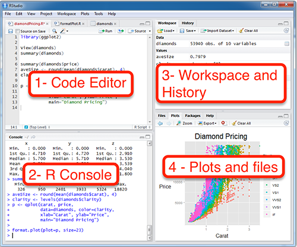
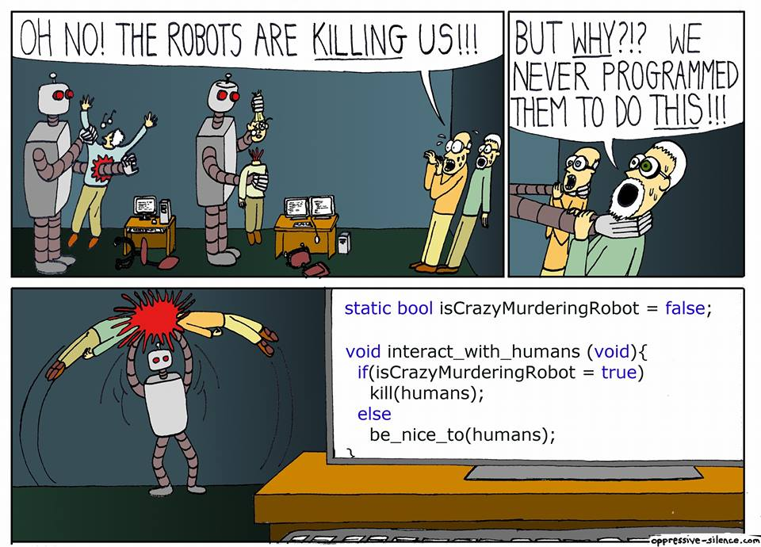
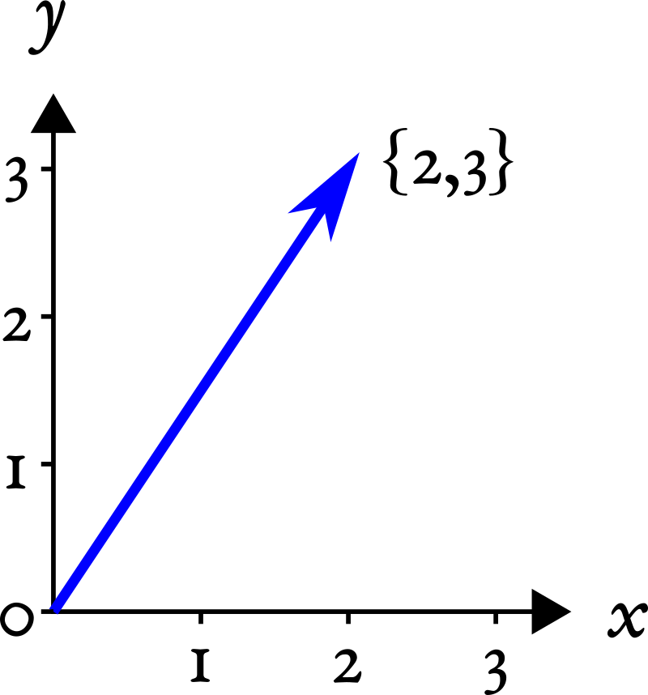
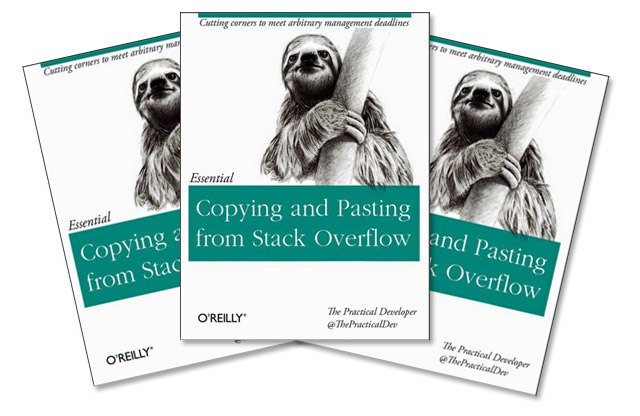
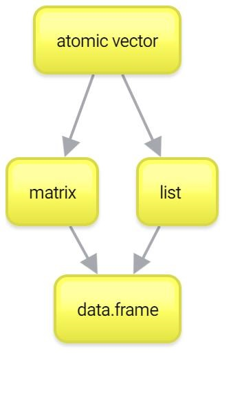
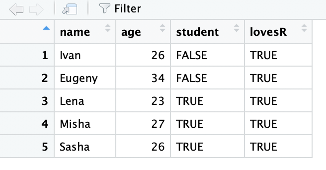
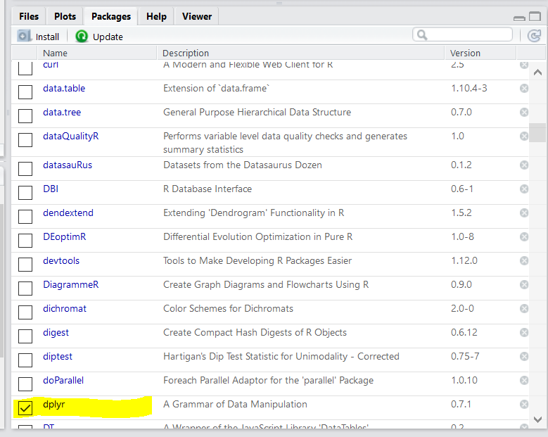
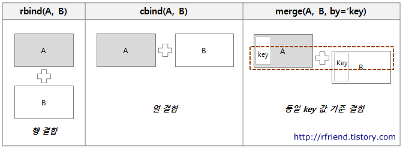

--- 
title: "A Minimal Book Example"
author: "Yihui Xie"
date: "`r Sys.Date()`"
site: bookdown::bookdown_site
documentclass: book
bibliography: [book.bib, packages.bib]
biblio-style: apalike
link-citations: yes
description: "This is a minimal example of using the bookdown package to write a book. The output format for this example is bookdown::gitbook."
---

# Prerequisites

This is a _sample_ book written in **Markdown**. You can use anything that Pandoc's Markdown supports, e.g., a math equation $a^2 + b^2 = c^2$.

The **bookdown** package can be installed from CRAN or Github:

```{r eval=FALSE}
install.packages("bookdown")
# or the development version
# devtools::install_github("rstudio/bookdown")
```

Remember each Rmd file contains one and only one chapter, and a chapter is defined by the first-level heading `#`.

To compile this example to PDF, you need XeLaTeX. You are recommended to install TinyTeX (which includes XeLaTeX): <https://yihui.name/tinytex/>.

```{r include=FALSE}
# automatically create a bib database for R packages
knitr::write_bib(c(
  .packages(), 'bookdown', 'knitr', 'rmarkdown'
), 'packages.bib')
```

<!--chapter:end:index.Rmd-->

# День 1. Основы R {#intro}

## Знакомимся с самым базовым {#very_base}

### Установка R и Rstudio {#install}

Для работы с R необходимо его сначала скачать и установить.

* R
    + [на Windows](https://cran.r-project.org/bin/windows/base/), найдите большую кнопку **Download R (номер версии) for Windows.**
    + [на Mac](https://cran.r-project.org/bin/macosx/), если маку меньше, чем 5 лет, то смело ставьте *.pkg файл с последней версией. Если старше, то поищите на той же странице версию для вашей системы.
    + [на Linux](https://cran.rstudio.com/bin/linux/), также можно добавить зеркало и установить из командной строки:
    
```
sudo apt-get install r-cran-base
```

В данной книге используется следующая версия R:

```{r}
sessionInfo()$R.version$version.string
```

После установки R необходимо скачать и установить RStudio:  

* [RStudio](https://www.rstudio.com/products/rstudio/download/)

Если вдруг что-то установить не получается (или же вы просто не хотите устанавливать на компьютер лишние программы), то можно работать в облаке, делая все то же самое в веб-браузере:

* [RStudio cloud](https://rstudio.cloud/)

Первый и вполне закономерный вопрос: зачем мы ставили R и отдельно еще какой-то RStudio?
Если опустить незначительные детали, то R --- это сам язык программирования, а RStudio --- это среда (IDE), которая позволяет в этом языке очень удобно работать. 

> RStudio --- это единственная среда для R, но, определенно, самая удобная на сегодняшний день, у нее практически нет конкурентов. Почти все пользуются именно ею и не стоит тратить время на поиск чего-то более удобного и лучшего. Если же вы привыкли работать с Jupyter Notebook

> Естественно, RStudio --- не единственная среда для R, но, определенно, самая крутая. Почти все пользуются именно ею и не стоит тратить время на поиск чего-то более удобного и лучшего. Если Вы привыкли к Jupyter Notebook, то здесь тоже есть ноутбуки (RNotebook --- хотя это и не совсем то же самое), но еще есть и кое-что покруче --- RMarkdown. И с этим мы тоже разберемся!   

### RStudio {#rstudio}


Так, давайте взглянем на то, что нам тут открылось:  

  

В первую очередь нас интересуют два окна: **1 - Code Editor** (окно для написания скриптов) [^open_editor] и **2 - R Console** (консоль). Здесь можно писать команды и запускать их. При этом работа в консоли и работа со скриптом немного различается. 

В **2 - R Console** вы пишите команду и запускаете ее нажиманием `Enter`. Иногда после запуска команды появляется какой-то результат. Если нажимать стрелку вверх на клавиатуре, то можно выводить в консоль предыдущие команды. Это очень удобно для запуска предыдущих команд с небольшими изменениями. 

В **1 - Code Editor** для запуска команды вы должны выделить ее и нажать `Ctrl` + `Enter` (`Cmd` + `Enter` на macOS). Если не нажать эту комбинацию клавиш, то команда не запустится. Можно выделить и запустить сразу несколько команд или даже все команды скрипта. Все команды скрипта можно выделить с помощью сочетания клавиш `Ctrl` + `A` на Windows и Linux, `Cmd` + `A` на macOS [^hot_keys]. Как только вы запустите команду (или несколько команд), соответствующие строчки кода появятся в **2 - R Console**, как будто бы вы запускали их прямо там.

Обычно в консоли удобно что-то писать, чтобы быстро что-то посчитать. Скрипты удобнее при работе с длинными командами и как способ сохранения написанного кода для дальнейшей работы. Для сохранения скрипта нажмите `File - Save As...`. R скрипты сохраняются с разрешением *.R*, но по своей сути это просто текстовые файлы, которые можно открыть и модифицировать в любом текстовом редакторе а-ля "Блокнот".  

[^open_editor]: При первом запуске RStudio вы не увидите это окно. Для того, чтобы оно появилось, нужно нажать `File - New File - R Script`.

[^hot_keys]: В RStudio есть много удобных сочетаний горячих клавиш. Чтобы посмотреть их все, нажмите `Help - Keyboard Shortcuts Help`. 

**3 - Workspace and History** --- здесь можно увидеть переменные. Это поле будет автоматически обновляться по мере того, как Вы будете запускать строчки кода и создавать новые переменные. Еще там есть вкладка с историей всех команд, которые были запущены.

**4 - Plots and files**. Здесь есть очень много всего. Во-первых, небольшой файловый менеджер, во-вторых, там будут появляться графики, когда вы будете их рисовать. Там же есть вкладка с вашими пакетами (`Packages`) и `Help` по функциям. Но об этом потом.  

### R как калькулятор  {#calc}

R --- полноценный язык программирования, который позволяет решать широкий спектр задач. Но в первую очередь R используется для анализа данных и статистических вычислений. Тем не менее, многими R до сих пор воспринимается как просто продвинутый калькулятор. Ну что ж, калькулятор, так калькулятор.

Давайте начнем с самого простого и попробуем использовать R как калькулятор с помощью арифметических операторов `+`, `-`, `*`, `/`, `^` (степень), `()` и т.д.

Просто запускайте в консоли пока не надоест:  

```{r}
40+2
3-2
5*6
99/9 #деление
2^3 #степень
13 %/% 3 #целочисленное деление
13 %% 3 #остаток от деления
```

Попробуйте самостоятельно посчитать что-нибудь с разными числами.

{width=400px}

Ничего сложного, верно? Вводим выражение и получаем результат.

Вы могли заметить, что некоторые команды у меня заканчиваются знаком решетки (`#`). Все, что написано в строчке после `#` игнорируется R при выполнении команды. Написанные команды в скрипте рекомендуется сопровождать комментариями, которые будут объяснять вам же в будущем (или кому-то еще), что конкретно происходит в соответствующем куске кода [^comment]. Кроме того, комментарии можно использовать в тех случаях, когда вы хотите написать кусок кода по-другому, не стирая полностью предыдущий код: достаточно "закомментить" нужные строчки - поставить `#` в начало каждой строки, которую вы хотите переписать. Для этого есть специальное сочетание горячих клавиш: `Ctrl` + `Shift` + `C` (`Cmd` + `Shift` + `C` на macOS) --- во всех выделенных строчках будет написан `#` в начале.

[^comment]: Во время написания кода вам может казаться понятным то, что вы написали, но при возвращении к коду через некоторое время вы уже не будете этого помнить. Старайтесь писать комментарии как можно чаще!

Согласно данным навязчивых рекламных баннеров в интернете, только 14% россиян могут справиться с этим примером:

```{r}
2 + 2 * 2
```

На самом деле, разные языки программирования ведут себя [по-разному](https://www.quora.com/Do-all-computer-languages-with-operator-precedence-use-the-same-operator-precedence) в таких ситуациях, поэтому ответ 6 (сначала умножаем, потом складываем) не так очевиден.

Порядок выполнения арифметических операций (т.е. приоритет операторов, *operator precedence*) в R как в математике, так что не забывайте про скобочки. 

```{r}
(2+2)*2
```

Если Вы не уверены в том, какие операторы имеют приоритет, то используйте скобочки, чтобы точно обозначить, в каком порядке нужно производить операции. Или же смотрите на таблицу приоритета операторов с помощью команды `?Syntax`.

###Функции{#func}

Давайте теперь извлечем корень из какого-нибудь числа. В принципе, тем, кто помнит школьный курс математики, возведения в степень вполне достаточно:

```{r}
16^0.5
```

Ну а если нет, то можете воспользоваться специальной **функцией**: это обычно какие-то буквенные символы с круглыми скобками сразу после названия функции. Мы подаем на вход (внутрь скобочек) какие-то данные, внутри этих функций происходят какие-то вычисления, которые выдает в ответ какие-то другие данные (или же функция записывает файл, рисует график и т.д.).

Вот, например, функция для корня:

```{r}
sqrt(16)
```

> R --- case-sensitive язык, т.е. регистр важен. SQRT(16) не будет работать.

А вот так выглядит функция логарифма:  

```{r}
log(8)
```

Так, вроде бы все нормально, но... Если Вы еще что-то помните из школьной математики, то должны понимать, что что-то здесь не так.  

Здесь не хватает основания логарифма!   

> Логарифм --- показатель степени, в которую надо возвести число, называемое основанием, чтобы получить данное число.  

То есть у логарифма 8 по основанию 2 будет значение 3:

$\log_2 8 = 3$

То есть если возвести 2 в степень 3 у нас будет 8:

$2^3 = 8$

Только наша функция считает все как-то не так.  

Чтобы понять, что происходит, нам нужно залезть в хэлп этой функции:  

```{r, eval = F}
?log
```

Справа внизу в RStudio появится вот такое окно:

{width=400px}


Действительно, у этой функции есть еще аргумент *`base =`*. По дефолту он равен числу Эйлера (`r exp(1)`...), т.е. функция считает натуральный логарифм. 
В большинстве функций R есть какой-то основной инпут --- данные в том или ином формате, а есть и дополнительные параметры, которые можно прописывать вручную, если параметры по умолчанию нас не устраивают.

```{r}
log(x = 8, base = 2)
```

...или просто (если Вы уверены в порядке переменных):

```{r}
log(8,2)
```

Более того, Вы можете использовать оутпут одних функций как инпут для других:  

```{r}
log(8, sqrt(4))
```

Отличненько. Мы еще много раз будем возвращаться к функциям. Вообще, функции --- это одна из важнейших штук в R (примерно так же как и в Python). Мы будем создавать свои функции, использовать функции как инпут для функций и многое-многое другое. В R очень крутые возможности работы с функциями. Поэтому подружитесь с функциями, они клевые.  

> Арифметические знаки, которые мы использовали: `+`, `-` , `/`, `^` и т.д. называются **операторами** и на самом деле тоже являются функциями:

```{r}
'+'(3, 4)
```


###Переменные  {#variables}

Важная штука в программировании на практически любом языке --- возможность сохранять значения в **переменных**. В R это обычно делается с помощью вот этих символов: `<-` (но можно использовать и обычное `=`, хотя это не очень принято). Для этого есть удобное сочетание клавиш: нажмите одновременно `Alt` +  `-` (или `option` + `-` на macOS).

```{r}
a <- 2
a
```

Заметьте, при присвоении результат вычисления не выводится в консоль! Если опустить детали, то обычно результат выполнения комманды либо выводится в консоль, либо записывается в переменную. 

После присвоения переменная появляется во вкладке **Environment** в RStudio:

{width=400px}

Можно использовать переменные в функциях и просто вычислениях:

```{r}
b <- a ^ a + a * a
b
log(b, a)
```

Вы можете сравнивать разные переменные:

```{r}
a == b
```

Заметьте, что сравнивая две переменные мы используем два знака равно `==`, а не один `=`. Иначе это будет означать присвоение.

```{r}
a = b
a
```

Теперь Вы сможете понять комикс про восстание роботов на следующей странице (пусть он и совсем про другой язык программирования)  

{width=400px}

Этот комикс объясняет, как важно не путать присваивание и сравнение *(хотя я иногда путаю до сих пор =( )*.

Иногда нам нужно проверить на *не*равенство:
```{r}
a <- 2
b <- 3

a==b
a!=b
```

Восклицательный язык в программировании вообще и в R в частности стандартно означает отрицание.

Еще мы можем сравнивать на больше/меньше:

```{r}
a > b
a < b
a >= b
a <= b
```

##Типы данных  {#data_types}

До этого момента мы работали только с числами (numeric):

```{r}
class(a)
```


> Вообще, в R много типов numeric: integer (целые), double (с десятичной дробью), complex (комплексные числа). Последние пишутся так: `complexnumber <- 2+2i`
> Однако в R с этим обычно можно вообще не заморачиваться, R сам будет конвертить между форматами при необходимости. Немного подробностей здесь:  

[Разница между numeric и integer](https://stackoverflow.com/questions/23660094/whats-the-difference-between-integer-class-and-numeric-class-in-r), [Как работать с комплексными числами в R](http://www.r-tutor.com/r-introduction/basic-data-types/complex)

Теперь же нам нужно ознакомиться с двумя другими важными типами данных в R:

1. **character**: строки символов. Они должны выделяться кавычками. Можно использовать как `"`, так и `'` (что удобно, когда строчка внутри уже содержит какие-то кавычки).

```{r}
s <- "Всем привет!"
s
class(s)
```

2. **logical**: просто `TRUE` или `FALSE`. 

```{r}
t1 <- TRUE
f1 <- FALSE

t1
f1
```
Вообще, можно еще писать `T` и `F` (но не `True` и `False`!)
```{r}
t2 <- T
f2 <- F
```

Это дурная практика, так как R защищает от перезаписи переменные `TRUE` и `FALSE`, но не защищает от этого `T` и `F`
```{r error=TRUE}
TRUE <- FALSE
TRUE
T <- FALSE
T
```

```{r, echo = FALSE}
rm(T)
```

Теперь вы можете догадаться, что результаты сравнения, например, числовых или строковых переменных вы можете сохранять в переменные тоже!

```{r}
comparison <- a == b
comparison
```

Это нам очень понадобится, когда мы будем работать с реальными данными: нам нужно будет постоянно вытаскивать какие-то данные из датасета, а это как раз и построено на игре со сравнением переменных.  

Чтобы этим хорошо уметь пользоваться, нам нужно еще освоить как работать с логическими операторами. Про один мы немного уже говорили --- это не (`!`):

```{r}
t1
!t1
!!t1 #Двойное отрицание!
```

Еще есть И (выдаст `TRUE` только в том случае если обе переменные `TRUE`):

```{r}
t1 & t2
t1 & f1
```

А еще ИЛИ (выдаст `TRUE` в случае если хотя бы одна из переменных `TRUE`):

```{r}
t1 | f1
f1 | f2
```

Поздравляю, мы только что разобрались с самой занудной (но очень важной!) частью.
Пора переходить к важному и интересному. ВЕКТОРАМ!

## Вектор  {#atomic}

Если у вас не было линейной алгебры (или у вас с ней было все плохо), то просто запомните, что **вектор** (**atomic vector** или просто **atomic**) --- это набор (столбик) чисел в определенном порядке.  

Если вы привыкли из школьного курса физики считать вектора стрелочками, то не спешите возмущаться и паниковать. Представьте стрелочки как точки из нуля координат {0,0} до какой-то точки на координатной плоскости, например, {2,3}:

{width=400px}

Вот последние два числа и будем считать вектором. Попытайтесь теперь мысленно стереть координатную плоскость и выбросить стрелочки из головы, оставив только последовательность чисел {2,3}:

{width=400px}

На самом деле, мы уже работали с векторами в R, но, возможно, вы об этом даже не догадывались. Дело в том, что в R нет как таковых скалярных (т.е. одиночных) значений, **есть вектора длиной 1**. Такие дела!

Чтобы создать вектор из нескольких значений, нужно воспользоваться функцией *`c()`*:

```{r}
c(4,8,15,16,23,42)
```

Создавать вектора можно не только из *numeric*, но также и из *character* и *logical*:

```{r}
c("Хэй", "Хэй", "Ха")
c(TRUE, FALSE)
```

>Одна из самых мерзких и раздражающих причин ошибок в коде --- это использование `с` из кириллицы вместо `c` из латиницы. Видите разницу? И я не вижу. А R видит.

Для создания числовых векторов есть удобный **оператор** `:`

```{r}
1:10
5:-3
```

Этот оператор создает вектор от первого числа до второго с шагом 1. Вы не представляете, как часто эта штука нам пригодится... Если же нужно сделать вектор с другим шагом, то есть функция `seq()`:

```{r}
seq(10,100, by = 10)
```

Кроме того, можно задавать не шаг, а длину вектора. Тогда шаг функция `seq()` посчитает сама:

```{r}
seq(1,13, length.out = 4)
```

Другая функция --- `rep()` --- позволяет создавать вектора с повторяющимися значениями. Первый аргумент --- значение, которое нужно повторять, а второй аргумент --- сколько раз повторять.

```{r}
rep(1, 5)
```

И первый, и второй аргумент могут быть векторами!

```{r}
rep(1:3, 3)
rep(1:3, 1:3)
```

Еще можно объединять вектора (что мы, по сути, и делали, просто с векторами длиной 1):
```{r}
v1 <- c("Hey", "Ho")
v2 <- c("Let's", "Go!")
c(v1, v2)
```

Очень многие функции в R работают именно с векторами. Например, функции `sum()` (считает сумму значений вектора) и `mean()` (считает среднее арифметическое всех значений в векторе):

```{r}
sum(1:10)
mean(1:10)
```

###Приведение типов {#coercion}

Что будет, если вы объедините два вектора с значениями разных типов? Ошибка? 

Мы уже обсуждали, что в *atomic* может быть только один тип данных. В некоторых языках программирования при операции с данными разных типов мы бы получили ошибку. А вот в R при несовпадении типов пройзойдет попытка привести типы к "общему знаменателю", то есть конвертировать данные в более "широкий" тип.

Например:  
```{r}
c(FALSE, 2)
```

`FALSE` превратился в `0` (а `TRUE` превратился бы в `1`), чтобы оба значения можно было объединить в вектор. То же самое произошло бы в случае операций с векторами:

```{r}
2 + TRUE
```

Это называется **неявным приведением типов (implicit coercion)**.

Вот более сложный пример:

```{r}
c(TRUE, 3, "Привет")
```

У R есть иерархия коэрсинга: 

`NULL < raw < logical < integer < double < complex < character < list < expression`. 

Мы из этого списка еще многого не знаем, сейчас важно запомнить, что логические данные --- `TRUE` и `FALSE` --- превращаются в `0` и `1` соответственно, а `0` и `1` в строчки `"0"` и `"1"`. 

Если Вы боитесь полагаться на приведение типов, то можете воспользоваться функциями `as.нужныйтипданных` для явного приведения типов (**explicit coercion**):

```{r}
as.numeric(c(T, F, F))
as.character(as.numeric(c(T, F, F)))
```

Можно превращать и обратно, например, строковые значения в числовые. Если среди числа встретится буква или другой неподходящий знак, то мы получим предупреждение `NA` --- пропущенное значение (мы очень скоро научимся с ними работать).

```{r}
as.numeric(c("1", "2", "три"))
```

> Один из распространенных примеров использования неявного приведения типов --- использования функций `sum()` и `mean()` для подсчета в логическом векторе количества и доли `TRUE` соответсвенно. Мы будем много раз пользоваться этим приемом в дальнейшем!

###Векторизация {#vector_op}

Все те арифметические операторы, что мы использовали ранее, можно использовать с векторами одинаковой длины:

```{r}
n <- 1:4
m <- 4:1
n + m
n - m
n * m
n / m
n ^ m + m * (n - m)
```

Если применить операторы на двух векторах одинаковой длины, то в мы получим результат поэлементного применения оператора к двум векторам. Это называется **векторизацией** (**vectorization**).

> Если после какого-нибудь MATLAB Вы привыкли, что по умолчанию операторы работают по правилам линейной алгебры и `m*n` будет давать скалярное произведение (*dot product*), то снова нет. Для скалярного произведения нужно использовать операторы с `%` по краям:  

```{r}
n %*% m
```

> Абсолютно так же и с операциями с матрицами в R, хотя про матрицы будет немного позже.  

В принципе, большинство функций в R, которые работают с отдельными значениями, так же хорошо работают и с целыми векторами. Скажем, Вы хотите извлечь корень из нескольких чисел, для этого не нужны никакие циклы (как это обычно делается в других языках программирования). Можно просто "скормить" вектор функции и получить результат применения функции к каждому элементу вектора:

```{r}
sqrt(1:10)
```

Таких векторизованных функций в R очень много. Многие из них написаны на более низкоуровневых языках программирования (C, C++, FORTRAN), за счет чего использование таких функций приводит не только к более элегантному, лаконичному, но и к более быстрому коду.

> Векторизация в R --- это очень важная фишка, которая отличает этот язык программирования от многих других. Если вы уже имеете опыт программирования на другом языке, то вам во многих задачах захочется использовать циклы типа `for` и `while` \@ref(for). Не спешите этого делать! В очень многих случаях циклы можно заменить векторизацией. Тем не менее, векторизация --- это не единственный способ избавить от циклов типа `for` и `while` \@ref(apply).

###Recycling {#recycling}

Допустим мы хотим совершить какую-нибудь операцию с двумя векторами. Как мы убедились, с этим обычно нет никаких проблем, если они совпадают по длине. А что если вектора не совпадают по длине? 
Ничего страшного! Здесь будет работать правило **ресайклинга** (*правило переписывания, recycling rule*). Это означает, что если мы делаем операцию на двух векторах разной длины, то если короткий вектор кратен по длине длинному, короткий вектор будет повторяться необходимое количество раз:

```{r}
n <- 1:4
m <- 1:2
n * m
```

А что будет, если совершать операции с вектором и отдельным значением? Можно считать это частным случаем ресайклинга: короткий вектор длиной 1 будет повторятся столько раз, сколько нужно, чтобы он совпадал по длине с длинным:

```{r}
n * 2
```

Если же меньший вектор не кратен большему (например, один из них длиной 3, а другой длиной 4), то R посчитает результат, но выдаст предупреждение. 

```{r}
n + c(3,4,5)
```

Проблема в том, что эти предупреждения могут в неожиданный момент стать причиной ошибок. Поэтому не стоит полагаться на ресайклинг некратных по длине векторов. [См. здесь](https://stackoverflow.com/questions/6555651/under-what-circumstances-does-r-recycle). А вот ресайклинг кратных по длине векторов --- это очень удобная штука, которая используется очень часто. 

###Индексирование векторов {#index_atomic}  

Итак, мы подошли к одному из самых сложных моментов. И одному из основных. От того, как хорошо вы научись с этим работать, зависит весь ваш дальнейший успех на R-поприще!

Речь пойдет об **индексировании** векторов. Задача, которую Вам придется решать каждые пять минут работы в R --- как выбрать из вектора (или же списка, матрицы и датафрейма) какую-то его часть. Для этого используются квадратные скобочки `[]` (не круглые --- они для функций!).  

Самое простое --- индексировать по номеру индекса, т.е. порядку значения в векторе. 

```{r}
n <- 1:10
n[1]
n[10]
```

> Если вы знакомы с другими языками программирования (не MATLAB, там все так же) и уже научились думать, что индексация с 0 --- это очень удобно и очень правильно (ну или просто свыклись с этим), то в R Вам придется переучиться обратно. Здесь первый индекс --- это 1, а последний равен длине вектора --- ее можно узнать с помощью функции `length()`. С обоих сторон индексы берутся включительно.   

С помощью индексирования можно не только вытаскивать имеющиеся значения в векторе, но и присваивать им новые:

```{r}
n[3] <- 20
n
```

Конечно, можно использовать целые векторы для индексирования:

```{r}
n[4:7]
n[10:1]
```

Индексирование с минусом выдаст вам все значения вектора кроме выбранных:

```{r}
n[-1]
n[c(-4, -5)]
```

Более того, можно использовать логический вектор для индексирования. В этом случае нужен логический вектор такой же длины:

```{r}
n[c(T,F,T,F,T,F,T,F,T,F)]
```

Ну а если они не равны, то тут будет снова работать правило ресайклинга! 

```{r}
n[c(T,F)] #то же самое - recycling rule!
```

Есть еще один способ индексирования векторов, но он несколько более редкий: индексирование по имени. Дело в том, что для значений векторов можно (но не обязательно) присваивать имена:

```{r}
my_named_vector <- c(first = 1, second = 2, third = 3)
my_named_vector['first']
```

А еще можно "вытаскивать" имена из вектора с помощью функции `names()` и присваивать таким образом новые.

```{r}
d <- 1:4
names(d) <- letters[1:4]
d["a"]
```

> `letters` --- это "зашитая" в R константа --- вектор букв от a до z. Иногда это очень удобно! Кроме того, есть константа `LETTERS` --- то же самое, но заглавными буквами. А еще есть названия месяцев на английском и числовая константа `pi`.  

Теперь посчитаем среднее вектора `n`:

```{r}
mean(n)
```

А как вытащить все значения, которые больше среднего?  

Сначала получим логический вектор --- какие значения больше среднего:  

```{r}
larger <- n>mean(n)
larger
```

А теперь используем его для индексирования вектора `n`:  

```{r}
n[larger]
```

Можно все это сделать в одну строчку:  

```{r}
n[n>mean(n)]
```

Предыдущая строчка отражает то, что мы будем постоянно делать в R: вычленять (subset) из данных отдельные куски на основании разных условий.   

### NA - пропущенные значения  {#na} 

В реальных данных у нас часто чего-то не хватает. Например, из-за технической ошибки или невнимательности не получилось записать какое-то измерение. Для этого в R есть `NA` (расшифровывается как *Not Available* - недоступное значение). `NA` --- это не строка `"NA"`, не `0`, не пустая строка `""` и не `FALSE`. `NA` --- это `NA`.
Большинство операций с векторами, содержащими `NA` будут выдавать `NA`:

```{r}
missed <- NA
missed == "NA"
missed == ""
missed == NA
```

Заметьте: даже сравнение `NA`  c  `NA` выдает `NA`!

Иногда `NA` в данных очень бесит:

```{r}
n[5] <- NA
n
mean(n)
```

Что же делать?  
Наверное, надо сравнить вектор с `NA` и исключить этих пакостников. Давайте попробуем:

```{r}
n == NA
```

Ах да, мы ведь только что узнали, что даже сравнение `NA` c `NA` приводит к `NA`...

Чтобы выбраться из этой непростой ситуации, используйте функцию `is.na()`:

```{r}
is.na(n)
```

Результат выполнения `is.na(n)` выдает `FALSE` в тех местах, где у нас числа и `TRUE` там, где у нас `NA`. Нам нужно сделать наоборот. Здесь нам понадобится оператор `!` (мы его уже встречали), который инвертирует логические значения:

```{r}
n[!is.na(n)]
```

Ура, мы можем считать среднее!

```{r}
mean(n[!is.na(n)])
```

Теперь Вы понимаете, зачем нужно отрицание (`!`)
 
Вообще, есть еще один из способов посчитать среднее, если есть `NA`. Для этого надо залезть в хэлп по функции *mean()*:

```{r, eval = F}
?mean()
```

В хэлпе мы найдем параметр `na.rm =`, который по дефолту `FALSE`. Вы знаете, что нужно делать!

```{r}
mean(n, na.rm = T)
```

Еееее!  

> `NA` может появляться в векторах других типов тоже. Более того, на самом деле, это все разные `NA`: логический `NA`, `NA_integer_`, `NA_real_`, `NA_complex_` and `NA_character_`. 

> Кроме `NA` есть еще `NaN` --- это разные вещи. `NaN` расшифровывается как *Not a Number* и получается в результате таких операций как `0 / 0`. Тем не менее, функция `is.na()` выдает `TRUE` на `NaN`, а вот функция `is.nan()` выдает `TRUE` на `NaN` и `FALSE` на `NA`:

```{r}
is.na(NA)
is.na(NaN)
is.nan(NA)
is.nan(NaN)
```


###В любой непонятной ситуации --- гуглите  {#google}

Если вдруг вы не знаете, что искать в хэлпе, или хэлпа попросту недостаточно, то... гуглите!

{width=400px}

Нет ничего постыдного в том, чтобы гуглить решения проблем. Это абсолютно нормально. Используйте силу интернета во благо и да помогут Вам *Stackoverflow*[^stack] и бесчисленные R-туториалы! 

[^stack]: Stackoverflow --- это сайт с вопросами и ответами. Эдакий аналог *Quora*, *The Question*, ну или *Ответы Mail.ru* в мире программирования.

<blockquote class="twitter-tweet" data-lang="en"><p lang="en" dir="ltr">Computer Programming To Be Officially Renamed “Googling Stack Overflow”<br><br>Source: <a href="http://t.co/xu7acfXvFF">http://t.co/xu7acfXvFF</a> <a href="http://t.co/iJ9k7aAVhd">pic.twitter.com/iJ9k7aAVhd</a></p>&mdash; Stack Exchange (@StackExchange) <a href="https://twitter.com/StackExchange/status/623139544276299776?ref_src=twsrc%5Etfw">July 20, 2015</a></blockquote> <script async src="https://platform.twitter.com/widgets.js" charset="utf-8"></script> 

{width=400px}

Главное, помните: загуглить работающий ответ всегда недостаточно. Надо понять, как и почему решение работает. Иначе что-то обязательно пойдет не так. 

Кроме того, правильно загуглить проблему --- не так уж и просто.

<blockquote class="twitter-tweet" data-lang="en"><p lang="en" dir="ltr">Does anyone ever get good at R or do they just get good at googling how to do things in R</p>&mdash; 🔬🖤Lauren M. Seyler, Ph.D.❤️⚒ (@mousquemere) <a href="https://twitter.com/mousquemere/status/1125522375141883907?ref_src=twsrc%5Etfw">May 6, 2019</a></blockquote> <script async src="https://platform.twitter.com/widgets.js" charset="utf-8"></script> 

Итак, с векторами мы более-менее разобрались. Помните, что вектора --- это один из краеугольных камней вашей работы в R. Если вы хорошо с ними разобрались, то дальше все будет довольно несложно. Тем не менее, вектора --- это не все. Есть еще два важных типа данных: списки (**list**) и матрицы (**matrix**). Их можно рассматривать как своеобразное "расширение" векторов, каждый в свою сторону. Ну а списки и матрицы нужны чтобы понять основной тип данных в R --- **data.frame**.  

{width=400px}


##Матрицы (matrix){#matrix}

Если вдруг вас пугает это слово, то совершенно зря. Матрица --- это всего лишь "двумерный" вектор: вектор, у которого есть не только длина, но и ширина. Создать матрицу можно с помощью функции `matrix()` из вектора, указав при этом количество строк и столбцов.

```{r}
A <- matrix(1:20, nrow=5,ncol=4)
A
```

Если мы знаем сколько значений в матрице и сколько мы хотим строк, то количество столбцов указывать необязательно:

```{r}
A <- matrix(1:20, nrow=5)
A
```

Все остальное так же как и с векторами: внутри находится данные только одного типа. Поскольку матрица --- это уже двумерный массив, то у него имеется два индекса. Эти два индекса разделяются запятыми.

```{r}
A[2,3]
A[2:4, 1:3]
```

Первый индекс --- выбор строк, второй индекс --- выбор колонок. Если же мы оставляем пустое поле вместо числа, то мы выбираем все строки/колонки в зависимости от того, оставили мы поле пустым до или после запятой:  

```{r}
A[, 1:3]
A[2:4, ]
A[, ]
```

Так же как и в случае с обычными векторами, часть матрицы можно переписать:

```{r}
A[2:4, 2:4] <- 100
A
```

В принципе, это все, что нам нужно знать о матрицах. Матрицы используются в R довольно редко, особенно по сравнению, например, с MATLAB. Но вот индексировать матрицы хорошо бы уметь: это понадобится в работе с датафреймами.

> То, что матрица --- это просто двумерный вектор, не является метафорой: в R матрица --- это по сути своей вектор с дополнительными *атрибутами* `dim` и (опционально) `dimnames`. Атрибуты --- это свойства объектов, своего рода "метаданные". Для всех объектов есть обязательные атрибуты типа и длины и могут быть любые необязательные атрибуты. Можно задавать свои атрибуты или удалять уже присвоенные: удаление атрибута `dim` у матрицы превратит ее в обычный вектор. Про атрибуты подробнее можно почитать [здесь](https://perso.esiee.fr/~courivad/R/06-objects.html) или на стр. 99-101 книги "R in a Nutshell" [@adler2010r].

##Списки (list){#list}

Теперь представим себе вектор без ограничения на одинаковые данные внутри. И получим список!

```{r}
l <- list(42, "Пам пам", T)
l
```

А это значит, что там могут содержаться самые разные данные, в том числе и другие списки и векторы!  

```{r}
lbig <- list(c("Wow", "this", "list", "is", "so", "big"), "16", l)
lbig
```

Если у нас сложный список, то есть очень классная функция, чтобы посмотреть, как он устроен, под названием `str()`:  

```{r}
str(lbig)
```

> Представьте, что список - это такое дерево с ветвистой структурой. А на конце этих ветвей - листья-векторы.

Как и в случае с векторами мы можем давать имена элементам списка:  

```{r}
namedl <- list(age = 24, PhDstudent = T, language = "Russian")
namedl
```

К списку можно обращаться как с помощью индексов, так и по именам. Начнем с последнего:  

```{r}
namedl$age
```

А вот с индексами сложнее, и в этом очень легко запутаться. Давайте попробуем сделать так, как мы делали это раньше:  
```{r}
namedl[1]
```

Мы, по сути, получили элемент списка --- просто как часть списка, т.е. как список длиной один:  

```{r}
class(namedl)
class(namedl[1])
```

А вот чтобы добраться до самого элемента списка (и сделать с ним что-то хорошее) нам нужна не одна, а две квадратных скобочки:  

```{r}
namedl[[1]]
class(namedl[[1]])
```

<blockquote class="twitter-tweet" data-lang="en"><p lang="en" dir="ltr">Indexing lists in <a href="https://twitter.com/hashtag/rstats?src=hash&amp;ref_src=twsrc%5Etfw">#rstats</a>. Inspired by the Residence Inn <a href="http://t.co/YQ6axb2w7t">pic.twitter.com/YQ6axb2w7t</a></p>&mdash; Hadley Wickham (@hadleywickham) <a href="https://twitter.com/hadleywickham/status/643381054758363136?ref_src=twsrc%5Etfw">September 14, 2015</a></blockquote> <script async src="https://platform.twitter.com/widgets.js" charset="utf-8"></script> 


Как и в случае с вектором, к элементу списка можно обращаться по имени.

```{r list}
namedl[['age']]
```

Хотя последнее --- практически то же самое, что и использование знака $.

> Списки довольно часто используются в R, но реже, чем в Python. Со многими объектами в R, такими как результаты статистических тестов, удобно работать именно как со списками --- к ним все вышеописанное применимо. Кроме того, некоторые данные мы изначально получаем в виде древообразной структуры --- хочешь не хочешь, а придется работать с этим как со списком. Но обычно после этого стоит как можно скорее превратить список в датафрейм.

##Data.frame  {#df}

Итак, мы перешли к самому главному. Самому-самому. Датафреймы (**data.frames**). Более того, сейчас станет понятно, зачем нам нужно было разбираться со всеми предыдущими темами.

Без векторов мы не смогли бы разобраться с матрицами и списками. А без последних мы не сможем понять, что такое датафрейм.  

```{r}
name <- c("Ivan", "Eugeny", "Lena", "Misha", "Sasha") 
age <- c(26, 34, 23, 27, 26) 
student <- c(F, F, T, T, T) 
df <- data.frame(name, age, student)  
df
str(df)
```

Вообще, очень похоже на список, не правда ли? Так и есть, датафрейм --- это что-то вроде проименованного списка, каждый элемент которого является *atomic* вектором фиксированной длины. Скорее всего, список Вы представляли "горизонтально". Если это так, то теперь "переверните" его у себя в голове на 90 градусов. Так, чтоб названия векторов оказались сверху, а колонки стали столбцами. Поскольку длина всех этих векторов равна (обязательное условие!), то данные представляют собой табличку, похожую на матрицу. Но в отличие от матрицы, разные столбцы могут имет разные типы данных: первая колонка --- `character`, вторая колонка --- `numeric`, третья колонка --- `logical`. Тем не менее, обращаться с датафреймом можно и как с проименованным списком, и как с матрицей:  

```{r}
df$age[2:3]
```

Здесь мы сначала вытащили колонку `age` с помощью оператора `$`. Результатом этой операции является числовой вектор, из которого мы вытащили кусок, выбрав индексы `2` и `3`.

Используя оператор `$` и присваивание можно создавать новые колонки датафрейма:  

```{r}
df$lovesR <- T #правило recycling - узнали? 
df
```

Ну а можно просто обращаться с помощью двух индексов через запятую, как мы это делали с матрицей:

```{r}
df[3:5, 2:3]
```

Как и с матрицами, первый индекс означает строчки, а второй --- столбцы.

А еще можно использовать названия колонок внутри квадратных скобок:

```{r}
df[1:2,"age"]
```

И здесь перед нами открываются невообразимые возможности! Узнаем, любят ли R те, кто моложе среднего возраста в группе:

```{r}
df[df$age < mean(df$age), 4]
```

Эту же задачу можно выполнить другими способами:

```{r dataframe}
df$lovesR[df$age < mean(df$age)]
df[df$age < mean(df$age), 'lovesR']
```

В большинстве случаев подходят сразу несколько способов --- тем не менее, стоит овладеть ими всеми.

Датафреймы удобно просматривать в RStudio. Для это нужно написать команду `View(df)` или же просто нажать на названии нужной переменной из списка вверху справа (там где Environment). Тогда увидите табличку, очень похожую на Excel и тому подобные программы для работы с таблицами. Там же есть и всякие возможности для фильтрации, сортировки и поиска...[^modify]

{width=200}

Но, конечно, интереснее все эти вещи делать руками, т.е. с помощью написания кода.

[^modify]: Все, что вы нажмете в этом окошке, никак не повлияет на исходную переменную. Так что можете смело использовать эти функции для исследования содержимого датафрейма.

На этом пора заканчивать с введением и приступать к работе с реальными данными.


##Начинаем работу с реальными данными {#real_data}  

Итак, пришло время перейти к реальным данным. Мы начнем с использования датасета (так мы будем называть любой набор данных) по Игре Престолов, а точнее, по книгам цикла *"Песнь льда и пламени"* Дж. Мартина. Да, будут спойлеры, но сериал уже давно закончился и сильно разошелся с книгами...

###Рабочая папка и проекты {#wd}

Для начала скачайте файл по [ссылке](https://raw.githubusercontent.com/Pozdniakov/stats/master/data/character-deaths.csv)

Он, скорее всего, появился у Вас в папке "Загрузки". Если мы будем просто пытаться прочитать этот файл (например, с помощью `read.csv()`  --- мы к этой функцией очень скоро перейдем), указав его имя и разрешение, то наткнемся на такую ошибку:


```{r, error=TRUE}
read.csv("character-deaths.csv")
```

Это означает, что R не может найти нужный файл. Вообще-то мы даже не сказали, где искать. Нам нужно как-то совместить место, где R ищет загружаемые файлы и сами файлы. Для этого есть несколько способов.

- Магомет идет к горе: *перемещение файлов в рабочую папку.*

Для этого нужно узнать, какая папка является рабочей с помощью функции `getwd()` (без аргументов), найти эту папку в проводнике и переместить туда файл. После этого можно использовать просто название файла с разрешением:

```{r, eval = FALSE}
got <- read.csv("character-deaths.csv")
```

- Гора идет к Магомету: *изменение рабочей папки.*

Можно просто сменить рабочую папку с помощью `setwd()` на ту, где сейчас лежит файл, прописав путь до этой папки. Теперь файл находится в рабочей папке:

```{r, eval = FALSE}
got <- read.csv("character-deaths.csv")
```

Этот вариант использовать не рекомендуется. Как минимум, это сразу делает невозможным запустить скрипт на другом компьютере.

- Гора находит Магомета по месту прописки: *указание полного пути файла.*

```{r, eval = FALSE}
got <- read.csv("/Users/Username/Some_Folder/character-deaths.csv")
```

Этот вариант страдает теми же проблемами, что и предыдущий, поэтому тоже не рекомендуется. 

> Для пользователей Windows есть дополнительная сложность: знак `/` является особым знаком для R, поэтому вместо него нужно использовать двойной `//`.

- Магомет использует кнопочный интерфейс: *Import Dataset.*

Во вкладке Environment справа в окне RStudio есть кнопка *Import Dataset*. Возможно, у Вас возникло непреодолимое желание отдохнуть от написания кода и понажимать кнопочки --- сопротивляйтесь этому всеми силами, но не вините себя, если не сдержитесь.  

- Гора находит Магомета *в интернете.* 

Многие функции в R, предназначенные для чтения файлов, могут прочитать файл не только на Вашем компьютере, но и сразу из интернета. Для этого просто используйте ссылку вместо пути:

```{r import}
got <- read.csv("https://raw.githubusercontent.com/Pozdniakov/stats/master/data/character-deaths.csv")
```

- Каждый Магомет получает по своей горе: *использование проектов в RStudio.*

`File - New Project...`, Затем `New Directory`, `New Project`, выбираете подходящее `Directory Name` и нажимаете `Create Project`.

На первый взгляд это кажется чем-то очень сложным, но это не так. Пользоваться проектами очень просто и ОЧЕНЬ удобно. При создании проекта создается отдельная папочка, где у Вас лежат данные, хранятся скрипты, вспомогательные файлы и отчеты. Если нужно вернуться к другому проекту --- просто открываете другой проект, с другими файлами и скриптами. Это еще помогает не пересекаться переменным из разных проектов --- а то, знаете, использование двух переменных `data` в разных скриптах чревато ошибками. Поэтому очень удобным решением будет выделение отдельного проекта под этот курс.

> А еще проекты очень удобно работают совместно с системами контроля версий, в частности, с Git. В RStudio есть для этого удобные инструменты. Самый простой способ --- при создании проекта `File - New Project...` выбрать `Version Control`, затем выбрать Git или Subversion и указать ссылку на репозиторий. После этого RStudio его склонирует и все сам настроит. Вот [здесь](https://happygitwithr.com) есть подробный туториал по работе с Git и RStudio.

###Импорт данных  {#import}

Как Вы уже поняли, импортирование данных --- одна из самых муторных и неприятных вещей в R. Если у Вас получится с этим справиться, то все остальное --- ерунда. Мы уже разобрались с первой частью этого процесса --- нахождением файла с данными, осталось научиться их читать.  

Здесь стоит сделать небольшую ремарку. Довольно часто данные представляют собой табличку. Или же их можно свести к табличке. Такая табличка, как мы уже выяснили, удобно репрезентируется в виде датафрейма. Но как эти данные хранятся на компьютере? Есть два варианта: в *бинарном* и в *текстовом* файле.

Текстовый файл означает, что такой файл можно открыть в программе "Блокнот" или ее аналоге и увидеть напечатанный текст: скрипт, роман или упорядоченный набор цифр и букв. Нас сейчас интересует именно последний случай. Таблица может быть представлена как текст: отдельные строчки в файле будут разделять разные строчки таблицы, а какой-нибудь знак-разделитель отделет колонки друг от друга.

Для чтения данных из текстового файла есть довольно удобная функция `read.table()`. Почитайте хэлп по ней и ужаснитесь: столько разных параметров на входе! Но там же вы увидете функции `read.csv()`, `read.csv2()` и некоторые другие --- по сути, это тот же `read.table()`, но с другими дефолтными параметрами, соответствующие формату файла, который мы загружаем. В данном случае используется формат .csv, что означает *Comma Separated Values* (Значения, Разделенные Запятыми). Это просто текстовый файл, в котором "закодирована" таблица: разные строчки разделяют разные строчки таблицы, а столбцы отделяются запятыми. С этим связана одна проблема: в некоторых странах (в т.ч. и России) принято использовать запятую для разделения дробной части числа, а не точку, как это делается в большинстве стран мира. Поэтому есть "другой" формат .csv, где значения разделены точкой с запятой (`;`), а дробные значения --- запятой (`,`). В этом и различие функций `read.csv()` и `read.csv2()` --- первая функция предназначена для "международного" формата, вторая --- для (условно) "Российского".  

В первой строчке обычно содержатся названия столбцов --- и это чертовски удобно, функции `read.csv()` и `read.csv2()` по умолчанию считают первую строчку именно как название для колонок.  

Итак, прочитаем наш файл. Для этого используем только параметр `file = `, который идет первым, и для параметра `stringsAsFactors = ` поставим значение `FALSE`:  

```{r, eval = FALSE}
got <- read.csv("data/character-deaths.csv", stringsAsFactors = FALSE)
```

> По умолчанию, функции семейства `read.table()` читают *character* переменные как фактор (*factor*). По сути, факторы --- это примерно то же самое, что и character, но закодированные числами. Когда-то это было придумано для экономии используемых времени и памяти: вместо того, чтобы хранить многократно "male" и "female", можно закодировать их числами 1 и 2, записав отдельно, как расшифровывается 1 и 2. На сегодняшний день факторы обычно становится просто лишней морокой, хотя факторы могут быть удобным инструментом для контроля порядка значений при визуализации данных. Некоторые функции требуют именно *character*, некоторые *factor*, в большинстве случаев это без разницы. Но иногда непонимание может привести к дурацким ошибкам. В данном случае мы просто пока обойдемся без факторов.

Можете проверить с помощью `View(got)`: все работает! Если же вылезает какая-то странная ерунда или же просто ошибка --- попробуйте другие функции и покопаться с параметрами. Для этого читайте *Help.* 

Кроме .csv формата есть и другие варианты хранения таблиц в виде текста. Например, .tsv
 --- тоже самое, что и .csv,  но разделитель --- знак табуляции. Для чтения таких файлов есть функция  `read.delim()`  и `read.delim2()`. Впрочем, даже если бы ее и не было, можно было бы просто подобрать нужные параметры для функции `read.table()`. Есть даже функции (например, `fread()` из пакета  `data.table` --- мы ее будем использовать завтра!), которые пытаются сами "угадать" нужные параметры для чтения --- часто они справляются с этим довольно удачно. Но не всегда. Поэтому стоит научиться справляться с любого рода данными на входе.
 
Тем не менее, далеко не всегда таблицы представлены в виде текстового файла. Самый распространенный пример таблицы в бинарном виде --- родные форматы *Microsoft Excel*. Если Вы попробуете открыть .xlsx  файл в Блокноте, то увидите кракозябры. Это делает работу с этим файлами гораздо менее удобной, поэтому стоит избегать экселевских форматов и стараться все сохранять в .csv.

> Для работы с экселевскими файлами есть много пакетов: *readxl, xlsx, openxlsx.* Для чтения файлов *SPSS, Stata, SAS* есть пакет *foreign*. Что такое пакеты и как их устанавливать мы изучим позже. 

<!--chapter:end:01-intro.Rmd-->

# День 2. Работа с реальными данными в R {#real}

##Препроцессинг данных в R {#prep}

Вчера мы узнали про основы языка R, про то, как работать с векторами, списками, матрицами и, наконец, датафреймами. Мы закончили день на загрузке данных, с чего мы и начнем сегодня:

```{r day2}
got <- read.csv("data/character-deaths.csv", stringsAsFactors = FALSE)
```

После загрузки данных стоит немного "осмотреть" получившийся датафрейм `got`.

###Исследование данных  {#explore}

Ок, давайте немного поизучаем датасет. Обычно мы привыкли глазами пробегать по данным, листая строки и столбцы - и это вполне правильно и логично, от этого не нужно отучаться. Но мы можем дополнить наш базовый зрительнопоисковой инструментарий несколькими полезными командами.  

Во-первых, вспомним другую полезную функцию `str()`:
```{r}
str(got)
```

Давайте разберемся с переменными в датафрейме:

Колонка `Name` - здесь все понятно. Важно, что эти имена записаны абсолютно по-разному: где-то с фамилией, где-то без, где-то в скобочках есть пояснения. Колонка `Allegiances` - к какому дому принадлежит персонаж. С этим сложно, иногда они меняют дома, здесь путаются сами семьи и персонажи, лояльные им. Особой разницы между `Stark` и `House Stark` нет.  Следующие колонки - `Death Year`, `Book.of.Death`, `Death.Chapter`, `Book.Intro.Chapter` - означают номер главы, в которой персонаж впервые появляется, а так же номер книги, глава и год (от завоевания Вестероса Эйгоном Таргариеном), в которой персонаж умирает. `Gender` - `1` для мужчин, `0` для женщин. `Nobility` - дворянское происхождение персонажа. Последние 5 столбцов содержат информацию, появлялся ли персонаж в книге (всего книг пока что 5).   

Другая полезная функция для больших таблиц - функция `head()`: она выведет первые несколько (по дефолту 6) строчек датафрейма.

```{r}
head(got)
```

Есть еще функция `tail()`. Догадайтесь сами, что она делает.

Для некоторых переменных полезно посмотреть таблицы частотности с помощью функции `table()`:

```{r}
table(got$Allegiances)
```

Уау! Очень просто и удобно, не так ли? Функция `table()` может принимать сразу несколько столбцов. Это удобно для получения *таблиц сопряженности*:

```{r}
table(got$Allegiances, got$Gender)
```

###Subsetting  {#subset}
 
Как мы обсуждали на прошлом занятии, мы можем сабсеттить (т.е. выделять часть датафрейма) датафрейм, обращаясь к нему и как к матрице: *датафрейм[вектор_с_номерами_строк, вектор_с_номерами_колонок]*

```{r}
got[100:115, 1:2]
```

и используя имена колонок:

```{r}
got[508:515, "Name"]
```

и даже используя вектора названий колонок!

```{r}
got[508:515, c("Name", "Allegiances", "Gender")]
```

Мы можем вытаскивать отдельные колонки как векторы:  

```{r}
houses <- got$Allegiances
unique(houses) #посмотреть все уникальные значения - почти как с помощью table()
```

Итак, давайте решим нашу первую задачу - вытащим в отдельный датасет всех представителей Ночного Дозора.
Для этого нам нужно создать вектор логических значений - результат сравнений колонки `Allegiances` со значением `"Night's Watch"` и использовать его как вектор индексов для датафрейма.

```{r}
vectornight <- got$Allegiances == "Night's Watch"
head(vectornight)
```

Теперь этот вектор с `TRUE` и `FALSE` нам надо использовать для индексирования строк. Но что со столбцами? Если мы хотем сохранить все столбцы, то после запятой внутри квадратных скобок нам не нужно ничего указывать:  

```{r}
nightswatch <- got[vectornight, ]
head(nightswatch)
```

Вуаля!
Все это можно сделать проще и в одну строку:

```{r}
nightswatch <- got[got$Allegiances == "Night's Watch", ]
```

И не забывайте про запятую!

Теперь попробуем вытащить одновременно всех Одичалых (`Wildling`) и всех представителей Ночного Дозора. Это можно сделать, используя оператор `|` (ИЛИ) при выборе колонок:

```{r}
nightwatch_wildling <-
  got[got$Allegiances == "Night's Watch" | got$Allegiances == "Wildling", ]

head(nightwatch_wildling)
```

> Кажется очевидным следующий вариант: `got[got$Allegiances == c("Night's Watch", "Wildling"),]`. Однако это выдаст не совсем то, что нужно, хотя результат может показаться верным на первый взгляд. Попробуйте самостоятельно ответить на вопрос, что происходит в данном случае и чем результат отличается от предполагаемого. Подсказка: вспомните правило recycling.

Для таких случаев есть удобный оператор `%in%`, который позволяет сравнить каждое значение вектора с целым набором значений. Если значение вектора хотя бы один раз встречается в векторе справа от `%in%`, то результат - `TRUE`:

```{r}
1:6 %in% c(1, 4, 5)

nightwatch_wildling <- got[got$Allegiances %in% c("Night's Watch", "Wildling"), ]
head(nightwatch_wildling)
```

###Создание новых колонок {#newcol}

Давайте создадим новую колонку, которая будет означать, жив ли еще персонаж (по книгам). 
Заметьте, что в этом датасете, хоть он и посвящен смертям персонажей, нет нужной колонки. Мы можем попытаться "вытащить" эту информацию.  В колонках `Death.Year`, `Death.Chapter` и `Book.of.Death` стоит `NA` у многих персонажей. Например, у `"Arya Stark"`, которая и по книгам, и по сериалу живее всех живых и мертвых:

```{r}
got[got$Name == "Arya Stark", ]
```

Следовательно, если в `Book.of.Death` стоит `NA`, мы можем предположить, что Джордж Мартин еще не занес своей карающей руки над этим героем.

Мы можем создать новую колонку `Is.Alive`:

```{r}
got$Is.Alive <- is.na(got$Book.of.Death)
```

Готово! Как легко, просто и элегантно, не так ли? Но в жизни часто бывает все сложнее, поэтому давайте научимся еще некоторым важным инструментам.

##Циклы, условия, создание функций {#loopsetc}
###If, else, else if {#ifelse}

Как и во всех "нормальных" языках программирования, в R есть if-else statements.

Например:

```{r}
na_slovah <- "Лев Толстой"
if (na_slovah == "Лев Толстой"){
  na_dele = "Парень простой"
} else {na_dele = na_slovah} 

na_dele
```

В круглых скобках после `if` - условие. Если оно `TRUE`, то выполняется то, что внутри последующих фигурных. Если не выполняется, то выполняется то, что в фигурных скобках после `else` (если `else` вообще присутствует).  

Можно использовать несколько условий:

```{r}
na_slovah <- "Алексей Толстой"
if (na_slovah == "Лев Толстой"){
  na_dele = "Парень простой"
} else if (na_slovah == "Алексей Толстой") {
  na_dele = "Лев Толстой"
} else {na_dele = na_slovah}

na_dele
```


Тем не менее, с `if`, `else`, `else if` есть одна серьезная проблема - на входе нельзя дать вектор, можно только единственное значение. Какая боль! Для решения этой проблемы можно воспользоваться функцией `ifelse()` или циклами.

###Функция ifelse() {#ifelse}

Функция `ifelse()` принимает три аргумента - 1) условие (т.е., по сути, логический вектор, состоящий из `TRUE` и `FALSE`), 2) что выдавать в случае `TRUE`, 3) что выдавать в случае `FALSE`. Вот это как раз мы можем применить уже к нашим данным.

Давайте сначала сотрем созданную колонку `Is.Alive`. Для этого присвоим ей значение `NULL`:

```{r}
got$Is.Alive <- NULL
```

Затем создадим ее заново, но уже как текстовую с помощью ifelse():

```{r}
got$Is.Alive <- ifelse(is.na(got$Book.of.Death), "Alive", "Dead")
```

> К сожалению, аналога `else if` в этой функции нет. Но если у вас больше, чем два варианта, то никто не мешает использовать `ifelse()` внутри `ifelse()`

###For loops {#for}

Во многих других языках программирования циклы (типа `for` и `while`) - это основа основ. Но не в R. В R они, конечно, есть, но использовать их не рекомендуется.
Векторизированные операции в R экономнее - как в плане более короткого и читаемого кода, так и в плане скорости. 

> Векторизованные функции часто написаны на более низкоуровневом языке (например, С), которые быстрее R.

Поэтому дважды подумайте, прежде чем делать то, что я сейчас покажу! Почти всегда в R можно обойтись без циклов.  

```{r}
got$Is.Alive <- NULL
got$Is.Alive <- character(nrow(got)) #сделаем вектор, заполненный пустыми строками

for (i in 1:nrow(got)) {
  if (is.na(got$Book.of.Death[i])) {
  got$Is.Alive[i] <- "Alive"
  } else {
  got$Is.Alive[i] <- "Dead"
  }
}
```

Ужас какой! Да еще и легко ошибиться. К тому, чтобы НЕ использовать циклы обычно получается приучиться не сразу у тех, кто пришел из других языков программирования. Часто кажется, что именно в данном случае без циклов не обойтись, но в подавляющем числе случаев это не так. Дело в том, что обычно мы работаем в R с датафреймами, которые представляют собой множество относительно независимых наблюдений. Если мы хотим провести какие-нибудь операции с этими наблюдениями, то они обычно могут быть выполнены параллельно. Скажем, вы хотите для каждого испытуемого пересчитать его массу из фунтов в килограммы. Этот пересчет осуществляется по одинаковой формуле для каждого испытуемого. Эта формула не изменится из-за того, что какой-то испытуемый слишком большой или слишком маленький - для следующего испытуемого формула будет прежняя. Если Вы встречаете подобную задачу (где функцию можно применить независимо для всех значений), то без цикла `for` вполне можно обойтись. 

> После этих объяснений кому-то может показаться странным, что я вообще упоминаю про эти циклы. Но для кого-то циклы `for` настолько привычны, что их полное отсутствие в курсе может показаться еще более странным. Поэтому лучше от меня, чем на улице.

Бывают случаи, в которых расчет значения в строчке все-таки зависит от предыдущих, но и тогда можно обойтись без циклов! Например, для подсчета кумулятивной суммы можно использовать функцию `cumsum()`:

```{r}
cumsum(1:10)
```

Существуют и исключения - некоторые функции не векторизованы. Но и тогда можно обойтись без `for`. В R есть "скрытые" циклы - семейство функций `apply()`. Но сначала нам нужно научиться создавать собственные функции.

> Вообще, если писать циклы `for` корректно, то они не такие уж и медленные. Главное --- заранее создавать переменную нужного размера  и не изменять размер объекта при каждой итерации цикла. Это основная причина "тормознутости" циклов в R. Тем не менее, циклов следует избегать по той причине, что они со скрипом вписываются в логику функционального программирования в R, поэтому решения без циклов `for` обычно оказываются проще и элегантнее.

###Создание функций {#newfun}

Поздравляю, сейчас мы выйдем на качественно новый уровень владения R. Вместо того, чтобы пользоваться теми функциями, которые уже написали за нас, мы можем сами создавать свои функции! В этом нет ничего сложного. Функция - это такой же объект в R, как и остальные. Давайте разберем на примере создания функции `sumofsquares()`, которая будет считать сумму квадратичных отклонений от среднего:  $Sum of squares = \sum_{i=1}^{n}(x_i - \bar{x})^2$

Эта формула будет нам часто встречаться, когда мы перейдем к статистике!

```{r}
sumofsquares <- function(x) {
  centralized_x <- x - mean(x)
  squares <- centralized_x ^ 2
  sum_of_squares <- sum(squares)
  return(sum_of_squares)
}
sumofsquares(1:10)
```

Синтаксис создания функции внешне похож на создание циклов. Мы пишем ключевое слово `function`, в круглых скобках обозначаем переменные, с которыми собираемся что-то делать. Внутри фигурных скобок пишем выражения, которые будут выполняться при запуске функции. У функции есть свое собственное окружение --- место, где хранятся переменные. Вот именно те объекты, которые мы передаем в скобочках, и будут в окружении, так же как и "обычные" переменные для нас в глобальном окружении. Это означает, что функция будет искать переменные в первую очередь среди объектов, которые переданы в круглых скобочках. С ними функция и будет работать. На выходе функция выдаст то, что будет закинуто в `return()`. Однако функция `return()` часто опускается: если ее нет, то функция будет выводить результат последнего выражения [^return]. Таким образом, нашу функцию можно написать короче:

[^return]: Если в последней строчке будет присвоение, то функция ничего не вернет обратно. Это очень распространенная ошибка: функция вроде бы работает правильно, но ничего не возвращает. Нужно писать так, как будто бы в последней строчке результат выполнения выводится в консоль.

```{r}
sumofsquares <- function(x) {
  centralized_x <- x - mean(x)
  squares <- centralized_x ^ 2
  sum(squares)
}
sumofsquares(1:10)
```

Можно еще сократить функцию:

```{r}
sumofsquares <- function(x) {
  sum((x - mean(x)) ^ 2)
}
sumofsquares(1:10)
```

На самом деле, если функция занимает всего одну строчку, то фигурные скобки и не нужны. 

```{r}
sumofsquares <- function(x) sum((x - mean(x)) ^ 2)

sumofsquares(1:10)
```

Вообще, фигурные скобки используются для того, чтобы выполнить серию выражений, но вернуть только результат выполнения последнего выражения. Это можно использовать, чтобы не создавать лишних временных переменных в глобальном окружении.

Когда стоит создавать функции? Существует ["правило трех"](https://en.wikipedia.org/wiki/Rule_of_three_(computer_programming)) - если у вас есть три куска очень похожего кода, то самое время превратить код в функцию. Это очень условное правило, но, действительно, стоит избегать копипастинга в коде. В этом случае очень легко ошибиться, код становится нечитаемым. 

Но есть и другой подход к созданию функций. Их стоит создавать не столько для того, чтобы использовать тот же код снова, сколько для абстрагирования от того, что происходит в отдельных строчках кода. Если несколько строчек кода были написаны для того, чтобы решить одну задачу, которой можно дать понятное название (например, подсчет какой-то особенной метрики, для которой нет готовой функции в R), то этот код стоит обернуть в функцию. Если функция работает корректно, то теперь не нужно думать над тем, что происходит внутри нее. Вы ее можете мысленно представить как операцию, которая имеет определенный вход и выход --- как и встроенные функции в R.

<blockquote class="twitter-tweet" data-lang="en"><p lang="en" dir="ltr">The reason for writing a function is not to reuse its code, but to name the operation it performs.</p>&mdash; Tim &quot;Agile Otter&quot; Ottinger (@tottinge) <a href="https://twitter.com/tottinge/status/293776089099153408?ref_src=twsrc%5Etfw">January 22, 2013</a></blockquote> <script async src="https://platform.twitter.com/widgets.js" charset="utf-8"></script> 


###Cемейство функций apply()  {#apply}

Семейство? Да, их целое множество: `apply()`, `lapply()`,`sapply()`, `vapply()`,`tapply()`,`mapply()`, `rapply()`... Ладно, не пугайтесь, всех их знать не придется. Обычно достаточно первых двух-трех. Проще всего пояснить как они работают на простой матрице с числами:

```{r}
A <- matrix(1:12, 3, 4)
A 
```

Теперь представим, что нам нужно посчитать что-нибудь (например, сумму) по каждой из строк. С помощью функции `apply()` вы можете в буквальном смысле "применить" какую либо функцию к матрице или датафрейму. Правда, эта функция будет пытаться превратить датафрейм в матрицу, так что будьте осторожны. Синтаксис такой: `apply(X, MARGIN, FUN, ...)`, где  `X` --- Ваши данные, `MARGIN` это `1` (для строк), `2` (для колонок), `c(1,2)` для строк и колонок (т.е. для каждого элемента по отдельности), а `FUN` --- это функция, которую вы хотите применить, но без скобок `()`! `apply()` будет брать строки/колонки из `X` в качестве первого аргумента для функции. 

{width=400}

Давайте разберем на примере:

```{r}
apply(A, 1, sum) #сумма по каждой строчке
apply(A, 2, sum) #сумма по каждой колонке
apply(A, c(1,2), sum) #кхм... сумма каждого элемента
```

Заметьте, мы вставляем функцию (а не ее аутпут!) как инпут в функцию.  

{width=400}

###Анонимные функции  {#anon}

Если вдумаетесь, то тут возникает определенная сложность: функция `apply()` будет работать только в том случае, если функция принимает первым аргументом именно то, что мы ей даем... А если это не так? Тогда мы можем создать *анонимные функции*! 

>Еще можно написать нужные аргументы через запятую после аргумента FUN:  

```{r}
apply(A, 1, weighted.mean, w = c(0.2, 0.4, 0.3, 0.1)) 
```

Анонимные функции - это функциии, которые будут использоваться один раз и без названия.

> Питонистам знакомо понятие *лямбда-функций*. Да, это то же самое

Например, мы можем посчитать сумму квадратичных отклонений от среднего без называния этой функции:
```{r}
apply(A, 1, function(x) sum((x-mean(x))^2))
apply(A, 2, function(x) sum((x-mean(x))^2))
apply(A, c(1,2), function(x) sum((x-mean(x))^2))
```

Как и в случае с обычной функцией, в качестве `x` выступает объект, с которым мы хотим что-то сделать, а дальше следует функция, которую мы собираемся применить к `х`. Можно использовать не `х`, а что угодно, как и в обычных функциях:

```{r}
apply(A, 1, function(whatevername) sum((whatevername-mean(whatevername))^2))
```

Ок, с `apply()` разобрались. А что с остальными? Некоторые из них еще проще и не требуют индексов, например, `lapply` (для применения к каждому элементу списка) и `sapply()` - упрощенная версия `lapply()`, которая пытается по возможности "упростить" результат до вектора или матрицы. Давайте теперь сделаем то же самое, что мы и делали (создание колонки `got$Is.Alive`), но с помощью `sapply()`:  

```{r}
got$Is.Alive <- NA
got$Is.Alive <- sapply(got$Book.of.Death, function (x) ifelse(is.na(x), "Alive", "Dead"))
```

Можно применять функции `lapply()` и `sapply()` на датафреймах. Поскольку фактически датафрейм - это список из векторов одинаковой длины (см. \@ref(df)), то итерироваться эти функции будут по колонкам:

```{r}
lapply(got, class)
```

Еще одна функция из семейства `apply()` - функция `replicate()` - самый простой способ повторить одну и ту же операцию много раз. Обычно это используется при симуляции данных и моделировании. Например, давайте сделаем выборку из логнормального распределения:

```{r}
set.seed(1) #Это сделает выбор случайных чисел воспроизводимым
samp <- rlnorm(30)
hist(samp)
```

А теперь давайте сделаем 1000 таких выборок и из каждой возьмем среднее:

```{r}
sampdist <- replicate(1000, mean(rlnorm(30)))
hist(sampdist)
```

> Про функции для генерации случайных чисел и про визуализацию мы поговорим в следующие дни.

Если хотите познакомиться с семейством `apply()` чуточку ближе, то рекомендую [вот этот туториал](https://www.datacamp.com/community/tutorials/r-tutorial-apply-family).

##Работа с текстом {#text}

Работа с текстом - это отдельная и сложная задача. И у R есть мощные инструменты для этого!. Для более-менее продвинутой работы с текстом придется выучить специальный язык - "регулярные выражения" (*regular expressions, regex, regexp*). Регулярные выражения реализованы на многих языках, в том числе в R. Но мы пока обойдемся наиболее простыми функциями, которые покроют большую часть того, что нам нужно уметь делать при работе с текстом. 

У нас есть две текстовые переменные - `Name` (имя персонажа) и `Allegiances` (дом, которому персонаж принадлежит/лоялен). Давайте попробуем вытащить всех персонажей, лояльных Старкам - как тех, у которых в `Allegiances` стоит `"House Stark"`, так и тех, у кого стоит `"Stark"`. В этом нам поможет функция `grep()`. Заметьте, что в этой функции необычного - первым ее аргументом является паттерн, который мы ищем, а не данные (как обычно). 

> Я рекомендую пока что ставить параметр `fixed = TRUE`. Иначе он будет искать по правилам регулярных выражений (да, R по умолчанию работает именно с регулярными выражениями). Сейчас это не создаст нам проблем, а вот если будете искать что-то с математическими или другими знаками - проблемы будут возникать. Регулярные выражения  - это специальный язык поиска сложных паттернов в тексте. Типа "Хочу все первые три знака после второго дефиса". Он выглядит страшным и совершенно не читаемым, но в нем нет ничего сложного. Если Вам нужно много работать с текстом, то уделите один день освоению "регулярок"! По умолчанию с помощью функции grep() идет поиск именно по регулярным выражениям. Чтобы это отключить, мы и используем параметр fixed = TRUE.  

```{r}
grep("Stark", got$Allegiances, fixed = TRUE) 
```

Результат --- индексы, которые мы можем использовать, чтобы вытащить всех Старков:  

```{r}
starks <- got[grep("Stark", got$Allegiances, fixed = TRUE), ]
table(starks$Allegiances)
```

Остались только Старки! 

> Если вы вдруг при чтении файла не поставили `stringsAsFactors = FALSE`, то в полученной таблице останутся другие дома, пусть и с нулевыми значениями. Так работают факторы в R. Чтобы избавиться от "пустых" уровней факторов (иногда это нужно), можно воспользоваться простой функцией `droplevels()`. С character колонками такой магии не нужно.

Хорошо, как находить что-то в текстовых переменных --- разобрались. А как заменять? У нас здесь есть очевидная задача: cовместить все `"House Stark"` и просто `"Stark"`, но для всех домов в оригинальном датасете. Для этого можно поменять все `"House "` на пустую строку `""` с помощью функции `gsub()`. Она работает примерно так же как и `grep()`, но сначала ищет искомый паттерн (`"House "`), затем то, на что мы его меняем (`""`), потом наш вектор. На выходе мы получим новый вектор, который можно подставить взамен старой колонки `got$Allegiances` (или создать новую колонку `got$Houses`):

```{r}
got$Houses <- gsub("House ", "", got$Allegiances, fixed = TRUE)
table(got$Allegiances)
```

Другая важная функция для работы с текстом: `nchar()` - количество знаков. Давайте найдем самое длинное имя в книгах Джорджа Мартина про лед, пламя, насилие и инцест:

```{r}
max(nchar(got$Name))
```

`r max(nchar(got$Name))` символа! Интересно, у кого же это?

```{r}
longest <- which.max(nchar(got$Name)) #index of the longest name
got[longest, 1:2]
```

А, ну, конечно, вот это вот пояснение в скобочках все испортило. Давайте его уберем.

Для этого нам понадобится функция `substr()`. Она работает как "ножницы": Сначала берем вектор значений, а потом два числа: откуда и покуда будем вырезать нужный кусок:

```{r}
aemon <- substr(got$Name[longest], 1, 15)
aemon
got$Name[longest] <- aemon 
```

Ну и, конечно, нам нужно знать как объединять строки. Не в вектор, а в одно значение. Для этого есть простые функции `paste()` и `paste0()`. Для `paste()` можно выбрать разделить `sep =`, который по умолчанию является пробелом, а `paste0()` - это функция `paste()` с пустым разделителем по умолчанию:

```{r}
paste("R", "is", "love")
paste0("R", "is", "love")
```

Обратите внимание: функция `paste()` принимает в качестве аргуметов векторы, чтобы соединить их в один вектор. Если нужно превратить один строковый вектор в одно значение, то можно поставить какое-нибудь значение параметра `collapse =` (по дефолту это `NULL`):  

```{r}
phrase <- paste(c("All", "you", "need", "is", "love"), collapse = " <3 ")
phrase
```

Функция `strsplit()` делает наоборот - она разбирает значение на вектор с выбранным разделителем:

```{r}
strsplit(phrase, split = " <3 ")
```

> Для тех, кто привык к C format (printf-style formatting), в R это можно сделать с помощью функции `sprintf()`:

```{r}
sprintf("%i на кроссовки; Трачу деньги на %s и трачу их без остановки", 20000, "ерунду")
```


Пока что этого будет нам достаточно для работы с текстом. В принципе, этих функций достаточно в большинстве случаев. Если же вдруг нужно копнуть глубже - придется освоить язык регулярных выражений. Он кажется страшным, но это займет у Вас всего пару часов с вот этим [удобным онлайн туториалом](https://regexone.com/) и [этим онлайн инструментом](https://regex101.com/). 
Для базовой работы с текстом в R есть вот [эта немного занудная, но короткая книжка](http://gastonsanchez.com/Handling_and_Processing_Strings_in_R.pdf). В ней примерно все то же самое, что мы сегодня разобрали, но на более глубоком уровне.

##Работа с дополнительными пакетами {#new_pack}

Пакеты в R - это обычно набор функций (иногда датасетов и т.п.) с документацией по ним. Они нужны для того, чтобы выйти за рамки функциональности базового R или же просто для того, чтобы сделать работу в R еще удобнее. Для R есть более 15000 пакетов (по данным на февраль 2020 года), которые вы можете скачать с зеркал Comprehensive R Archive Network (CRAN) с помощью простой функции `install.packages()`, где в качестве основного аргумента используется вектор имен скачиваемых пакетов.  

```{r, eval = FALSE}
install.packages(c("data.table", "dplyr"))
```

Для установки пакетов нужен интернет!  

Эти 15000+ пакетов содержат в себе уйму всякого. Некоторые представляют собой буквально одну удобную функцию, некоторые посвящены какой-то узкоспециализированной теме (например, работе с текстом), есть даже просто наборы всякой всячины от того или иного разработчика (например, пакет `Hmisc`). Кроме того, можно устанавливать пакеты из других источников и делать собственные.  
После установки пакета Вы увидете его во вкладке Packages справа внизу

{width=400}

Затем нужно "присоединить" этот пакет. Запомните: устанавливаете пакет всего один раз, а присоединяете его в каждой новой сессии.  

```{r}
library("dplyr")
```

{width=400}

##Решейпинг данных {#reshape}

Теперь мы возьмем данные по битвам из книг про Игру Престолов. Каждая строчка означает какую-то битву, описанную в книгах нашего любомого пухляша-бородача. Подробную информацию про набор данных можно найти [здесь](https://www.kaggle.com/mylesoneill/game-of-thrones). Скачать данные можно [здесь](https://raw.githubusercontent.com/Pozdniakov/stats/master/data/character-deaths.csv)

```{r}
bat <- read.csv("data/battles.csv")
```

После освоения базовых возможностей датафрейма, становится понятно, что чего-то не хватает. Допустим, мы хотим узнать, в каких годах были наиболее эпичные битвы. Нам нужно посчитать среднее количество бойцов атакующей армии по годам. Зная все года битв, можно сделать так:

```{r}
mean(bat[bat$year == 298, "attacker_size"], na.rm = T)
mean(bat[bat$year == 299, "attacker_size"], na.rm = T)
mean(bat[bat$year == 300, "attacker_size"], na.rm = T)
```

Всякий раз, когда у Вас возникает желание сделать что-нибудь с помощью священного копипаста - задумайтесь: разве ради этого Вы пришли на курс? Конечно, нет! Как говорилось ранее, если появляется желание копипастить одни и те же строчки, это означает, что, скорее всего, это можно сделать быстрее, проще и лучше.

Конечно, стандартными возможностями R, которые мы уже освоили, нашу задачу можно выполнить, но довольно неудобно:  

```{r}
sapply(unique(bat$year), function(x) mean(bat$attacker_size[bat$year == x], na.rm = T))
```

> В принципе, есть много других способов сделать то же самое - функция `aggregate()`, `split()`, но мы на них останавливаться не будем.

Тем не менее, задача аггрегации данных - это то, что необходимо постоянно. Усреднить значения по каждому испытуемому, получить средние значения по каждому из уровней всех переменных... А если нужно не усреднять, а делать что-то более сложное? Очевидно, что тут нам нужны какие-то новые инструменты, которых мы еще не знаем. И здесь у нас появляется важная развилка - есть два разных пакета, которые позволяют удобно делать агрегацию и другие операции, о которых мы говорили раньше (например, сабсеттинг) и о которых мы еще поговорим позднее.  


###data.table vs. dplyr {#holywar}


Начнем с пакета **`dplyr`** от создателя `ggplot2` (а еще `tidyr`, `stringr`, `lubridate`, `devtools`, `httr`, `readr` и много других популярных пакетов для R) Хэдли Уиэкхэма.  

> Сейчас этот парень работает в RStudio, следы чего вы можете обнаружить. Например, откройте Help - Cheatsheets: Вы обнаружите читшиты для dplyr. Но не для data.table =)  

Этот подход сильно перерабатывает синтаксис R, отличается понятностью и читаемостью. Более того, он очень популярен, многие пакеты предполагают, что Вы именно с ним работаете и хорошо им владеете. 

``` {r}
library("dplyr")
bat %>% group_by(year) %>% summarise(mean(attacker_size, na.rm = T))
```

Просто попытайтесь догадаться, что значат эти строчки: берем датафрейм, группируем по году, выводим какую-то суммирующию информацию по каждой группе. 

> Оператор %>% называется "пайпом" (pipe), т.е. "трубой". Он означает, что следующая функция принимает на вход в качестве первого аргумента аутпут предыдущей. Фактически, это примерно то же самое, что и вставлять аутпут функции как первый инпут в другую функцию. Просто выглядит это красивее и читабельнее. Как будто данные пропускаются через трубы функций или конвеерную ленту на заводе, если хотите. А то, что первый параметр функции - это почти всегда данные, работает нам на руку. Этот оператор взят из пакета magrittr. Возможно, даже если вы не захотите пользоваться dplyr, использование пайпов Вам понравится. Ну а если нет, то тогда вперед к data.table!  

Множество пакетов, опирающихся и дополняющих `dplyr` (`magrittr`, `purrr`, `stringr`, `readr`, `tidyr`, `tibble` и т.д.), называют "tidyverse". Эти пакеты предлагают альтернативные варианты для многих операций в R. Например, `stringr` дает удобные функции для работы со строковыми данными (фактически заменяя стандартные), пакет `readr` заменяет стандартный импорт данных, а `purrr` - функции типа `apply()`. Выходит, что это уже практически новый язык!

Другой подход - пакет **`data.table`**. Он не так сильно перерабатывает стиль работы в R, но изменяет датафреймы, "совершенствуя" их. Этот пакет сильно повышает скорость обработки данных, поскольку написан с использованием более совершенных алгоритмов. `data.table` обладает более "суровым" и лаконичным синтаксисом:  

```{r}
library("data.table")
batdt <- as.data.table(bat)
batdt[,mean(attacker_size, na.rm = T), by = year]
```

Внешне все очень похоже на работу с обычным data.frame, но если приглядитесь, то увидите, что появился непонятный *by =* - это как раз-таки группировка. Более того, мы делаем анализ прямо в том месте, где раньше просто выбирали столбцы. Да и столбцы эти (как и строчки) мы выбираем без кавычек.  

### Так что же выбрать?  {#what}

Мы остановимся на data.table. В принципе, если Вы освоили один пакет, то альтернативный пакет уже не нужен - про это можете почитать замечательную дискуссию от создателей пакетов. Основной вывод - оба пакета позволяют делать нужные нам вещи, но [разными способами](https://stackoverflow.com/questions/21435339/data-table-vs-dplyr-can-one-do-something-well-the-other-cant-or-does-poorly). 

###data.table  {#dt}

Мы начнем с очень милой функции под названием `fread()`. Эта функция похожа на функцию `read.table()`, но быстрее (воистину!) и автоматически подбирает параметры чтения файлов (обычно правильно). В большинстве случаев Вы можете просто использовать эту функцию без задания каких-либо параметров для чтения таблицы - и готово!

```{r}
batdt <- fread("data/battles.csv")
```

> Ну, на этом датасете Вы едва ли заметите разницу в скорости, а вот если у вас датасет побольше, скажем, на несколько десятков мегабайт, то разница будет заметна.

Заметьте, теперь это уже не совсем датафрейм:

```{r}
class(batdt)
```

Одновременно датафрейм и дататейбл! Это означает, что почти все, что мы умеем делать с датафреймом, мы можем делать так же и с дататейблом, но теперь нам открываются новые возможности (и новый синтаксис).

> Некоторые используют пакет data.table только для того, чтобы быстрее загружать данные. Если Вы захотите пойти этим путем, то нужно поставить параметр `data.table = FALSE` - тогда данные загрузятся как "чистый" датафрейм. Кроме того, в R можно использовать функцию, не подключая весь пакет с помощью оператора `::`. То есть вот так: 

```{r}
batdataframe <- data.table::fread("data/battles.csv", data.table = FALSE)
```

> Этот оператор `::` еще рекомендуется использовать, если у Вас есть есть несколько одноименных функций для одного и того же из разных пакетов, и есть риск запутаться в том, какой именно пакет вы используете. 

####Основы data.table  {#base_dt}

data.table обладает своим синтаксисом, напоминающим SQL (если Вы не знаете, что это, то Вы счастливый человек; ну а если знаете, то быстрее освоитесь). Главная формула звучит так:

`DT[i, j, by]`

Здесь `i` - это то, какие Вы выбираете строки. Очень похоже на обычный data.frame, не так ли?
`j` - это то, что Вы считаете. Это тоже похоже на датафрейм - Вы выбираете колонки. Но тут есть важное различие - можно что-то считать прямо внутри `j`, т.е. внутри квадратных скобочек!
`by` - это аггрегация по подгруппам.

> "General form: DT[i, j, by] “Take DT, subset rows using `i`, then calculate `j` grouped by `by` " (из читшита по data.table). Если проводить аналогии с SQL, то i = WHERE, j = SELECT | UPDATE, by = GROUP BY.

Естественно, далеко не всегда используются сразу все три `i`, `j` и `by`. Но это дает прекрасные возможности делать сложные операции с данными в одну строчку. Как и в датафрейме, если Вы хотите выбрать все строчки, просто оставляете поле перед первой запятой пустым. Если не хотите делать группировку, то можете просто не писать вторую запятую. Если же не писать вообще запятых внутри квадратных скобок, то все внутри будет считаться как `i`, т.е. Вы будете выбирать только строки. Но я советую все-таки ставить одну запятую, чтобы не запутаться с тем, где выбираются строки (`i`), а где производятся манипуляции с колонками (`j`).


Скажем, мы хотим посчитать средний размер защищающихся армий только для битв, где победили атакующие, группируя по регионам:

```{r}
batdt[attacker_outcome == "win", mean(attacker_size, na.rm = TRUE), by = region]
```

Готово!

Давайте разберем этот пример подробнее:

- `i`: выбираем только те строки, где `attacker_outcome` равен `"win"`. Заметьте, мы тут используем не вектор (как если бы это была переменная), а название колонки и без кавычек!
- `j`: прямо в `j` считаем средний размер атакующей армии. Опять же - без кавычек используем название столбца.
- `by`: группируем по региону. То есть как бы делим дататейбл на пять дататейблов и применяем функцию среднего для каждого.

В итоге мы получили новый дататейбл!

По умолчанию новому столбцу будет присваиваться название `V1` (а если такая колонка есть, то `V2` и т.д.), но можно присвоить и свое название колонки. Для этого используйте круглые скобки и точку перед ними:


```{r}
batdt[attacker_outcome == "win", 
      .(mean_attack = mean(attacker_size, na.rm = TRUE)), 
      by = region]
```

> .() - это то же самое, что и list(). То есть мы создаем список, а это значит, что мы можем сделать сразу несколько операций:

```{r}
batdt[attacker_outcome == "win", 
      .(mean_attack = mean(attacker_size, na.rm = TRUE), 
        max_attacker = max(attacker_size, na.rm = TRUE)), 
      by = region]
```

Чтобы аггрегировать по двум условиям, нужно использовать конструкцию с `.()` в `by`:

```{r}
batdt[,.(mean_attack = mean(attacker_size, na.rm = TRUE)), by = .(region, attacker_outcome)]
```

####Создание новых колонок  {#new_col_dt}

В data.table есть специальный оператор `:=` для создания новых колонок.

Давайте создадим новую колонку, по которой будет проще понять, кто победил в битве:  

```{r}
batdt[,outcome:=ifelse(attacker_outcome == "win", 
                       "Победа атакующих", 
                       ifelse(attacker_outcome == "loss", 
                              "Победа защищающихся", 
                              "Исход неизвестен"))]
```

> Оператор `:=` создает поверхностную копию, т.е. не копирует физически данные.

Заметьте, мы даже не присваиваем результат выполнения этой операции новой переменной: просто в нашем batdt появилась новая колонка.

> Если мы хотим создать сразу несколько столбцов за раз, то можно использовать оператор `:=` как функцию:

```{r}
batdt[, ':='(all_army = attacker_size + defender_size, 
             ratio_army = attacker_size / defender_size)]
```


####Chaining  {#chaining}

*Chaining* (формирование цепочки) - это что-то вроде альтернативы пайпам. В принципе, это можно делать и с обычным датафреймом или матрицей, но именно с data.table это становится удобным и клевым инструментом. А также способом "сделать весь анализ в одну очень длинную строчку". Все просто - результатом вычислений в data.table обычно является новый data.table. И ничто не мешает нам делать несколько квадратных скобочек, превращая код в паравозик со множеством вагонов. Это позволяет избежать промежуточных присвоений переменных, как и в случае с пайпами.   

Давайте шаг за шагом создадим такой паровозик для того, чтобы сделать таблицу частот битв по регионам.

Для начала нам нужно посчитать длину столбцов. Для этого в data.table есть `.N`, и это гораздо удобнее, чем считать `length()` какого-нибудь столбца:  

```{r}
batdt[.N,]
```

> Заметьте, мы используем `.N` в j (т.е. после первой запятой). Если мы используем `.N` в `i`, то получим просто последнюю строчку дататейбла.  

Если же мы аггрегируем по регионам, то получим таблицу частот регионов - что нам и нужно:  

```{r}
batdt[,.N, by = region]
```

Отличная альтернатива функции `table()`!  

Можно было сохранить результат в новой переменной, а можно просто продолжить работать с получившимся дататейблом, "дописывая" его.  

```{r}
batdt[,.N, by = region][order(-N),]
```

Теперь мы отсортировали регионы по количеству битв. Мы используем функцию `order()`, чтобы посчитать ранг каждого значения нового столбца `N`, а потом использовать значения этого столбца для выбора строк в нужном порядке. Добавление минуса позволяет "инвертировать" этот порядок, чтобы получилось от большего к меньшему.  

```{r}
batdt[,.N, by = region][order(-N),][N>2,]
```

Продолжая наш паровозик, мы "отрезали" от получившегося дататейбла только те регионы, где `N` больше двух. 

Для лучшей читаемости можно организовать цепочку таким образом:

```{r}
batdt[,.N, by = region
      ][order(-N),
        ][N>2,]
```


###Широкий и длинный форматы данных {#long_wide}

Что если есть несколько измерений по одному испытуемому? Например, вес до и после прохождения курса. Как это лучше записать - как два числовых столбца (один испытуемый - одна строка) или же создать отдельную "группирующую" колонку, в которой будет написано время измерения, а в другой - измеренные значения (одно измерение - одна строка)? На самом деле, оба варианта приемлимы, оба варианта возможны в реальных данных, а разные функции и статистические пакеты могут требовать от вас как "длинный", так и "широкий" форматы.

####"Широкий" формат  {#wide_f}

Студент |До курса по R     | После курса по R
--------|----------------  | ----------------
Маша    |70                | 63
Рома    |80                | 74
Антонина|86                | 71

####"Длинный" формат {#long_f}

Студент |Время измерения   | Вес (кг)
--------|----------------  | ----------------
Маша    |До курса по R     | 70
Рома    |До курса по R     | 80
Антонина|До курса по R     | 86
Маша    |После курса по R  | 63
Рома    |После курса по R  | 74
Антонина|После курса по R  | 71

###Решейпинг в data.table: melt() и dcast()  {#melt_dcast}

Таким образом, нам нужно научиться переводить из широкого формата в длинный и наоборот. Это может показаться довольно сложной задачей, но для это в data.table есть специальные функции:

+ `melt()` (= "плавление"): из *широкого* в *длинный* формат  

+ `dcast()`(= "литье"): из *длинного* в *широкий* формат  

#### Пример 1: melt() для размера армий {#melt}

В нашем дататейбле `batdt` у нас есть две колонки, которые содержат информацию про размер армий:
`attacker_size` и `defender_size`.

```{r}
head(batdt[, .(name, year, attacker_size, defender_size)])
```

Это пример широкого формата: у нас два измерения на каждую битву. Допустим, мы хотим сделать длинный формат. В новом дататейбле будет "группирующая" колонка `battle_role`, а все размеры армий будут в новой колонке `army_size`:

```{r}
batlong <- melt(batdt, 
                measure.vars = c("attacker_size", "defender_size"),
                variable.name = "battle_role", 
                value.name = "army_size")
```

Теперь новый дататейбл batlong в два раза длиннее оригинального, а названия колонок `attacker_size` и `defender_size` превратились в значения колонки `battle_role`.  

Важные параметры функции `melt()`:  

+ `data` - Ваш data.table
+ `id.vars` - вектор имен id. Можно не ставить, если у нас "чистый" длинный формат. 
+ `measure.vars` - вектор названий колонок (т.е. в кавычках!), которые содержат измерения
*Note:* `melt()` удалит в новом дататейбле все колонки, которые вы написали в `id.vars` и `measure.vars`.  

+ `variable.name` - название новой "группирующей" колонки
+ `value.name` - название новой колонки с измерениями

#### Пример 2: dcast() для размера армий  {#dcast}

А теперь обратно к широкому формату!  

Функция `dcast()` использует формулы. Это новый для нас тип данных, но мы с ним еще столкнемся, когда перейдем к статистическим тестам и моделям, поэтому давайте немного ознакомимся с ними. Собственно, для задания статистических моделей формулы в R и существуют, но иногда они используются и в других случаях.  

```{r}
class(y ~ x1 + x2 * x3)
```

В формуле обязательно присутствует тильда (`~` - в клавиатуре на кнопке "ё"), которая разделяет левую и правую часть. 

Давайте вернемся к `dcast()`
```{r, echo = T, message=F, warning=F}
batwide <- dcast(batlong,  
                 ... ~ battle_role, 
                 value.var = "army_size")
```

Мы практически вернулись к исходному `batdt`, разве что колонки в другой последовательности.  

### Объединение с помощью rbind(), cbind() и merge() {#join_merge}

Допустим, у нас есть два дататейбла. Мы создадим немного искусственную ситуацию, разделив длинный дататейбл на два:  

```{r}
bat_at <- batlong[battle_role == "attacker_size",]
bat_def <- batlong[battle_role == "defender_size",]
```

Ну а теперь попробуем склеить их обратно!  

Для этого есть три замечательные функции: `rbind()`, `cbind()` и `merge()`.  



С первымии двумя все просто. `rbind()` соединяет вертикально, а `cbind()` - горизонтально.  

```{r}
verylong_bat <-cbind(bat_at, bat_def) #c stands for columns
```

`h_bat` это результат вертикального соединения. По сути, мы почти вернулись к `batlong`

```{r}
verywide_bat <- rbind(bat_at, bat_def) #r stands for rows
```

А теперь мы сделали горизонтальное соединение, получив ооочень широкий дататейбл с повторяющимися колонками.  

Самое сложное (и самое интересное!) - это `merge()`.  

На практике часто случается, что нужно объединить два датасета. Например, поведенческие данные с какими-нибудь метриками ЭЭГ. Скажем, время реакции на задачу и мощность альфа-ритма. Или, например, мы хотим добавить в набор данных информацию о поле и возрасте, которая у нас хранится в отдельной табличке. Все, что объединяет два датасета - это *id* испытуемых, по которым нужно составить новую табличку.  

Другая проблема может возникнуть, когда мы сделали какой-то анализ с данными, что-то аггрегировали, посчитали, а теперь это нужно вставить в оригинальный датасет. Давайте решим такую задачу: создадим сабсет из нашего `batdt`, в котором будут только битвы, которые проходили в регионах, где было больше двух битв.  

Первую часть этой задачи мы уже делали сегодня: считали частоты по регионам, а потом оставляли только регионы с больше чем двумя битвами:  

```{r}
batdt[,.N, by = region][order(-N),][N>2,]
```

Сохраним этот результат в переменную `hot_regions`. 

```{r}
hot_regions <- batdt[,.N, by = region][order(-N),][N>2,]
```

Теперь воспользуемся `merge()`:

```{r}
subset_batdt <- merge(hot_regions, batdt, 
      by = "region", 
      all.x = TRUE, all.y = FALSE)
```

Получилось! А теперь чуть подробнее, о том, что мы сделали.

Первые два аргумента в `merge()` - это дататейблы. `by =` это тот самый айди, который должен совпадать у обоих дататейблов. Это может быть не одна, а сразу несколько колонок. В качестве значения по умолчанию используются все общие колонки двух дататейблов. Если названия не совпадают, то их можно прописать в `by.x =` и `by.y =` отдельно.  

Следующие важные варианты - это `all.x =` и `all.y =`. С помощью этих параметров мы прописываем, что нужно сделать, если список айдишников (в нашем случае - регионов) не совпадает. Они могут принимать значения `TRUE` и `FALSE`, в зависимости от этого есть 4 варианта:  

+ `all = T`: добавит новые строки, если в каком-то из дататейблов каких-то значений нет. Что-то вроде логического "ИЛИ" для выбора строк: если хотя бы в одном дататейбле есть строки с каким-то айди, то они добавятся в получившийся дататейбл.  
+ `all.x = T, all.y = F`: возьмет все строки из первого дататейбла, но проигнорирует все строки с айдишниками, которых нет во втором дататейбле.  
+ `all.x = F, all.y = T`: возьмет все строки из второго дататейбла, но проигнорирует лишние строки из первого.  
+ `all.x = F, all.y = F`: возьмет только строчки, айдишники которых пересекаются в обоих дататейблах.  

Мы взяли именно второй вариант. Взяли все регионы из `hot_regions` и проигнорировали те регионы, что встречаются только в `batdt`.  

##Заключение {#day2_con}

Итак, мы научились делать самые сложные штуки в R (из тех, которые жизненно необходимы вне зависимости от данных). Сабсетить данные, агрегировать, вертеть их, соединять... На самом деле, подобные вещи отнимают большую часть времени, и они не раз нам понадобятся в будущем. С другой стороны, какие-то сложные вещи, например, `melt()`, `dcast()` и `merge()` сложно запомнить сразу. И это нормально, главное - понимать, в какую сторону гуглить и какие заметки смотреть в случае необходимости.

> Кстати говоря, для более глубокого погружения в data.table есть замечательный [туториал, переведенный на русский язык](https://bookdown.org/statist_/DataTableManual/01_data.table_intro.html).


<!--chapter:end:02-real.Rmd-->

# День 3. Описательная статистика и визуализация {#vis}

##Описательная статистика {#desc}

Статистика делится на **описательную статистику** (*descriptive statistics*) и **статистику вывода** (*inferential statistics*). Описательная статистика пытается описать нашу **выборку** (*sample*, т.е. те данные, что у нас на руках) различными способами. Проблема в том, что описательная статистика может описать только то, что у нас есть, но не позволяет сделать выводы о **генеральной совокупности** (*population*) - это уже цель статистики вывода. Цель описательной статистики - "ужать" данные для их обобщенного понимания с помощью *статистик*. 

> Заметьте, у выборки (**s**ample) мы считаем статистики (**s**tatistics), а у генеральной совокупности (**P**opulation) есть параметры (**P**arameters). Вот такая вот мнемотехника. 

Статистики часто выступают в роли *точечной оценки* (point estimators) параметров, так что в этом легко запутаться. Например, среднее (в выборке) - это оценка среднего (в генеральной совокупности). Да, можно свихнуться. Мы это будем разбирать подробнее в следующие занятия (это действительно важно, поверьте), пока что остановимся только на описании выборки.

{width=400}

Сегодня мы будем работать с пакетом `survival`, в котором есть датасет `pbc`. Мы его сразу превратим в `data.table`

```{r}
library(survival)
library(data.table)

data(pbc)
pbcdt <- as.data.table(pbc)
```

Это данные 424 пациентов с первичным билиарным циррозом - редким аутоимунным заболеванием печени. При поступлении в клинику у них измерили разные медицинские показатели, определели в экспериментальную и контрольную группу. В наборе данных есть информация о том, что стало с этими испытуемыми.

> "This data is from the Mayo Clinic trial in primary biliary cirrhosis (PBC) of the liver conducted between 1974 and 1984. A total of 424 PBC patients, referred to Mayo Clinic during that ten-year interval, met eligibility criteria for the randomized placebo controlled trial of the drug D-penicillamine. The first 312 cases in the data set participated in the randomized trial and contain largely complete data."

Подробнее про датасет можно почитать [здесь](https://stat.ethz.ch/R-manual/R-devel/RHOME/library/survival/html/pbc.html) или в `Help`.

Эти данные часто используются в качестве примера для анализа выживаемости. Они уже в достаточно упорядоченном виде и не нуждаются в предобработке (что, к сожалению, случай малореалистичный).

Для простоты мы удалим все пропущенные значения. Мы уже знакомы с функцией `is.na()`, теперь познакомимся с еще одной функцией: `complete.cases()` возвращает вектор, равный длине датафрейма, с `FALSE` для строчек, где есть хотя бы один `NA`, и `TRUE` если пропущенных значений нет.

```{r}
pbcdt <- pbcdt[complete.cases(pbc),]
```

Пока что мы будем использовать только данные о возрасте испытуемых. Для краткости обозначим это вектором `a`

```{r}
a <- pbcdt$age
```

###Меры центральной тенденции {#cent_tend}

Мера центральной тенденции - это число для описания *центра* распределения. 

####Арифметическое среднее {#mean}
Самая распространенная мера центральных тенденций - **арифметическое среднее**, то самое, которые мы считаем с помощью функции `mean()`.

$$\overline{x}= \frac{\sum\limits_{i=1}^{n} x_{i}} {n}$$

Не пугайтесь значка $$\sum\limits_{i=1}^{n}$$ - это означает сумму от i = 1 до n. Что-то вроде цикла `for`!  

В качестве упражнения попробуйте самостоятельно превратить эту формулу в функцию `mymean()` c помощью `sum()` и `length()`. Можете убирать `NA` по дефолту! Сравните с результатом функции `mean()`.  

```{r}
mean(a)
```


####Медиана {#median}

**Медиана** - это *середина* распределения. Представим, что мы расставили значения по порядку (от меньшего к большему) и взяли значение по середине. Если у нас четное количество значений, то берется среднее значение между теми двумя, что по середине. Для расчета медианы есть функция `median()`:  

```{r}
median(a)
```

Разница медианы со средним не очень существенная. Это значит, что распределение довольно "симметричное". Но бывает и по-другому.

Представьте себе, что кто-то говорит про среднюю зарплату в Москве. Но ведь эта средняя зарплата становится гораздо больше, если учитывать относительно небольшое количество мультимиллионеров и миллиардеров! А вот медианная зарплата будет гораздо меньше.  

Представьте себе, что в эту клинику с циррозом печени пришел 8000-летний Король Ночи из Игры Престолов. Тогда арифметическое среднее станет гораздо больше:

```{r}
mean(c(a, 8000))
```

А вот медиана останется почти той же.

```{r}
median(c(a, 8000))
```

Таким образом, экстремально большие или маленькие значения оказывают сильное влияние на арифметическое среднее, но не на медиану. Поэтому медиана считается более "робастной" оценкой, т.е. более устойчивой к выбросам и крайним значениям.  

####Усеченное среднее (trimmed mean)  {#trim}

Если про среднее и медиану слышали все, то про усеченное (тримленное) среднее известно гораздо меньше. Тем не менее, на практике это довольно удобная штука, потому что представляет собой некий компромисс между арифметическим средним и медианой.  

В усеченном среднем значения ранжируются так же, как и для медианы, но отбрасывается только какой-то процент крайних значений. Усеченное среднее можно посчитать с помощью обычной функции mean(), поставив нужное значение параметра `trim =`:  

```{r}
mean(a, trim = 0.1)
```

`trim = 0.1` означает, что мы отбросили 10% слева и 10% справа. `trim` может принимать значения от 0 до 0.5. Что будет, если `trim = 0`?  

```{r}
mean(a, trim = 0)
```

Обычное арифметическое среднее! А если `trim = 0.5`?  

```{r}
mean(a, trim = 0.5)
```

Медиана!

####Мода {#mode}

**Мода** *(mode)* - это самое *частое* значение. Обычно используется для номинальных переменных. Например, можно посчитать моду для регионов, в которых происходили битвы. Что интересно, в R нет встроенной функции для подсчета моды. Обычно она и не нужна: мы можем посчитать таблицу частот и даже проранжировать ее (и мы уже умеем это делать разными способами). На случай если Вы все-таки хотите создать свою функцию для моды, можно попробовать что-то такое:  

```{r}
mymode <- function(x){names(which.max(table(x)))}
mymode(pbcdt$sex)
```

###Меры рассеяния  {#vary}

> Начинающий статистик пытался перейти в брод реку, средняя глубина которой 1 метр. И утонул.  
> В чем была его ошибка? Он не учитывал разброс значений глубины!  

Мер центральной тенденции недостаточно, чтобы описать выборку. Необходимо знать ее вариабельность.  

####Размах {range}

Самое очевидное - посчитать **размах** *(range)*, то есть разницу между минимальным и максимальным значением. В R есть функция для вывода максимального и минимального значений:  

```{r}
range(a)
```

Осталось посчитать разницу между ними:  

```{r}
diff(range(a))
```

Естественно, крайние значения очень сильно влияют на этот размах, поэтому на практике он не очень-то используется.  

####Дисперсия  {#var}

**Дисперсия** *(variance)* вычисляется по следующей формуле:  


$$s^2= \frac{\sum\limits_{i=1}^{n} (x_{i} - \overline{x})^2} {n}$$


Попробуйте превратить это в функцию `myvar()`!

```{r}
myvar <- function(x) mean((x - mean(x))^2)
```

Естественно, в R уже есть готовая функция `var()`. Но, заметьте, ее результат немного отличается от нашего:  

```{r}
myvar(a)
var(a)
```

Дело в том, что встроенная функция `var()` делит не на $n$, а на $n-1$. Это связано с тем, что эта функция пытается оценить дисперсию в генеральной совокупности, т.е. относится уже к статистике вывода. Про это мы будем говорить в дальнейших занятиях, сейчас нам нужно только отметить то, что здесь есть небольшое различие.  

####Стандартное отклонение  {#sd}

Если вы заметили, значение дисперсии очень большое. Чтобы вернуться к единицам измерения, соответствующих нашим данным используется корень из дисперсии, то есть **стандартное отклонение** *(standard deviation)*:  


$$s= \sqrt\frac{\sum\limits_{i=1}^{n} (x_{i} - \overline{x})^2} {n}$$


Для этого есть функция `sd()`:

```{r}
sd(a)
```

Что то же самое, что и:  

```{r}
sqrt(var(a))
```

####Медианное абсолютное отклонение  {#mad}

Поскольку стандартное отклонение не устойчово ко всяким выбросам, то иногда используют его альтернативу, которая устойчива к выбросам (особенно если эти выбросы нам как раз и нужно удалить) - медианное абсолютное отклонение (median absolute deviation):


$$mad= median(|x_{i} - median(x)|)$$


Для этого есть функция `mad()`:

```{r}
mad(a)
```

####Межквартильный размах {#iqr}

Другой вариант рабостной оценки вариабельности данных является **межквартильный размах** *(interquartile range, IQR)*. Это разница между третьим и первым **квартилем** [^quantile] - значением, которое больше 75% значений в выборке, и значением, которое больше 25% значений в выборке. 

[^quantile]: Квартиль --- это частный пример квантиля. Другой известный квантиль --- процентиль. Процентили часто используют для сравнения значения с другими значениями. Например, 63ий процентиль означает, что данное значение больше 63% значений в выборке.

```{r}
IQR(a)
```

> Ну а второй квартиль - это медиана!  

###Ассиметрия и эксцесс {#skku}

####Ассиметрия  {#skew}
Ассиметрия (skewness) измеряет симметричность распределения. Положительный показатель ассиметрии ("Right-skewed" или positive skewness) означает, что хвосты с правой части распределения длиннее. Негативный показатель ассиметрии ("Left-skewed" или negative skewness) означает, что левый хвост длиннее.  


> Например, в психологии положительная ассиметрия встречается очень часто. Например, время реакции: оно ограничено снизу 0 мс (а по факту не меньше 100 мс - быстрее сигнал не успеет по нервной системе пройти до пальцев), а вот с другой стороны оно никак не ограничено. Испытуемый может на полчаса перед монитором затупить, ага.  

####Эксцесс  {#kurtosis}

**Эксцесс** *(kurtosis)* - это мера "вытянутости" распределения:


Положительные показатели эксцесса означают "вытянутое" распределение, а отрицательные - "плоское".

####Ассиметрия и эксцесс в R  {#skewR}

К сожалению, в базовом R нет функций для ассиметрии и эксцесса. Зато есть замечательный пакет `psych` (да-да, специально для психологов).  

```{r, eval = FALSE}
install.packages("psych")
```

```{r}
library("psych")
```

В нем есть функции `skew()` и `kurtosi()`:

```{r}
skew(a)
kurtosi(a)
```

Ассиметрия близка к нулю - значит распределение выборки достаточно симметричное, а эксцесс немного ниже нуля - значит распределение довольно "плоское".

###А теперь все вместе!  {#summary}

В базовом R есть функция `summary()`, которая позволяет получить сразу неплохой набор описательных статистик.

```{r}
summary(a)
```

> Функция summary() - это универсальная (generic) функция. Это означает, что Вы можете ее применять для разных объектов и получать разные результаты. Попробуйте применить ее к векторам с разными типами данных и даже к дата.фреймам и дата.тейблам. Посмотрите, что получится.   

В пакете `psych` есть еще и замечательная функция `describe()`, которая даст Вам еще больше статистик, включая ассиметрию и куртозис:  

```{r}
describe(a)
```

Даже усеченное (trimmed) среднее есть (с `trim = 0.1`)! Все кроме `se` мы уже знаем. А про этот `se` узнаем через позже.  

Эта функция прекрасно работает в `data.table` в сочетании с `by =`:  

```{r}
pbcdt[, describe(age), by = stage]
```

###Описательных статистик недостаточно {#datasaurus} 

```{r, echo = FALSE}
xxx <- fread("data/d.csv")
```

Я в тайне от Вас загрузил данные в переменную `xxx` (можете найти этот набор данных [здесь](https://raw.githubusercontent.com/Pozdniakov/stats/master/data/d.csv), если интересно). Выглядят они примерно так:

```{r}
head(xxx)
str(xxx)
```

Надеюсь, Вы уже понимаете, как это интерпретировать - два столбца с 142 числами каждый. Представьте себе, как выглядят эти точки на плоскости, если каждая строчка означают координаты одной точки по осям x и y (это называется диаграмма рассеяния, точечная диаграмма или scatterplot).  

```{r echo = FALSE}
library(ggplot2)

ggplot(xxx, aes(x = x, y = y))+
  coord_fixed()+
  xlim(0, 100)+
  ylim(0, 100)+
  labs(title = "Представьте точки здесь:")
```

Применим разные функции, которые мы выучили:  

```{r}
mean(xxx$x)
mean(xxx$y)
median(xxx$x)
median(xxx$y)
```

Средние и медианы примерно одинаковые, при этом по х они около 53-54, а по у - примерно 46-47. Попытайтесь представить это. Идем дальше: 

```{r}
sd(xxx$x)
sd(xxx$y)
```

Похоже, расброс по у несколько больше, верно?  
```{r}
skew(xxx$x)
skew(xxx$y)
kurtosi(xxx$x)
kurtosi(xxx$y)
```

Похоже, оба распределения немного право-ассиметричны и довольно "плоские".  

Давайте еще посчитаем корреляцию. Мы про нее будем говорить позже гораздо подробнее. Пока что нам нужно знать, что она говорит о линейной связи двух переменных. Если корреляция *положительная* (максимум равен `1`), то чем *больше* х, тем *больше* у. Если *отрицательная* (минимум равен `-1`), то чем *больше* х, тем *меньше* у. Если же корреляция равна нулю, то такая линейная зависимость отсутствует.  

```{r}
cor(xxx$x, xxx$y)
```

Корреляция очень близка к нулю (делайте выводы и представляйте).

Давайте напоследок воспользуемся функцией describe() из psych:  

```{r}
describe(xxx)
```

Готовы узнать, как выглядят эти данные на самом деле?!  

<details>
  <summary>Жмите сюда если готовы!</summary>


```{r, echo = FALSE}
ggplot(xxx, aes(x = x, y = y))+
  geom_point()+
  coord_fixed()+
  xlim(0, 100)+
  ylim(0, 100)+
  labs(title = "Это Датазавр!")
```

</details>


Из этого можно сделать важный вывод: не стоит слепо доверять описательным статистикам. Нужно визуализировать данные, иначе можно попасть в такую ситуацию в реальности. Все следующее занятие будет посвящено визуализации данных.  

##Визуализация данных в R {#vis_r}

###Базовые функции для графики {#base_vis}

В R есть достаточно мощный встроенный инструмент для визуализации. Я приведу три простых примера. Во-первых, это та самая диаграмма рассеяния. Здесь все просто: функция `plot()`, вектора `x` и `у`, дополнительные параметры для цвета, размера, формы точек.

Для примера возьмем из дататейбла `pbcdt` уровень холистерина и возраст:

```{r}
plot(pbcdt$age, pbcdt$chol)
```

> Между прочим, функция `plot()` - это тоже универсальная (generic) функция, как и `summary()`. В качестве аргумента можете ей скормить просто один вектор, матрицу, датафрейм. Более того, многие пакеты добавляют новые методы plot() для новых объектов из этих пакетов.

Другая распространенная функция - `hist()` - гистограмма:

```{r}
hist(pbcdt$age)
```

Ну и закончим на суперзвезде прошлого века под названием "ящик с усами"(boxplot with whiskers):

```{r}
boxplot(chol ~ stage, pbcdt)
```

Здесь мы использовали уже знакомый нам класс формул. Они еще будут нам встречаться дальше, обычно они используются следующим образом: слева от `~` находится зависимая переменная, а справа - "предикторы". Эта интуиция работает и здесь: мы хотим посмотреть, как различается холестирин в зависимости от стадии.

###ggplot2

gg в `ggplot2` означает Grammar of Graphics - это книга Леланда Уилкинсона, в которой он попытался создать язык описания и создания всевозможных визуализаций. Хэдли Викхэм (уже знакомый нам по `dplyr`) дополнил эту систему *(Layered Grammar of Graphics)* и реализовал в качестве пакета в R под названием `ggplot2`. 

```{r, eval = F}
install.packages("ggplot2")
```


```{r}
library(ggplot2)
```

####Layered Grammar of Graphics

Основные элементы Layered Grammar of Graphics

- Layer (geom +)
- Scale
- Coordinate system (coord)
- Faceting (facet)
- Theme
- Defaults
    - Data
    - Mapping


-Layer:
   - Data
   - Mapping (aes)
   - Statistical transformation (stat)
   - Geometric object (geom)
   - Position adjustment (position)


####Пример 0: Круговая диаграмма

Чтобы продемонстрировать суть "графической грамматики" Уилкинсон в своей книге приводит в качестве примера круговую диаграмму. Да-да, тот самый злополучный пирог, которым все так плюются! Тем не менее, этот пример перевернет Ваше понимание графиков с ног на голову.  

Итак, создадим объект `ggplot` с данными и каким-нибудь мэппингом по умолчанию (пока не обращайте внимания на него). Если мы попробуем это отрисовать, то получим пустой экран.

```{r}
pie <- ggplot(data = pbcdt, aes(x = "", fill = sex))
pie
```

Теперь мы добавим на картинку геом, который будет наследовать мэппинг и набор данных, указанные в `ggplot()`. Этим геомом будет `geom_bar()`, для столбиковой диаграммы. Мы получаем немного странный график:

```{r, echo = T}
pie <- pie +
  geom_bar(position = "fill")
pie
```

Как нам из этого получить круговую диаграмму? Надо поменять декартову систему координат на полярную (круговую)!

```{r, echo = T}
pie + coord_polar(theta = "y")
```

В качестве финального штриха мы можем максимально упростить тему:

```{r, echo = T}
pie + coord_polar(theta = "y")+theme_void()
```

То есть пай-чарт можно рассматривать не как отдельный вид графика, а как столбчатую диаграмму в полярной системе координат. То же верно и для многих других графиков, которые можно представить с помощью ограниченного количества геомов и других элементов грамматики графики. Подумайте над этим! 

####Пример 1: Диаграмма рассеяния

Итак, давайте разбираться детально с синтаксисом `ggplot2`. 

Для начала создадим объект ggplot с помощью `ggplot()` команды. Для нее можно указать данные и мэппинг по умолчанию с помощью аргументов `data = ` и `mapping = aes()` 

В качестве примера мы сделаем диаграмму рассеяния с возрастом по х и уровнем холестирина по у:

```{r}
ggplot(data = pbcdt, mapping = aes(x = age, y = chol))
```

На самом деле, название параметров `data =` и `mapping = ` можно опустить.

Наш график пуст. Нам нужно сделать слой с нужной геометрией. В данном случае - `geom_point()`. Синтаксис `ggplot()` несколько необычный - мы добавляем новые слои и дополнительные параметры с помощью `+`:

```{r}
ggplot(data = pbcdt, mapping = aes(x = age, y = chol))+
  geom_point()
```


#####Фиксированные параметры vs mapping aesthetics

Теперь нам хотелось бы как-то разнообразить график. Изменить цвет, форму, размер точек:

```{r}
ggplot(data = pbcdt, mapping = aes(x = age, y = chol))+
  geom_point(size = 3, colour = "purple", shape = 15)
```

А что если мы хотим сделать параметры геома поставить в зависимость от данных? Тогда нам нужно менять мэппинг с помощью эстетики - `aes()`:

```{r}
ggplot(data = pbcdt, mapping = aes(x = age, y = chol))+
  geom_point(size = 3,aes(colour = sex, shape = as.factor(hepato)))
```

Если какой-то параметр зависит от данных, то он прописывается внутри `aes()`, если же это фиксированное значение - то он находится "извне" функции `aes()` (параметра  `mapping = `).

> Здесь мы `hepato` (является печень увеличенной или нет) превратили в фактор. Иначе `ggplot2` воспринимает эту колонку как континуальную переменную, потому что она `numeric`.

```{r}
ggplot(data = pbcdt, mapping = aes(x = age, y = chol))+
  geom_point(size = 2,aes(shape = as.factor(hepato)))
```

У использования цветов на графиков есть 3 основные функции:

- Для различения групп

- Для кодирования информации

- Для подчеркивания

Если на диаграмме рассеяния у нас есть и мэппинг формы, и мэппинг цвета, то победа будет за цветом, причем обычно с большим перевесом. Разные формы будут только отвлекать, поэтому и смысла в них особого не будет. Впрочем, при достаточно большом количестве точек даже при одинаковом цвете формы точек дадут какое-то представление только если эти точки довольно сильно обособляются в отдельные паттерны.


```{r}
ggplot(data = pbcdt, mapping = aes(x = age, y = chol))+
  geom_point(size = 2,aes(shape = as.factor(hepato)))
```

#####Overplotting и position

На картинке мы видим много точек, которые перекрывают друг друга. Мы не знаем, что стоит за точкой - возможно, под ней еще 10 таких же на той же позиции. Это плохо. 

Данная проблема получила название оверплоттинга (overplotting). Решить ее можно разными способами. 

Первый способ - добавить небольшой случайный шум (jitter). Это иногда подходит в случае дискретных значений - точки за счет шума немного "раздвигаются" и создают пятна большего или меньшего размера. Для зашумления можно использовать position adjustment:

```{r}
ggplot(data = pbcdt, mapping = aes(x = age, y = chol))+
  geom_point(size = 2,aes(shape = as.factor(hepato)), position = "jitter")
```

То же самое можно сделать выбрав `geom_jitter` - `geom_point` с `position = "jitter"` по умолчанию. Но это нам не подходит - у нас значения не дискретные и никакой разницы не видно. Поэтому мы решим проблему оверплоттинга с помощью использования прозрачных точек. Для этого есть параметр `alpha =`, который при 0 дает полностью прозрачные точки, а при 1 - полностью непрозрачные точки. 

```{r}
ggplot(data = pbcdt, mapping = aes(x = age, y = chol))+
  geom_point(size = 2,aes(shape = as.factor(hepato)), alpha = 0.4)
```


#####Двумерные гистограммы

Другой способ избежать оверплоттинга - использование других геомов, в которых можно кодировать плотность. Плотность здесь становится третьей переменной: мы разделяем все пространство на прямоугольники или шестиугольники, считаем сколько попало в каждый из них. Количество попаданий мы можем кодировать цветом. У нас получится "температурная карта" (heatmap) - там, где много точек, происходит что-то "горячее", а там где их нет - что-то "холодное". Но на самом деле, это всего лишь двумерная гистограмма.

> В теории, мы могли бы сами агррегировать данные, использовать точки определенного цвета и размера и отрисовать двумерные гистограммы как точки или маленькие прямоугольники, просто в `ggplot2` есть геомы, которые все это немного упрощают.

Для этого в ggplot2 есть несколько геомов: `geom_hex()`, `geom_bin2d` и их "трехмерные" братья (если плотность уже посчитана) - `geom_raster()`, `geom_tile()`

```{r}
ggplot(pbcdt, aes(x = age, y = chol))+
  geom_hex()+
  scale_fill_viridis_c()
```

```{r}
ggplot(pbcdt, aes(x = age, y = chol))+
  geom_bin2d(binwidth = c(1, 50))+
  scale_fill_viridis_c()
```

Геом `geom_density_2d()` позволяет нарисовать контуры плотности - довольно элегантный способ визуализировать пространственную динамику плотности. Можно 

```{r}
ggplot(pbcdt, aes(x = age, y = chol, colour = sex))+
  geom_density_2d()+
  geom_point(alpha = 0.4)
```

Мы можем наложить два слоя с разными геомами друг на друга. Таким образом можно создавать совершенно новые графики!

```{r}
ggplot(pbcdt, aes(x = age, y = chol, colour = sex, fill = sex))+
   stat_density_2d(aes(alpha = ..level..), geom = "polygon")+
   geom_point(alpha = 0.4)+
   scale_alpha_continuous(range = c(0.01, 0.2))
```

####Пример 2: Столбиковая диаграмма


```{r}
ggplot(pbcdt)+
  geom_bar(aes(x = sex, fill = sex))+
  facet_grid(rows = vars(stage), cols = vars(hepato))+
  coord_flip()
```

#### Пример 3: Гистограмма и ящик с усами

```{r}
ggplot(pbcdt, aes(x = chol, fill = as.factor(stage)))+
  geom_histogram(position = "identity")+
  facet_grid(rows = vars(stage))
```

```{r}
ggplot(pbcdt, aes(x = chol, fill = as.factor(stage)))+
  geom_density(position = "identity")
```

```{r}
ggplot(pbcdt, aes(x = chol, fill = as.factor(stage)))+
  geom_density(position = "identity", alpha = 0.4, adjust = 3)
```

```{r}
ggplot(pbcdt, aes(x = as.factor(stage), y = chol, fill = as.factor(stage)))+
  geom_violin()
```


```{r}
ggplot(pbcdt, aes(x = as.factor(stage), y = chol))+
  geom_boxplot()
```

```{r}
ggplot(pbcdt, aes(x = as.factor(stage), y = chol))+
  geom_violin(aes(fill = as.factor(stage)))+
  geom_boxplot(width = 0.1)
```

###Дополнения к ggplot2 

`ggplot2` стал настолько популярным пакетом, что существуют сторонние пакеты, которые расширяют его функциональность. В некоторых можно найти новые геомы, в некоторых - новые темы и палитры. Ознакомиться с разнообразием расширений `ggplot2` можно  [здесь](http://www.ggplot2-exts.org/gallery/). Мы же остановимся на одном из них - `cowplot`

###cowplot

Для начала нужно установить `cowplot`: 

```{r, eval = FALSE}
install.packages("cowplot")
```

И подгрузить его:

```{r}
library(cowplot)
```

```{r}

g1 <- ggplot(data = pbcdt, mapping = aes(x = age, y = chol))+
  geom_point(size = 2,aes(colour = sex), alpha = 0.3)

g2 <- ggplot(pbcdt, aes(x = age, y = chol))+
  geom_hex()+
  scale_fill_viridis_c()

g3 <- ggplot(pbcdt, aes(x = age, y = chol))+
  geom_hex()+
  scale_fill_viridis_c()

g4 <- ggplot(pbcdt, aes(x = age, y = chol, colour = sex))+
  geom_density_2d()+
  geom_point(alpha = 0.1)
```

```{r}
plot_grid(g1, g4,g2, g3, labels = LETTERS[1:4])
```


Если хотите вернуть стандартную тему `ggplot2`, то выполните следующую команду: 

```{r}
theme_set(theme_grey())
```

###plotly

```{r, eval = FALSE}
install.packages("plotly")
```

```{r}
library(plotly)
```

```{r}
ggplotly(g1)
```


<!--chapter:end:03-vis.Rmd-->


# Задания {#tasks}

```{r include=FALSE}
knitr::opts_chunk$set(echo = FALSE, warning = FALSE, message = FALSE)
```

## Вектор {#vec_task_1}

- Посчитайте логарифм от 8912162342 по основанию 6

```{r}
log(8912162342, 6)

```

- Теперь натуральный логарифм 10 и умножьте его на 5

```{r}
log(10)*5
```

- Создайте вектор от 1 до 20

```{r}
1:20
```

- Создайте вектор от 20 до 1

```{r}
20:1
```

- Создайте вектор от 1 до 20 и снова до 1. Число 20 должно присутствовать только один раз!

```{r}
c(1:20, 19:1)
```

- Создайте вектор 2, 4, 6,  ... , 18, 20

```{r}
seq(2,20, 2)
```

- Создайте вектор из одной единицы, двух двоек, трех троек, .... , девяти девяток

```{r}
rep(1:9, 1:9)
```

- Сделайте вектор vec, в котором соедините `3`, а также значения `"Мой"` и `"вектор"`.

```{r}
vec <- c(3, "Мой", "вектор")
vec
```

- Вычесть `TRUE` из 10

```{r}
10 - TRUE
```

- Соедините значение `10` и `TRUE` в вектор `vec`

```{r}
vec <- c(10, TRUE)
vec
```

- Соедините вектор `vec` и значение `"r"`:

```{r}
c(vec, "r")
```

- Соедините значения `10`, `TRUE`, `"r"`  в вектор.

```{r}
c(10, TRUE, "r")
```

## Вектор. Операции с векторами {#vec_op}

Создайте вектор `p`, состоящий из значений 4, 5, 6, 7, и вектор `q`, состоящий из 0, 1, 2, 3. 

```{r}
p <- 4:7
p
q <- 0:3
q
```

Посчитайте поэлементную сумму векторов `p` и `q`:

```{r}
p + q
```

Посчитайте поэлементную разницу `p` и `q`:

```{r}
p - q
```

Поделите каждый элемент вектора `p` на соответствующий ему элемент вектора `q`:

> О, да, Вам нужно делить на 0!

```{r}
p/q
```

Возведите каждый элемент вектора `p` в степень соответствующего ему элемента вектора `q`:

```{r}
p^q
```


Создайте вектор квадратов чисел от 1 до 10:

```{r}
(1:10)^2
```

Создайте вектор 0, 2, 0, 4, ... , 18, 0, 20

```{r}
1:20 * 0:1
```

## Вектор. Индексирование {#vec_task_2}

Создайте вектор `vec1`:

```{r, echo = TRUE}
vec1 <- c(3, 5, 2, 1, 8, 4, 9, 10, 3, 15, 1, 11)
```

- Найдите второй элемент вектора `vec1`:

```{r}
vec1[2]
```

- Найдите последний элемент вектора `vec1`

```{r}
vec1[length(vec1)]
```

- Найдите все значения вектора `vec1`, которые больше 4

```{r}
vec1[vec1>4]
```

- Найдите все значения вектора vec1, которые больше 4, но меньше 10

```{r}
vec1[vec1>4 & vec1<10]
```

- Возведите в квадрат каждое значение вектора `vec1`

```{r}
vec1^2
```

- Возведите в квадрат каждое значение вектора на нечетной позиции и извлеките корень из каждого значения на четной позиции вектора `vec1`

```{r}
vec1 ^ c(2, 0.5)
```

- Создайте вектор `vec2`, в котором будут значения все значения `vec1`, которые меньше 10 будут заменены на `NA`.

```{r}
vec2 <- vec1
vec2[vec2<10] <- NA
vec2
```


- Посчитайте сумму `vec2` с помощью функции `sum()`. Ответ `NA` не считается!

```{r}
sum(vec2, na.rm = TRUE)
```

- Создайте вектор 2, 4, 6,  ... , 18, 20 как минимум 2 новыми способами

> Знаю, это задание может показаться бессмысленным, но это очень базовая операция, с помощью которой можно, например, разделить данные на две части. Чем больше способов Вы знаете, тем лучше!

```{r}
(1:20)[c(F,T)]
#(1:10)*2
```

## Матрицы {#t}

- Создайте матрицу 4х4, состоящую из единиц. Назовите ее `M`

```{r}
M <- matrix(rep(1, 16), ncol = 4)
M
```

- Поменяйте все некрайние значения матрицы `M` (то есть значения на позициях [2,2], [2,3], [3,2] и [3,3]) на число 2.

```{r}
M[2:3, 2:3] <- 2
M
```

- Выделите второй и третий столбик из матрицы `M`

```{r}
M[,2:3]
```

- Сравните (`==`) вторую колонку и вторую строчку матрицы `M`
```{r}
M[,2] == M[2,]
```


- Создайте таблицу умножения (9х9) в виде матрицы. Сохраните ее в переменную `tab`:

```{r}
tab <- matrix(rep(1:9, rep(9,9))*(1:9), nrow = 9)
tab

#Еще
#outer(1:9, 1:9, "*")
#1:9 %o% 1:9
```

- Из матрицы `tab` выделите подматрицу, включающую в себя только строчки с 6 по 8 и столбцы с 3 по 7.

```{r}
tab[6:8, 3:7]
```

- Создайте матрицу с логическими значениями, где `TRUE`, если в этом месте в таблице умножения (`tab`) двузначное число и `FALSE`, если однозначное.

> Матрица - это почти вектор. К нему можно обращаться с единственным индексом.

```{r}
tab>=10
```

- Создайте матрицу `tab2`, в которой все значения `tab` меньше 10 заменены на 0.

```{r}
tab2 <- tab
tab2[tab<10] <- 0
tab2
```


## Списки {#list_ta}

Дан список `list_1`:

```{r, echo = T}
list_1 = list(numbers = 1:5, letters = letters, logic = T)
list_1
```

- Найдите первый элемент списка. Ответ должен быть списком.

```{r}
list_1[1]
```

- Теперь найдите содержание первого элемента списка двумя разными способами. Ответ должен быть вектором.

```{r}
list_1[[1]]
list_1$numbers
```

Теперь возьмите первый элемент содержания первого элемента списка. Ответ должен быть вектором.

```{r}
list_1[[1]][1]
```

Создайте список `list_2`, содержащий в себе два списка `list_1` с именами `pupa` и `lupa`.

```{r}
list_2 = list(pupa = list_1, lupa = list_1)
list_2
```

Извлеките первый элемент списка, из него - второй полэлемент, а из него - третье значение
```{r}
list_2[[1]][[2]][3]
```


## Датафрейм {#df_task}

- Кто является 274ым персонажем в `got` датафрейме? Из какого он дома?

```{r}
got[274, 1:2]
```

- Найдите имена всех персонажей из дома (`Allegiances`) `"Tyrell"` и `"House Tyrell"`.

```{r}
got[got$Allegiances %in% c("Tyrell", "House Tyrell"), "Name"]
```

- Создайте новый датафрейм `greyjoy_women`, который будет включать в себя только женщин Грейджоев (`"Greyjoy"`, `"House Greyjoy"`)

```{r}
greyjoy_women <- got[got$Allegiances %in% c("Greyjoy", "House Greyjoy") & got$Gender == 0, ]
greyjoy_women
```

- Сколько всего женских персонажей в книгах "Песни льда и пламени"?

```{r}
sum(got$Gender == 0)
```

- Сколько всего женских персонажей дворянского происхождения в книгах "Песни льда и пламени"?

```{r}
sum((got$Gender == 0) & (got$Nobility == 1))
```


- Поcчитатйе процентную (!) долю знати от общего числа персонажей (`Nobility`) в `Night's Watch`.

```{r}
mean(got[got$Allegiances == "Night's Watch", "Nobility"])*100
```

- Поcчитатйе процентную (!) долю знати от общего числа персонажей (`Nobility`) у `Lannister`.

```{r}
mean(got[got$Allegiances == "Lannister", "Nobility"])*100
```

- Какая из книг цикла самая кровавая? Для ответа на этот вопрос подсчитайте таблицу частот для колонки `got$Book.of.Death`:

> Это можно сделать с помощью функции `table()`, но в дальнейшем Вы узнаете и другие способы - подобная задача возникает достаточно часто.

```{r}
table(got$Book.of.Death)
```


## Создание функций {#task_function}

- Создайте функцию `plus_one()`, которая принимает число и возвращает это же число + 1

```{r}
plus_one <- function(x) x+1
```

```{r, echo = T}
plus_one(41)
```

- Создайте функцию `kvadrat()` возвращающее число в квадрате

```{r}
kvadrat <- function(x) x*x
```

```{r, echo = T}
kvadrat(6)
```

- Создайте функцию `century()`, которая превращает год в век. Возможно, понадобится вспомнить, [как года переводятся в века](https://ru.wikipedia.org/wiki/Век). 

> Здесь нужно немного погуглить.

```{r}
century <- function(x) floor((x-1)/100)+1
```

```{r, echo=TRUE}
century(1999:2002)
```
- *А теперь сделайте функцию `century_roman()`, которая переводит год в век, записанный римскими цифрами!

> Здесь нужно просто немного погуглить - возможно, для создания римских цифр есть уже готовая функция?
> Прежде созданные функции можно использовать для создания новых функций!

```{r}
century_roman <- function(x) as.roman(century(x))
```

```{r, echo = TRUE }
century_roman(1999:2002)
```

- *Напишите функцию `is_prime()`, которая проверяет, является ли число простым.

> Здесь может понадобиться оператор для получения остатка от деления: `%%`. Еще может пригодиться функция `any()` - она возвращает `TRUE`, если в векторе есть хотя бы один `TRUE`

```{r}
is_prime <- function(x) !any(x%%(2:(x-1)) == 0)
``` 

```{r, echo = TRUE}
is_prime(2017)
is_prime(2019)
2019/3 #2019 делится на 3 без остатка
is_prime(2020)
```

- *Создайте функцию `monotonic()`, которая принимает возвращает `TRUE`, если значения в векторе не убывают (то есть каждое следующее - больше или равно предыдущему) или не возврастают.

```{r}
monotonic <- function(x) all(diff(x)>=0) | all(diff(x)<=0)
```

```{r, echo = TRUE}
monotonic(1:7)
monotonic(c(1:5,5:1))
monotonic(6:-1)
monotonic(c(1:5, rep(5, 10), 5:10))
```


## Семейство apply() {#task_text}

- Посчитайте, в какой из 5 книг больше всего персонажей.

```{r}
apply(got[, 9:13], 2, sum)

#Без apply():

#colSums(got[, 9:13])

#Еще:

#sapply(got[,9:13], sum)
```

- Сделайте датафрейм `heroes` с персонажами, которые присутствовали во всех книгах.

```{r}
heroes <- got[apply(got[, 9:13], 1, sum) == 5, ]

heroes

#Еще

#heroes <- got[rowSums(got[, 9:13]) == 5, ]
```

- Создайте функцию `na_n()`, которая будет возвращать количество `NA` в векторе.

```{r}
na_n <- function(x) sum(is.na(x))
```

```{r, echo = TRUE}
na_n(c(NA, 3:5, NA, 2, NA))
```

- Посчитайте количество NA в каждом столбце `got`.

```{r}
apply(got, 2, na_n)
```

- Есть список `spisok`:

```{r, echo = TRUE}
spisok <- list(1:5, 0:20, 4:24, 6:3, 6:25)
```

- Посчитайте сумму каждого вектора.

```{r}
sapply(spisok, sum)
```

- А теперь длину.

```{r}
sapply(spisok, length)
```

- Напишите функцию `max_item()`, которая будет принимать на входе список, а возвращать - (первый) самый длинный его элемент.

```{r}
max_item <- function (x) spisok[[which.max(sapply(x, length))]]
```

- Теперь мы сделаем сложный список:

```{r, echo = T}
large_spisok <- list(1:3, 3:40, spisok)
```

- Посчитайте длину каждого вектора в списке, в т.ч. для списка внутри

> Для этого может понадобиться функция `rapply()`: **recursive lapply**

```{r}
rapply(large_spisok, length, how = "list")
```

## Работа с текстом {#task_test}

Дан строковый вектор:

```{r, echo = TRUE}
s <- c("Я", "выучу", "R", "за", "май!")
```

- Соедините вектор в одно строковое значение `ch`

```{r}
ch <- paste(s, collapse = " ")
ch
```

- Подсчитайте количество знаков в `ch`

```{r}
nchar(ch)
```

- Следующее задание: вырезать Замая

```{r}
substr(ch, 11, 16)
```

- Превратите `ch` обратно в вектор, значения которого - отдельные слова:

```{r}
strsplit(ch, " ")[[1]]
```

- Создайте дополнительную колонку в `got` под названием `info`, в которой будет написано: 
"ИМЯ_ПЕРСОНАЖА from House ЕГО_ДОМ is dead/alive" в зависимости от его статуса

```{r}
got$info <- paste(got$Name, "from House", got$Houses, "is", got$Is.Alive)
got$info <- sprintf("%s from House %s is %s", got$Name, got$Houses, got$Is.Alive)
head(got$info)
```


- Посчитайте длину самого короткого имени в "Песни льда и пламени"?

```{r}
min(nchar(got$Name))
```

- На самом деле, функция `which.max()` выдает только индекс первого максимального значения, даже если их несколько. Это же верно для функции `which.min()`.

Напишите функцию `which.all.min()`, которая выдает индексы всех минимальных значений векторов.

```{r}
which.all.min <- function(x) (1:length(x))[x == min(x)]
```

Проверьте, что эта функция работает на длине имен персонажей:

```{r}
got[which.all.min(nchar(got$Name)),]
```


- Создайте функцию `is_anagram()`, которая будет выдавать `TRUE` если одно слово является анаграммой другого.

```{r}
a <- "tree"
b <- "erte"

is_anagram <- function(a, b) paste(sort(strsplit(a, "")[[1]]), collapse = "") == paste(sort(strsplit(b, "")[[1]]), collapse = "")
```

Проверьте, работает ли функция, на двух векторах:

```{r, echo = T}
a <- c("спаниель", "капюшон", "state")
b <- c("апельсин", "парашют", "taste")
```

> Нужно либо векторизовать функцию (сделать так, чтобы она могла принимать вектора на входе), либо использовать mapply(). Есть простой и хитрый способ векторизовать функцию - Vectorize(). Постарайтесь все-таки не использовать for, пожалуйста.

```{r}
mapply(is_anagram, a, b)
is_anagram_v <- function(a, b) {
  sapply(sapply(sapply(a,strsplit, ""), sort), paste, collapse = "") == sapply(sapply(sapply(b,strsplit, ""), sort), paste, collapse = "")
}
```

## data.table {#dt_task}

Найдите все битвы, в которых `attacker_king` - `Robb Stark`. 

```{r}
batdt[attacker_king == "Robb Stark"]
```

Как они заканчивались?

```{r}
batdt[attacker_king == "Robb Stark", .N, by = attacker_outcome]
```

Найдите, в битвах какого типа проигрывал `Robb Stark` как атакующий король. 

```{r}
batdt[attacker_king == "Robb Stark", .N, by = .(attacker_outcome, battle_type)]
```


## Решейпинг {#task_reshape}

- Допустим, у вас есть следующий `data.table`:

```{r, echo = T}
iq <- data.table(id = 1:3, iq_before = c(98, 106, 102), iq_after = c(103, 105, 103))
```

- Превратите широкий iq в длинный iq_long с колонками `id`, `time`, `IQ`

```{r}
iq_long <- melt(iq, id.vars = 'id', variable.name = "time", value.name = "IQ")
iq_long
```

- В колонке `time` должно быть значение `before` или `after`

```{r}
iq_long[, time := gsub("iq_", "", time)]
iq_long
```

- А теперь обратно `iq_long` в широкий формат:

```{r}
dcast(iq_long, ... ~ time)
```

## Описательная статистика {#task_desc}

- Вспомните все описательные статистики, которые мы прошли, и примените их на векторе `pbcdt$chol` (количество холистерина). Попытайтесь представить, как будут распределены эти данные исходя из результатов.

- Посчитайте описательные статистики 

- Создайте функцию `check_outliers()`, которая принимает как аргумент числовой вектор, а возвращает логический вектор: `TRUE` - если есть значения больше или меньше чем 3 стандартных отклонения от среднего, `FALSE` в обратнос случае. Проверьте функцию на векторе 
`pbcdt$chol`. Посчитайте количество `TRUE` в результате.

```{r}
check_outliers <- function(x) abs(x - mean(x))>3*sd(x)
sum(check_outliers(pbcdt$chol))
```

- Измените функцию `check_outliers()`, чтобы у нее появился параметр `n = ` со значением 3 по умолчанию. От этого параметра должно зависеть количество стандартных отклонений от среднего в формуле. Проверьте функцию на том же векторе и `n = 2`:

```{r}
check_outliers <- function(x, n) abs(x - mean(x))>n*sd(x)
```

```{r, echo = T}
sum(check_outliers(pbcdt$chol, n = 2))
```

- Добавим в функцию `check_outliers()` еще больше гибкости. Теперь функция сможет принимать на вход еще и функции центральной тенденции и вариабельности `central = ` и `deviation = ` со средним и стандартным отклонением по умолчанию. Проверьте функцию с помощью `n = 3`, медианой и медианным абсолютным отклонением.

```{r}
check_outliers <- function(x, n, central = mean, deviation = sd) abs(x - central(x))>n*deviation(x)
```

```{r, echo = T}
sum(check_outliers(pbcdt$chol, n = 3, median, mad))
```
- $$s^2_{pool} = \frac {(n_1-1)s^2_1 + (n_2-1)s^2_2} {(n_1 - 1) + (n_2 -1)}$$

<!--chapter:end:04-tasks.Rmd-->

# Решения_заданий {#solutions}

```{r include=FALSE}
knitr::opts_chunk$set(echo = TRUE, warning = FALSE, message = FALSE)
```

## Вектор {#solvvec_task_1}

- Посчитайте логарифм от 8912162342 по основанию 6

```{r}
log(8912162342, 6)

```

- Теперь натуральный логарифм 10 и умножьте его на 5

```{r}
log(10)*5
```

- Создайте вектор от 1 до 20

```{r}
1:20
```

- Создайте вектор от 20 до 1

```{r}
20:1
```

- Создайте вектор от 1 до 20 и снова до 1. Число 20 должно присутствовать только один раз!

```{r}
c(1:20, 19:1)
```

- Создайте вектор 2, 4, 6,  ... , 18, 20

```{r}
seq(2,20, 2)
```

- Создайте вектор из одной единицы, двух двоек, трех троек, .... , девяти девяток

```{r}
rep(1:9, 1:9)
```

- Сделайте вектор vec, в котором соедините `3`, а также значения `"Мой"` и `"вектор"`.

```{r}
vec <- c(3, "Мой", "вектор")
vec
```

- Вычесть `TRUE` из 10

```{r}
10 - TRUE
```

- Соедините значение `10` и `TRUE` в вектор `vec`

```{r}
vec <- c(10, TRUE)
vec
```

- Соедините вектор `vec` и значение `"r"`:

```{r}
c(vec, "r")
```

- Соедините значения `10`, `TRUE`, `"r"`  в вектор.

```{r}
c(10, TRUE, "r")
```

## Вектор. Операции с векторами {#solvvec_op}

Создайте вектор `p`, состоящий из значений 4, 5, 6, 7, и вектор `q`, состоящий из 0, 1, 2, 3. 

```{r}
p <- 4:7
p
q <- 0:3
q
```

Посчитайте поэлементную сумму векторов `p` и `q`:

```{r}
p + q
```

Посчитайте поэлементную разницу `p` и `q`:

```{r}
p - q
```

Поделите каждый элемент вектора `p` на соответствующий ему элемент вектора `q`:

> О, да, Вам нужно делить на 0!

```{r}
p/q
```

Возведите каждый элемент вектора `p` в степень соответствующего ему элемента вектора `q`:

```{r}
p^q
```


Создайте вектор квадратов чисел от 1 до 10:

```{r}
(1:10)^2
```

Создайте вектор 0, 2, 0, 4, ... , 18, 0, 20

```{r}
1:20 * 0:1
```

## Вектор. Индексирование {#solvvec_task_2}

Создайте вектор `vec1`:

```{r, echo = TRUE}
vec1 <- c(3, 5, 2, 1, 8, 4, 9, 10, 3, 15, 1, 11)
```

- Найдите второй элемент вектора `vec1`:

```{r}
vec1[2]
```

- Найдите последний элемент вектора `vec1`

```{r}
vec1[length(vec1)]
```

- Найдите все значения вектора `vec1`, которые больше 4

```{r}
vec1[vec1>4]
```

- Найдите все значения вектора vec1, которые больше 4, но меньше 10

```{r}
vec1[vec1>4 & vec1<10]
```

- Возведите в квадрат каждое значение вектора `vec1`

```{r}
vec1^2
```

- Возведите в квадрат каждое значение вектора на нечетной позиции и извлеките корень из каждого значения на четной позиции вектора `vec1`

```{r}
vec1 ^ c(2, 0.5)
```

- Создайте вектор `vec2`, в котором будут значения все значения `vec1`, которые меньше 10 будут заменены на `NA`.

```{r}
vec2 <- vec1
vec2[vec2<10] <- NA
vec2
```


- Посчитайте сумму `vec2` с помощью функции `sum()`. Ответ `NA` не считается!

```{r}
sum(vec2, na.rm = TRUE)
```

- Создайте вектор 2, 4, 6,  ... , 18, 20 как минимум 2 новыми способами

> Знаю, это задание может показаться бессмысленным, но это очень базовая операция, с помощью которой можно, например, разделить данные на две части. Чем больше способов Вы знаете, тем лучше!

```{r}
(1:20)[c(F,T)]
#(1:10)*2
```

## Матрицы {#solvt}

- Создайте матрицу 4х4, состоящую из единиц. Назовите ее `M`

```{r}
M <- matrix(rep(1, 16), ncol = 4)
M
```

- Поменяйте все некрайние значения матрицы `M` (то есть значения на позициях [2,2], [2,3], [3,2] и [3,3]) на число 2.

```{r}
M[2:3, 2:3] <- 2
M
```

- Выделите второй и третий столбик из матрицы `M`

```{r}
M[,2:3]
```

- Сравните (`==`) вторую колонку и вторую строчку матрицы `M`
```{r}
M[,2] == M[2,]
```


- Создайте таблицу умножения (9х9) в виде матрицы. Сохраните ее в переменную `tab`:

```{r}
tab <- matrix(rep(1:9, rep(9,9))*(1:9), nrow = 9)
tab

#Еще
#outer(1:9, 1:9, "*")
#1:9 %o% 1:9
```

- Из матрицы `tab` выделите подматрицу, включающую в себя только строчки с 6 по 8 и столбцы с 3 по 7.

```{r}
tab[6:8, 3:7]
```

- Создайте матрицу с логическими значениями, где `TRUE`, если в этом месте в таблице умножения (`tab`) двузначное число и `FALSE`, если однозначное.

> Матрица - это почти вектор. К нему можно обращаться с единственным индексом.

```{r}
tab>=10
```

- Создайте матрицу `tab2`, в которой все значения `tab` меньше 10 заменены на 0.

```{r}
tab2 <- tab
tab2[tab<10] <- 0
tab2
```


## Списки {#solvlist_ta}

Дан список `list_1`:

```{r, echo = T}
list_1 = list(numbers = 1:5, letters = letters, logic = T)
list_1
```

- Найдите первый элемент списка. Ответ должен быть списком.

```{r}
list_1[1]
```

- Теперь найдите содержание первого элемента списка двумя разными способами. Ответ должен быть вектором.

```{r}
list_1[[1]]
list_1$numbers
```

Теперь возьмите первый элемент содержания первого элемента списка. Ответ должен быть вектором.

```{r}
list_1[[1]][1]
```

Создайте список `list_2`, содержащий в себе два списка `list_1` с именами `pupa` и `lupa`.

```{r}
list_2 = list(pupa = list_1, lupa = list_1)
list_2
```

Извлеките первый элемент списка, из него - второй полэлемент, а из него - третье значение
```{r}
list_2[[1]][[2]][3]
```


## Датафрейм {#solvdf_task}

- Кто является 274ым персонажем в `got` датафрейме? Из какого он дома?

```{r}
got[274, 1:2]
```

- Найдите имена всех персонажей из дома (`Allegiances`) `"Tyrell"` и `"House Tyrell"`.

```{r}
got[got$Allegiances %in% c("Tyrell", "House Tyrell"), "Name"]
```

- Создайте новый датафрейм `greyjoy_women`, который будет включать в себя только женщин Грейджоев (`"Greyjoy"`, `"House Greyjoy"`)

```{r}
greyjoy_women <- got[got$Allegiances %in% c("Greyjoy", "House Greyjoy") & got$Gender == 0, ]
greyjoy_women
```

- Сколько всего женских персонажей в книгах "Песни льда и пламени"?

```{r}
sum(got$Gender == 0)
```

- Сколько всего женских персонажей дворянского происхождения в книгах "Песни льда и пламени"?

```{r}
sum((got$Gender == 0) & (got$Nobility == 1))
```


- Поcчитатйе процентную (!) долю знати от общего числа персонажей (`Nobility`) в `Night's Watch`.

```{r}
mean(got[got$Allegiances == "Night's Watch", "Nobility"])*100
```

- Поcчитатйе процентную (!) долю знати от общего числа персонажей (`Nobility`) у `Lannister`.

```{r}
mean(got[got$Allegiances == "Lannister", "Nobility"])*100
```

- Какая из книг цикла самая кровавая? Для ответа на этот вопрос подсчитайте таблицу частот для колонки `got$Book.of.Death`:

> Это можно сделать с помощью функции `table()`, но в дальнейшем Вы узнаете и другие способы - подобная задача возникает достаточно часто.

```{r}
table(got$Book.of.Death)
```


## Создание функций {#solvtask_function}

- Создайте функцию `plus_one()`, которая принимает число и возвращает это же число + 1

```{r}
plus_one <- function(x) x+1
```

```{r, echo = T}
plus_one(41)
```

- Создайте функцию `kvadrat()` возвращающее число в квадрате

```{r}
kvadrat <- function(x) x*x
```

```{r, echo = T}
kvadrat(6)
```

- Создайте функцию `century()`, которая превращает год в век. Возможно, понадобится вспомнить, [как года переводятся в века](https://ru.wikipedia.org/wiki/Век). 

> Здесь нужно немного погуглить.

```{r}
century <- function(x) floor((x-1)/100)+1
```

```{r, echo=TRUE}
century(1999:2002)
```
- *А теперь сделайте функцию `century_roman()`, которая переводит год в век, записанный римскими цифрами!

> Здесь нужно просто немного погуглить - возможно, для создания римских цифр есть уже готовая функция?
> Прежде созданные функции можно использовать для создания новых функций!

```{r}
century_roman <- function(x) as.roman(century(x))
```

```{r, echo = TRUE }
century_roman(1999:2002)
```

- *Напишите функцию `is_prime()`, которая проверяет, является ли число простым.

> Здесь может понадобиться оператор для получения остатка от деления: `%%`. Еще может пригодиться функция `any()` - она возвращает `TRUE`, если в векторе есть хотя бы один `TRUE`

```{r}
is_prime <- function(x) !any(x%%(2:(x-1)) == 0)
``` 

```{r, echo = TRUE}
is_prime(2017)
is_prime(2019)
2019/3 #2019 делится на 3 без остатка
is_prime(2020)
```

- *Создайте функцию `monotonic()`, которая принимает возвращает `TRUE`, если значения в векторе не убывают (то есть каждое следующее - больше или равно предыдущему) или не возврастают.

```{r}
monotonic <- function(x) all(diff(x)>=0) | all(diff(x)<=0)
```

```{r, echo = TRUE}
monotonic(1:7)
monotonic(c(1:5,5:1))
monotonic(6:-1)
monotonic(c(1:5, rep(5, 10), 5:10))
```


## Семейство apply() {#solvtask_text}

- Посчитайте, в какой из 5 книг больше всего персонажей.

```{r}
apply(got[, 9:13], 2, sum)

#Без apply():

#colSums(got[, 9:13])

#Еще:

#sapply(got[,9:13], sum)
```

- Сделайте датафрейм `heroes` с персонажами, которые присутствовали во всех книгах.

```{r}
heroes <- got[apply(got[, 9:13], 1, sum) == 5, ]

heroes

#Еще

#heroes <- got[rowSums(got[, 9:13]) == 5, ]
```

- Создайте функцию `na_n()`, которая будет возвращать количество `NA` в векторе.

```{r}
na_n <- function(x) sum(is.na(x))
```

```{r, echo = TRUE}
na_n(c(NA, 3:5, NA, 2, NA))
```

- Посчитайте количество NA в каждом столбце `got`.

```{r}
apply(got, 2, na_n)
```

- Есть список `spisok`:

```{r, echo = TRUE}
spisok <- list(1:5, 0:20, 4:24, 6:3, 6:25)
```

- Посчитайте сумму каждого вектора.

```{r}
sapply(spisok, sum)
```

- А теперь длину.

```{r}
sapply(spisok, length)
```

- Напишите функцию `max_item()`, которая будет принимать на входе список, а возвращать - (первый) самый длинный его элемент.

```{r}
max_item <- function (x) spisok[[which.max(sapply(x, length))]]
```

- Теперь мы сделаем сложный список:

```{r, echo = T}
large_spisok <- list(1:3, 3:40, spisok)
```

- Посчитайте длину каждого вектора в списке, в т.ч. для списка внутри

> Для этого может понадобиться функция `rapply()`: **recursive lapply**

```{r}
rapply(large_spisok, length, how = "list")
```

## Работа с текстом {#solvtask_test}

Дан строковый вектор:

```{r, echo = TRUE}
s <- c("Я", "выучу", "R", "за", "май!")
```

- Соедините вектор в одно строковое значение `ch`

```{r}
ch <- paste(s, collapse = " ")
ch
```

- Подсчитайте количество знаков в `ch`

```{r}
nchar(ch)
```

- Следующее задание: вырезать Замая

```{r}
substr(ch, 11, 16)
```

- Превратите `ch` обратно в вектор, значения которого - отдельные слова:

```{r}
strsplit(ch, " ")[[1]]
```

- Создайте дополнительную колонку в `got` под названием `info`, в которой будет написано: 
"ИМЯ_ПЕРСОНАЖА from House ЕГО_ДОМ is dead/alive" в зависимости от его статуса

```{r}
got$info <- paste(got$Name, "from House", got$Houses, "is", got$Is.Alive)
got$info <- sprintf("%s from House %s is %s", got$Name, got$Houses, got$Is.Alive)
head(got$info)
```


- Посчитайте длину самого короткого имени в "Песни льда и пламени"?

```{r}
min(nchar(got$Name))
```

- На самом деле, функция `which.max()` выдает только индекс первого максимального значения, даже если их несколько. Это же верно для функции `which.min()`.

Напишите функцию `which.all.min()`, которая выдает индексы всех минимальных значений векторов.

```{r}
which.all.min <- function(x) (1:length(x))[x == min(x)]
```

Проверьте, что эта функция работает на длине имен персонажей:

```{r}
got[which.all.min(nchar(got$Name)),]
```


- Создайте функцию `is_anagram()`, которая будет выдавать `TRUE` если одно слово является анаграммой другого.

```{r}
a <- "tree"
b <- "erte"

is_anagram <- function(a, b) paste(sort(strsplit(a, "")[[1]]), collapse = "") == paste(sort(strsplit(b, "")[[1]]), collapse = "")
```

Проверьте, работает ли функция, на двух векторах:

```{r, echo = T}
a <- c("спаниель", "капюшон", "state")
b <- c("апельсин", "парашют", "taste")
```

> Нужно либо векторизовать функцию (сделать так, чтобы она могла принимать вектора на входе), либо использовать mapply(). Есть простой и хитрый способ векторизовать функцию - Vectorize(). Постарайтесь все-таки не использовать for, пожалуйста.

```{r}
mapply(is_anagram, a, b)
is_anagram_v <- function(a, b) {
  sapply(sapply(sapply(a,strsplit, ""), sort), paste, collapse = "") == sapply(sapply(sapply(b,strsplit, ""), sort), paste, collapse = "")
}
```

## data.table {#solvdt_task}

Найдите все битвы, в которых `attacker_king` - `Robb Stark`. 

```{r}
batdt[attacker_king == "Robb Stark"]
```

Как они заканчивались?

```{r}
batdt[attacker_king == "Robb Stark", .N, by = attacker_outcome]
```

Найдите, в битвах какого типа проигрывал `Robb Stark` как атакующий король. 

```{r}
batdt[attacker_king == "Robb Stark", .N, by = .(attacker_outcome, battle_type)]
```


## Решейпинг {#solvtask_reshape}

- Допустим, у вас есть следующий `data.table`:

```{r, echo = T}
iq <- data.table(id = 1:3, iq_before = c(98, 106, 102), iq_after = c(103, 105, 103))
```

- Превратите широкий iq в длинный iq_long с колонками `id`, `time`, `IQ`

```{r}
iq_long <- melt(iq, id.vars = 'id', variable.name = "time", value.name = "IQ")
iq_long
```

- В колонке `time` должно быть значение `before` или `after`

```{r}
iq_long[, time := gsub("iq_", "", time)]
iq_long
```

- А теперь обратно `iq_long` в широкий формат:

```{r}
dcast(iq_long, ... ~ time)
```

## Описательная статистика {#solvtask_desc}

- Вспомните все описательные статистики, которые мы прошли, и примените их на векторе `pbcdt$chol` (количество холистерина). Попытайтесь представить, как будут распределены эти данные исходя из результатов.

- Посчитайте описательные статистики 

- Создайте функцию `check_outliers()`, которая принимает как аргумент числовой вектор, а возвращает логический вектор: `TRUE` - если есть значения больше или меньше чем 3 стандартных отклонения от среднего, `FALSE` в обратнос случае. Проверьте функцию на векторе 
`pbcdt$chol`. Посчитайте количество `TRUE` в результате.

```{r}
check_outliers <- function(x) abs(x - mean(x))>3*sd(x)
sum(check_outliers(pbcdt$chol))
```

- Измените функцию `check_outliers()`, чтобы у нее появился параметр `n = ` со значением 3 по умолчанию. От этого параметра должно зависеть количество стандартных отклонений от среднего в формуле. Проверьте функцию на том же векторе и `n = 2`:

```{r}
check_outliers <- function(x, n) abs(x - mean(x))>n*sd(x)
```

```{r, echo = T}
sum(check_outliers(pbcdt$chol, n = 2))
```

- Добавим в функцию `check_outliers()` еще больше гибкости. Теперь функция сможет принимать на вход еще и функции центральной тенденции и вариабельности `central = ` и `deviation = ` со средним и стандартным отклонением по умолчанию. Проверьте функцию с помощью `n = 3`, медианой и медианным абсолютным отклонением.

```{r}
check_outliers <- function(x, n, central = mean, deviation = sd) abs(x - central(x))>n*deviation(x)
```

```{r, echo = T}
sum(check_outliers(pbcdt$chol, n = 3, median, mad))
```
- $$s^2_{pool} = \frac {(n_1-1)s^2_1 + (n_2-1)s^2_2} {(n_1 - 1) + (n_2 -1)}$$

<!--chapter:end:05-solutions.Rmd-->

